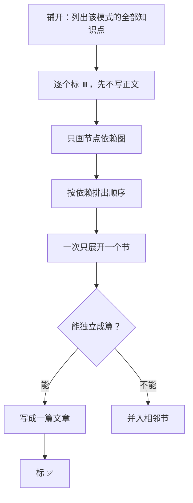
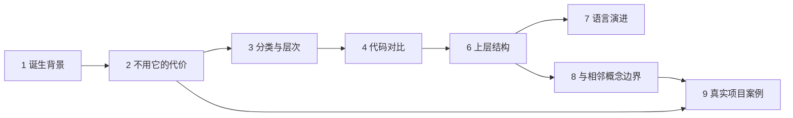

# TEMPLATE.md —— 新模式的骨架与知识拆解流程

> 仓库根的这个文件是**抽象基类**。每个 `<xxx>-pattern/` 是它的一个实现。
>
> 写新模式之前读这一份；写完跑 `python3 tools/check_pattern.py <xxx>-pattern`。
>
> 它管的是**知识该怎么拆**，不管进度、排期、素材从哪来——那些属于仓库外的工作目录。

## 1. 这个文件从哪来

一次工厂模式的拆解走完之后回看，发现拆解过程里有三样东西**与"工厂"这个词无关**：

| 沉淀物 | 当时的形态 | 为什么通用 |
|---|---|---|
| 目录骨架 | 固定节，从"它从哪来"排到"待展开清单" | 任何模式都能套：先讲它解决什么，再讲它的变体，再讲现代语言下的变化，最后讲边界 |
| 展开状态机 | `✅ 已展开` / `⏸️ 已标记但未展开` / `⬜ 待补充` | 它让**素材消化进度**与**正文写作进度**分离，任何一篇长文都受益 |
| 讨论路径 | 先 BFS 铺开、再 DFS 展开，末附依赖图 | 决定章节顺序的是节点依赖，不是重要性排序 |

留在模式文件夹里，它们只能服务一个模式；提到仓库根，它们服务全部。所以有了这个文件。

**2026-09-20 的一次修订。** 原第 1 节是「是什么」，写工厂模式时发现**这个问法本身不成立**：
名词定义没有终止条件——"答到哪算完"说不清，于是正文只有 3 行也敢标"已展开"（实测）。
回源核对发现 **GoF 原书自己的模板里没有"定义"这一节**：它给"是什么"的配额是 `Intent` 的
**一两句话**，紧接着就是 `Motivation`（**一个具体场景**）。所以第 1 节改为「诞生背景」，
"是什么"降为**章首几句话**；"定义要能被反例检验"这条硬要求移到第 8 节——
反例是"区分"的工具，不是定义的工具。

## 2. 十个节的骨架

**这是骨架，不是目录。** 一个节可以先被标记、后被打散进文章；也可以两三个节合成一篇文章。但**节的存在必须先在骨架里有一次判断**，否则写到一半一定发现缺前置。

| # | 节 | 回答的问题 | 硬要求 |
|---|---|---|---|
| 1 | 诞生背景 | 它从哪来；这段来历对应哪一类反复出现的问题 | **必须回源**：来历逐条可查一手出处；并说清它是**被观察、被命名出来的**，不是被设计出来的 |
| 2 | 不用它，代价是什么 | 不这么做，具体付出什么代价 | **必须有可编译的对照**：两版代码，逐字节或逐输出可比的差异 |
| 3 | 分类与层次 | 这一族里有几个变体，它们是什么关系 | 必须回答"它们是不是并列的"。若不是，给出真实关系 |
| 4 | 代码对比 | 同一场景下各变体并排 | 同一份场景贯穿，不许每个变体换一个例子 |
| 5 | 业务场景 | 真实场景 ≥3 个 + 生活类比 ≥1 个 | 类比要能指出**在哪里失效**，不能只做修辞 |
| 6 | 上层结构 | 谁负责组装、谁只依赖抽象 | 要出现"组合根"这一层，否则后面无法讨论 DI |
| 7 | 语言演进 | 现代标准下哪些写法被取代 | **必须落成编译期装置**（`static_assert` / 条件编译 / 两种标准下的对照构建），不能只写在正文 |
| 8 | 与相邻概念的边界 | 它和长得最像的那个东西，各管什么 | 给出**可操作的判断标准**，不是描述性差异 |；**"看着像但其实不是"的反例归这一节** |
| 9 | 真实项目案例 | 开源项目怎么用的 | ≥3 个，且**每个都必须回源核验**（读真实代码或头文件，不接受转述） |
| 10 | 待展开清单 | 已标记但还没展开的 | 每条注明归属：进哪一节、或独立成篇 |

**章首那几句话不是一节。** 把这个模式说清楚的那一两句话，配额就是**一两句话**——
放在正文开头，不占节号，也不扩成小节。这与 GoF 原书把 `Intent` 压到一两句、
紧接就进 `Motivation` 的排法一致。把它扩成一节，得到的是一个**没有终止条件的问题**：
说不清答到哪算完，于是任意篇幅都能自称"写完了"。

**可省性**：3、5、6 在单变体模式里可以合并或省略，其余不可省。省的要在该模式的 `README.md` 里写明理由。

## 3. 展开状态机

状态标在**节**上，不标在文件上。这是它最有价值的地方：


- **⬜ 待补充**：知道这里缺东西，但还不知道缺什么。
- **⏸️ 已标记但未展开**：知道缺什么、知道要写什么，**但还没写**。这一态是全部价值所在——它让"我知道我要写这段"变成可清点的存量，而不是脑子里的模糊感觉。
- **✅ 已展开**：正文写了、代码进了 `code/`、验证跑过。**三条齐了才算**。

`✅ → ⏸️` 这条回退边不是装饰。只要引用它的代码块还在，它就是仓库里的一个已知负债。

## 4. 先 BFS，再 DFS



**为什么要先铺开**：只有先铺开，才能发现"这一节其实该拆成两节"和"这一节根本没有素材"。带着未铺开的知识开始写，代价是在文章写到一半时返工重排章节顺序——那是这个仓库里最贵的返工。

**什么时候允许打破**：只在你已经有该模式的高质量素材时。此时可以跳过铺开，直接按素材的固有结构展开，但**依赖图不能省**。

## 5. 章节顺序由依赖决定

节点的依赖关系决定顺序，不决定重要性。工厂模式实例：



读图得到的顺序结论：**先讲代价再讲分类**（没有代价做动机，分类就是名词解释）；**先讲上层结构再讲语言演进**（否则 `unique_ptr` 返回机制没有落脚点）；**边界节在案例节之前**（案例是用来验证边界的，不是用来炫技的）。

第 1 节给的是**动机**。没有动机，后面所有节都会退化成名词解释——所以它排在最前，
但它自己**没有前置**：一个读者只读一节，该读这一节。

**与"篇"的关系**：节是知识单元，篇是阅读单元。一篇可以覆盖 2–3 个节，也可以把一个节拆成 2 篇。**篇的划分服从节的划分，反过来不行。**

## 6. 目录架构

### 进仓库的

```
<pattern-name>/
├── README.md              该模式的导航：从哪读起、已知问题在哪
├── docs/
│   ├── NN-<标题>.md       正文，一篇文章一个文件（NN 为两位序号）
│   ├── NNx-<标题>.md      主线的子编号篇（如 `04a-` / `04b-`）
│   ├── A0N-<标题>.md      专题篇（考据 / 实战类）
│   └── quizNN-<标题>.md   检验篇
├── code/
│   └── NN_<slug>/         每个场景一个自包含子目录；每篇可对应一个或多个
│       ├── build.sh       该场景的构建入口（或 Makefile / CMakeLists.txt）
│       └── *.cpp          对照示例（old / new 或一组可执行片段）
└── notes/
    └── NNN-<问题>.md      问题记录与复盘（目录可选：真踩过坑才建）
```

**仓库根另有（不随模式走）**：`AGENTS.md`（协作约定）、`TEMPLATE.md`（本文件）、`tools/`（跨场景工具与非系统默认依赖登记，见其 [`README.md`](tools/README.md)）、`STATE.md`（进度锚点）。**工具脚本随仓库提交**——见下表现行条文。

### 不进仓库的

| 东西 | 为什么不进 |
|---|---|
| 进度锚点、决策记录、迭代队列 | 过程，不是设计模式。公开仓库只承载结论，不承载到达结论的路径 |
| 原始素材、评审意见、系列排期 | 素材多为第三方文本；排期是工作计划。放仓库外的 `materials/` 与 `plan/` |
| 特定助手平台的**专名**（skill 名称、产品名、账号名等） | 仓库对任何助手中立——不写平台专名。⚠️ **本条曾整条禁止「技能、协作脚本」进仓库，已于 2026-09-30 推翻**：「只看仓库内文件就能工作」这句理由其实**要求**工具在仓库里；而工具只存在于仓库外时，同一判据会出现两份实现（`tools/check_pattern.py` 的「代码块来源标注」与仓库外 skill 的 `check_code_provenance.py` 即为一对）、改一处另一处不知道。**现行条文：工具脚本随仓库提交**（`tools/` 与 `code/<场景>/`），只有平台专名不进 |
| `.docx` / `.html` 历史产物 | 本仓库的交付形态是 markdown + 内嵌 Mermaid，其他形态是遗留 |

判断标准一句话：**知识进仓库，过程出仓库。** 拿不准时问"一个只想学这个模式的人，需要看到它吗"。

### 序号约定

- `docs/NN-` 两位序号，与篇号一致，**允许跳号**（系列里有的篇可能永远不写）。
  主线之外另有三种：子编号 `NNx-`（`04a-` / `04b-`）、专题 `A0N-`、检验 `quizNN-`。
- `code/NN_<slug>/` 两位序号，与篇号一致（如 `04b-` 篇对应 `code/04b_syntax/`）。
  每个场景自带构建入口（`build.sh` / `Makefile` / `run.sh` 任一种），**不设工程根统一构建**。
  生成图的 `make_*.py` 与度量脚本也放该场景目录内 —— 场景要能**单独拷走、单独跑**，所以不往 `tools/` 集中（代价与裁决见 `tools/README.md`）。
- `notes/NNN-` 三位序号，**连续不跳**，按记录的先后。目录可选——没踩过坑就是空的，
  建一个空目录不如不建。
- 顶层节序号：**可选体例**。用就用 `## 一、标题`，中文序号连续不跳；不用就整篇不带编号。
  两种都合法——工厂模式 17 篇里 `06` / `07` 用、其余 15 篇不用。
  （2026-09-30 定案：原规则要求"必须用"，但它想达成的"节可被别处引用"并没达成，
  而脚本当时还把 `## 进度` 当正文节去数序号，报的那条本身就是错的 → 改规则。）
  `## 进度` 这类篇内状态块不是正文节，不参与序号统计。
- 子节分两种，按用途选：**会被别处引用的**用 `### N.M 标题`（`N` 与父节序号一致，如 §7.2）；**只是给一节的内部做分组**的用 `### <名词短语>`（如 `### 代价一：…`），不带编号。
  分这条界线的原因：正文与 `notes/` 之间会互相引用，无编号的子节引用不起来；但并不需要每层分组都长出编号。

## 7. 复核清单

### 机械可判 —— 跑脚本

```bash
python3 tools/check_pattern.py <pattern-name>
```

`[!!]` 必须修，`[!]` 是警告，退出码 1 表示存在 `[!!]`。它检查：

- 必需文件与目录齐全（`README.md` / `docs/` / `code/`）
- `code/` 下至少有一个构建入口（`CMakeLists.txt` / `Makefile` / `build.sh` / `run.sh`）
- `docs/` 命名合**三层体例**（`NN-` / `NNx-` / `A0N-` / `quizNN-`）、序号无重复
- `README.md` 与 `docs/` 中 md 之间的相对链接都能落到真实文件
  （写在行内代码里的引用**语法示例**不算链接）
- 正文里以 `code/` 前缀声明的配套代码路径都能找到；
  `src/` `include/` 开头的是**上游第三方源码引用**（本仓库 `code/` 下没有这两个顶层目录），
  只计数、不要求存在——考据类正文的主体就是引用上游代码
- 每篇正文的顶层节数量 ≥ 2
- 顶层节序号**用了的话**须连续（整篇不用序号不报）
- 代码块**自述引用了他人代码**时，出处必须可定位（本仓库路径 / 上游路径 / URL / 文件名）；
  文档自己写的教学示例**不要求**标来源——「来源」只指公开论坛 / 仓库中引用的**他人代码**
- 有没有 `.docx` / `.html` 之类的遗留形态（本仓库只用 markdown + 内嵌 Mermaid）

### 人工判 —— 脚本判不了

| 项 | 判据 |
|---|---|
| 节的独立性 | 抽掉这一节，其余节还读得通吗 |
| 节的问法 | 标题能通过问法体检吗：**有终止条件吗 / 在问名词定义吗 / 抽掉它别的节还读得通吗** |
| 对照是否同源 | 各变体用的是不是同一份场景 |
| 案例是否回源 | 每个开源案例能不能指出真实的文件与函数名 |
| 可省性理由 | 省掉的节，理由写在 `README.md` 里了吗 |

### 体例裁决记录（2026-09-30）

跑 `check_pattern.py` 时暴露出三条**规则与正文脱节**的项。它们**不是脚本 bug**，
而是「尺子写的体例」与「正文实际体例」谁对的问题。**三条已于 2026-09-30 全部定案，
去向一致：改规则去合正文。**

| 项 | 正文实际 | 裁决 |
|---|---|---|
| 顶层节序号 | 15/17 篇不用序号（只有 `06` / `07` 用） | ✅ **改规则** —— 序号降为可选，`## 进度` 不计入正文节（17 条警告 → 0） |
| 代码块来源标注 | 76 个块实测 **76 个原创、0 个引用他人代码** | ✅ **改规则** —— 「来源」只指**公开论坛 / 仓库**中引用的他人代码；原创示例不要求标注（68 条警告 → 0） |
| 工具脚本注释语言 | `code/` 下 **13 个**工具脚本（`*.sh` / `*.py` / `Makefile`）、**82 行**注释，说明性文字**全是中文**；而 `AGENTS.md` §5 原要求全英文 | ✅ **改规则** —— 按**读者角色**分开：**C++ 源码用英文**（Google Style 一致性）、**工具脚本注释用中文**（读者是维护者，文字承担运维说明）。**核查：0 处英文说明文字 ⇒ 无需改动任何脚本**；机器初筛报的 14 处「疑似英文」逐条核实后全部另有归属 —— 上游摘录 **9**（`A05_nginx_redis/04_gen_modules.sh`，标了 nginx 出处）+ heredoc / 字符串里的代码 **3** + 命令示例 **2**。**边界**：只管说明性文字，注释掉的代码 / 命令示例 / 上游摘录照原样。**此条只能人工判**——行首 `#` 正则会把 heredoc 里的代码误当注释（14 处里 **12 处**是这类误报），不进 `check_pattern.py` |

判据统一成一句话：**规则想达成的目的若本就没达成，换判据，而不是改正文。**
① 想要的"节可被引用"、② 想要的"引用可溯源"，都没因原来的写法而达成——
反而把真问题淹在噪声里（② 的 68 条假警告就是活例子）。
③ 是同一族的另一种情形：**一条体例同时套在两类不同读者、不同角色的东西上**——
"全用英文"服务的是 C++ 源码的风格一致性，而工具脚本的读者是维护者。
⇒ **区分对象、各给合适的体例，比统一口径更强**（这与 ①② 的"换判据"同源：先问"这条规则为谁而立"）。

---

*体例问题改这个文件。它的每次改动都应让下一个模式少踩一次坑。*
