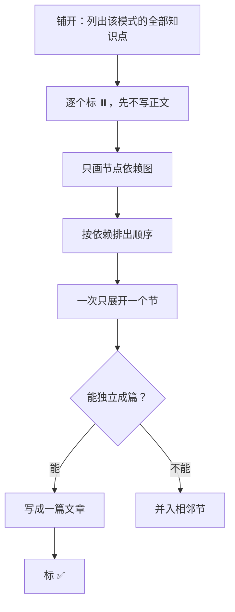
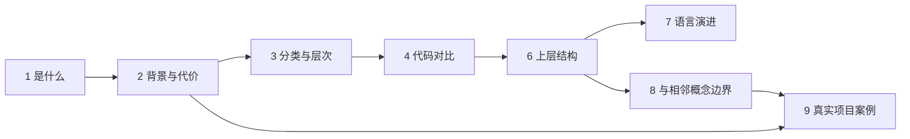

# TEMPLATE.md —— 新模式的骨架与知识拆解流程

> 仓库根的这个文件是**抽象基类**。每个 `<xxx>-pattern/` 是它的一个实现。
>
> 写新模式之前读这一份；写完跑 `python3 tools/check_pattern.py <xxx>-pattern`。
>
> 它管的是**知识该怎么拆**，不管进度、排期、素材从哪来——那些属于仓库外的工作目录。

## 1. 这个文件从哪来

一次工厂模式的拆解走完之后回看，发现拆解过程里有三样东西**与"工厂"这个词无关**：

| 沉淀物 | 当时的形态 | 为什么通用 |
|---|---|---|
| 目录骨架 | 10 个固定节，从"是什么"排到"待展开清单" | 任何模式都能套：先讲它解决什么，再讲它的变体，再讲现代语言下的变化，最后讲边界 |
| 展开状态机 | `✅ 已展开` / `⏸️ 已标记但未展开` / `⬜ 待补充` | 它让**素材消化进度**与**正文写作进度**分离，任何一篇长文都受益 |
| 讨论路径 | 先 BFS 铺开、再 DFS 展开，末附依赖图 | 决定章节顺序的是节点依赖，不是重要性排序 |

留在模式文件夹里，它们只能服务一个模式；提到仓库根，它们服务全部。所以有了这个文件。

## 2. 十个节的骨架

**这是骨架，不是目录。** 一个节可以先被标记、后被打散进文章；也可以两三个节合成一篇文章。但**节的存在必须先在骨架里有一次判断**，否则写到一半一定发现缺前置。

| # | 节 | 回答的问题 | 硬要求 |
|---|---|---|---|
| 1 | 是什么 | 一句话定义 + 它在 GoF 分类里的位置 | 定义要能被反例检验：举一个"看着像但其实不是"的例子 |
| 2 | 背景与代价 | 不用它，具体付出什么代价 | **必须有可编译的对照**：两版代码，逐字节或逐输出可比的差异 |
| 3 | 分类与层次 | 这一族里有几个变体，它们是什么关系 | 必须回答"它们是不是并列的"。若不是，给出真实关系 |
| 4 | 代码对比 | 同一场景下各变体并排 | 同一份场景贯穿，不许每个变体换一个例子 |
| 5 | 业务场景 | 真实场景 ≥3 个 + 生活类比 ≥1 个 | 类比要能指出**在哪里失效**，不能只做修辞 |
| 6 | 上层结构 | 谁负责组装、谁只依赖抽象 | 要出现"组合根"这一层，否则后面无法讨论 DI |
| 7 | 语言演进 | 现代标准下哪些写法被取代 | **必须落成编译期装置**（`static_assert` / 条件编译 / 两种标准下的对照构建），不能只写在正文 |
| 8 | 与相邻概念的边界 | 它和长得最像的那个东西，各管什么 | 给出**可操作的判断标准**，不是描述性差异 |
| 9 | 真实项目案例 | 开源项目怎么用的 | ≥3 个，且**每个都必须回源核验**（读真实代码或头文件，不接受转述） |
| 10 | 待展开清单 | 已标记但还没展开的 | 每条注明归属：进哪一节、或独立成篇 |

**可省性**：3、5、6 在单变体模式里可以合并或省略，其余不可省。省的要在该模式的 `README.md` 里写明理由。

## 3. 展开状态机

状态标在**节**上，不标在文件上。这是它最有价值的地方：


- **⬜ 待补充**：知道这里缺东西，但还不知道缺什么。
- **⏸️ 已标记但未展开**：知道缺什么、知道要写什么，**但还没写**。这一态是全部价值所在——它让"我知道我要写这段"变成可清点的存量，而不是脑子里的模糊感觉。
- **✅ 已展开**：正文写了、代码进了 `code/`、验证跑过。**三条齐了才算**。

`✅ → ⏸️` 这条回退边不是装饰。只要引用它的代码块还在，它就是仓库里的一个已知负债。

## 4. 先 BFS，再 DFS



**为什么要先铺开**：只有先铺开，才能发现"这一节其实该拆成两节"和"这一节根本没有素材"。带着未铺开的知识开始写，代价是在文章写到一半时返工重排章节顺序——那是这个仓库里最贵的返工。

**什么时候允许打破**：只在你已经有该模式的高质量素材时。此时可以跳过铺开，直接按素材的固有结构展开，但**依赖图不能省**。

## 5. 章节顺序由依赖决定

节点的依赖关系决定顺序，不决定重要性。工厂模式实例：



读图得到的顺序结论：**先讲代价再讲分类**（没有代价做动机，分类就是名词解释）；**先讲上层结构再讲语言演进**（否则 `unique_ptr` 返回机制没有落脚点）；**边界节在案例节之前**（案例是用来验证边界的，不是用来炫技的）。

**与"篇"的关系**：节是知识单元，篇是阅读单元。一篇可以覆盖 2–3 个节，也可以把一个节拆成 2 篇。**篇的划分服从节的划分，反过来不行。**

## 6. 目录架构

### 进仓库的

```
<pattern-name>/
├── README.md          该模式的导航：从哪读起、已知问题在哪
├── docs/
│   └── NN-<标题>.md   正文，一篇文章一个文件，NN 为两位序号
├── code/
│   ├── CMakeLists.txt 顶层构建设置
│   └── src/NN_<slug>/ 每篇一个子目录
└── notes/
    └── NNN-<问题>.md  问题记录与复盘，NNN 为三位序号
```

### 不进仓库的

| 东西 | 为什么不进 |
|---|---|
| 进度锚点、决策记录、迭代队列 | 过程，不是设计模式。公开仓库只承载结论，不承载到达结论的路径 |
| 原始素材、评审意见、系列排期 | 素材多为第三方文本；排期是工作计划。放仓库外的 `materials/` 与 `plan/` |
| 技能、协作脚本 | 含平台专名，且任何读取本仓库的助手都应能只看仓库内文件就工作 |
| `.docx` / `.html` 历史产物 | 本仓库的交付形态是 markdown + 内嵌 Mermaid，其他形态是遗留 |

判断标准一句话：**知识进仓库，过程出仓库。** 拿不准时问"一个只想学这个模式的人，需要看到它吗"。

### 序号约定

- `docs/NN-` 两位序号，与篇号一致，**允许跳号**（系列里有的篇可能永远不写）。
- `code/src/NN_` 两位序号，与篇号一致。
- `notes/NNN-` 三位序号，**连续不跳**，按记录的先后。
- 顶层节用 `## 一、标题`，中文序号**连续不跳**。
- 子节分两种，按用途选：**会被别处引用的**用 `### N.M 标题`（`N` 与父节序号一致，如 §7.2）；**只是给一节的内部做分组**的用 `### <名词短语>`（如 `### 代价一：…`），不带编号。
  分这条界线的原因：正文与 `notes/` 之间会互相引用，无编号的子节引用不起来；但并不需要每层分组都长出编号。

## 7. 复核清单

### 机械可判 —— 跑脚本

```bash
python3 tools/check_pattern.py <pattern-name>
```

`[!!]` 必须修，`[!]` 是警告，退出码 1 表示存在 `[!!]`。它检查：

- 必需文件与目录齐全（`README.md` / `docs/` / `code/CMakeLists.txt` / `notes/`）
- 序号命名合规、无重复
- `README.md` 与 `docs/` 中 md 之间的相对链接都能落到真实文件
- 正文里标注的配套代码路径都能在 `code/` 下找到
- 每篇正文的顶层节数量 ≥ 2，中文序号连续
- 每个代码块是否有来源标注
- 有没有 `.docx` / `.html` 之类的遗留形态（本仓库只用 markdown + 内嵌 Mermaid）

### 人工判 —— 脚本判不了

| 项 | 判据 |
|---|---|
| 节的独立性 | 抽掉这一节，其余节还读得通吗 |
| 对照是否同源 | 各变体用的是不是同一份场景 |
| 案例是否回源 | 每个开源案例能不能指出真实的文件与函数名 |
| 可省性理由 | 省掉的节，理由写在 `README.md` 里了吗 |

---

*体例问题改这个文件。它的每次改动都应让下一个模式少踩一次坑。*
