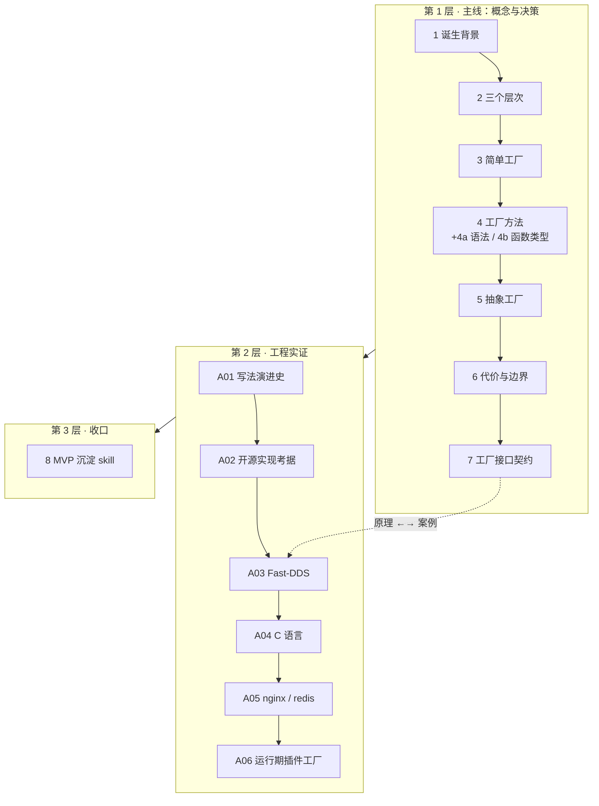

# 讲解计划 · 工厂模式

> 定位：面向 10+ 年 Linux C++ 工程师的问题驱动式讲解，不从「是什么」开始，从「为什么需要」开始。
> 协作：小步快走，一问一答，每节配最小可运行代码。
> 物料分工：概念与决策 → 第 1 层；真实仓库里的实现 → 第 2 层；流程沉淀 → 第 3 层。

## 三层结构

---

## 第 1 层 · 主线：概念与决策

### 1. 诞生背景：`new` 的痛点
不谈定义，先看代码坏味道：调用方直接 `new ConcreteProduct` 导致的两类问题（耦合 + 扩散）。这节回答「工厂到底解决什么」。

### 2. 三个层次：一句话区分
简单工厂 / 工厂方法 / 抽象工厂——不是三个模式，是一个演进链。用一张对比表 + 一段「什么时候升级到下一层」的判据。

### 3. 简单工厂 · 最小可运行示例
`code/` 第一个落地代码：`old.cpp`（直接 new）vs `new.cpp`（引入工厂）对照。10 分钟能编译跑起来的那种。

### 4. 工厂方法：解开开闭原则的死结
简单工厂的 `switch` 在新增产品时要改谁？工厂方法如何用虚函数把这个改动局部化——以及它付出的代码行数代价。
（+ 4a 注册表语法逐行拆解与特殊成员函数 / 4b 函数类型 vs 函数指针）

### 5. 抽象工厂：产品族问题
什么时候「一个工厂」不够，需要「一族产品」。嵌入式场景常见：同一套 HAL 接口，不同芯片平台各出一家族。

### 6. 代价与边界：什么时候不用工厂
反直觉但重要——工厂不是免费的：间接层、类数量膨胀、调试栈变深。给出「三行以下不值得上工厂」这类可操作判据。

### 7. 工厂接口契约：返回什么 · 失败怎么报 · 谁销毁
前 6 节回答「创建决策放在哪」，本节补另半边：返回值类型决定所有权、失败用哪种表达、工厂缓存时谁负责销毁。
**体例换代**：以具象图为主（时序 / 指针关系 / 内存状态），不再以表格 + 代码为主。

### 8. MVP 沉淀
把 1~7 与 A01~A06 跑通的流程（目录结构、old/new 对照、示例可运行、文档引代码路径、图密度）固化为 skill，推广到下一个设计模式。

---

## 第 2 层 · 工程实证（追加专题）

讲解主线之外的延伸，围绕学习过程中提出的疑问展开，编号 `A0x`。

| 编号 | 专题 | 回答的问题 |
|---|---|---|
| [A01](A01-工厂写法演进史.md) | 工厂写法演进史 | 智能指针出现前后的工厂是两种东西？C++11 之后为什么写法变多？ |
| [A02](A02-开源中的工厂实现考据.md) | 开源里的工厂实现考据 | >=C++11 的经典工厂实现出自哪些仓库，为什么经典 |
| [A03](A03-FastDDS里的工厂.md) | Fast-DDS 里的工厂 | Fast-DDS 源码里有哪些工厂形态？**补 RPC 实现会撞哪三面墙？** |
| [A04](A04-C语言里的工厂与我的偏好.md) | C 语言里的工厂 | C 没有类和虚函数，工厂怎么做？哪几个 C 写法值得偏爱？ |
| [A05](A05-nginx与redis里的工厂.md) | nginx 与 redis 里的工厂 | 这两个真库里有哪些**技巧上不重复**的经典实现？ |
| A06 | 运行期插件工厂（待写） | 把链接期自注册推到运行期：`dlopen` + 注册宏 + ABI 版本校验 + 卸载 |

---

## 产出约定

- 每节一个 `docs/NN-标题.md`，内引用 `code/` 相对路径
- 每个示例 `old.cpp` / `new.cpp` 对照，可独立编译
- 一节一提交，随时可停
- **WSL 内源码的中文字符串一律用「」，不要用弯引号**（弯引号会被 gcc 当 ASCII 引号，字符串提前终止）
- **本仓库为公开交付物**：产出前过一遍「工作区 ≠ 交付仓库」原则——不带本机绝对路径、不带账号、不带过程管理队列
- **图密度**：主线每篇至少 1 张图；全库目标 ≥ 1 图 / 200 行（当前 3290 行 / 5 图 ≈ 658 行一图，明显不足）
- **图的两种画法，按用途分**：
  - **具象图**（内存块 / 时序 / 指针关系 / 对象状态）→ 手写 SVG 存 `docs/assets/`，正文用 `` 引用
  - **结构关系图**（流程 / 决策 / 分类）→ Mermaid 内联代码块
  - ⚠️ **GitHub 会过滤 markdown 里的内联 `<svg>`**，只有「SVG 文件被引用」才能渲染，别把 SVG 直接贴进正文

## 补充点归位表

主线与专题完成后追加的一批补充点。**不新开 `B0x` 系列**——多数补充点只是既有章节缺的那一块，独立成篇会造成重述。
判据：这段内容**能不能独立回答一个完整问题**？能 → 独立成篇；不能 → 回流到它所属的章节。

| 补充点 | 归属 | 理由 | 状态 |
|---|---|---|---|
| 所有权与销毁契约 | **第 7 节** | 能独立成问，且 A03 有 3 处实证 | ✅ 已写 |
| 创建失败语义 | 第 7 节 | 只是接口形状的一个维度，不单独成篇 | ✅ 已写 |
| 可测试性 / 依赖注入 | **回流 01**（痛点 4） | 与前三个痛点同层级，且是评审时最有说服力的理由 | 待写 |
| 运行期插件工厂 | **A06** | 自成体系，接 A02 / A04 的「链接期 → 运行期」 | 待写 |
| 反模式清单 | **回流 06** | 06 讲「不该用」，它讲「用了但用歪了」，是同一枚硬币 | 待写 |
| 模板 / 编译期工厂 | 06 决策表补一行 | **A01 §5 已覆盖**（`04_modern_forms.cpp` 实测过），降级为一行引用 | 待写 |
| A01 §8「对你场景的意义」4 条 | 上移进第 7 节，A01 留一行引用 | 那 4 条是**决策视角**，混在 A01 的**历史视角**里属权属不清 | 待收敛 |

**收敛原则：单点权威 + 交叉引用。** 同一个知识点只在一处讲全，其它地方写引用。收敛只补引用、不搬文件。

## 挂起清单（按需展开，不主动插播）

讲解过程中遇到「这个词需要单独讲清楚」的概念，先记在这里，等进度合适时展开。

| 概念 | 挂起于 | 状态 |
|---|---|---|
| **类型擦除**（type erasure）：怎么把异质可调用对象塞进定长缓冲、vtable 式分派如何生成 | 04a / 04b 提到 `std::function` 内部机制 | **移出本专题 —— 属于 C++ 语言机制主线，另开线路** |
| 函数指针的返回类型协变、lambda 到函数指针的转换规则 | 04b 已部分回答（见 04b 第 5 节） | 已完成 |

## 延伸发现（非本专题范围）

A03 在 Fast-DDS 源码实测中另检出 3 处设计缺陷——`protected` 非虚析构（补 `delete` 即 UB）、
「protected 语义下沉到实现类」实际防护面为零、工厂返回裸指针且无配对销毁入口。
技术分析见 [A03 §6.3](A03-FastDDS里的工厂.md)；**其接口层面的通用结论已并入第 7 节**（原理 ←→ 案例单向引用）。

## 当前进度

- [x] 1 诞生背景（+ 痛点 2 专题 spread.cpp、痛点 3 专题 responsibility.cpp、痛点 4 可测试性 testability_before/after.cpp + build.sh）
- [x] 2 三个层次（+ 判据 1 拆解 pain_of_switch.cpp）
- [x] 3 简单工厂（03_simple_factory/new.cpp）
- [x] 4 工厂方法（factory_method.cpp + registry.cpp）
- [x] 4a 注册表语法逐行拆解 + 特殊成员函数/单例四修法
- [x] 4b 函数类型 vs 函数指针
- [x] 5 抽象工厂（bad_mix.cpp + abstract_factory.cpp + measure_extend_cost.py）
- [x] 6 代价与边界（bench_dispatch.cpp + variant_alt.cpp + count_loc.sh）
- [x] 检验 quiz01 判断题（三档位辨析 + 批改记录）
- [x] A01 工厂写法演进史（code/A01_evolution/ 四个可运行示例）
- [x] A02 开源工厂实现考据（llvm::Registry / MessageFactory / make_unique / boost::factory / folly 的缺失）
- [x] A03 Fast-DDS 里的工厂（code/A03_fastdds/ 四组实测：protected 析构三后果 / 单例 1vs2 次分配 / 两个编译失败取证）
- [x] A04 C 语言里的工厂（code/A04_c/ 四档 + 内核 initcall 一手取证 + 静态库陷阱实测）
- [x] A05 nginx 与 redis 里的工厂（code/A05_nginx_redis/ 四组实测：offset 通用 setter 12:124 / 名字到索引 5.15x / 表即协议一表六用 / 构建期代码生成改 1 行）
- [x] **7 工厂接口契约**（code/07_contract/ 两组实测：ASan 抓 heap-use-after-free / LeakSanitizer 抓 32B 泄漏 / 四种失败表达行为 + 一张具象时序图）
- [x] 补充点回流（01 痛点 4：同一条 if 的 gcov 分支 50% → 100%，补上另 50% 必须改生产代码；06 反模式清单 4 条 + 自查表 + 决策表补「模板工厂」行；01~07 进度块归一）
- [ ] A06 运行期插件工厂
- [ ] 收敛：A01 §8 上移进第 7 节，建立 07 ←→ A03 单向引用
- [ ] 8 MVP 沉淀 skill
