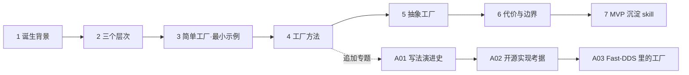

# 讲解计划 · 工厂模式

> 定位：面向 10+ 年 Linux C++ 工程师的问题驱动式讲解，不从"是什么"开始，从"为什么需要"开始。
> 协作：小步快走，一问一答，每节配最小可运行代码。

## 讲解路线（7 节 + 追加专题）

### 1. 诞生背景：`new` 的痛点
不谈定义，先看代码坏味道：调用方直接 `new ConcreteProduct` 导致的两类问题（耦合 + 扩散）。这节回答"工厂到底解决什么"。

### 2. 三个层次：一句话区分
简单工厂 / 工厂方法 / 抽象工厂——不是三个模式，是一个演进链。用一张对比表 + 一段"什么时候升级到下一层"的判据。

### 3. 简单工厂 · 最小可运行示例
`code/` 第一个落地代码：`old.cpp`（直接 new）vs `new.cpp`（引入工厂）对照。10 分钟能编译跑起来的那种。

### 4. 工厂方法：解开开闭原则的死结
简单工厂的 `switch` 在新增产品时要改谁？工厂方法如何用虚函数把这个改动局部化——以及它付出的代码行数代价。

### 5. 抽象工厂：产品族问题
什么时候"一个工厂"不够，需要"一族产品"。嵌入式场景常见：同一套 HAL 接口，不同芯片平台各出一家族。

### 6. 代价与边界：什么时候不用工厂
反直觉但重要——工厂不是免费的：间接层、类数量膨胀、调试栈变深。给出"三行以下不值得上工厂"这类可操作判据。

### 7. MVP 沉淀
前 6 节跑通的流程（目录结构、old/new 对照、文档引用代码路径）固化为 skill，推广到下一个设计模式。

---

## 追加专题

讲解主线之外的延伸，围绕学习过程中提出的疑问展开，编号 `A0x`。

| 编号 | 专题 | 回答的问题 |
|---|---|---|
| [A01](A01-工厂写法演进史.md) | 工厂写法演进史 | 智能指针出现前后的工厂是两种东西？C++11 之后为什么写法变多？ |
| [A02](A02-开源中的工厂实现考据.md) | 开源里的工厂实现考据 | >=C++11 的经典工厂实现出自哪些仓库，为什么经典 |
| [A03](A03-FastDDS里的工厂.md) | Fast-DDS 里的工厂 | Fast-DDS 源码里有哪些工厂形态？**补 RPC 实现会撞哪三面墙？** |
| [A04](A04-C语言里的工厂与我的偏好.md) | C 语言里的工厂 | C 没有类和虚函数，工厂怎么做？哪几个 C 写法值得偏爱？ |

---

## 产出约定

- 每节一个 `docs/NN-标题.md`，内引用 `code/` 相对路径
- 每个示例 `old.cpp` / `new.cpp` 对照，可独立编译
- 一节一提交，随时可停
- **WSL 内源码的中文字符串一律用「」，不要用弯引号**（弯引号会被 gcc 当 ASCII 引号，字符串提前终止）
- **本仓库为公开交付物**：产出前过一遍「工作区 ≠ 交付仓库」原则——不带本机绝对路径、不带账号、不带过程管理队列

## 挂起清单（按需展开，不主动插播）

讲解过程中遇到"这个词需要单独讲清楚"的概念，先记在这里，等进度合适时展开。

| 概念 | 挂起于 | 状态 |
|---|---|---|
| **类型擦除**（type erasure）：怎么把异质可调用对象塞进定长缓冲、vtable 式分派如何生成 | 04a / 04b 提到 `std::function` 内部机制 | **移出本专题 —— 属于 C++ 语言机制主线，另开线路** |
| 函数指针的返回类型协变、lambda 到函数指针的转换规则 | 04b 已部分回答（见 04b 第 5 节） | 已完成 |

## 延伸发现（非本专题范围）

A03 在 Fast-DDS 源码实测中另检出 3 处设计缺陷——`protected` 非虚析构（补 `delete` 即 UB）、
「protected 语义下沉到实现类」实际防护面为零、工厂返回裸指针且无配对销毁入口。
**不属于工厂模式讲解范围**，技术分析见 [A03 §6.3](A03-FastDDS里的工厂.md)。

## 当前进度

- [x] 1 诞生背景（+ 痛点 2 专题 spread.cpp、痛点 3 专题 responsibility.cpp）
- [x] 2 三个层次（+ 判据 1 拆解 pain_of_switch.cpp）
- [x] 3 简单工厂（03_simple_factory/new.cpp）
- [x] 4 工厂方法（factory_method.cpp + registry.cpp）
- [x] 4a 注册表语法逐行拆解 + 特殊成员函数/单例四修法
- [x] 4b 函数类型 vs 函数指针
- [x] 5 抽象工厂（bad_mix.cpp + abstract_factory.cpp + measure_extend_cost.py）
- [x] 6 代价与边界（bench_dispatch.cpp + variant_alt.cpp + count_loc.sh）
- [x] 检验 quiz01 判断题（三档位辨析 + 批改记录）
- [x] A01 工厂写法演进史（code/A01_evolution/ 四个可运行示例）
- [x] A02 开源工厂实现考据（llvm::Registry / MessageFactory / make_unique / boost::factory / folly 的缺失）
- [x] A03 Fast-DDS 里的工厂（code/A03_fastdds/ 四组实测：protected 析构三后果 / 单例 1vs2 次分配 / 两个编译失败取证）
- [x] A04 C 语言里的工厂（code/A04_c/ 四档 + 内核 initcall 一手取证 + 静态库陷阱实测）
- [ ] 7 MVP 沉淀 —— 延后，待追加专题收尾
