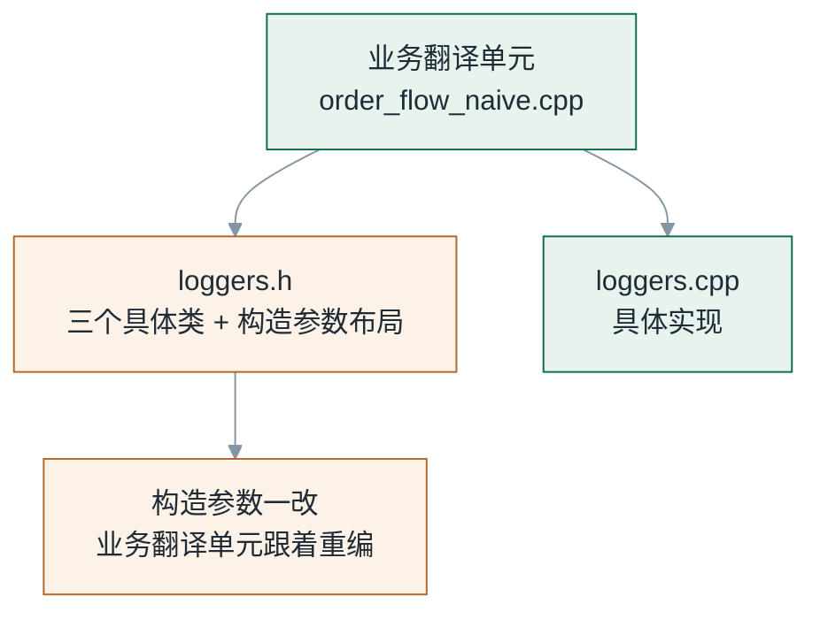
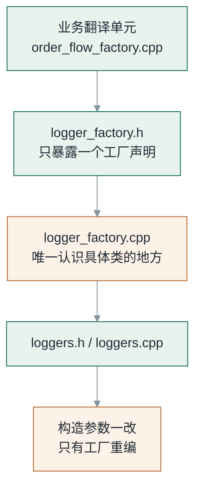
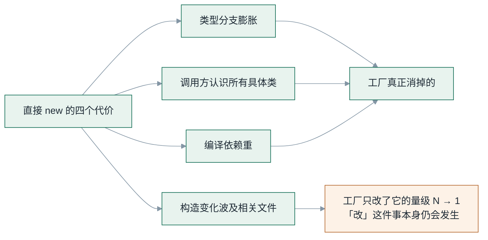

# 为什么你的 C++ 代码里到处都是 if/else new

> 《C++ 工厂模式：从 if/else 到架构边界》第 1 篇
>
> 配套代码：`factory-pattern/code/src/01_if_else_new/`｜代码块逐块标注来源：出自仓库的与文件同名同序，标「示意」的不在仓库中
>
> **系列边界（先读这段）**：本系列只讨论**创建与装配的职责划分**——谁决定 `new` 哪个类、谁把对象交给谁。**不覆盖**线程安全、异常安全、ABI 兼容性；测试只演示"替换实现"这一件事，不展开测试策略。这里也不会讲"工厂模式分三种、UML 该怎么画"——那类内容搜索引擎里到处都是，而且多半互相抄。这篇只回答一个问题：**这段 if/else 到底错在哪、错到什么程度；把它换成工厂之后，究竟换来了什么，又付出了什么。**

---

## 一、这段代码你一定见过

它大概长这样：

```cpp
// 摘自 src/01_if_else_new/order_flow_naive.cpp（节选）
std::unique_ptr<Logger> new_logger(const std::string& kind) {
    if (kind == "console") {
        return std::make_unique<ConsoleLogger>();
    }
    if (kind == "file") {
        FileLoggerConfig config;
        config.path              = "fp_01_demo.log";
        config.append            = true;
        config.flush_interval_ms = 100;
        return std::make_unique<FileLogger>(std::move(config));
    }
    if (kind == "null") {
        return std::make_unique<NullLogger>();
    }
    throw std::invalid_argument("unknown logger kind: " + kind);
}
```

先声明一件事：**这段代码本身没有错误。** 它编译通过、运行正确，`kind` 三选一的意图也表达得很清楚。它甚至已经被"优化"过一轮了——原本散落在各个业务函数里的 if/else，已经被人收敛到了这一个函数里。

但它有四个结构性问题。这四个问题一个比一个隐蔽，而且**第四个是绝大多数人从来没量化过的**。

---

## 二、四个代价，逐个称重

### 代价一：类型分支会持续膨胀

这不是"现在有三行 if"，而是"这个函数的存在方式注定要一直改"。

每新增一种日志器，这里就多一个分支。这件事听起来不严重——直到你注意到它的两个变体：

- **分支长在什么地方。** 上例是收敛到一个函数里的版本。真实项目里更常见的是它长在**每个需要日志器的地方**——`OrderService::checkout()` 里一段、`Report::generate()` 里一段、`main()` 里又一段。这时候"新增一种类型要改几处"的答案，直接等于"项目里有几个地方需要日志器"。
- **分支会带上构造细节。** 看 `file` 那个分支：路径、追加模式、刷盘间隔都在业务代码里拼。这意味着它不只是"选择哪个类"，它还把**这个类的构造契约**复制到了调用方。

第二个变体才是关键。选择逻辑和构造逻辑是两件事，它们被塞进了同一个 if/else。

### 代价二：调用方必须认识所有具体类

这一条有物理后果，不是审美问题：

```cpp
// src/01_if_else_new/order_flow_naive.cpp 的 include 段
#include "order_flow.h"
#include "loggers.h"   // ← 反例的代价就在这一行
```

`loggers.h` 里有 `ConsoleLogger`、`FileLogger`、`NullLogger` 的完整类定义，还有 `FileLoggerConfig` 的成员布局。业务代码把这些全部拉进了自己的编译视野。

于是业务代码和三个它根本不关心的类，建立了编译期绑定：



这里要说清楚一件事：`make_unique<T>` 需要看到 `T` 的完整类型，所以**只要你在调用方创建对象，调用方就必然认识那个具体类**。这不是写法问题，是 C++ 的语义决定的——想不看见，唯一的办法就是"不在这里创建"。

### 代价三：构造过程一变，所有调用点都要改

把上一个代价推到它的结论上，就是这一条。素材里的例子很典型：

```cpp
// 示意：构造签名变化，本段不在配套仓库中
// 旧构造：三个参数
auto logger = std::make_unique<FileLogger>("app.log", true, 100);

// 新构造：参数打包成配置对象
FileLoggerConfig cfg{"app.log", true, 100, "utf-8"};
auto logger = std::make_unique<FileLogger>(cfg);
```

`FileLogger` 的构造函数变了。现在数一下要改几处：

- 每一个直接 `new` 的地方——**N 处**。
- 工厂版本——**1 处**。

N 是几？是你项目里需要日志器的地方数。一个中等规模的后端服务，十几处很常见。

还有更糟的一种：初始化步骤分散。

```cpp
// 示意：两阶段初始化，本段不在配套仓库中
auto logger = std::make_unique<FileLogger>();
logger->setPath("app.log");
logger->setAppend(true);
logger->setFlushInterval(100);
logger->setEncoding("utf-8");
if (!logger->open()) { /* ... */ }
```

这叫**两阶段初始化**：构造函数只做一半，剩下的靠调用方接着调。它的致命之处在于"调用方现在不仅要认识类型，还要知道正确的初始化顺序"。而这个顺序没有任何地方会替你检查——漏掉 `open()` 也能编译通过，运行时才发现日志一条没写。

工厂版本把这一段收进了一处：

```cpp
// 简化写法：仓库里是 LoggerFactory::create(logger_kind)
auto logger = LoggerFactory::create("file");
```

### 代价四：编译依赖变重

这一条最容易被当成"感觉问题"，其实它完全可以量化。用 `g++ -MM` 把两个版本的依赖打出来对比：

```bash
g++ -std=c++17 -I src -I include -MM src/01_if_else_new/order_flow_naive.cpp
g++ -std=c++17 -I src -I include -MM src/01_if_else_new/order_flow_factory.cpp
```

**前者的依赖列表里有 `loggers.h`，后者没有。** 一行命令的差别，背后是：改一次 `loggers.h`（哪怕只是加一个私有成员、调整一次成员顺序），前者的每一个业务翻译单元都要重编，后者一个都不用。

把四个代价并排看，会发现它们不是四个独立的问题，而是同一件事的四个切面：

| 代价 | 直接 `new` | 工厂 | 为什么 |
|---|---|---|---|
| 类型分支膨胀 | 散落在每个调用点 | 集中在一个类里 | 选址问题 |
| 认识所有具体类 | 每个调用点都要 | 只有工厂要 | 语义决定：创建才需要完整类型 |
| 构造变化波及范围 | **N 个调用点** | **1 处** | 这是量级差异，不是风格差异 |
| 编译依赖 | 每个调用点都依赖具体头文件 | 只有工厂依赖 | `-MM` 可验证 |

**第三行是本篇最想让你记住的：前两条是"位置"变了，第三、四条是"数量级"变了。** 而"位置"那两条，光靠自觉也能做得不错——把 if/else 收到一个函数里，你就已经拿到了大半好处。

所以真正的问题是：既然收敛一下就能解决大半，**为什么还需要"工厂"这个专门的东西？**

---

## 三、把 if/else 收敛起来，问题并没有消失

这是本篇最想纠正的一个直觉。很多人对工厂的理解是："它就是把 if/else 挪进一个类里"。按这个理解，上面那段 `new_logger()` 函数**已经是工厂了**——它有名字、有单一职责、调用方只认它。

从"能不能跑"的角度，这个说法没错。但把两者放在一起看，会发现一处不是量变的东西：



**差别不在这段创建代码长什么样，而在它被放在哪个编译单元里。**

`new_logger()` 就算写得再干净，它也是和业务代码**编译在一起**的。`#include "loggers.h"` 出现的那一行，决定了业务翻译单元和三个具体类之间的编译依赖——这跟这个函数写得漂不漂亮完全无关。

而工厂版本里，业务翻译单元只 include 了 `logger_factory.h`（一个只包含**声明**的头文件）。`loggers.h` 被关进了 `logger_factory.cpp`。

**这就是"创建与使用分离"在 C++ 里的物理含义：不是一个设计口号，是一次编译依赖的搬家。**

反过来也解释了为什么有些人觉得工厂没用——他们确实写了工厂类，但把工厂类定义和业务代码放在了同一个头文件里。那样一来，依赖没有搬家，只多了一层调用：代价照付，好处一分没拿。

---

## 四、最小可编译对照

上面都是论述，下面看证据。仓库里 `01_if_else_new/` 有**两个可执行文件**，它们：

- **共用同一份 `main.cpp`**（同一个路径，不是副本）
- 调用同一个声明 `run_order_flow(const std::string&)`
- 对同一个入参产生**逐字节相同**的输出

```
factory-pattern/code/src/01_if_else_new/
├── main.cpp                  ← 两个可执行文件共用这一个文件
├── order_flow.h              ← 共用声明，里面没有任何版本痕迹
├── order_flow_naive.cpp      ← 唯一的差异 A
├── order_flow_factory.cpp    ← 唯一的差异 B
├── loggers.h / loggers.cpp
└── logger_factory.h / logger_factory.cpp
```

验一下输出真的相同：

```bash
cmake -B build -DCMAKE_BUILD_TYPE=Release && cmake --build build -j
diff <(./build/src/01_if_else_new/fp_01_naive   --kind console) \
     <(./build/src/01_if_else_new/fp_01_factory --kind console)
# 无输出 —— 两个版本逐字节相同
```

**两个版本的全部差异，就在这一个翻译单元里：**

```diff
 #include "order_flow.h"
-#include "loggers.h"
+#include "logger_factory.h"
 #include <memory>
 #include <stdexcept>
-#include <utility>
 
 namespace fp {
-namespace {
-
-std::unique_ptr<Logger> new_logger(const std::string& kind) {
-    // 三个 if 分支，每个分支都带着一个具体类的构造细节
-}
-
-}  // namespace
 
 void run_order_flow(const std::string& logger_kind) {
-    auto logger = new_logger(logger_kind);
+    auto logger = LoggerFactory::create(logger_kind);
+    if (!logger) {
+        throw std::invalid_argument("unknown logger kind: " + logger_kind);
+    }
 
     // ---- 以下 4 行与工厂版本逐字节相同 ----
     logger->info("order flow started");
```

注意两点：

**一、业务逻辑一行没动。** 那 4 行 `logger->info(...)` 在两个文件里逐字节相同。变的只有"日志器从哪来"。

**二、正例里那个 `if (!logger)` 不是类型分支。** 它是错误处理。把 `create()` 返回 `nullptr` 当成"这里还有 if，所以没解耦"是常见的误读——这个 `if` 只有一个分支，不随类型数量增长。真正会膨胀的是"每个类型一个分支"那种。**判断一段 if 是好是坏，看的不是它有几个，而是它会不会随需求增长。**

---

## 五、工厂换来的东西，和它没换来的东西

把四个代价重新对一遍，看哪些真被消掉了：



**换来的：**

1. **创建逻辑有了唯一的落点。** 新增一种日志器，改工厂一处；不需要满项目搜索 `new FileLogger`。
2. **业务代码不再认识具体类。** `-MM` 可验证的编译依赖收缩。
3. **构造细节有了归属。** 路径、追加模式这些参数有了明确的家，而不是散在调用方。
4. **创建策略有了名字。** `LoggerFactory::create` 这个符号可以被搜索、被替换、被测试。

**没换来的（这些必须说清楚）：**

1. **改构造这件事本身没有被消掉**，只是从 N 处变成 1 处。这依然是量级收益，但请别理解成"以后就不用改了"。
2. **工厂没有减少任何运行时代价**，它甚至可能引入一次间接调用。它换的是**维护成本和编译成本**，不是运行性能。
3. **工厂没有让代码变短。** 这个仓库里，工厂版本的文件总数比反例多——多了一个头文件和一个实现文件。它的价值不在行数。

第 3 条值得展开一句：**如果你只有一处需要创建对象、只有一个实现、构造参数永不变化，那么工厂是纯负债。** 这个话题（什么时候**不该**用工厂）足够重要，值得单独一篇——那是本系列的第 6 篇。

---

## 六、本篇留下的一个尾巴

工厂版本里有一行，现在看着有点刺眼：

```cpp
// src/01_if_else_new/order_flow_factory.cpp（节选）
auto logger = LoggerFactory::create(logger_kind);
if (!logger) {
    throw std::invalid_argument("unknown logger kind: " + logger_kind);
}
```

`create()` 用 `nullptr` 表达失败。这个选择有三个问题：

1. **调用方可能忘记检查。** 忘检就是一个 `nullptr` 解引用，而且编译期不会有任何提示。
2. **`nullptr` 丢失了失败原因。** "类型不认识"和"配置非法"是两回事，返回 `nullptr` 时它们长得一模一样。
3. **它污染了返回类型。** `unique_ptr<Logger>` 本来可以是一个"一定有值"的承诺，现在它承载了两层含义。

第 4 篇会专门处理这件事：从 `nullptr` 到 `std::optional`，再到 `std::expected`，以及为什么三种表达各有它合适的场景。

---

## 七、下一篇：三种工厂，不是三个并列的模式

你已经看到了"工厂"能解决什么。接下来的问题是：**它到底有几种？**

中文技术文章里最常见的说法是"工厂模式分三种：简单工厂、工厂方法、抽象工厂"。这个说法会误导人，因为前两个和后一个根本不在同一个层级上：

- GoF 原书**只承认两种**模式：工厂方法、抽象工厂。简单工厂**不在其中**——英文社区把它归类为 `programming idiom`（编程惯用法），是习惯而不是模式。
- 把三者当成并列选项，会导致一个典型错误：**以为"抽象工厂"是"工厂方法的升级版"**。它不是。抽象工厂 = 多个工厂方法 + **产品族配套约束**，那个约束才是它的本质，而不是"工厂方法多了几个"。

下一篇会把三者放在**同一条演化线**上：每一步解决什么问题、付出什么代价、以及那张最常被引用的三者对比表，缺了最关键的一列。

---

*本文配套代码：`factory-pattern/code/src/01_if_else_new/`*
*`cmake -B build && cmake --build build -j` 一键构建；两个可执行文件的输出差异，`diff` 一下就知道*
