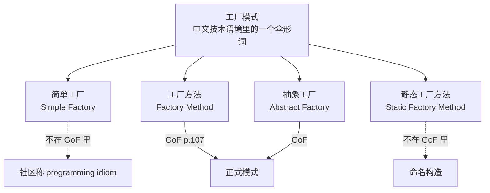
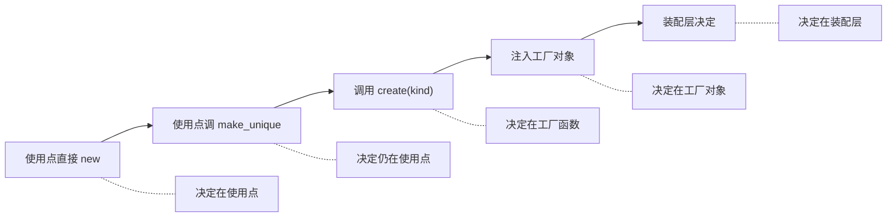

# 工厂模式是什么

> 《C++ 工厂模式》系列 · 第 1 篇
>
> **本章是概念章，没有配套代码** —— 配套工程自第 2 篇起引入。
>
> 本章引用的每一处外部论断都已回源核实，出处与核实方式见文末「出处」。

---

## 一、"工厂模式是什么"没有干净的答案

在搜索框里敲这句话，会拿到至少三种互相打架的回答。它们未必错——错的是这个问法本身。
因为**"工厂模式"不是一个模式的名字，它是一把伞。**

**GoF 原书（1994）的 23 个模式里，创建型只有 5 个**：Abstract Factory、Builder、
Factory Method、Prototype、Singleton。里面没有 "Simple Factory"，也没有 "Factory"。

而中文技术语境里的"工厂模式"，至少指着四样东西：

这件事有两个权威的旁证，都是原话：

《Head First 设计模式》第 4 章 P117：

> 简单工厂其实不是一个设计模式，反而比较像是一种编程习惯。……
> **有些开发人员的确是把这个编程习惯误认为是"工厂模式"**。

《Effective Java》第 1 条，布洛赫亲手划清另一处混淆：

> 注意，静态工厂方法与《设计模式》里的工厂方法模式**不是一回事**。
> 本条描述的静态工厂方法在《设计模式》中**没有直接对应物**。

**所以"工厂模式是什么"在术语层面没有唯一答案。** 继续追问只会收集到更多名词。
要拿到一个能用的答案，必须换问法。

## 二、换问法：它把哪个决定搬到了哪里

不问"它长什么样"，问"**它把哪个决定搬到了哪里**"。

四样东西立刻变成同一条谱系上的刻度：

| 写法 | 决定在哪做 | 使用点还见到具体类型名吗 |
|---|---|---|
| `new ConsoleLogger()` | 就在调用点 | 是 |
| `std::make_unique<ConsoleLogger>()` | 仍在调用点 | 是 |
| `create_logger(kind)` | 一个工厂函数 | 否 |
| 工厂方法 / 抽象工厂 | 工厂对象 | 否 |
| 自注册 / 依赖注入 | 装配代码 | 否 |

于是可以给出一个能被检验的定义：

> **工厂模式 = 把「实例化哪个具体类」这个决定，从使用点搬到一个明确的归属地。**

搬到哪里、搬多远，才是「简单工厂 / 工厂方法 / 抽象工厂」的差别。
**它们不是三个并列的模式，而是同一条搬移谱系上的三个刻度。**

GoF 对 Factory Method 的原文定义，说的正是这件事：

> Define an interface for creating an object, but let subclasses decide which class to
> instantiate. Factory Method lets a class **defer** instantiation to subclasses.

注意那个词：**defer（推迟）**。

《Head First》对 "decide" 还有一句更锋利的注解：

> 他们说 "decide"，并不是因为子类能在运行期做决定，而是因为 creator 类在编写时
> **不知道**实际会创建哪些产品——那完全取决于用了哪个子类。

这句话把"搬走"讲透了：**搬走的不是代码，是"知道"。**

## 三、一条判据

由上面的定义直接落下来，判据只有一条：

> 写下使用这个对象的代码。**里面还出现具体类型的名字吗？**

上表前两行（`new` 与 `make_unique` 具体类）——决定**一点没搬**，只是换了语法。
从第三行起，"知道具体类型"这件事才离开了使用点。

这条判据的好处是它不需要理解 UML：**打开文件看一眼有没有具体类型名，就够了。**

## 四、反例检验

按本仓库的骨架要求，定义必须能挡住"看着像但其实不是"的东西。三个反例：

### 反例一：`std::make_unique<Concrete>()`

它带着 `make` 字样、带着"构造一个对象"的语义，很多人顺口叫它工厂。
但具体类型名 `Concrete` 就写在调用点上——**决定一步没搬**。

它在《Effective Java》里的正式名字是"静态工厂方法"，与工厂方法模式**同名不同物**，
布洛赫为此专门写过一句澄清（见 §1）。这不是工厂模式，是**命名构造**。

### 反例二：建造者 Builder

Builder 确实在 GoF 的创建型 5 个里，也确实是"创建"相关。
但它解决的是"**构造参数太多、构建有先后顺序**"，不是"**选哪个实现**"。
把 Builder 归进"工厂模式"，是把两个本来就正交的问题揉在一起。

### 反例三：服务定位器

它的使用点看起来最"干净"——`locator.get<ILogger>()`，一个具体类型名都没有。

但它不是工厂。它把决定搬走了，却搬进了"**谁都能去取的全局注册表**"：
依赖关系不再出现在构造函数签名里，读代码的人也看不见这个类究竟依赖什么。

**搬走 ≠ 藏起来。** 这是判据之外一条不问自明的补充：
**决定搬到的地方，必须让人看得见。**
（这条边界在讲"工厂与依赖注入"时会正式展开，这里先留一个记号。）

## 五、一个反直觉的结论

谱系不是"越往右越好"。

越往右，使用点越干净（越不知道具体实现），与此同时两样代价在上涨：

- "这个对象到底是哪个类"，**要跳更多层**才追得到；
- 编译期能拦住的错误变少——自注册的注册失败只有运行期才暴露。

于是得到一句可以直接拿去做决策的话：

> 工厂模式真正解决的问题，不是"让代码更优雅"，而是
> **把"知道具体类型"这件事，集中到少数几个地方。**

它同时说明了**为什么需要工厂**，也预告了**什么时候不需要**：
当"知道具体类型"本来就只发生在一个地方时，再套一层工厂只是把成本换了个位置，并没有减少。

## 六、本章边界

- 本章只回答"是什么"。**不把它当导览用**——阅读顺序由知识依赖决定，不由篇号决定。
- "为什么需要它"（把代价量化）是下一节的内容。
- 不涉及线程安全、异常安全、ABI 兼容性；那些是工程问题，不是模式问题。

## 七、出处

| 论断 | 出处 | 核实方式 |
|---|---|---|
| GoF 有 23 个模式，创建型 5 个，其中无 Simple Factory | Gamma / Helm / Johnson / Vlissides, *Design Patterns*, 1994 | 多份独立索引一致 |
| 简单工厂"不是设计模式，更像编程习惯"；有人误称其为工厂模式 | *Head First Design Patterns*, Ch.4, P.117 | 原文引述 |
| 静态工厂方法 ≠ Factory Method 模式，GoF 中无对应物 | Bloch, *Effective Java*, Item 1 | 原文引述 |
| Factory Method 定义（"defer instantiation to subclasses"） | GoF, p.107 | 原文引述 |
| "decide" 指 creator 编写时不知道实际产品 | *Head First Design Patterns*, Ch.4 | 原文引述 |

三点说明：

1. **服务定位器**不是 GoF 的 23 个模式之一；它出自另一份模式目录，与本章的引用体系不同源。
2. 本章**没有**把简单工厂、工厂方法、抽象工厂三者的代码摆在一起对比——
   那属于骨架的「分类与层次」与「代码对比」两节，需要可编译的对照，不在概念章展开。
3. 凡本章没有给出处的判断（如 Builder 与工厂的分工），都是**本仓库的分析**，不是引述。
