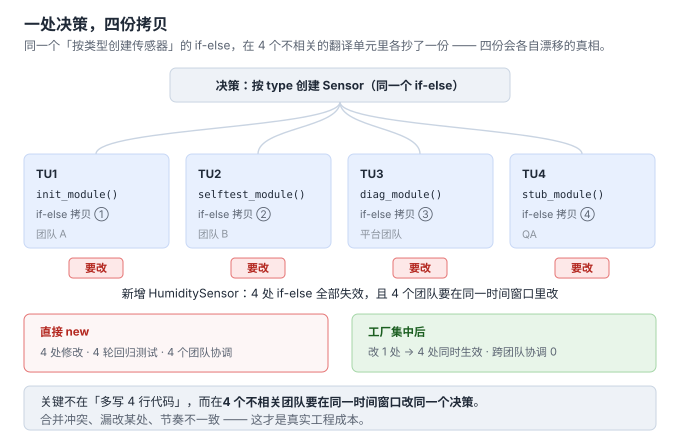
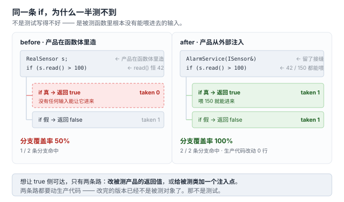

# 1. 诞生背景：`new` 到底痛在哪

> 代码：[`code/01_birth/old.cpp`](../code/01_birth/old.cpp)、[`code/01_birth/spread.cpp`](../code/01_birth/spread.cpp)、[`code/01_birth/responsibility.cpp`](../code/01_birth/responsibility.cpp)（均实测编译运行通过，g++ -std=c++17）
> 痛点 4 另附：[`code/01_birth/testability_before.cpp`](../code/01_birth/testability_before.cpp)、[`code/01_birth/testability_after.cpp`](../code/01_birth/testability_after.cpp)（需 `--coverage` 编译 + `gcov -b -c`）

## 先看一段"没有毛病"的代码

`old.cpp` 里业务函数 `report()` 根据类型创建传感器，直接 `new` 具体类：

```cpp
void report(const std::string& type) {
    std::unique_ptr<Sensor> s;
    if (type == "temp") {
        s = std::make_unique<TempSensor>();      // <-- 直接 new 具体类
    } else if (type == "pressure") {
        s = std::make_unique<PressureSensor>();  // <-- 又一处
    }
    ...
}
```

它编译通过、运行正确。那痛在哪？

## 痛点 1：编译期耦合（头文件依赖扩散）

`report()` 所在的翻译单元必须 `#include` `TempSensor` 和 `PressureSensor` 的**完整定义**。业务代码没用到它们任何私有细节，却为它们的头文件变动买单——头文件一改，所有 include 它的业务文件全部重编。项目大了以后，这就是"改一行，编一小时"的来源。

## 痛点 2：修改扩散（不是改一个点，是改 N 个点）

> 具体案例：[`code/01_birth/spread.cpp`](../code/01_birth/spread.cpp)（已实测编译运行通过）

假设新增 `HumiditySensor`：这个 `if-else` 要改。如果项目里有 5 处类似逻辑（初始化、自检、诊断、模拟、测试桩），就要改 5 处。**"新增"本该是加法，却变成了对既有代码的减法 + 加法**——这就是违反开闭原则（OCP）的具体形态。

### 扩散的可视化：4 个翻译单元，4 份重复决策

`spread.cpp` 用 4 个函数模拟 4 个翻译单元（TU）各自维护一份"根据类型创建传感器"逻辑（真实项目中它们分属 4 个 .cpp、4 个团队）：



新增 `HumiditySensor` 的真实代价对比：

| 变更项 | 直接 new（spread.cpp） | 工厂集中后 |
|---|---|---|
| 新增 `humidity_sensor.h/cpp` | 1 个文件 | 1 个文件 |
| 修改各处 if-else | **4 处 + 4 轮回归测试** | 0 |
| 修改工厂 | — | 1 处（一处改，处处生效） |
| 跨团队协调 | 4 个团队同步改 | 0（产品团队自己加） |

关键不在"多写 4 行代码"，而在**4 个不相关团队要在同一时间窗口改同一个决策**——合并冲突、漏改某处、节奏不一致，才是真实工程成本。

### 开放社区的同类讨论（佐证）

- **GeeksforGeeks** · [Factory Method](https://www.geeksforgeeks.org/factory-method-for-designing-pattern/)：Client 里 `if (type==1) new TwoWheeler(); else if (type==2) new FourWheeler();`，"Adding a new vehicle requires **modifying the client**"——与 TU1–TU4 同构。
- **BestHub** · [From Scattered if-else to Centralized Creation](https://www.besthub.dev/articles/factory-method-pattern-deciding-which-variant-to-create-a9db88cba86d)：支付渠道 if-else **scattered throughout** OrderService，每个新渠道逼业务代码加分支。"scattered"正是"扩散"的英文原词。
- **develclan** · [Factory Method Pattern](https://develclan.com/factory-method-pattern)：表述最准——"The problem arrives when **the same decision shows up in a second place**"；新格式意味着"hunting down every case statement"。
- **java9r** · [OCP for Object Creation](https://java9r.com/roadmap/oop/ocp-with-abstract-factory-extensible-creation)：反直觉补充——**把 if-else 收进一个工厂类后，这个工厂本身仍违反 OCP**（新格式还是要改 switch 体）。这是简单工厂 → 工厂方法/注册表演进的动机，第 3、4 节展开。

> develclan 的触发判据值得单独记：**同一创建决策出现第 2 份拷贝，就是引入工厂的 earliest 时机**；只有 1 份时"it can stay just like that"。

## 痛点 3：责任放错了地方（构造知识泄漏）

> 具体案例：[`code/01_birth/responsibility.cpp`](../code/01_birth/responsibility.cpp)（已实测编译运行通过）

"创建哪种传感器"是**产品体系的决策**，`report()` 只想拿到一个能 `read()` 的东西。现在这个决策散落在每个调用点，等于让所有业务代码都参与产品体系的维护。

### 拆解：选类名只是冰山一角

痛点 1、2 讲的都是"选哪个类"这一层。但"创建"这个决策实际包含三块知识，全部属于产品体系、全部不该让调用方掌握：

| 知识 | 归属 | 直接 new 时的下场 |
|---|---|---|
| ① 选哪个类 | 产品体系 | 调用方写 if-else（痛点 2） |
| ② 构造参数怎么定 | 产品体系 | 调用方被迫传参、被迫懂默认值含义 |
| ③ 版本/变体差异 | 产品体系 | 调用方被迫懂硬件版本这类实现细节 |

`responsibility.cpp` 把 ②③ 演示得很具体：

```cpp
// TempSensor 的构造知识：
//   - explicit 构造函数要求传 calibration_offset，不传直接编译失败
//   - v2 硬件要走 create_v2() 入口，校准值从 OTP 读
t = TempSensor::create_v2(2);            // 调用方必须懂硬件版本逻辑
t = std::make_unique<TempSensor>(0.0);   // 调用方必须懂"0.0 表示不校准"

// PressureSensor 的构造知识：
//   - 默认量程 110 是产品团队定的决策
auto p = std::make_unique<PressureSensor>();  // 调用方被动继承这个决策
```

### 责任错位的判据（一句话）

> **调用方是否被迫阅读具体类的构造函数签名才能写出正确的创建代码？**

是 → 创建决策已经泄漏进业务代码。业务代码应该只回答"我要一个能 read() 的东西"，而不是"TempSensor 的校准参数该传几、v2 硬件走哪个入口"。

### 工厂为什么能治这个病

工厂把 ①②③ 三块知识收进一处后，调用方与产品体系之间只剩一个接口：`create(type) -> Sensor*`。产品体系内部怎么选类、怎么定参数、怎么处理版本差异，都是工厂的私事。**这正是"收走创建决策"这句话的完整含义——收走的不只是 if-else，还有构造知识。**

## 痛点 4：可测试性（前三个"读代码能看出来"，这个是"想写测试才暴露"）

> 具体案例：[`code/01_birth/testability_before.cpp`](../code/01_birth/testability_before.cpp) 与 [`code/01_birth/testability_after.cpp`](../code/01_birth/testability_after.cpp)
> 实测：g++ 13.3 `-std=c++17 -O0 --coverage`，`gcov -b -c` 只统计 `over_threshold` 里那一条 `if`

前三个痛点都是**读代码**就能发现的：耦合、扩散、责任错位。第四个不一样——代码看着完全正常，只有在你想**验证某一条分支**时才卡住。

被测逻辑（`testability_before.cpp`）：

```cpp
class AlarmService {
public:
    bool over_threshold() const {
        RealSensor s;                 // ← 产品在函数体里造出来，没有接缝
        if (s.read() > 100) {         // ← 分支真实存在，但 true 侧永远走不到
            return true;
        }
        return false;
    }
};
```

`RealSensor::read()` 恒返回 42。要测"读数超阈值 → 报警"这一侧，**你没有任何输入可以给**。

### 实测：同一条 `if`，覆盖率差一倍

```text
$ ./before
[before] over_threshold() = 0
[before] 可构造的输入 : 1 种（read() 恒返回 42）
$ ./after
[after]  注入  42 → over_threshold() = 0
[after]  注入 150 → over_threshold() = 1
[after]  可构造的输入 : 2 种（可任意扩展）
```

gcov 原始输出（只截目标那一条 `if`，已滤掉 `printf` 调用边的噪声）：

```text
--- before：src_line=16（if）---
  branch  1 taken 0 (fallthrough)     ← true 侧一次都没进去
  branch  2 taken 1
--- after：src_line=18（if）---
  branch  1 taken 1 (fallthrough)
  branch  2 taken 1
```



| 版本 | `if` 的分支数 | 命中 | 分支覆盖率 | 生产代码改动 |
|---|---|---|---|---|
| before（函数体内部构造） | 2 | 1（true 侧 **taken 0**） | **50%** | — |
| after（从外部注入） | 2 | 2（两侧各 taken 1） | **100%** | **0 行** |

**关键不是"50%"这个数字，而是补上另外 50% 要付什么代价。**

在 before 里想让 true 侧可达，只有两条路：改 `RealSensor::read()` 的返回值，或者给 `AlarmService` 加一个构造注入点。**两条路的共同点是都要动生产代码**——改完的版本已经不是被测对象了。那不是测试，那是"为了测试而改生产代码"。

### 为什么第四条要单列

| | 痛点 1–3 | 痛点 4 |
|---|---|---|
| 什么时候暴露 | 读代码时 | **想写测试时** |
| 谁先抱怨 | 开发 / 代码评审 | **QA / 覆盖率门禁** |
| 说服力的形式 | 是观点（"我觉得乱"） | **是数字（"这条分支测不到"）** |

这也是引入工厂的**第三个理由**（前两个：解耦调用方与产品体系、支持扩展）。它在评审现场最好用，因为前两个理由都能被"我们项目不会变"顶回来，第四个顶不回来。

### 判据

> **你想给这个被测函数喂一个"非正常值"时，改得动吗？**

改不动（产品在函数体里造、参数写死、依赖具体实现）→ 这里缺一个**接缝（seam）**。工厂提供的就是这个接缝：把"造什么"的决定权从函数体内部挪到调用方手上。

这类"把依赖从内部挪到外部"的手法，业界叫**依赖注入（Dependency Injection, DI）**。工厂是它最朴素的一种形态——只注入"谁被造出来"，不注入整个对象图。**你要的往往只是这一个注入点，不必上完整的 DI 框架。**

> 这条接缝的完整形态（不只是"谁能造"，还有"谁持有、谁销毁、失败怎么报"）在第 7 节 [`07-工厂接口契约.md`](07-工厂接口契约.md) 收口。

## 工厂模式的本质（一句话）

> **把"创建什么"的决策，从调用方手里收走，集中到一处。**

调用方从此只认识抽象 `Sensor`，不认识任何具体类。后面几节的三层演进（简单工厂 → 工厂方法 → 抽象工厂），都是围绕这句话在不同规模下的落地方式。

## 一句话检验你有没有这个痛点

> 你的代码里，同一个具体类名出现在**两个以上不相关的翻译单元**的 `new` 里吗？

是 → 工厂值得考虑。否（比如整个项目就 `main` 里 new 一次）→ 别上工厂，白付代价（第 6 节展开）。

## 进度

- [x] 1 诞生背景（+ 痛点 4 可测试性）
- [x] 2 三个层次
- [x] 3 简单工厂·最小示例
- [x] 4 工厂方法（+4a 语法专题 / 4b 函数类型专题）
- [x] 5 抽象工厂
- [x] 6 代价与边界（+ 反模式清单）
- [x] 7 工厂接口契约
- [x] A06 运行期插件工厂
- [x] 收敛：引用归位（A01 §8 上移进第 7 节 / 07 ←→ A03 互指）
- [x] 图密度补齐（目标 ≥ 1 图 / 200 行；逐篇进度见 00-讲解计划）
- [ ] 8 MVP 沉淀 skill

> 主线之外的追加专题（A01 演进史 / A02 开源考据 / A03 Fast-DDS / A04 C 语言 / A05 nginx·redis）已完成，编排见 [`00-讲解计划.md`](00-讲解计划.md)。
