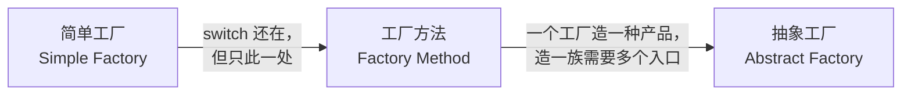

# 2. 三个层次：一句话区分

> 前置：第 1 节的三个痛点（编译耦合 / 修改扩散 / 构造知识泄漏）。三层演进是对这三个痛点逐层加码的解法。
> 代码：[`code/02_levels/pain_of_switch.cpp`](../code/02_levels/pain_of_switch.cpp)（实测编译运行通过）

## 不是三个模式，是一个演进链



## 一张表区分

| | 简单工厂 | 工厂方法 | 抽象工厂 |
|---|---|---|---|
| **一句话** | 一个函数里写 switch | 每个产品一个工厂类 | 一个工厂造**一族**产品 |
| **新增产品改哪里** | 改工厂的 switch（违反 OCP） | 新增一个工厂类（不改旧代码） | 新增整个产品族要改工厂接口 |
| **类数量** | 1 个工厂类 | **N 个**工厂类 | **M 个**族工厂类 |
| **解决的问题** | 痛点 2/3 的扩散与泄漏 | 痛点 2 的 OCP 死结 | 产品族的一致性约束 |
| **付出的代价** | 最小 | 类数量翻倍 | 接口最重、最难改 |

## 判断什么时候升级到下一层

三个判据，满足即升级：

1. **简单工厂 → 工厂方法**：switch 体的频繁变更开始伤人（详见下节拆解）。**触发信号：工厂函数成为高频改动热点。**
2. **工厂方法 → 抽象工厂**：调用方每次都要**成组**拿产品（拿串口就得拿匹配的 GPIO 实现），分散创建会拿到不匹配的组合。**触发信号：产品之间存在"必须配套"的约束。**
3. **任何一层 → 停在原地**：产品数量稳定（如传感器就那 3 种，一年不加了）——留在简单工厂甚至直接 new。**触发信号：没有变化信号就是最好的信号。**

## 判据 1 拆解："switch 体的频繁变更伤人"的三个具体形态

> 代码对照：[`code/02_levels/pain_of_switch.cpp`](../code/02_levels/pain_of_switch.cpp)
> 场景：简单工厂 `create_sensor()` 从 v1（2 个分支）演化到 v3（4 个分支 + 构造知识泄漏）

### 伤 A：已测试代码体被反复编辑（回归风险）

`create_sensor_v1` 只有 2 个分支时岁月静好。v2 新增 `HumiditySensor` 时，你必须**编辑一个已经通过测试、已经在生产环境跑着的函数体**。

java9r 对此的表述：*"every new format requires editing that method's existing, **already-tested** body, which is precisely the kind of modification-to-extend OCP says should be avoidable."*

伤在：① 每次编辑理论上都可能碰坏既有分支（手滑改错行、删错逗号）；② 保守的流程要求**全量回归**——明明只是加一个新产品，4 个老产品全部要重测。加产品的边际成本不随产品数增长，但**回归成本**随产品数线性增长。

### 伤 B：分支间隐式耦合（新分支的"仪式"越来越多）

`pain_of_switch.cpp` 的 v3 版演示了这种积累：

```cpp
if (type == "temp") {
    return std::make_unique<TempSensor>();  // v2.5 起：构造知识泄漏进工厂体
}
if (type == "humidity") { ... }   // 团队 A 加的
if (type == "gps")      { ... }   // 团队 B 加的
```

- v2.5：`TempSensor` 构造开始要传校准参数——**老分支**被迫跟着改（第 1 节痛点 ③ 的重演）
- 每加一个分支，可能还有白名单/校验表要同步——**忘了就是运行时 bug**，编译器不帮你

伤在：switch 不是 N 个独立分支的并列，而是一个**共享可变状态**。每个分支的"添加仪式"随版本越来越多，且没有任何编译期机制提醒你做全。

### 伤 C：并行改动撞在同一区域（合并冲突）

两个团队同时开发 `HumiditySensor` 和 `GpsSensor`，都要往**同一个函数体**的同一个位置插分支。git 视角：两份 diff 上下文重叠，必冲突。

伤在：冲突解决本身是纯手工劳动；更隐蔽的是**解决冲突的人不一定懂两个产品的构造知识**，随手解决可能弄丢一方的细节。类膨胀的工厂方法没有这个问题——**新工厂类 = 新文件 = 天然无冲突**，这是 OCP 在协作维度的红利。

### 三伤的累积曲线

| 产品数 | 伤 A（回归） | 伤 B（仪式） | 伤 C（冲突概率） |
|---|---|---|---|
| 2 个 | 每次全量回归 2 个 | 仪式少 | 撞不上 |
| 4 个 | 每次全量回归 4 个 | 仪式增多 | 偶发 |
| 8 个 | 每次全量回归 8 个 | 仪式成为文档级负担 | 高发 |

**switch 的伤害不是常数，是随产品数和团队数超线性增长的。** "频繁变更开始伤人"的判断点：当你在 code review 里第二次看到"改 create_sensor() 要同步改 XX"这类人肉提醒时，就该升级了。

## 嵌入式视角的对照

| 场景 | 合适的层 |
|---|---|
| 驱动库里 3 种传感器，类别稳定 | 简单工厂，甚至注册表 lambda 就够 |
| 日志输出后端可扩展（file/syslog/串口/网络），第三方要加新后端 | 工厂方法 |
| HAL 层：同一芯片家族要同时给 UART/GPIO/DMA 一组实现，不能混搭 | 抽象工厂 |

## 一句话总结

> 简单工厂治"扩散"，工厂方法治"改旧代码"，抽象工厂治"配套约束"。**层次的每一步升级都在买更贵的保险——只在下一段路况确实变差时才值得付费。**

## 进度

- [x] 1 诞生背景
- [x] 2 三个层次
- [ ] 3 简单工厂·最小示例
