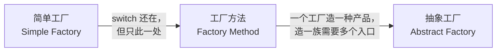

# 2. 三个层次：一句话区分

> 前置：第 1 节的三个痛点（编译耦合 / 修改扩散 / 构造知识泄漏）。三层演进是对这三个痛点逐层加码的解法。
> 本节只建框架不写代码——每层的完整代码在第 3、4、5 节。

## 不是三个模式，是一个演进链

## 一张表区分

| | 简单工厂 | 工厂方法 | 抽象工厂 |
|---|---|---|---|
| **一句话** | 一个函数里写 switch | 每个产品一个工厂类 | 一个工厂造**一族**产品 |
| **新增产品改哪里** | 改工厂的 switch（违反 OCP） | 新增一个工厂类（不改旧代码） | 新增整个产品族要改工厂接口 |
| **类数量** | 1 个工厂类 | **N 个**工厂类 | **M 个**族工厂类 |
| **解决的问题** | 痛点 2/3 的扩散与泄漏 | 痛点 2 的 OCP 死结 | 产品族的一致性约束 |
| **付出的代价** | 最小 | 类数量翻倍 | 接口最重、最难改 |

## 判断什么时候升级到下一层

三个判据，满足即升级：

1. **简单工厂 → 工厂方法**：switch 体的频繁变更开始伤人（新成员要改测试过的工厂函数体——java9r 说的"editing the method's already-tested body"）。**触发信号：工厂函数成为高频改动热点。**
2. **工厂方法 → 抽象工厂**：调用方每次都要**成组**拿产品（拿串口就得拿匹配的 GPIO 实现），分散创建会拿到不匹配的组合。**触发信号：产品之间存在"必须配套"的约束。**
3. **任何一层 → 停在原地**：产品数量稳定（如传感器就那 3 种，一年不加了）——留在简单工厂甚至直接 new。**触发信号：没有变化信号就是最好的信号。**

## 嵌入式视角的对照

| 场景 | 合适的层 |
|---|---|
| 驱动库里 3 种传感器，类别稳定 | 简单工厂，甚至注册表 lambda 就够 |
| 日志输出后端可扩展（file/syslog/串口/网络），第三方要加新后端 | 工厂方法 |
| HAL 层：同一芯片家族要同时给 UART/GPIO/DMA 一组实现，不能混搭 | 抽象工厂 |

## 一句话总结

> 简单工厂治"扩散"，工厂方法治"改旧代码"，抽象工厂治"配套约束"。**层次的每一步升级都在买更贵的保险——只在下一段路况确实变差时才值得付费。**

## 进度

- [x] 1 诞生背景
- [x] 2 三个层次
- [ ] 3 简单工厂·最小示例
