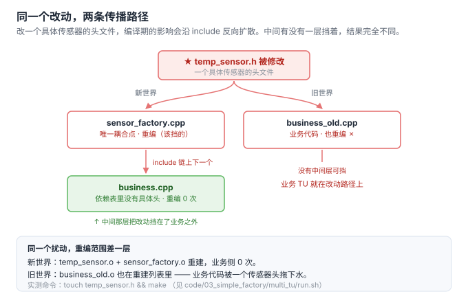

# 3. 简单工厂 · 最小可运行示例

> 代码对照：
> - 旧世界：[`code/01_birth/old.cpp`](../code/01_birth/old.cpp)（业务函数直接 if-else new）
> - 新世界：[`code/03_simple_factory/new.cpp`](../code/03_simple_factory/new.cpp)（引入简单工厂）
> 均实测编译运行通过（g++ -std=c++17）

## 最小改动：创建决策收进一个函数

```cpp
// new.cpp —— 工厂是全部创建决策的唯一居所
std::unique_ptr<Sensor> create_sensor(const std::string& type) {
    if (type == "temp")          return std::make_unique<TempSensor>();
    if (type == "pressure")      return std::make_unique<PressureSensor>();
    throw std::invalid_argument("unknown sensor type: " + type);
}

// 业务侧：没有具体类名，没有构造参数知识，没有 if-else
void report(const std::string& type) {
    auto s = create_sensor(type);
    std::printf("read: %s\n", s->read().c_str());
}
```

就这么大。**简单工厂的全部内容 = 一个函数。** 没有工厂基类、没有继承层次、没有注册表。

## 第 1 节三个痛点的对照记分板

| 痛点 | old.cpp | new.cpp | 解到什么程度 |
|---|---|---|---|
| 1 编译耦合 | 业务 TU include 具体类头文件 | 业务 TU 只 include 工厂头文件 | ✅ 彻底解（见下方布局） |
| 2 修改扩散 | 4 个 TU 各改各的 if-else | 新增传感器只改工厂一处 | ✅ 扩散面从 N 收敛到 1 |
| 3 构造知识泄漏 | 调用方被迫懂参数/版本 | 构造知识封进工厂函数 | ✅ 调用方无感 |

### 痛点 1 的解：真实项目布局（单文件演示的盲区）

```text
sensor_factory.h   —— 只声明 create_sensor()，业务侧只 include 这个
sensor_factory.cpp  —— include 全部具体传感器头文件，是唯一耦合点
business.cpp        —— 编译期与具体类彻底解耦
```

具体传感器头文件改动 → `business.cpp` 不重编。**关键手法：声明与实现分离，头文件只给抽象。**



**上面那句不是推断，是实测。** `code/03_simple_factory/multi_tu/` 把那段布局真做成了多 TU 工程，`bash run.sh` 一键复现。

先看依赖表（`-MM` 只列用户头，不含系统头）：

```text
$ g++ -std=c++17 -MM -I. business.cpp
business.o: business.cpp sensor_factory.h sensor.h

$ g++ -std=c++17 -MM -I. business_old.cpp      # 旧世界对照组
business_old.o: business_old.cpp pressure_sensor.h sensor.h temp_sensor.h

$ g++ -std=c++17 -MM -I. sensor_factory.cpp    # 唯一耦合点
sensor_factory.o: sensor_factory.cpp sensor_factory.h sensor.h pressure_sensor.h temp_sensor.h
```

新世界的业务 TU 依赖表里**没有任何具体传感器头**；对照组的依赖表里两个都在。

再看真实重建 —— 改一个具体头，然后 `make`：

```text
$ touch temp_sensor.h && make
g++ -std=c++17 -Wall -MMD -MP -I. -c -o temp_sensor.o temp_sensor.cpp
g++ -std=c++17 -Wall -MMD -MP -I. -c -o sensor_factory.o sensor_factory.cpp
g++ -std=c++17 -Wall -MMD -MP -I. -c -o business_old.o business_old.cpp
g++ ... -o /tmp/fp03_multi_tu ...          # 重链

# business.o 不在上面任何一行
```

| | 依赖的具体头 | `touch temp_sensor.h` 后重编 |
|---|---|---|
| `business.cpp`（经工厂） | **0 个** | **否** |
| `business_old.cpp`（直接 new） | 2 个 | **是** |

⇒ 痛点 1 的"解"，本质是**把具体类型从业务 TU 的依赖图里删掉**。工厂函数只是手段，真正的机制是"业务只 include 抽象"这条依赖纪律 —— 这也是为什么第 7 节要谈工厂的接口契约：**边界画在哪里，决定了改动能走多远。**

### 痛点 2 的解：报错也集中了

`new.cpp` 运行输出里有一行值得注意：

```text
expected error: unknown sensor type: humidity
```

未注册类型只有一个报错点、一种报错格式——在 old 世界，4 个 TU 可能写出 4 种失败方式（有的静默返回 nullptr，有的随手 new 个默认值）。

## 但 switch 还在（判据 1 的伏笔）

对照第 2 节：简单工厂把 if-else 从 N 处收敛到 1 处，**但没有消灭它**。新增 `HumiditySensor` 仍然要改 `create_sensor()` 的函数体——伤 A（回归）/伤 B（仪式）/伤 C（冲突）三伤一个没少，只是受害范围从"N 个 TU"缩到"1 个工厂函数"。

这就是第 4 节的入口：**当这个函数体本身成为高频改动热点时，工厂方法把"改函数体"变成"加新类"**。

## 一句话总结

> 简单工厂 = 用一个函数买断三个痛点，代价是全项目最小的。**它是默认选项，不是过渡形态**——产品稳定时，它就是终点站。

## 进度

- [x] 1 诞生背景（+ 痛点 4 可测试性）
- [x] 2 三个层次
- [x] 3 简单工厂·最小示例
- [x] 4 工厂方法（+4a 语法专题 / 4b 函数类型专题）
- [x] 5 抽象工厂
- [x] 6 代价与边界（+ 反模式清单）
- [x] 7 工厂接口契约
- [x] A06 运行期插件工厂
- [x] 收敛：引用归位（A01 §8 上移进第 7 节 / 07 ←→ A03 互指）
- [ ] 图密度补齐（目标 ≥ 1 图 / 200 行；逐篇进度见 00-讲解计划）
- [ ] 8 MVP → skill

> 主线之外的追加专题（A01 演进史 / A02 开源考据 / A03 Fast-DDS / A04 C 语言 / A05 nginx·redis）已完成，编排见 [`00-讲解计划.md`](00-讲解计划.md)。
