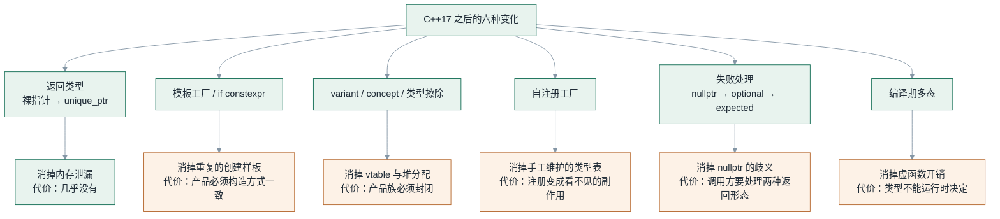
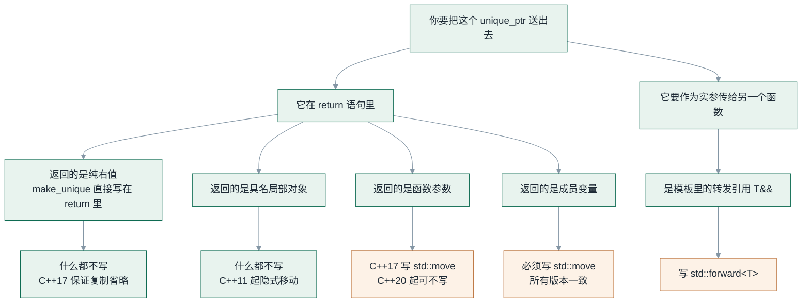
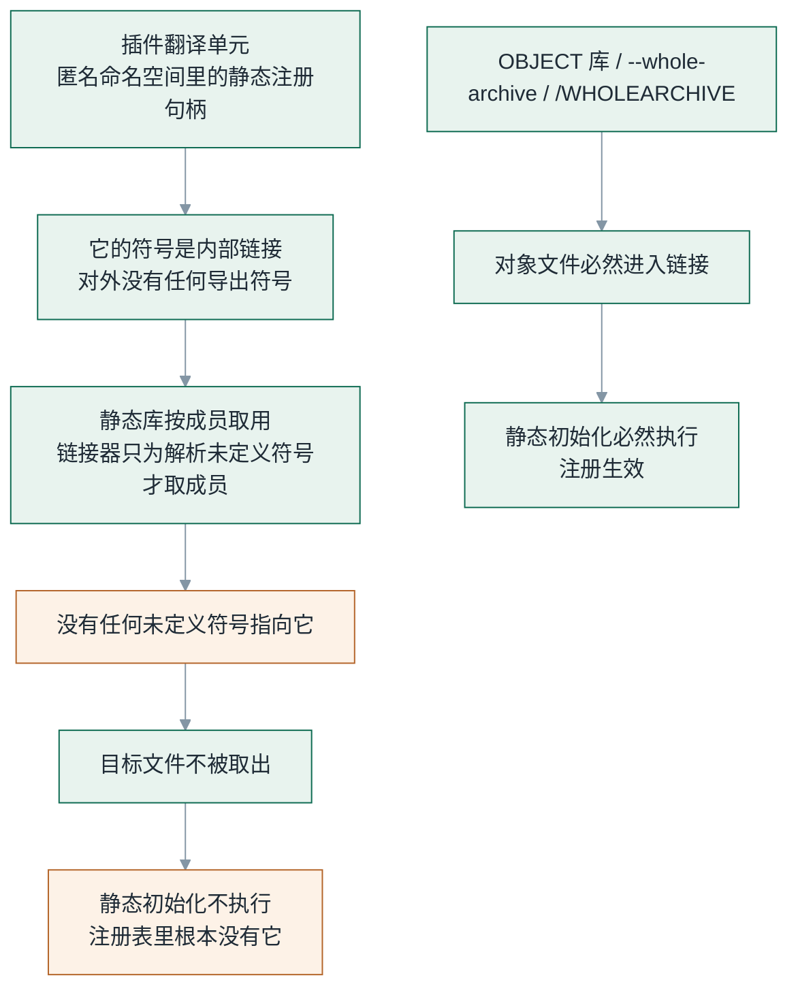
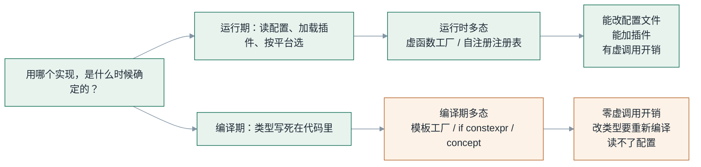

# C++17 之后，工厂模式发生了哪些变化

> 《C++ 工厂模式：从 if/else 到架构边界》第 4 篇
>
> 配套代码：`factory-pattern/code/src/04_modern_cpp17/`｜代码块逐块标注来源：出自仓库的与文件同名同序，标「示意」的不在仓库中
>
> 系列边界：本系列只讨论**创建与装配的职责划分**，不覆盖线程安全、异常安全与 ABI 兼容；测试只演示"替换实现"这一件事。

---

## 一、先给结论，再说过程

关于"C++17 之后工厂模式有什么变化"，网上常见两种答法。一种是罗列 `unique_ptr`、`variant`、`concept`、`if constexpr` 这些关键词——读完你知道有哪些新玩具，但不知道该用哪个。另一种是宣布"虚函数工厂过时了"——这是错的。

这篇的结论只有一句，其余全部是它的证据：

> **运行时多态仍是默认选择。模板工厂、编译期工厂、`variant` 这些是局部优化，不是替代品——它们换掉的是虚函数开销，付出的是「类型不能在运行时决定」。**

六种变化的对照表，先摆在前面：

| 工厂要素 | C++17 之前 | C++17 之后 |
|---|---|---|
| 返回所有权 | 裸指针 | `unique_ptr` / `shared_ptr` |
| 创建方式 | `if/else` | 模板、`if constexpr`、concept |
| 注册方式 | 集中注册 | 自注册 |
| 失败处理 | `nullptr` / 异常 | `optional` / `expected` |
| 多态形态 | 虚函数 | 虚函数 + `variant` + concept + 类型擦除 |
| 装配职责 | 工厂全包 | 工厂创建，DI 装配 |

这张表里有两个格子值得警惕。**"返回所有权：裸指针 → `unique_ptr`"** 看着最平淡，但它藏着一处被大量中文文章讲错的地方（第三节整节讲它）。**"装配职责"** 那一格是本系列第 5 篇的全部主题，本篇只到门口。

六种变化各自解决什么问题、要付什么代价：



绿色的那一条是唯一"几乎白拿"的。其余五条都带代价——这就是为什么它们只是**补充选项**。

---

## 二、变化一：返回类型从裸指针变成智能指针

这一条不用多说，但值得看清它到底消除了什么：

```cpp
// 示意：C++17 之前的写法，本段不在配套仓库中
// 旧写法
Logger* logger = LoggerFactory::create("file");
if (logger == nullptr) { /* ... */ }
logger->log("start");
delete logger;          // ← 异常路径上不会被执行
```

问题不在 `delete` 本身，而在 `delete` **在异常路径上会被跳过**：

```cpp
// 示意：异常路径，本段不在配套仓库中
Logger* logger = LoggerFactory::create("file");
logger->log("start");
maybe_throw();          // ← 这里抛了
delete logger;          // 永远到不了
```

```cpp
// 示意：C++17 的写法，本段不在配套仓库中
// 新写法
auto logger = LoggerFactory::create("file");
logger->log("start");
maybe_throw();          // 抛出也安全，unique_ptr 的析构会执行
```

这是六种变化里唯一"没有代价"的一条——`unique_ptr` 是零开销抽象，析构函数在编译期就被内联进调用点。

代价只在一个地方：**如果你还需要把对象交给别人，或者让多个对象共享，就得选对智能指针**。`unique_ptr` 表示独占，`shared_ptr` 表示共享，选错的代价是真实的（第 5 篇有一节专门讨论这个选择）。

---

## 三、§7.2 独立成节：`unique_ptr` 返回的三个问题

这一节单独拎出来，是因为它是最容易写错的地方。中文技术博客里讲到工厂返回 `unique_ptr`，几乎一定会出现下面这句话：

> "`return std::make_unique<FileLogger>();` 这一步，发生了移动语义和完美转发。"

**这句话的两个半句都不准确。** 下面逐问拆开，每一问都由仓库里的 `src/04_modern_cpp17/probe_unique_ptr.cpp` 给出可编译、可运行的答案。

### 问一：`unique_ptr<ConsoleLogger>` 是怎么变成 `unique_ptr<Logger>` 的？

靠的是 `unique_ptr` 的**模板转换构造函数**：

```cpp
// 标准库签名（摘自 <memory>），非本仓库代码
template <class U, class E>
unique_ptr(unique_ptr<U, E>&& u) noexcept;   // 约束：U* 可隐式转换为 T*
```

三个要点：

1. **不是移动构造函数。** 移动构造是 `unique_ptr<T>(unique_ptr<T>&&)`，同一个类型。这里是不同类型之间的转换。
2. **不是 `dynamic_cast`。** 它要求 `U*` 到 `T*` 的隐式转换，也就是编译期的向上转型。没有 RTTI、没有运行期检查、零开销。
3. **方向是单向的。** 向上能转，向下编译期就拦住了。

第 3 点可以在编译期断言出来：

```cpp
// src/04_modern_cpp17/probe_unique_ptr.cpp（节选）
static_assert(std::is_constructible<std::unique_ptr<Logger>,
                                    std::unique_ptr<ConsoleLogger>&&>::value,
              "向上转型可以：这正是模板转换构造函数在做的事");
static_assert(!std::is_constructible<std::unique_ptr<ConsoleLogger>,
                                     std::unique_ptr<Logger>&&>::value,
              "向下转型不行：它必须在编译期被挡住");
```

这两条 `static_assert` 不是注释，是**编译期就会拦人的断言**。它们和文章一起被编译，任何一条不成立，这个文件就编不过。

### 问二：要不要写 `std::move`？

分四种情形——其中**第 ③ 种的答案取决于标准版本**：

```cpp
// src/04_modern_cpp17/probe_unique_ptr.cpp（节选）

// ① 返回纯右值 —— 不写。C++17 起连移动构造都没发生（保证的复制省略）
std::unique_ptr<Logger> make_by_prvalue() {
    return std::make_unique<ConsoleLogger>();
}

// ② 返回具名局部对象 —— 不写。C++11 起先按右值做重载决议（隐式移动）
std::unique_ptr<Logger> make_from_named_local() {
    auto local = std::make_unique<ConsoleLogger>();
    return local;
}

// ③ 返回函数参数 —— C++17 必须写，C++20 起可以不写（原因见下）
std::unique_ptr<Logger> make_from_forwarded_param(std::unique_ptr<Logger>&& incoming) {
#if __cplusplus >= 202002L
    return incoming;               // C++20：右值引用参数已是 implicitly movable entity
#else
    return std::move(incoming);    // C++17：函数参数不在隐式移动范围内
#endif
}

// ④ 返回成员变量 —— 必须写，任何标准版本都一样
std::unique_ptr<Logger> Holder::release_member() {
    return std::move(owned_);      // ← 这里不写就是编译错误
}
```

| 情形 | C++11–17 | C++20 起 |
|---|---|---|
| ① 纯右值 | 不写 | 不写 |
| ② 具名局部对象 | 不写 | 不写 |
| ③ 函数参数 | **必须写** | 不写 |
| ④ 成员变量 | **必须写** | **必须写** |

第 ③ 行是本系列里**唯一一处"答案随标准版本改变"**的地方，值得说清它为什么变：

- **C++11 到 C++17**，隐式移动的适用范围写死在 `[class.copy.elision]` 里，措辞是
  "a non-volatile automatic object (**other than a function or catch-clause parameter**)"
  ——函数参数被**显式排除**。所以在 C++17 下写 `return incoming;`，编译器会去匹配
  `unique_ptr` 已删除的拷贝构造，**直接编译失败**。
- **C++20 的 [P1825R0](https://wg21.link/p1825r0)** 把它改成 "implicitly movable entity"，
  定义为"自动存储期的非 volatile 对象，**或指向非 volatile 对象类型的右值引用**"。
  右值引用参数由此被纳入，`return incoming;` 才变得合法。

> 这个坑值得单独记一笔：**同一行代码，C++17 编译失败，C++20 编译通过。**
> 如果你的项目还在 C++17，看到别人说"函数参数返回不用写 `std::move`"，
> 先确认他编的是哪个标准——本仓库的 `CMAKE_CXX_STANDARD` 是 **17**，所以
> `probe_unique_ptr.cpp` 在这个条件下走的是 `std::move` 那一支。

第 ④ 种在任何版本都必须写，原因很具体：**隐式移动只覆盖"这次函数调用新造出来的东西"**
——局部对象，以及（C++20 起）函数参数。成员变量不属于此列，编译器不会替你把它当右值。

这里还有一条**反过来的建议**，比"要不要写"更重要：

> **不要在返回局部对象时写 `std::move`。**

```cpp
// 示意：错误写法，本段不在配套仓库中
auto local = std::make_unique<ConsoleLogger>();
return std::move(local);   // ← 不要这样写
```

写上去不只是多余，是**负优化**：返回语句一旦不是"单纯的名字"（而是一个 `std::move` 调用表达式），保证的复制省略和隐式移动就都不适用了，编译器只能老老实实调一次移动构造。你把一个"可能完全不发生"的操作，变成了一次"一定发生"的操作。

标准就是这么定的：C++11 引入隐式移动（覆盖**局部对象**），C++17 加入保证的复制省略，C++20 的 P1825 把**函数参数**也纳入进来。方向一直很清楚——**手写 `std::move` 的理由在逐年变少**，但"变少"不等于"已经没有了"：在 C++17 下，转发函数参数时它依然不能省。

### 问三：`std::forward` 参不参与？

**不参与。返回语句这一侧，根本没有"完美转发"这回事。**

完美转发解决的是另一个问题：模板里拿到一个 `T&&` 参数，要把它**转手传给下一个函数**时，怎么保住它原本的左右值属性。它的作用点是"函数调用的实参"，不是"返回语句的返回值"。

```cpp
// 对照：真正需要 std::forward 的地方
// src/04_modern_cpp17/probe_unique_ptr.cpp（节选）
template <typename T>
void forward_to_sink(T&& value, Sink& sink) {
    sink.take(std::forward<T>(value));   // ← 这里才是它的位置
}
```

而返回语句里，各种情形已经被"保证的复制省略 + 隐式移动"覆盖干净了。**在 `return` 里写 `std::forward`，是把两个不相干的机制记混了。**

顺带验证一下这个说法本身：往 `forward_to_sink` 传一个**左值**，会编译失败——因为 `std::forward` 忠实地把左值属性传了下去，而 `sink.take()` 需要按值接收，移动构造被删除，复制又不可用。**这次编译失败不是缺陷，是 `std::forward` 语义正确的证明。**

### 这三问汇成一张决策图



> 图里橙色三条是"必须写"，绿色两条是"不要写"。唯一随标准摇摆的是 **R5**（函数参数）——
> 这也是本系列里唯一一处版本相关的答案。

**结论：工厂把 `unique_ptr` 送出去时，`std::forward` 一次都不该出现；`std::move` 只在两处该出现——返回成员变量，以及（仅限 C++17）返回函数参数。** 在别的地方看到它们，通常说明作者把"隐式移动"记成了"必须手写移动"。

跑一下就能看到全部结论：

```bash
./build/src/04_modern_cpp17/fp_04_probe_unique_ptr
```

---

## 四、变化二：模板工厂与 `if constexpr`

模板工厂的长相很讨喜——用类型参数消掉整个 `if/else` 链：

```cpp
// src/04_modern_cpp17/modern_factories.h（节选）
template <typename T>
class LoggerCreator final : public LoggerCreatorBase {
    static_assert(std::is_base_of<Logger, T>::value,
                  "LoggerCreator<T> 要求 T 派生自 fp::Logger");
    static_assert(std::is_default_constructible<T>::value,
                  "模板工厂要求产品可以默认构造 —— 这就是它的根本限制");

public:
    std::unique_ptr<Logger> create() const override {
        return std::make_unique<T>();
    }
};
```

请注意那两条 `static_assert`——**我把这个模式的根本限制写进了编译期，而不是写在文档里。**

关键设计是：**接口仍然是虚函数**（`LoggerCreatorBase`），模板只负责"造哪一个"。所以它不是"用模板取代多态"，而是"用模板消掉重复的创建样板"。这一点如果搞反，就会得出"模板工厂比虚函数快"的错误结论——`create()` 依然是虚调用。

它的硬限制由第二条 `static_assert` 精确定义出来：**产品必须可以默认构造，也就是所有产品的构造方式必须一致。** 看仓库里的例子就明白为什么：

```cpp
// src/04_modern_cpp17/modern_factories.cpp（节选，为可读性加了行内注释）
std::unique_ptr<Logger> make_creator(std::string_view kind) {
    if (kind == "console") {
        return std::make_unique<LoggerCreator<ConsoleLogger>>();   // 可默认构造 ✅
    }
    if (kind == "null") {
        return std::make_unique<LoggerCreator<NullLogger>>();      // 可默认构造 ✅
    }
    return nullptr;
}
```

第 1 篇那个 `FileLogger` 用的是 `LoggerCreator<FileLogger>`——**它进不来**，因为它的构造需要一个 `FileLoggerConfig`，而模板工厂没有地方放这个参数。

`if constexpr` 是同一思路的另一支：把"选择"整体搬到编译期。

```cpp
// src/04_modern_cpp17/modern_factories.h（节选）
template <typename T>
std::unique_ptr<Logger> create_known_at_compile_time() {
    if constexpr (std::is_same<T, ConsoleLogger>::value) {
        return std::make_unique<ConsoleLogger>();
    } else if constexpr (std::is_same<T, NullLogger>::value) {
        return std::make_unique<NullLogger>();
    } else {
        static_assert(always_false_v<T>, "未知的 Logger 类型 —— 请在这里补一个分支");
        return nullptr;
    }
}
```

没被选中的分支**根本不参与编译**，运行期也没有任何判断。第 4 篇的"零开销"就来自这里。代价同样清晰：类型必须在编译期确定，读不了配置文件。

**所以这两种写法的共同边界是：配置驱动、插件化、跨平台选择——这三个场景它们全都干不了。**

---

## 五、变化三：封闭产品族用 `variant`

产品族在编译期已知且封闭时，可以完全不要 vtable、不要堆分配：

```cpp
// src/04_modern_cpp17/modern_factories.h（节选）
enum class LoggerKind { Console, Null };

using LoggerVariant = std::variant<ConsoleLogger, NullLogger>;

LoggerVariant make_variant_logger(LoggerKind kind);

/// 用 std::visit 访问：编译期展开成重载集合，没有虚调用。
void log_via_variant(LoggerVariant& variant, const std::string& message);
```

访问方式是 `std::visit`，它在编译期展开成重载集合——没有虚表指针，也没有跳转表。

两条边界必须说清：

1. **产品族必须封闭。** 每加一个产品，就要改 `using` 那一行，并且**所有** `std::visit` 的地方都可能需要跟着处理新分支。这是拿"开放性"换"零开销"。
2. **它是值语义。** `sizeof(LoggerVariant)` 是所有备选类型里最大的那个——如果某个产品很大，这个 variant 就跟着大，而且每次传递都在拷贝。

素材里同时提到的 C++20 concepts（编译期多态、零开销）和类型擦除（值语义 + 运行期切换），定位与 `variant` 相同：都是**在特定封闭条件下**替代虚函数，不是通用答案。

**现实里，纯虚接口仍然是抽象工厂的主流写法。** 这不是惯性，是因为"运行期决定用哪个实现"这个需求，恰恰是工厂模式存在的主要理由之一。

---

## 六、变化四：自注册工厂，和那个会安静吃掉你的坑

自注册的思路很干净：每个具体实现**在自己的 `.cpp` 里**完成注册，工厂里那个必须手工维护的类型表就此消失。

```cpp
// src/04_modern_cpp17/plugins/plugin_stdout.cpp（节选）
namespace {

const fp::LoggerRegistrar fp_registrar_plugin_stdout{
    "plugin-stdout",
    []() -> std::unique_ptr<fp::Logger> {
        return std::make_unique<fp::ConsoleLogger>();
    }};

}  // namespace
```

C++17 的三样东西让这件事变得自然：`std::string_view` 做键（不必先构造 `std::string`）、`inline static` 让注册表定义不必再单开一个 `.cpp`、`std::function` + lambda 让"创建函数"可以直接写在同一行。

但真正的坑不在这些语法上。**坑是：这个文件可能根本不会被执行。**

### 坑的完整机制



**注意整条链上没有任何一步会报错或警告。** 编译成功、链接成功、程序正常启动，只是注册表里少了一项。这类故障是最贵的一种——它不告诉你出错了，只告诉你"这个类型不存在"。

仓库把这个坑做成了可复现装置：**同一个 `plugins/plugin_stdout.cpp`，被编译进两种不同的库**。

```cmake
# src/04_modern_cpp17/CMakeLists.txt（节选）

# 装进 STATIC 库：插件对外没有任何符号被引用 → 目标文件不会被取出 → 注册不生效。
add_library(fp_04_plugins_static STATIC plugins/plugin_stdout.cpp)

# 装进 OBJECT 库：对象文件必然进入最终链接 → 注册一定生效。
add_library(fp_04_plugins_object OBJECT plugins/plugin_stdout.cpp)
```

跑一下对比：

```bash
./build/src/04_modern_cpp17/fp_04_self_register_dropped   # 只看到 1 个类型
./build/src/04_modern_cpp17/fp_04_self_register_fixed     # 看到 2 个类型
```

两个可执行文件用的是**同一份 `main_self_register.cpp`**，`main` 里自己也注册了一个 `console`——这个设计是为了把"注册机制本身有问题"和"这个翻译单元没被链进来"精确区分开。前者如果是坏的，两个版本都会只剩 0 个；现在一个 1 个、一个 2 个，说明机制是通的，问题百分百在链接器。

三条对策，按推荐程度排：

| 对策 | 写法 | 适用 |
|---|---|---|
| 改用 OBJECT 库 | `add_library(x OBJECT ...)` | CMake 3.12+，最干净 |
| 强制整库链接 | GNU: `-Wl,--whole-archive`；MSVC: `/WHOLEARCHIVE:` | 不方便改库类型时 |
| 显式调用一次 | 插件导出一个函数，使用时手工调用 | 最笨但最易懂，跨构建系统都有效 |

---

## 七、变化五：失败怎么表达

第 1 篇留了一个尾巴：工厂用 `nullptr` 表达失败。三个问题——调用方可能忘检、`nullptr` 丢失失败原因、它污染了返回类型。C++ 给了三代答案：

```cpp
// src/04_modern_cpp17/expected_compat.h（节选）
enum class CreateError { UnknownType, BadConfig };

/// C++17 的写法。
/// 它能表达"失败了"，但表达不了"为什么失败"——
/// 而且一旦产品是 move-only，optional<unique_ptr<T>> 这层嵌套也显得笨重。
std::optional<std::unique_ptr<Logger>> create_logger_optional(std::string_view kind);

#if defined(FP_HAS_EXPECTED)
/// C++23 的写法：失败原因随返回值一起带出来。
std::expected<std::unique_ptr<Logger>, CreateError> create_logger_expected(std::string_view kind);
#endif
```

三种表达各自的形状：

| 标准 | 表达方式 | 能说"为什么失败" | 对 move-only 产品是否顺手 |
|---|---|---|---|
| C++11/14 | `nullptr` | ❌ | ✅ |
| C++17 | `std::optional` | ❌ | ❌（`optional<unique_ptr<T>>` 两层） |
| C++23 | `std::expected` | ✅ | ✅ |

关键取舍在这一行：**`std::optional` 相对 `nullptr` 的进步，只是"忘检"这件事被类型系统提醒了**（`optional` 没有 `operator*` 之外的隐式解引用，想取值必须显式）。它并没有解决"失败原因"的问题。而 `expected` 一次解决两个问题——这也是为什么它被放进 C++23 而不是 C++17。

仓库的做法是**条件编译**：主线走 C++17 的 `optional`，若编译器有 `<expected>`，`expected` 分支自动启用。

```cpp
// src/04_modern_cpp17/expected_compat.h（节选）
#if defined(__has_include)
#  if __has_include(<expected>)
#    include <expected>
#    if defined(__cpp_lib_expected) && __cpp_lib_expected >= 202202L
#      define FP_HAS_EXPECTED 1
#    endif
#  endif
#endif
```

这不是为了花哨——是**读者主流编译器还在 C++17** 这个现实决定的。用条件编译可以在保持 C++17 兼容的同时，把 C++23 的写法也跑通、也展示。

---

## 八、变化六：编译期多态，是补充不是替代

最后一种变化最容易被过度解读。把两种工厂并排看：

| | 运行时工厂 | 编译期工厂 |
|---|---|---|
| 决定时机 | 运行时 | 编译期 |
| 能否读配置文件 | 能 | 不能 |
| 能否插件化 | 能 | 不能 |
| 虚函数开销 | 有 | 无 |
| 适合场景 | 配置驱动、插件、跨平台 | 性能敏感、类型固定 |



**这张图的左边一列，才是工厂模式存在的理由。** 如果你不需要"运行期决定用哪个实现"，那你要解决的其实不是工厂问题——第 6 篇会专门讲这种情况。

---

## 九、踩坑清单

把本篇涉及的四条坑聚成一张表。它们的共同点是：**都不会报错。**

| # | 坑 | 表现 | 规避 |
|---|---|---|---|
| 1 | **静态初始化顺序** | 注册表还没构造好，自注册句柄就来注册了 —— 注册丢失或崩溃 | 注册表用**函数内静态局部变量**（C++11 起初始化线程安全），构造时机与翻译单元顺序无关 |
| 2 | **链接器丢弃未引用的 `.cpp`** | 插件在静态库里、对外无符号 → 目标文件不被取出 → 注册静默失效 | OBJECT 库 / `--whole-archive` / `/WHOLEARCHIVE`；详见第六节 |
| 3 | **`unique_ptr` 的转换构造不是移动构造** | 类型转换失败时，报错指向 `unique_ptr` 的构造函数，而你可能以为自己写错了 move | 记清方向：向上可转（编译期），向下必须显式；用 `static_assert(std::is_constructible<...>)` 提前钉住 |
| 4 | **自注册的调试可见性** | 注册是一次"看不见的调用"，出问题时没有栈可查 | 启动时打印注册表内容；用 `nm -C <可执行文件> \| grep -i registrar` 确认目标文件是否被链入 |

第 1 条在这份代码里是**已经规避并写进注释的**，不是理论：

```cpp
// src/04_modern_cpp17/self_register.cpp（节选）
LoggerRegistry& LoggerRegistry::instance() {
    // 函数内静态局部变量：第一次被用到时才构造，
    // 因此不受翻译单元之间静态初始化顺序的影响。
    static LoggerRegistry registry;
    return registry;
}
```

第 4 条是操作性的建议，但它的价值很高：**自注册把"注册"从一次显式调用变成了一次副作用，代价就是排查手段变少。** 既然机制本身安静，你就必须主动给自己造一个可见性入口。

---

## 十、结论

回到开头那句话，现在它有六组证据了：

**运行时多态仍是默认。** 因为工厂模式最核心的那个需求——"运行期才知道用哪个实现"——只有它能满足。模板工厂、`if constexpr`、`variant`、concept、类型擦除，全都在同一个地方让步：**它们要求类型在编译期确定。**

如果这个让步对你的场景不成立（配置驱动、插件化、跨平台），那它们就不适用；如果成立，它们换来的是实打实的收益。所以正确的用法不是"用新写法替换旧写法"，而是**在同一套接口后面，各取所需地混用**：注册表负责运行期选择，`unique_ptr` 负责所有权，`expected` 负责失败，模板消掉重复样板。

---

## 十一、下一篇：工厂和依赖注入，到底谁管什么

这一篇从头到尾都在讲工厂自己。但工厂不是孤岛——它把一个对象造出来之后，**这个对象要怎么拿到它需要的其他东西**？

这个问题有两套答法，而且经常被混为一谈：

- **工厂**回答：`new` 哪个？怎么 `new`？
- **依赖注入**回答：谁需要它？怎么给它？

下一篇会指出一个具体而常见的错误：把工厂当依赖注入用——也就是**服务定位**。它还会给出一段代码，那段代码的作者大概率会说"我用了工厂，所以解耦了"，而这句话一半是错的。

第 5 篇也是本系列的首发篇。如果你是从这一篇读过来的，建议按 1 → 2 → 3 → 4 → 5 的顺序补上前面三篇，第 5 篇里有一个测试用的断言，需要第 1 篇那句"创建与使用分离"才能看懂它在断言什么。

---

*本文配套代码：`factory-pattern/code/src/04_modern_cpp17/`*
*其中 `fp_04_probe_unique_ptr` 挂了两条 `static_assert`——你可以试着把断言反过来说，看它是不是真的编不过*
