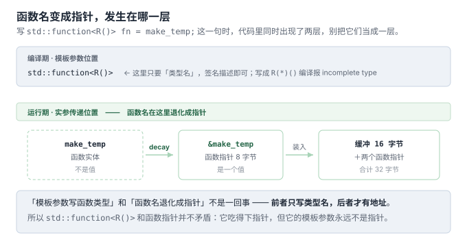
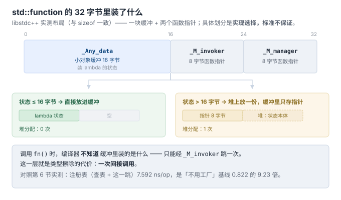

# 4b. 函数类型 vs 函数指针类型——`std::function<Sig>` 到底是不是指针

> 回答提问：`模板参数是函数类型不是函数指针类型` 是什么意思？
> `unique_ptr<Sensor>()` 经过 `std::function` 包装以后会变成函数指针吗？
>
> 代码：[`code/04b_syntax/function_type_vs_pointer.cpp`](../code/04b_syntax/function_type_vs_pointer.cpp)
> 实测环境：g++ 13.3（Ubuntu/WSL2），`-std=c++17 -Wall`，零警告

---

## 一句话回答

**不会。`std::function<Sig>` 是一个类对象，从头到尾都不是指针。**

实测数据（同一程序输出）：

| 检查项 | 结果 | 含义 |
|---|---|---|
| `sizeof(std::unique_ptr<Sensor>(*)())` | **8** | 函数指针 = 一个地址 |
| `sizeof(std::function<Sig>)` | **32** | 它是一个有体积的对象 |
| `is_class<std::function<Sig>>` | **1** | 是类类型 |
| `is_pointer<std::function<Sig>>` | **0** | 不是指针 |
| `&fn` 取地址 | 有效地址 | 它有实体，占栈/堆内存 |

"装进去的东西"可能是函数指针（当 `Sig` 对应的是普通函数或无捕获 lambda 时），但**容器本身始终是对象**。这两件事必须分开看。

---

## 1. 函数类型 `R()` 和函数指针类型 `R(*)()` 是什么关系

它们是**两个不同的类型**，差别在"能不能当值用"：

```cpp
using FuncType    = std::unique_ptr<Sensor>();       // 函数类型
using FuncPtrType = std::unique_ptr<Sensor>(*)();    // 函数指针类型
```

| | 函数类型 `R()` | 函数指针类型 `R(*)()` |
|---|---|---|
| `std::is_function` | **1**（实测） | 0 |
| `std::is_pointer` | 0 | **1**（实测） |
| `sizeof` | **不允许**（编译错误） | 8 |
| 能定义变量吗 | **不能**：`FuncType f;` 是硬错误 | 能 |
| 能做模板参数吗 | **能** | 能 |
| 用途 | 描述"签名" | 描述"一个可调用的地址" |

**关键语言规则：函数不是对象。** 你不能拷贝一个函数、不能给函数赋值、不能 `sizeof` 它。所以函数类型只能作为**类型层面的签名描述**存在——恰恰这正是 `std::function` 需要的：它要的是"签名"，不是"地址"。

**类型层面怎么区分（可直接用在代码里）**：

```cpp
std::is_function<FuncType>::value      // true
std::is_pointer<FuncPtrType>::value    // true
```

---

## 2. 为什么 `std::function` 只吃函数类型（实测反例）

标准里 `std::function` 的主模板**没有定义**，只对**函数类型**提供偏特化：

```cpp
template<class> class function;                       // 主模板：空壳
template<class R, class... Args> class function<R(Args...)>;   // ← 实际实现
```

所以把指针类型塞进去，编译器找不到匹配的特化。实测报错（原样摘录）：

```text
/tmp/bad.cpp:5:47: error: aggregate 'std::function<std::unique_ptr<Sensor> (*)()> f'
                    has incomplete type and cannot be defined
    5 |   std::function<std::unique_ptr<Sensor>(*)()> f;
      |                                               ^
```

**"incomplete type cannot be defined"** —— 这就是"只能用函数类型"的语言级证据。

**为什么标准这么设计？** 因为函数类型是"纯签名载体"，不带指针语义，能自然表达签名上的附加限定：

```cpp
std::function<void()>              // 普通签名
std::function<void() noexcept>     // C++17：noexcept 签名
std::move_only_function<void() const>   // C++23：const 限定的签名
```

如果模板参数写成 `void(*)()` 形态，这些 cv/ref/noexcept 限定就没地方写了（`void(* const)()` 指的是"指针本身是 const"，不是"函数是 const"）。

---

## 3. 那"函数名变成函数指针"是怎么回事（混淆的真正来源）

转换确实存在，但发生在**实参传递**层面，不在模板参数层面：

```cpp
std::unique_ptr<Sensor> make_temp();
std::function<Sig> fn = make_temp;   // ← 这里 make_temp "退化(decay)"成函数指针
```

这是 C++ 的一条老规则：**函数名用作值时，自动转换成函数指针**（数组名同理退化成数组指针）。所以：

- ✅ 说"普通函数/无捕获 lambda 被装进去时先退化成函数指针" —— 对
- ❌ 说"`std::function<Sig>` 就是函数指针" —— 错



混淆的另一个来源：`std::function<Sig>` **可以**由函数指针构造，也可以由 lambda/仿函数构造，**来源不同但结果类型相同**——这正是它作为"容器"的意义。

实测验证四种来源都能装：

```text
a(函数):      23.5C       ← 普通函数，退化后装入
b(空捕获):    23.5C       ← 无捕获 lambda
c(有捕获):    23.5C   捕获计数=1   ← 有捕获 lambda，【不能】退化成指针
d(仿函数):    23.5C       ← 自定义 operator()
```

**c 是关键反例**：有捕获的 lambda 携带状态，无法表示为"一个函数地址"，但 `std::function` 照样能装。**这说明容器内部存的绝不只是函数指针。**

> 顺带一个实测踩坑（该程序注释里也标了）：若把 `printf("...", c()->read().c_str(), call_count)` 写在一句里，`call_count` 会被打印成 **0** —— 因为函数实参求值顺序是**不确定顺序**，它可能在 `c()` 执行前就被读走了。拆成两句即为 1。

---

## 4. 内部存的是什么（实现细节，非标准保证）

以 libstdc++ 为例，`std::function` 典型布局（合计 32 字节，与实测 `sizeof` 一致）：



- 左边那种（状态 ≤16 字节）就是 SSO：状态直接躺进缓冲，零堆分配；超出则走堆
- 调用 `fn()` → 经 `_M_invoker` 跳转（**一次间接调用**，这就是注册表的运行时开销，倍数见第 6 节）

**注意**：这 32 字节和两个指针是 libstdc++ 的实现选择，**标准不保证**（其他实现可能是 3 个指针、或不同的 SSO 阈值）。但"它是有体积的类对象、不是裸指针"这一点是标准行为。

> 类型擦除的完整机制（怎么把异质类型塞进定长缓冲、vtable 式分派怎么生成）是独立话题——**已按你的要求挂起，见 `00-讲解计划.md` 的挂起清单。**

---

## 5. 一个可迁移的额外发现：函数指针不享受返回类型协变

写示例时踩到的真实编译错误（原样摘录）：

```text
error: invalid conversion from
  'std::unique_ptr<TempSensor, std::default_delete<TempSensor> > (*)()'
  to 'std::unique_ptr<Sensor> (*)()' {aka 'std::unique_ptr<Sensor> (*)()'}
```

原因：lambda 若让返回类型自动推导，得到的是 `unique_ptr<TempSensor>`。虽然 `unique_ptr<TempSensor>` 能隐式转 `unique_ptr<Sensor>`（派生→基类），但**函数指针的签名必须逐字匹配**——返回类型协变只适用于**虚函数重写**，不适用于函数指针赋值。

修法：显式写返回类型。

```cpp
auto no_capture = []() -> std::unique_ptr<Sensor> {   // 显式
    return std::make_unique<TempSensor>();
};
RawPtr raw = +no_capture;                             // 一元 + 触发到指针的转换
```

**为什么 `+` 能触发转换**：一元 `+` 要求操作数具有算术/指针类型，编译器会为无捕获 lambda 做"到函数指针"的隐式转换以满足它。所以 `+lambda` 是 C++ 里把无捕获 lambda 变函数指针的惯用小技巧。

---

## 6. 三条可直接带走的判据

1. **`R()` 是函数类型，`R(*)()` 是指针类型**；`is_function` 判前者，`is_pointer` 判后者。
2. **`std::function` 是对象不是指针**：它可以为空（`operator bool` 判空，调用空对象抛 `std::bad_function_call`，实测已验），可以有体积（32 字节），可以被拷贝/移动。
3. **"函数名退化成指针"是实参转换规则**，与"模板参数写函数类型"是两件事——前者是运行实体，后者是签名描述。

---

## 进度

- [x] 1 诞生背景（+ 痛点 4 可测试性）
- [x] 2 三个层次
- [x] 3 简单工厂·最小示例
- [x] 4 工厂方法（+4a 语法专题 / 4b 函数类型专题）
- [x] 5 抽象工厂
- [x] 6 代价与边界（+ 反模式清单）
- [x] 7 工厂接口契约
- [x] A06 运行期插件工厂
- [x] 收敛：引用归位（A01 §8 上移进第 7 节 / 07 ←→ A03 互指）
- [x] 图密度补齐（目标 ≥ 1 图 / 200 行；逐篇进度见 00-讲解计划）
- [x] 8 MVP 沉淀

> 主线之外的追加专题（A01 演进史 / A02 开源考据 / A03 Fast-DDS / A04 C 语言 / A05 nginx·redis）已完成，编排见 [`00-讲解计划.md`](00-讲解计划.md)。
