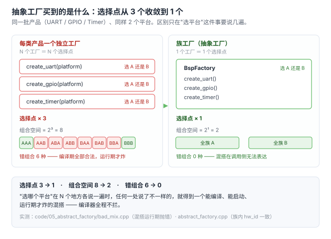
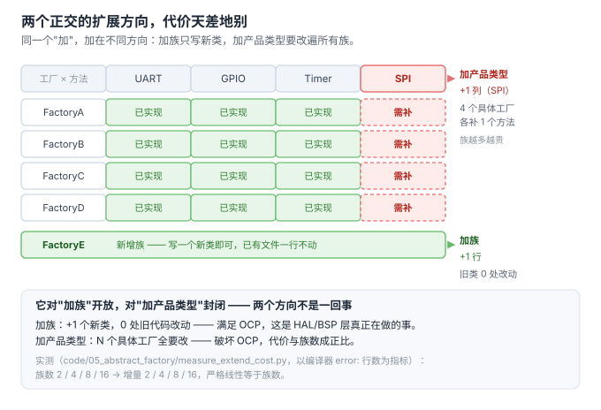

# 5. 抽象工厂：产品族问题

> 代码：
> - 混搭的后果：[`code/05_abstract_factory/bad_mix.cpp`](../code/05_abstract_factory/bad_mix.cpp)
> - 族工厂的解法：[`code/05_abstract_factory/abstract_factory.cpp`](../code/05_abstract_factory/abstract_factory.cpp)
> - 扩展代价量化：[`code/05_abstract_factory/measure_extend_cost.py`](../code/05_abstract_factory/measure_extend_cost.py)
> 均实测编译运行通过（g++ 13.3，-std=c++17 -Wall）

## 一句话动机

工厂方法回答"**一个**产品该造哪个"。当产品之间**必须配套**（同一芯片平台的 UART / GPIO / Timer 不能混搭），需要的是"**一族**产品由同一个对象产出"——这就是抽象工厂。

## 场景：芯片平台 BSP（嵌入式真实形态）

平台 A / B 各自提供 UART + GPIO + Timer。同一平台内三者**寄存器基址互相约定**：UART 的引脚复用配置必须写进同平台 GPIO 的寄存器布局，否则配置丢失。

### 先看混搭怎么发生（bad_mix.cpp 实测输出）

```text
=== 场景 2：混搭（编译器完全不拦，运行期炸）===
uart  hw=A pinmux_base=0x40001000
gpio  hw=B reg_base   =0x50002000
error: pinmux 写入平台不匹配的 GPIO：配置丢失，UART 收不到数据
```

问题出在"每类产品一个独立工厂"的思路：

```cpp
auto uart_a2 = create_uart("A");   // 从 A 平台拿 UART
auto gpio_b  = create_gpio("B");   // 从 B 平台拿 GPIO —— 混了，但语法完全合法
```

**判据**：错误在**运行期**才暴露，而且暴露点（配置函数内部）离犯错点（装配处）很远——典型的"能编译、能启动、跑一段时间才炸"。

## 抽象工厂怎么把约束前移（abstract_factory.cpp 实测输出）

```text
--- chip-A ---
uart  hw=A pinmux=0x40001000
gpio  hw=A reg   =0x40002000
timer hw=A tick  =1000000 Hz
=> 全族一致（hw_id 均为 A），混搭在调用侧无法表达

--- chip-B ---
uart  hw=B pinmux=0x50001000
gpio  hw=B reg   =0x50002000
timer hw=B tick  =24000000 Hz
=> 全族一致（hw_id 均为 B），混搭在调用侧无法表达
```

```cpp
class BspFactory {                                  // 抽象的是"整族产品"
public:
    virtual std::unique_ptr<Uart>  create_uart()  = 0;
    virtual std::unique_ptr<Gpio>  create_gpio()  = 0;
    virtual std::unique_ptr<Timer> create_timer() = 0;
};

void bring_up(BspFactory& f) {                       // 平台无关：一份代码适配所有平台
    auto uart  = f.create_uart();
    auto gpio  = f.create_gpio();                    // 必定与 uart 同族
    auto timer = f.create_timer();
}
```

**关键机制：把"选平台"从 N 次选择（每类产品各选一次）收敛成 1 次选择（选哪个工厂对象）。** 选完工厂，族内一致性由结构保证——调用方**无法表达**混搭，而不是"记得不要混搭"。



## 与工厂方法的区别（一句话）

| | 工厂方法 | 抽象工厂 |
|---|---|---|
| 抽象的是 | 一个产品的创建 | **一族**产品的创建 |
| 调用方持有 | 产品工厂接口 | 族工厂接口 |
| 保证 | 产品可替换 | 产品之间**配套** |
| 类层次 | 产品侧 + 工厂侧两条平行 | 产品侧 + 族工厂侧 **两条平行** |

## 代价：两个正交扩展方向的代价天差地别

抽象工厂有**两个**独立的扩展方向，一个便宜一个昂贵：



`measure_extend_cost.py` 用编译器报错数作为量化指标（接口加一个 `create_spi()`、不更新具体工厂，统计 `error:` 行数）：

```text
族数 N    基线错误      加一个产品类型后          增量
2         0           2                   2
4         0           4                   4
8         0           8                   8
16        0           16                  16
```

**增量严格等于族数——线性扩散。** 这就是抽象工厂最硬的代价：**它对"加族"开放，对"加产品类型"封闭。**

> 方法说明：脚本用 `g++ -fsyntax-only` + 统计 `error:` 行数当指标。最初写漏了"实例化具体工厂"这一步，得到的增量全是 0——因为抽象类只要不实例化，编译器不会报错。补上实例化才暴露出 2/4/8/16 的线性关系。**测量脚本本身也需要验证，零结果先怀疑测法。**

## 什么时候不该用抽象工厂

| 情形 | 判断 |
|---|---|
| 产品之间无配套约束 | 用工厂方法/注册表，别上抽象工厂 |
| 产品类型集合会频繁增长（今天加 SPI，明天加 CAN） | **不要**用抽象工厂——每加一个产品要改 N 个族工厂，痛苦与族数成正比 |
| 只有 1 个族（只有一种芯片平台） | 抽象工厂退化为普通工厂，直接省掉接口 |
| 族数会增长但产品类型稳定 | **抽象工厂最舒服的场景**（如：芯片平台不断增加，UART/GPIO/Timer 三件套固定） |

## 嵌入式视角

抽象工厂在嵌入式里的天然位置就是 **HAL / BSP 层**：

- 平台（芯片型号）作为"族"，不断增加 → 加族便宜 ✅
- 外设类型（UART/GPIO/SPI/I2C/Timer）作为"产品类型"，由板级需求决定增减 → 加产品类型昂贵 ⚠️
- 因此常见工程实践是：**先把产品类型集合谈定**（一次性的接口设计），之后靠"加族"演进

## 一句话总结

> 抽象工厂买的是**族内一致性由结构保证**（混搭无法表达），付的是**加产品类型的线性扩散**（实测：增量 = 族数）。它适合"产品类型固定、平台/族不断增长"的场景，恰好是 HAL 层的形状。

## 进度

- [x] 1 诞生背景（+ 痛点 4 可测试性）
- [x] 2 三个层次
- [x] 3 简单工厂·最小示例
- [x] 4 工厂方法（+4a 语法专题 / 4b 函数类型专题）
- [x] 5 抽象工厂
- [x] 6 代价与边界（+ 反模式清单）
- [x] 7 工厂接口契约
- [x] A06 运行期插件工厂
- [x] 收敛：引用归位（A01 §8 上移进第 7 节 / 07 ←→ A03 互指）
- [ ] 图密度补齐（目标 ≥ 1 图 / 200 行；逐篇进度见 00-讲解计划）
- [ ] 8 MVP → skill

> 主线之外的追加专题（A01 演进史 / A02 开源考据 / A03 Fast-DDS / A04 C 语言 / A05 nginx·redis）已完成，编排见 [`00-讲解计划.md`](00-讲解计划.md)。
