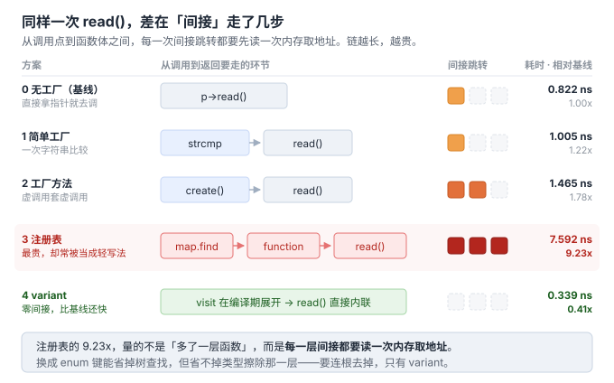
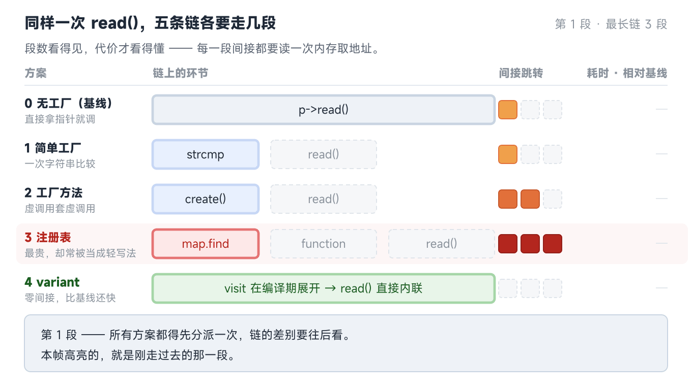
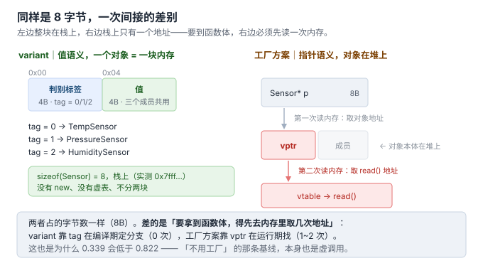

# 6. 代价与边界：什么时候**不**用工厂

> 代码：
> - 分派开销实测：[`code/06_cost/bench_dispatch.cpp`](../code/06_cost/bench_dispatch.cpp)
> - 封闭集合的替代方案：[`code/06_cost/variant_alt.cpp`](../code/06_cost/variant_alt.cpp)
> - 行数统计：[`code/06_cost/count_loc.sh`](../code/06_cost/count_loc.sh)
> 实测环境：g++ 13.3 -O2，WSL2/Ubuntu（x86_64）

前面五节都在讲"工厂解决什么"。这节反过来：**工厂不是免费的，它是买来的**。

---

## 一、先看买到了什么，再看花了多少

### 代价 1：运行期分派开销（实测）

只测**分派**，不测分配（全部返回指向静态实例的指针），输入随循环交替以防被优化掉：

```text
迭代 20000000 次 ×3 轮取最小值

方案                            耗时
0. 无工厂（基线）               0.822 ns/op
1. 简单工厂（string 分派）      1.005 ns/op
2. 工厂方法（虚调用）           1.465 ns/op
3. 注册表（map+function）       7.592 ns/op
4. variant（visit）             0.339 ns/op

相对基线倍数：
  简单工厂         1.22x
  工厂方法         1.78x
  注册表           9.23x
  variant          0.41x
```

**读法（不要记绝对值，记数量级关系）**：

| 方案 | 一次分派 ≈ 几次基线调用 | 直觉 |
|---|---|---|
| 简单工厂 | 1.2 次 | 基本白送——一次 string 比较 |
| 工厂方法 | 1.8 次 | 一次虚表跳转，代价可接受 |
| 注册表 | **9.2 次** | **最贵**：`map<string>` 查找 + `std::function` 双重间接 |
| variant | 0.4 次 | **比基线还快**——编译期分派、可完全内联 |

**反直觉结论：注册表比工厂方法贵 5 倍以上，而它常被当成"更轻的写法"。** 轻的是代码行数，不是运行期。若热路径必须用注册表，把 string 键换成 `enum` 键能省掉大部分查找成本。

贵在哪，走一遍就知道：



同一批数据，慢放一遍 —— 五条链一起往前走，看「差在哪一段」：



> 静图是**并置对照**（排成表，看差多少）；动图是**过程推进**（一起走，看差在哪段）。两张图是不同切面、不是同一内容的两形态。
> 数据同源（`code/06_cost/bench_dispatch.cpp` 实测），配色共用 —— 生成脚本 `code/06_cost/make_06_dispatch.py`。

`variant` 那一行是唯一没有间接层的：`visit` 在编译期就把分支展开成了直接调用。所以 **9.23x 不是「多了一次函数调用」的量级，是「多读了两次内存取地址」的量级**。

### 代价 2：代码行数与类数量（实测）

同口径（2 个产品），剔除注释后的有效行：

```text
01_birth/old.cpp                          总行 47    有效行 32    ← 直接 new
03_simple_factory/new.cpp                 总行 69    有效行 36    ← +4 行
04_factory_method/factory_method.cpp      总行 88    有效行 58    ← +26 行
04_factory_method/registry.cpp            总行 97    有效行 63    ← +31 行
05_abstract_factory/abstract_factory.cpp  总行 135   有效行 96    ← 但场景是 2 族 × 3 产品
06_cost/variant_alt.cpp                   总行 95    有效行 61    ← 3 产品，封闭集合
```

换算成**类数量**（N = 产品数）：

| 方案 | 类数量 | N=2 | N=4 | 每加 1 个产品，新增类数 |
|---|---|---|---|---|
| 直接 new | N | 2 | 4 | **1**（只有产品类） |
| 简单工厂 | N + 1 | 3 | 5 | 1 |
| 工厂方法 | 2N + 1 | 5 | 9 | **2**（产品类 + 它的工厂类） |
| 注册表 | N + 1 | 3 | 5 | 1（表项分散在各 .cpp） |
| variant | N（无基类、无工厂） | 2 | 4 | 1 |

**类数量的涨法是工厂方法最硬的代价**：每加 1 个产品要多写 2 个类 —— 产品一个、工厂一个，其余方案都只加 1 个。

### 代价 3：调试与阅读成本（无法量化，但真实）

- 调用栈多一层：出问题时栈里是 `create_sensor → ...` 还是直接 `Sensor::read`，定位速度不同
- 调试器里注册表方案看到的是 `lambda at registry.cpp:88`，不是类型名
- 新人接手需要先理解"创建决策在哪"，这是纯粹的理解成本

---

## 二、什么时候**不该**用工厂（可操作判据）

按"看到就否决"的强度排列：

| # | 判据 | 结论 |
|---|---|---|
| 1 | **只有一种实现**（未来也不会加） | 不用工厂。没有变化轴，工厂只是纯增复杂度 |
| 2 | **创建调用点只有一处** | 不用工厂。第 1 节的判据：同一决策出现第 2 份拷贝才值得集中 |
| 3 | **构造无知识**（无参数、无版本差异、无资源获取） | 直接 `new` 或返回静态引用即可 |
| 4 | **产品集合封闭且编译期已知** | 用 `std::variant` 代替工厂（见本节 §四） |
| 5 | **热路径 + 调用频率极高** | 别用注册表（9.2x）；用 variant 或 enum 键 |
| 6 | **只在 `main` 里创建一次**（如全局单例设备） | 直接 new，或函数内静态 |

**一句话版**：**工厂为"变化"付费。没有变化，钱白花。**

---

## 三、用了但用歪了：反模式清单

上一节判"该不该用"，这一节判"已经用了，长歪了没有"。四个可一眼点名的形态：

| # | 反模式 | 长什么样 | 病在哪 | 怎么改 |
|---|---|---|---|---|
| 1 | **一类一工厂** | `TempSensorFactory` / `PressureSensorFactory` 各一个类，每个类体只有 `return std::make_unique<TempSensor>();` | 工厂与产品 1:1，扩展性为 0——新增产品时调用方还是要改成 `new HumiditySensorFactory()`。**类数 2N+1 的代价付了，好处一点没买着** | 若产品无构造知识 → 删工厂，直接 `new`；若有构造知识 → 合并成一个按类型分派的工厂 |
| 2 | **空壳工厂** | 工厂里的 `switch` 只有一个分支，或 `if` 条件恒真 | 唯一实现还包一层，纯增一层调用栈和一处阅读成本 | 删掉。等第 2 种实现出现再引入（第 1 节判据） |
| 3 | **`FactoryFactory`** | `SensorFactoryProvider::get_factory(type) -> *Factory`，外面再套一层 `FactoryRegistry` | 造的层级超过了需求的层级。多一层就多一个"谁来管这一层"的问题 | 拉平为一层：用注册表把"选类"和"造对象"合成一步 |
| 4 | **工厂包一切** | 连 `std::string`、`std::vector` 这类标准类型的构造也过一遍自己的工厂 | 把"统一入口"当成了目的本身。标准库类型的创建知识**不在你的产品体系里**，收走它无利可图 | 只对**带产品体系语义**的类型上工厂（设备、协议、算法变体…） |

**共同点：这四个都不是"用错了模式"，而是"用在了没有变化的地方"。**

第 1 节的判据（同一创建决策出现第 2 份拷贝才值得集中）和第 2 节的判据（工厂为变化付费）在这里合流——

> **反模式的本质，是把保险卖给了一个没有风险的人。**

### 一条最快的自查

打开你的工厂类，只问一句：

> **"删掉它，调用方要改几行？"**

| 答案 | 判断 | 动作 |
|---|---|---|
| **0 行**（工厂只在 1 处被调用，或调用方拿到的还是裸 `new` 的等价物） | 空壳工厂 | 删 |
| **1 行**（把 `create()` 换成 `new Xxx()` 就完事） | 大概率是一类一工厂 | 删 |
| **N 行，且 N 会随新产品增长** | 这个工厂买到了东西 | 留着 |

---

## 四、封闭集合的替代方案：`std::variant`（很值得知道）

当产品集合**封闭且编译期已知**（板子上就这 3 种传感器，不会再加），工厂买到的是"运行期可替换"，而代价是虚函数 + 堆分配。`variant` 用另一套机制达成目的：

```cpp
// 三种产品：纯值类型，【不需要共同基类】
struct TempSensor     { int read() const { return 235; } };
struct PressureSensor { int read() const { return 1013; } };
struct HumiditySensor { int read() const { return 47; } };

using Sensor = std::variant<TempSensor, PressureSensor, HumiditySensor>;   // 封闭集合
```

实测（variant_alt.cpp）：

```text
sizeof(TempSensor)      = 4
sizeof(PressureSensor)  = 4
sizeof(HumiditySensor)  = 4
sizeof(Sensor/variant)  = 8      ← 最大成员 + 判别标签，栈上值语义
栈地址：0x7fff9fb588c0            ← 没有 new、没有虚表
编译期类型数：3
```

**收益**：无堆分配、无虚表、分派比基线还快（0.41x）、类型清单编译期可枚举（`std::variant_size_v`）、**不需要为了多态而引入共同基类**。

这个「8 字节」值得单独看一眼——它和指针方案占的空间**一样大**，差别不在大小，在间接：



### 三种分派写法的实测差异（这是本节最值钱的部分）

同一个 variant，三种 visit 写法，在"新增第 4 种产品"时的表现完全不同（均实测）：

| 写法 | 新增第 4 种类型时 | 实测证据 |
|---|---|---|
| **泛型 lambda** `visit([](const auto& x){...})` | **静默通过**，什么都不报 | 编译成功，行为靠 x 自己实现正确 |
| **exhaustive overload** `visit(overloaded{...})` | **编译报错，强制你处理** | 追加 `PmsSensor` 后 **6 条 error**，首条：`no type named 'type' in 'struct std::invoke_result<overloaded<...>, const PmsSensor&>'` |
| **`if constexpr` 链**（手写 else 兜底） | **编译通过，运行期炸** | 实测输出：`D -> 抛异常: std::get: wrong index for variant` |

**第三行是最阴的坑**：`if constexpr` 链末尾那个"兜底 else"会把新类型悄悄当成最后一个已处理类型，编译零警告，等到真的构造出第 4 种产品才抛 `bad_variant_access`。

> **结论：用 variant 就一定要用 exhaustive overload 写法**，让编译器替你守穷尽性。这正是 `if constexpr` 手写链做不到的。

---

## 五、方案总决策表

| 场景 | 选择 | 理由 |
|---|---|---|
| 1 种实现、1 个调用点 | 直接 `new` | 工厂为变化付费，此处无变化 |
| 2+ 调用点，产品种类少且稳定 | **简单工厂** | 一个函数买断三痛点，成本最低 |
| 产品种类频繁增长，需零回归 | **工厂方法** | 加类不改旧码（代价：类数 2N+1） |
| 产品多、模块化、第三方可扩展 | **注册表** | 可分散登记（代价：分派 9.2x，热路径慎用） |
| 产品必须配套（HAL/BSP 多平台） | **抽象工厂** | 族一致性由结构保证（代价：加产品类型线性扩散） |
| 类型编译期就定死、无运行期替换需求 | **模板工厂** | `make_unique<T>` 形态，零虚调用、零注册表查找；代价是类型必须编译期已知。详见 [A01 §5](A01-工厂写法演进史.md) |
| 集合封闭、编译期已知、要性能 | **`std::variant`** | 零间接、无堆、编译器守穷尽性 |

---

## 六、一句话总结

> 工厂的四种形态（简单 / 方法 / 抽象 / 注册表）本质是**四种不同价位的保险**：
> 简单工厂几乎免费（1.2x），工厂方法买"零回归"（1.8x + 类数翻倍），抽象工厂买"族一致性"（加产品类型线性扩散），注册表买"可分散扩展"（9.2x 分派）。
> **不变化就什么都不买**——封闭集合用 `variant`，类型编译期就定死的用模板工厂（`make_unique<T>` 形态）：两者都不付虚调用，也不养注册表。

## 进度

- [x] 1 诞生背景（+ 痛点 4 可测试性）
- [x] 2 三个层次
- [x] 3 简单工厂·最小示例
- [x] 4 工厂方法（+4a 语法专题 / 4b 函数类型专题）
- [x] 5 抽象工厂
- [x] 6 代价与边界（+ 反模式清单）
- [x] 7 工厂接口契约
- [x] A06 运行期插件工厂
- [x] 收敛：引用归位（A01 §8 上移进第 7 节 / 07 ←→ A03 互指）
- [x] 图密度补齐（目标 ≥ 1 图 / 200 行；逐篇进度见 00-讲解计划）
- [x] 8 MVP 沉淀

> 主线之外的追加专题（A01 演进史 / A02 开源考据 / A03 Fast-DDS / A04 C 语言 / A05 nginx·redis）已完成，编排见 [`00-讲解计划.md`](00-讲解计划.md)。
