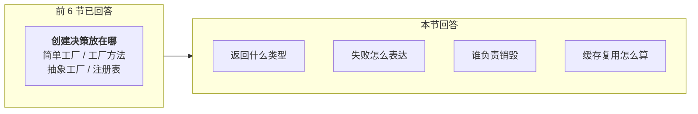
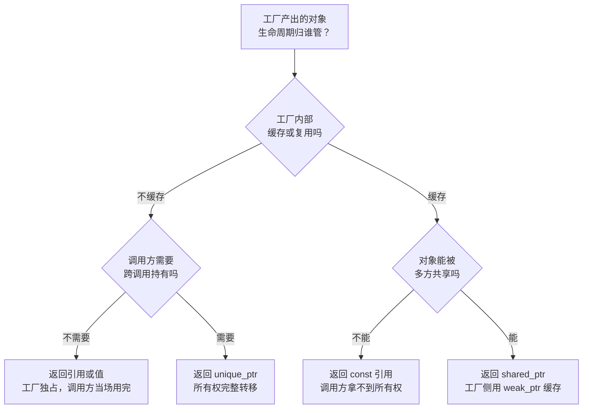
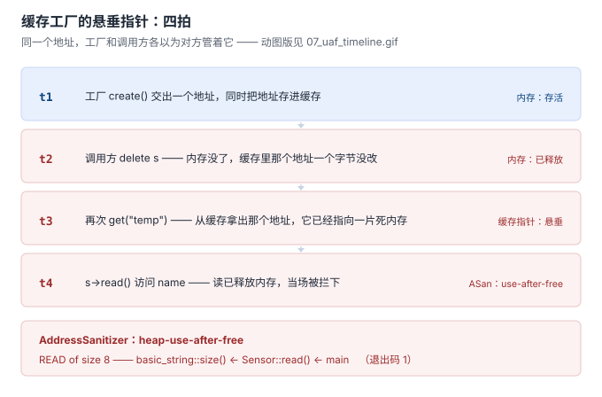

# 7. 工厂接口契约：返回什么 · 失败怎么报 · 谁销毁

> 代码：
> - 所有权三选一（含 ASan / LeakSanitizer 实测）：[`code/07_contract/01_cache_owner.cpp`](../code/07_contract/01_cache_owner.cpp)
> - 四种失败表达：[`code/07_contract/02_fail_semantics.cpp`](../code/07_contract/02_fail_semantics.cpp)
> - 一键构建运行：[`code/07_contract/build.sh`](../code/07_contract/build.sh)
>
> 实测环境：g++ 13.3，`-fsanitize=address` / `-std=c++23`，WSL2/Ubuntu（x86_64）
>
> **本节体例与前 6 节不同：以图为主。**

---

## 一、这一节补的是"另半边"

前 6 节的每个示例都长这样：

```cpp
Sensor* create(const std::string& type);
```

这不是疏漏——那是为了把「创建决策放在哪」讲清楚而做的简化。但一个真实的工厂接口有四个面，前 6 节只回答了第一个：



**这四个面是接口设计，不是模式选择。** 模式选错了顶多复杂一点，契约定歪了会直接出事——下面的实测就是这个出事的现场。

---

## 二、谁持有：一棵决策树

先给判断路径，再看实测。



树里最后一种情况值得单独说：**如果工厂既要缓存、又要允许调用方持有、还要能回收**，标准库给的三个答案都不够用，得靠工厂自己提供销毁入口——Fast-DDS 就是这么做的（`TopicProxyFactory` 的 `can_be_deleted()`，见 [A03 §4](A03-FastDDS里的工厂.md)）。这一节先讲清楚前四种。

### 2.1 前置分支：产品真的需要多态吗

上面这棵树整个建立在「工厂返回指针」这个前提上。**若产品集合是封闭的**（类型编译期全知道、不会再加），这个前提本身可以先砍掉——第 6 节量过这笔账：

| 返回方式 | 何时用 | 分派开销（06 实测） |
|---|---|---|
| `variant<T…>` + `std::visit` | 产品类型编译期已知、集合不变 | **0.339 ns/op** |
| 类层次工厂（返回指针，虚函数） | 类型运行期决定、集合开放 | 1.465 ns/op（工厂方法） |

**基线（不用工厂、直接调用）是 0.822 ns/op。** 也就是说 `variant` 分派只有基线的 0.4 倍——它一次堆分配都没有、一次虚表跳转都没有：判别标签就存在值旁边，`visit` 在编译期展开（`sizeof=16`，含 `std::string`）。产品集合封闭时，堆和虚表都是白付的账。

代价写在返回类型上：**集合一变，所有 `visit` 分支都要重编译**。所以这条分支的判据只有一句话——**产品集合真的封得住吗**。

代码与完整对照见 [`06-代价与边界.md`](06-代价与边界.md) 与 [`code/06_cost/variant_alt.cpp`](../code/06_cost/variant_alt.cpp)。

---

## 三、实测：同一个缓存场景，三种返回方式

场景：按名字取传感器，创建成本高，工厂内部缓存已建实例。三种返回方式全写出来（`01_cache_owner.cpp`），调用方做同一件「看起来很正常」的事。

| 模式 | 返回方式 | 工厂侧缓存 | 实测结果 | 退出码 |
|---|---|---|---|---|
| `a` | `Sensor*` | 裸指针 | 调用方 `delete` → **heap-use-after-free** | 1 |
| `a2` | `Sensor*` | 裸指针 | 调用方不删 → **32 字节泄漏** | 1 |
| `b` | `shared_ptr<Sensor>` | `shared_ptr`（强持有） | 正常，`use_count = 2` | 0 |
| `b2` | `shared_ptr<Sensor>` | `weak_ptr`（弱持有） | 正常，无人用时自动释放 | 0 |
| `c` | `const Sensor&` | `unique_ptr`（独占） | 正常，调用方无法越权释放 | 0 |

### 3.1 最危险的三种，全都栽在同一件事上

模式 `a` 的时序：



对应代码只有五行：

```cpp
RawCacheFactory f;
Sensor* s = f.get("temp");
s->read();
delete s;                   // ← 调用方认为自己拥有这个对象
Sensor* s2 = f.get("temp"); // ← 工厂并不知道，把悬垂指针又递了出来
s2->read();                 // ← 读已释放内存
```

AddressSanitizer 的实测输出：

```text
ERROR: AddressSanitizer: heap-use-after-free on address 0x503000000048
READ of size 8 at 0x503000000048 thread T0
    #0 basic_string::size() const            /usr/include/c++/13/bits/basic_string.h:1072
    #1 Sensor::read() const                  01_cache_owner.cpp:33
    #2 main                                  01_cache_owner.cpp:128
0x503000000048 is located 8 bytes inside of 32-byte region
freed by thread T0 here:
    #1 main                                  01_cache_owner.cpp:124     ← delete s
previously allocated by thread T0 here:
    #1 RawCacheFactory::get(...)             01_cache_owner.cpp:45      ← new Sensor
```

**注意这份报告说的是什么**：它没有说"你忘了 delete"，也没有说"你有内存泄漏"。它说的是**同一个地址被两个主人管过**——L45 分配，L124 由调用方释放，L128 又被工厂递出来用了。

> **契约缺陷的形态不是"少了 delete"，是"两个人都以为自己有权 delete"。**
> 而裸指针这种返回类型，恰好不给任何人拒绝这个误解的机会。

### 3.2 另一种失败：谁也不删

调用方"聪明"地选择不删（它不确定该不该），结果既没崩也没报错——跑完就结束了。只有 LeakSanitizer 在退出时说话：

```text
ERROR: LeakSanitizer: detected memory leaks
Direct leak of 32 byte(s) in 1 object(s) allocated from:
    #1 RawCacheFactory::get(...)             01_cache_owner.cpp:45
SUMMARY: AddressSanitizer: 32 byte(s) leaked in 1 allocation(s)
```

**同一份代码，删也错、不删也错。** 这不是调用方的问题，是接口把决定权扔给了不该拿它的人。

### 3.3 三种正确写法的差别

| 写法 | `use_count` | 对象何时释放 | 适用 |
|---|---|---|---|
| 工厂强持有 `shared_ptr` | 2（工厂 + 调用方） | 工厂析构时才释放 | 对象本来就该活到程序结束 |
| 工厂弱持有 `weak_ptr` | 1 | 调用方放手即释放，下次再取时重建 | 对象可按需重建 |
| 返回 `const&` | — | 随工厂释放 | 调用方只需要当场用 |

模式 `b2` 的实测输出能直接看出弱持有的效果：

```text
  新建并写入缓存
  [析构] temp                ← 调用方作用域一结束，对象立即释放
调用方作用域结束
  缓存已失效，重建            ← 下次取时发现缓存变成空壳，重建
  新建并写入缓存
再取一次：use_count = 1
```

**`weak_ptr` 是唯一能表达「工厂缓存地址、但不延长寿命」的类型。** 工厂想省一次创建、又不想替调用方决定对象活多久时，就靠它。

### 3.4 ⚠️ 一个测法上的坑：「没崩」不等于「没问题」

这一节差点写错。`Sensor::read()` 第一版是这么写的：

```cpp
int read() const { return 42; }        // 不访问任何成员
```

在这个版本下实测，**两个错误全部被掩盖了**：

| 场景 | 预期 | 实际 |
|---|---|---|
| `delete` 之后 `s2->read()` | ASan 报 use-after-free | 打印 `read() = 42`，**退出码 0** |
| 空指针 `p->read()` | 段错误 | 打印 `read() = 42`，**退出码 0** |

原因：成员函数不访问成员时，编译器根本不会解引用 `this`，`p->read()` 就是一次普通函数调用。**悬垂指针和空指针都"正常工作"了。**

改成真的访问成员之后，两个问题立刻现形：

```cpp
int read() const { return static_cast<int>(name.size()) + 41; }
```

⇒ 模式 `a` 报 use-after-free（退出码 1）；`02 crash` 直接 SIGSEGV（退出码 139）。

> **与第 6 节"零结果先怀疑测法"是同一条铁律**：一个本该出错的场景平静地通过了，第一反应应该是测法没打到点上，而不是"没问题"。
> 这也解释了真实项目里那类诡异的偶发崩溃——**平时不崩，只在某个访问了成员的路径上崩。**

---

## 四、回报失败：四种表达

工厂是唯一的创建入口，所以"创建不出来"这件事必须由它说清楚。四种写法的实测行为（`02_fail_semantics.cpp`）：

| 表达 | 调用方怎么知道失败 | 忘记检查的后果 | 实测输出 |
|---|---|---|---|
| `Sensor*` + `nullptr` | 只能靠自觉 | **SIGSEGV，无任何信息** | 退出码 139，连一行日志都没有 |
| `unique_ptr<T>` + 异常 | 靠自觉 try/catch | 异常向上逃逸 | `invalid_argument: unknown sensor: gyro` |
| `std::optional<T>` | `!s` 检查 | 抛类型化异常 | `bad_optional_access: bad optional access` |
| `std::expected<T,E>` | `!s` ＋ `s.error()` | 抛类型化异常 | `bad_expected_access: unknown sensor: gyro` |

三个关键差别：

**① `nullptr` 是唯一"说不出话"的失败。** 忘检查时它给的是一个没有任何上下文的 SIGSEGV——没有类型、没有错误码、没有栈。四种表达里，它是唯一需要调用方**自己记得**去检查的。

**② `optional` / `expected` 把失败变成了类型的一部分。** 忘检查时不会静默，而是抛一个**带类型名的**异常；`expected` 还能把详情带出来（`unknown sensor: gyro`）。代价是函数签名变长。

**③ `expected` 比 `optional` 多的是"为什么失败"。** 传感器名字打错、驱动没加载、参数不合法——`nullopt` 三种情况长得一模一样，`expected` 能把原因分开。**工厂越接近边界（读配置、开设备、查注册表），越值得用 `expected`。**

一个实践上的分界：

| 场景 | 建议 |
|---|---|
| 失败是"正常的业务分支"（名字可能不存在） | `optional` |
| 失败需要向用户/日志解释原因 | `expected` |
| 失败是"不该发生"的程序错误 | 异常 |
| 只在内部小范围传递、且调用点就在隔壁 | 裸指针 + 断言 |

（`std::expected` 需要 C++23；C++20 及以前用 `optional` + 单独的 error 通道，或引入 `tl::expected`。）

---

## 五、契约清单：抄走就能用

工厂类的头文件里，把这些写进注释——**"能编译"和"约定清楚"是两件事**：

```text
返回类型：     决定了"谁负责销毁"，必须与下面三项自洽
删除器：       句柄类产品（fd / FILE* / mmap / shm）用带删除器的 unique_ptr
缓存策略：     工厂是否持有实例？持有时用 weak_ptr 还是 shared_ptr？
销毁入口：     工厂持有且允许回收时，必须提供 destroy() 或 can_be_deleted()
失败语义：     nullptr / optional / expected / 异常，四选一并在注释里写明
线程安全：     注册表、缓存的读写是否有锁；无锁时写明"仅启动期注册"
```

四条最容易漏的实战细节：

**① 句柄型产品，把"怎么还"写进类型**

```cpp
std::unique_ptr<FILE, decltype(&fclose)> create_log(const char* path) {
    return {fopen(path, "a"), &fclose};
}
```

工厂返回裸 `FILE*` 时，调用方拿到的是"一个需要 `fclose` 的指针"——这件事只存在于文档里。

**② 多态产品才需要 `unique_ptr<Base>`，其余返回值**

```cpp
std::unique_ptr<Sensor> create_sensor(Type t);   // 需要运行期多态
Sensor create_config(const std::string& path);   // 不需要：值语义更省、更快
```

产品集合封闭时优先 `variant`，理由是分派开销（见 §2.1）。

返回裸 `unique_ptr<Base>` 的前提是 **`Base` 的析构必须是 `virtual`**。这一条在 [A03 §6.3](A03-FastDDS里的工厂.md) 有实测反例：析构非虚时 `delete` 派生类对象，派生类析构函数调用 **0 次**。

**③ `make_shared` 少一次分配，但延长了内存占用**

`shared_ptr<T>(new T)` 是两次分配（控制块 + 对象），`make_shared<T>()` 是一次。代价是控制块与对象同块，**只要还有一个 `weak_ptr` 活着，整块内存就不能释放**。工厂长期持有 `weak_ptr` 时，这个差别会实实在在留下来。

**④ 工厂自身也要考虑并发**

04a 讨论过：注册表 / 缓存的**初始化**若靠函数内静态变量，C++11 起是线程安全的；但 `std::map` 的**并发读写不是**。工厂要么加锁，要么把"只在启动期注册/创建"写成文档化契约——protobuf 的 `MessageFactory` 选择了后者（见 [A02 §3](A02-开源中的工厂实现考据.md)）。

---

## 六、本节与 A03 的关系

A03 是在真实仓库里**看到病**，本节是**开方**。两处的定位要分清，避免当成"同一件事讲了两遍"：

| | 位置 | 回答的问题 |
|---|---|---|
| **原理** | 本节 | 工厂接口应该长什么样 |
| **案例** | [A03 §6.3](A03-FastDDS里的工厂.md) | 某份真实接口违反了哪几条、证据是什么 |

A03 查出的三处缺陷，逐条对到本节的清单上：

| A03 缺陷 | 对应本节哪一条 |
|---|---|
| `RPCEntity` 析构 protected 且**非虚** → 补 `delete` 即 UB | 清单 ②：返回 `unique_ptr<Base>` 的前提是虚析构 |
| 基类析构 public virtual，注释却说"语义下沉到实现类" → **防护面为零** | 清单：**类型系统的约束要写在类型上**，写在注释里的约束不算约束 |
| 工厂返回裸指针，**无配对销毁入口** | 清单：工厂持有且允许回收时，必须提供 `destroy()` |

**一句话**：接口的形状决定了调用方能不能犯错。上面这三条，没有一条是靠"调用方更小心"能解决的。

---

## 七、一句话总结

> **前 6 节回答"要不要工厂"，本节回答"工厂的门牌怎么写"。**
>
> 同一个缓存场景，裸指针返回实测同时给出两种错法：**删了是 use-after-free，没删是 32 字节泄漏**——
> 错的不是调用方，是接口把销毁决定权交给了不该拿它的人。
>
> 返回值类型就是契约本身：`unique_ptr` 说"归你"，`const&` 说"别动"，
> `weak_ptr` 缓存说"地址给你、寿命你自己定"。
> 失败要能说话：`nullptr` 是唯一说不出话的那种。

## 进度

- [x] 1 诞生背景（+ 痛点 4 可测试性）
- [x] 2 三个层次
- [x] 3 简单工厂·最小示例
- [x] 4 工厂方法（+4a 语法专题 / 4b 函数类型专题）
- [x] 5 抽象工厂
- [x] 6 代价与边界（+ 反模式清单）
- [x] 7 工厂接口契约
- [x] A06 运行期插件工厂
- [x] 收敛：引用归位（A01 §8 上移进第 7 节 / 07 ←→ A03 互指）
- [ ] 图密度补齐（目标 ≥ 1 图 / 200 行；逐篇进度见 00-讲解计划）
- [ ] 8 MVP → skill

> 主线之外的追加专题（A01 演进史 / A02 开源考据 / A03 Fast-DDS / A04 C 语言 / A05 nginx·redis）已完成，编排见 [`00-讲解计划.md`](00-讲解计划.md)。
