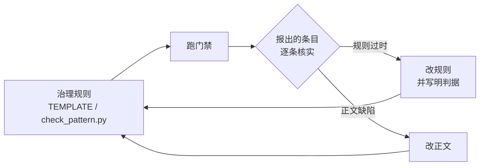
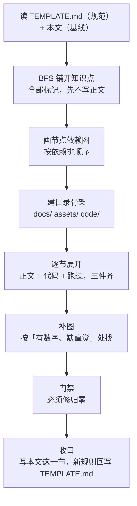

# 8. MVP 沉淀：这一轮跑通了什么，下一个模式能拿走什么

> 分工：[`TEMPLATE.md`](../../TEMPLATE.md)（规范面）回答「**该拆成什么样**」，本文回答「**这一轮是按什么顺序拆出来的、哪些数字可以当参照系**」。
> 本文**不重述骨架**——骨架、状态机、BFS→DFS 顺序都在 `TEMPLATE.md`，要改也改那里；本文只放实测数字、迁移分级与本轮的规则改动记录。
>
> 范围：工厂模式这一轮的产出（`docs/` 17 篇 + `code/` 13 个场景），结账于 2026-09-30。

---

## 一、先给一把尺子

下一个模式跑完，拿这七个数字对照——它们**不是目标，是参照系**。

| # | 指标 | 这一轮实测 | 数出来的方式 |
|---|---|---|---|
| 1 | 正文 | **16 篇 / 4052 行**（不含本文，口径见下） | `wc -l docs/*.md` 得 4222 行；减去编排文件 170 行、本文 188 行 |
| 2 | 图 | **27 张** ＝ mermaid **7** ＋ 具象 SVG **17** ＋ 动图 GIF **3** | `grep -c mermaid docs/*.md` |
| 3 | 图密度 | **≈ 150 行 / 图** | 4052 ÷ 27 |
| 4 | 场景 | **13 个**自包含目录 | `ls -1 code/` |
| 5 | 示例源 | **39 个 `.cpp`** ＋ 8 个 `.h` | `find code -name '*.cpp'` |
| 6 | 构建入口 | **7 个**（`build.sh` ×5 ＋ `Makefile` ×1 ＋ `run.sh` ×1），覆盖 **6 / 13** 场景 | `find code -name 'build.sh'` |
| 7 | 文档引代码 | **116 处** `code/` 前缀引用，条条可达 | `grep -c code/ docs/*.md` |

**三个容易数错的口径**：① 第 1 项数的是 **1~7 加 A01~A06 加检验篇共 16 篇**，**不含本文**——收口篇统计自己会绕回来；② 同一份 `docs/` 会有两个「总行数」，说的时候要说清含不含编排文件（`00-讲解计划.md` 是编排，不是正文）；③ 第 3 项的分母只算**正文内嵌**的图，只在图注里以链接形式保留的矢量备份不计（`07` 的静态 SVG 属此类）。

**硬约束只有两条**（出自 `00-讲解计划.md`「产出约定」）：**主线**每篇 ≥ 1 图；**全库** ≥ 1 图 / 200 行。上表其余六项都是参照系——不达标**不构成缺陷**，只值得回看一眼。

---

## 二、五个流程要素，逐个判断能不能直接搬

`00-讲解计划.md` 第 8 节点名的五件事：目录结构、old/new 对照、示例可运行、文档引代码路径、图密度。逐个核过。

### 2.1 目录结构 —— 直接搬

13 个场景全按 `code/<两位序号>_<场景名>/`，考据类走 `code/A0N_<场景名>/`；每个场景自包含，能单独拷走、单独跑（放弃"一条命令跑全部"的代价见 [`AGENTS.md`](../../AGENTS.md) §4）。

与模式无关，命名规则照抄即可。

### 2.2 old/new 对照 —— 搬「实质」，**别搬文件名**

实况：**真正叫 `old.cpp` / `new.cpp` 的只有 2 个文件**（`code/01_birth/old.cpp`、`code/03_simple_factory/new.cpp`）。

其余对照的命名各不相同，而且**各有理由**：

| 场景 | 对照形态 | 为什么这么命名 |
|---|---|---|
| `01` 诞生背景 | `testability_before.cpp` / `testability_after.cpp` | 痛点是"可测试性"，`before/after` 比 `old/new` 更贴题 |
| `04` 工厂方法 | `registry.cpp` / `registry_annotated.cpp` / `registry_fixed.cpp` | 三版递进：原始 → 逐行标注 → 修好 |
| `05` 抽象工厂 | `bad_mix.cpp` / `abstract_factory.cpp` | 一版是错组合，一版是收敛后的 |
| `A01` 演进史 | `01_before_smart_ptr` → `04_modern_forms` | 四个版本**是时间轴**，序号即顺序 |
| `A06` 插件 | `plugin_temp` / `plugin_mangled` / `plugin_pressure` / `plugin_abi_drifted` | 按**故障类型**分，不是按新旧分 |

还有一条：**对照允许跨场景**。`03` 篇的"旧世界"根本没有自己的目录，它引的是 [`code/01_birth/old.cpp`](../code/01_birth/old.cpp)。

⇒ 要搬的是**同源两版、差异可比**这个实质；文件名服从内容，不服从规则。

⚠️ **条文与现状不符（待修）**：`00-讲解计划.md` L77 写「每个示例 `old.cpp` / `new.cpp` 对照，可独立编译」，实测 **2 / 13**。该句是**目标不是现状**。

### 2.3 示例可运行 —— 分两档，别一刀切

**6 / 13 个场景有自包含入口**（`build.sh` 5 个 ＋ `multi_tu/` 的 `Makefile` ＋ `run.sh`）。其余是**单文件示例**——正文里直接给 `g++ -std=c++17 -Wall xxx.cpp -o /tmp/x && /tmp/x`，不引入脚本。这正是 [`AGENTS.md`](../../AGENTS.md) §4 定的两种跑法。

⚠️ **两处条文比现状严**：

- `TEMPLATE.md` §6 写「**每个**场景自带构建入口」，实测 6 / 13。应按 `AGENTS.md` §4 的口径理解——**单文件场景本就不该有脚本**；
- 「每篇都配可运行代码」同样是目标：`A02` 是唯一**没有配套代码**的正文（纯开源考据），`quiz01` 是测验文档。

判据：**脚本只解决"一次跑多个文件"，不解决"证明能跑"**。单文件的证明就是那行命令加它的输出。

### 2.4 文档引代码路径 —— 直接搬，而且已有机器判

116 处 `code/` 前缀引用，`check_pattern.py` 逐条查可达。这条的价值在于**它是自动化的**：正文改了、文件挪了，门禁立刻报。

**必须连口径一起搬**的两个细节：

- 门禁只检查**带扩展名**的 `code/...` 路径（`LOCAL_CODE_RE` 匹配到 `.cpp` / `.sh` / `.py` 等结尾才算），写成 `code/<场景名>/` 这种模板形式不会被判；
- **上游引用只计数、不要求存在**——`src/` `include/` 开头的路径视为第三方源码引用。少了这条，`A02`~`A05` 那 **32 处**考据引用会全变成假警报。

### 2.5 图密度 —— 直接搬，口径也要一起搬

150 行 / 图。三类图的分工写在 `00-讲解计划.md`「产出约定」里：

| 类 | 数量 | 判据 |
|---|---|---|
| mermaid 内嵌 | 7 | 流程 / 决策树 / 时序这类**结构** |
| 具象 SVG | 17 | 内存布局 / 指针关系 / 对象状态——**有数字、缺直觉**的地方 |
| 动图 GIF | 3 | **一段时间里的状态变化**；并置对照类不配 |

⚠️ **三个内容最重的考据篇单篇超标**：`A03` **519** 行/图、`A05` **468**、`A04` **319**（各只有 1 张 mermaid）。全库平均 150 把它们盖住了——**平均值会掩盖单篇**，下一个模式收口时要逐篇过一遍，不能只看总数。

---

## 三、流程被自己的正文改过三次

这一轮最值得带走的不是"流程长什么样"，而是**流程是怎么被正文校准的**：

回到起点的这条边就是回路——**规则不是权威，正文跑出来的实况才是**。

| 轮次 | 报出 | 核实结论 | 处置 |
|---|---|---|---|
| S-012 | 44 条必须修 | **43 条是规则过时**：32 条上游源码路径被要求落在 `code/` 下、9 条三层命名只认两位数字、1 条把行内代码里的语法示例当成真链接、1 条构建入口规则停在旧架构 | 改脚本 5 条规则 → **44 → 0** |
| S-015 | 86 条警告 | 顶层节序号只有 13 / 136 节在用；代码块「来源」68 条里 **68 条是原创示例**，本就无来源可标 | 序号降为可选、来源判据改为"仅自述引用" → **86 → 1** |
| S-016 | 剩余 1 条警告 | 工具脚本注释"全英文"的规则，与实测 82 行注释**全中文**相反 | 按**读者角色**分开：C++ 源码英文、工具脚本中文 → **无需改动任何脚本** |

判据一句话：**规则想达成的目的若本就没达成，换判据，而不是改正文。**

三条的完整记录与核查数字在 [`TEMPLATE.md`](../../TEMPLATE.md) §7「体例裁决记录」。

**为什么这条要进 MVP 沉淀**：本轮 44 条必须修里 43 条是假的——长期报假错会产生"狼来了"，**真问题会被淹掉**。所以**门禁的假警报率本身是要维护的指标**：下一个模式第一次跑门禁，先怀疑规则，再怀疑正文。

---

## 四、下一个模式的启动序列

与 `TEMPLATE.md` §4 那张 `BFS→DFS` 图**不是同一切面**：那张画的是**知识拆解顺序**，这张画的是**工程动作顺序**。

每步做完的标志：

| 步 | 标志 | 命令 |
|---|---|---|
| 4 | 目录过命名检查 | `python3 tools/check_pattern.py <模式名>` |
| 5 | 每节三件齐（正文 / 代码 / 跑过） | 该场景的 `build.sh`，或正文里给的那行 `g++` |
| 7 | 必须修归零 | `python3 tools/check_pattern.py <模式名>` |
| 收尾 | 状态锚点自洽 | `python3 tools/check_state.py .` |

---

## 五、搬不走的：凡是"因为它是工厂"才成立的

| 搬不走 | 为什么 |
|---|---|
| 三层次演进链（简单工厂 → 工厂方法 → 抽象工厂） | 那是**工厂**的骨架。别的模式的变体关系要重新找 |
| A 系列考据对象的选取（Fast-DDS / nginx / redis / LLVM / Linux 内核） | 取决于该模式在真实仓库里**哪里有**，下一个模式要重选 |
| `06` 的性能基线（0.339 / 1.465 ns/op） | 量的是**分派开销**，只对"用不用间接层"这类决策有意义 |
| 十节骨架里第 3 / 5 / 6 节的可省性 | 「单变体时可省」是**判断**不是规则，下一个模式要重新判 |

判据：**凡是"因为它是工厂"才成立的，都搬不走。**

---

## 六、流程的载体在哪（别在两处找同一样东西）

| 文件 | 管什么 | 加什么内容写哪里 |
|---|---|---|
| [`TEMPLATE.md`](../../TEMPLATE.md) | **规范**：骨架 / 状态机 / BFS-DFS / 目录架构 / 复核清单 | 改流程 → 改这里 |
| 本文 | **基线**：实测数字 / 迁移分级 / 启动序列 / 本轮规则改动 | 加"下一轮的经验" → 加这里 |
| [`AGENTS.md`](../../AGENTS.md) | **协作**：人机分工 / 单元定义 / 停机四件事 / 体例 | 改协作方式 → 改这里 |
| [`tools/README.md`](../../tools/README.md) | **工具与依赖**登记 | 加工具或依赖 → 加这里 |

一句话分工：**规范回答"该怎样"，本文回答"实际是多少"。** 两者冲突时以本文的实测为准，然后回头改规范——这就是第三节那个回路。

---

## 进度

- [x] 1 诞生背景（+ 痛点 4 可测试性）
- [x] 2 三个层次
- [x] 3 简单工厂·最小示例
- [x] 4 工厂方法（+4a 语法专题 / 4b 函数类型专题）
- [x] 5 抽象工厂
- [x] 6 代价与边界（+ 反模式清单）
- [x] 7 工厂接口契约
- [x] A06 运行期插件工厂
- [x] 收敛：引用归位（A01 §8 上移进第 7 节 / 07 ←→ A03 互指）
- [x] 图密度补齐（目标 ≥ 1 图 / 200 行；逐篇进度见 00-讲解计划）
- [x] 8 MVP 沉淀（本文）
