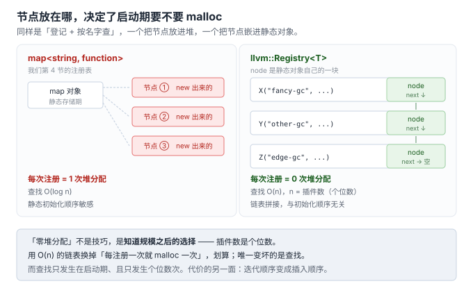
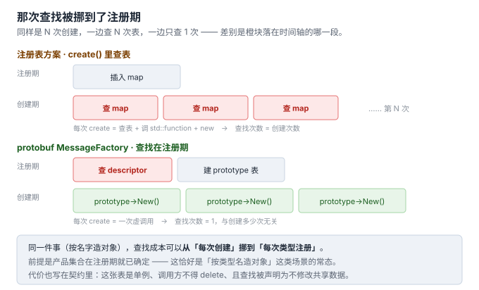

# A02 · 开源世界里的工厂实现考据

> 回答：>=C++11 的经典工厂实现出自哪些仓库，以及「为什么经典」。
> 所有仓库路径与代码片段均经实测核对（HTTP 状态码 / 系统头文件）。

## 0. 先把「经典」拆开

「经典实现」这个词有三种完全不同的含义，混着答会答偏：

| 含义 | 判据 | 代表 |
|---|---|---|
| **标准库级** | 写进 ISO 标准，全世界编译器都得实现 | `std::make_unique` |
| **工程级** | 在生产系统里跑了十几年，被大量项目依赖 | `llvm::Registry`、protobuf `MessageFactory` |
| **教材级** | 被反复引用为"正确写法"的样板 | `boost::factory`、POCO `DynamicFactory` |

下面按这个分层给。

---

## 1. 标准库级：`std::make_unique`（GCC libstdc++）

**仓库**：`gcc-mirror/gcc` → `libstdc++-v3/include/bits/unique_ptr.h`

**一手证据**：直接读系统 libstdc++ 的 `/usr/include/c++/13/bits/unique_ptr.h`（1170 行），`make_unique` 定义在 **L1069**：

```cpp
  template<typename _Tp, typename... _Args>
    _GLIBCXX23_CONSTEXPR
    inline __detail::__unique_ptr_t<_Tp>
    make_unique(_Args&&... __args)
    { return unique_ptr<_Tp>(new _Tp(std::forward<_Args>(__args)...)); }
```

**这一行就是整个工厂。** 三个要点：

1. **它是函数模板，不是类** —— 没有基类、没有工厂类层次、没有虚函数
2. **`std::forward` 让它透传任意构造参数** —— 这是 C++11 变参模板 + 完美转发给的能力
3. **数组用偏特化 + `= delete` 在编译期拦掉**：

```cpp
  template<typename _Tp, size_t _Bound>          // L1047
    struct _MakeUniq<_Tp[_Bound]>
    { struct __invalid_type { }; };              // 已知边界数组 -> 无效类型

  template<typename _Tp, typename... _Args>      // L1092
    __detail::__invalid_make_unique_t<_Tp>
    make_unique(_Args&&...) = delete;            // 直接编译期报错
```

顺带一个自证细节：**特性测试宏就写在源码里** —— `#define __cpp_lib_make_unique 201304L`（L1033），`201304` 对应标准会议通过的时间点。**版本边界不需要查文档，源码自己写着。**

**为什么经典**：

> 它证明了在 C++11 之后，绝大多数场景下工厂**不需要是「模式」，只需要是一个函数模板**。

**对你的用处**：这是写任何工厂时的**下限基线**。如果你的工厂比这一行复杂得多，先回答"为什么多出来的部分值这个钱"。

---

## 2. 工程级标杆：`llvm::Registry<T>`（LLVM）

**仓库**：`llvm/llvm-project` → `llvm/include/llvm/Support/Registry.h`
（Apache-2.0 with LLVM Exceptions）

文件头注释一句话点明用途：

> `Defines a registry template for discovering pluggable modules.`

**核心 API**（原文摘录）：

```cpp
template <typename T, typename... CtorParamTypes> class Registry {
public:
  using type  = T;
  using entry = SimpleRegistryEntry<T, CtorParamTypes...>;

  static void add_node(node *N) { ... }
  static iterator begin();
  static iterator end();
  static iterator_range<iterator> entries();

  /// A static registration template. Use like such:
  ///
  ///   Registry<Collector>::Add<FancyGC>
  ///   X("fancy-gc", "Newfangled garbage collector.");
  ///
  template <typename V> class Add { ... };
};
```

注册项本身：

```cpp
template <typename T, typename... CtorParamTypes> class SimpleRegistryEntry {
  using FactoryFnRef = function_ref<std::unique_ptr<T>(CtorParamTypes &&...)>;
  StringRef Name, Desc;
  FactoryFnRef Ctor;
public:
  std::unique_ptr<T> instantiate(CtorParamTypes &&...Params) const {
    return Ctor(std::forward<CtorParamTypes>(Params)...);
  }
};
```

### 为什么经典（三条）

**① 它做到了 GoF 书里没有的能力：自注册（self-registration）**

插件作者在自己的 `.cpp` 里只写一行：

```cpp
static llvm::Registry<Collector>::Add<FancyGC>
X("fancy-gc", "Newfangled garbage collector.");
```

**没有任何 central list 需要改。** 这一行是个静态对象，构造时就调 `add_node()` 把节点挂进链表。主程序完全不认识 `FancyGC` 这个类型，但只要链接进去，就能按名字找到它。

对照第 4 节我们写的注册表：我们还需要显式调 `register_xxx()`。LLVM 连这一步都省了——**注册动作 = 定义静态变量**。

**② 用侵入式链表换掉 `map`**

```cpp
template <typename R> struct RegistryLinkListStorage {
  typename R::node *Head;
  typename R::node *Tail;
};
```

先把两种布局摊开看，表格在图后补齐第四维（迭代顺序）：



| | 我们的 `map<string, function>` | LLVM 侵入式链表 |
|---|---|---|
| 每次注册的分配 | map 节点（堆） | **零**（node 是静态对象的一部分） |
| 查找 | O(log n) | O(n)，但 n 是插件数（个位数） |
| 静态初始化顺序 | 敏感 | 链表拼接，顺序无关 |
| 迭代顺序 | 按 key 排序 | 插入顺序 |

**取舍很值得学**：LLVM 判断「插件数量是个位数」，于是用链表把启动期开销压到零——这是**知道规模之后的理性选择**，不是"链表比 map 高级"。

**③ 那堆 `LLVM_DECLARE_REGISTRY` / `LLVM_DEFINE_REGISTRY` 宏是伤疤**

代码里留着一段**明确禁止重构**的注释：

```cpp
/// ATTENTION: Be careful when attempting to "refactor" or "simplify" this.
///
/// - This shall not be a member of `RegistryLinkList`, to control instantiation
///   timing separately.
///
/// - The body also shall not be inlined here; otherwise, the guard from a
///   missed explicit instantiation definition won't work.
///
/// - Use an accessor function that returns a reference to a function-local
///   static variable, rather than using a variable template or a static member
///   variable in a class template directly since functions can be imported
///   without the `dllimport` annotation.
```

理由全是 **Windows DLL 边界**：`dllimport`/`dllexport` 无法跨 DLL 共享隐式实例化的全局变量。

**这才是"经典"最值钱的部分**：生产级工厂的真实复杂度不来自模式，来自**链接模型和 ABI 边界**。

---

## 3. 工程级标杆（历史最久）：protobuf `MessageFactory`

**仓库**：`protocolbuffers/protobuf` → `src/google/protobuf/message.h`

```cpp
class PROTOBUF_EXPORT MessageFactory {
 public:
  MessageFactory() = default;
  MessageFactory(const MessageFactory&) = delete;
  MessageFactory& operator=(const MessageFactory&) = delete;
  virtual ~MessageFactory();

  virtual const Message* GetPrototype(const Descriptor* type) = 0;

  static MessageFactory* generated_factory();

  static void InternalRegisterGeneratedFile(
      const google::protobuf::internal::DescriptorTable* table);
  static void InternalRegisterGeneratedMessage(const Descriptor* descriptor,
                                               const Message* prototype);
};
```

### 为什么经典

**① 它是「原型模式 + 工厂」的组合，不是 `make_unique`**

`GetPrototype()` 返回的**不是新对象，是原型**；要新对象得调 `prototype->New()`。好处是：

> 查找成本从「每次创建」降到「每次类型注册」。

对照我们的注册表方案（每次 `create()` 都查 map + 调 `std::function`）——protobuf 把那次查找挪到了注册期，创建期只走一次虚调用：



**② 它的注册是「惰性」的，作者自己承认这设计丑**

注释原文：

> `This strange mechanism is necessary because descriptors are built lazily, so we can't register types by their descriptor until we know that the descriptor exists.`

原文用的词就是 **"This strange mechanism"**。作者知道丑，但被惰性构造的 descriptor 逼成这样。**工程妥协被诚实留在注释里**——值得学的态度。

**③ 线程安全被写进契约**

> `This factory is 100% thread-safe; calling GetPrototype() does not modify any shared data.`
>
> `This factory is a singleton. The caller must not delete the object.`

对照 04a 我们讨论的 `RegistryA`：我们的线程安全只能靠「注册只在启动期完成」这句口头约定；protobuf 把它写成了**文档化的接口契约**。

---

## 4. 教材级：`boost::factory`（Boost.Functional/Factory）

**仓库**：`boostorg/functional` → `include/boost/functional/factory.hpp`（实测 HTTP 200）

API 极简：

```cpp
boost::factory()(arg1, arg2, arg3)        // 等价于  new T(arg1, arg2, arg3)
boost::value_factory()(arg1, arg2, arg3)  // 等价于  T(arg1, arg2, arg3)
```

官方文档给出的典型用法（正是我们第 4 节的注册表，但用它的 factory 当创建器）：

```cpp
std::map<std::string, boost::function<Product*()>> factories;
factories["a_name"]       = boost::factory<A>();
factories["another_name"] = boost::factory<B>();
```

**为什么经典**：它是「**工厂泛型化**」的起点——把 `new T` 这个**表达式**本身变成一等的函数对象。于是任何"接收一个能造 T 的东西"的泛型代码，都能把工厂当参数传进去。

**但它在 C++11 之后略显尴尬**（Boost 文档自己也做了版本说明）：裸指针交货，调用方还得自己包一层智能指针。

C++11 之后这行就够了：

```cpp
factories["a_name"] = [] { return std::make_unique<A>(); };
```

**lambda 把 `boost::factory` 的生存空间吃掉了。** 所以它的历史地位是：**证明了工厂可以是函数对象——然后 C++11 把这个洞察变成了语言原生能力。**

---

## 5. 一处值得注意的缺失：folly 里没有 Factory

实测（`facebook/folly`）：

```text
folly/README.md   : 200   ← 网络正常
folly/Factory.h   : 404   ← 该文件不存在
```

当前 `folly/` 目录下与"造对象"相关的文件只剩：

```text
Poly.h / Poly-inl.h / PolyException.h    ← 值语义多态（C++17）
Singleton.h / SingletonThreadLocal.h     ← 单例
```

**无任何 Factory 相关文件。**

folly 的 README 里写着它的维护原则：

> `We endeavor to remove things from folly if or when std or Boost obsoletes them.`

（注：我无法从当前仓库证明 `folly/Factory.h` **曾经**存在，故不下断言。但这条维护原则本身是 README 原文，可核。）

**这个缺失本身就是论据**：一家以"std 覆盖了就删自己的"为原则的库，在工厂这件事上**没有留下组件**——因为 C++11 之后，工厂这件事已经不需要一个库级实现了：要么一行 `make_unique`，要么自己搭一张注册表。

---

## 6. 汇总

| 实现 | 仓库 | 层级 | 核心机制 | 为什么经典 |
|---|---|---|---|---|
| `std::make_unique` | `gcc-mirror/gcc`（及 libc++/MSVC STL） | 标准库 | 变参模板 + 完美转发 | 工厂被压进一个函数；证明"多数时候不需要模式" |
| `llvm::Registry<T>` | `llvm/llvm-project` | 工程 | 静态初始化**自注册** + 侵入式链表 | GoF 书里没有的自注册能力；零启动期堆分配 |
| `MessageFactory` | `protocolbuffers/protobuf` | 工程 | 原型模式 + 惰性注册 + 单例 | 查找成本从"每次创建"降到"每次注册"；线程安全进契约 |
| `boost::factory` | `boostorg/functional` | 教材 | 把 `new T` 变成函数对象 | 工厂泛型化的起点；后被 lambda 取代 |
| `Poco::DynamicFactory` | `pocoproject/poco` | 教材 | `map<string, Instantiator>` | 注册表式工厂的经典两层设计（实测 HTTP 200） |

---

## 7. 建议的阅读顺序

1. **`std::make_unique`**（5 分钟）
   建立下限基线：工厂可以小到什么程度。

2. **`llvm/include/llvm/Support/Registry.h`**（30 分钟）⭐ **最该读的**
   唯一同时具备「现代 C++（变参模板 / 完美转发 / `function_ref`）」+「真实工程约束（DLL 边界 / 静态初始化 / 链接期行为）」+「代码量一个 header」的实现。
   **重点读那两段 `ATTENTION: Be careful when attempting to "refactor"...` 注释**——那是全部复杂度所在。

3. **`MessageFactory`**（20 分钟）
   理解「原型 + 工厂」这个组合为什么在"按类型名造对象"场景更优。

4. `boost::factory` / `Poco::DynamicFactory`（各 5 分钟）
   只需知道历史地位，不必精读。

---

## 8. 一条判断标准

如果只留一条：

> **一个工厂实现是否经典，不看它用了多少技巧，看它被删掉之后有多少人会疼。**

按这个标准过一遍：

| 实现 | 删掉的后果 |
|---|---|
| `make_unique` | 全世界 C++ 代码编译不过 |
| `llvm::Registry` | clang 所有 pass / target / GC 插件机制崩掉 |
| `MessageFactory` | gRPC、TF 等所有依赖反射动态造消息的系统崩掉 |
| `boost::factory` | 少量老代码，且 `lambda` 一行可替换 |
| `folly::Factory`（若曾存在） | 实测现状：folly 里已经没有它了 |
