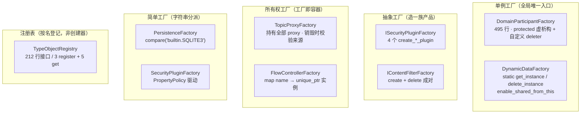

# A03 · Fast-DDS 里的工厂（v3.6.2 实读）

> 上一节 A02 是"满世界挖经典实现"——LLVM、protobuf、boost、folly。
> 而 **Fast-DDS** 源码是同题的工业级答案库，而且是一个**系统内部的全套工厂设计**：
> 单例工厂、抽象工厂、注册表、所有权工厂、C++98 遗留形态，全都齐了。
>
> 本节所有行号与数据实测于 Fast-DDS 源码（`v3.6.2-17-g2ce7fe897`，upstream 为 `eProsima/Fast-DDS`），
> 代码见 `code/A03_fastdds/`。

---

## 0. 先给结论

| 问题 | 答案 |
|---|---|
| Fast-DDS 里有工厂模式吗？ | 有，而且**是 DDS 规范的强制形态**——`create_participant` / `create_datawriter` 就是工厂方法，写 DDS 程序的人每天都在用 |
| 和 A02 那些库比，有什么特别的？ | 它把「**对象只能由工厂造、只能由工厂毁**」这条纪律做到了**语言机制级别**（protected 构造/析构 + friend） |
| 对补 RPC 实现有什么直接价值？ | 3 处实测缺陷，直接决定补实现时会撞什么墙 —— §6 |

---

## 1. 全景：19 个文件，五种形态

实测 `find -iname "*Factory*"` 的骨架（去掉 examples）：



**注意最后一格**：`ITypeObjectRegistry` 虽然有 `register_*` 接口，但它登记的是 **TypeObject 数据**，不造对象——**它是 registry，不是 factory**。这个区分在 §7 会用到。

---

## 2. 金样本：`DomainParticipantFactory`

DDS 规范里每个应用的第一行代码就是它。全文 495 行的头文件，核心只有 3 个决定。

### 2.1 源码原文（`DomainParticipantFactory.cpp` L83–99）

```cpp
DomainParticipantFactory* DomainParticipantFactory::get_instance()
{
    return get_shared_instance().get();
}

std::shared_ptr<DomainParticipantFactory> DomainParticipantFactory::get_shared_instance()
{
    // Note we need a custom deleter, since the destructor is protected.
    static std::shared_ptr<DomainParticipantFactory> instance(
        new DomainParticipantFactory(),
        [](DomainParticipantFactory* p)
        {
            delete p;
        });
    return instance;
}
```

### 2.2 决定一：单例靠「魔法静态」，不靠锁

`static std::shared_ptr<...> instance` 是函数内静态局部变量。C++11 起，**同一变量的并发初始化只执行一次**，其余线程阻塞等待。

对照同一个文件里的锁分布：

| 位置 | 是否加锁 | 保护对象 |
|---|---|---|
| `get_shared_instance()` L87 | **无锁** | 单例的唯一性（魔法静态已保证） |
| `mtx_participants_` L63 / 108 / 171 / 267 / 281 | 加锁 | `participants_` 容器（业务数据） |

**单例的"唯一性"不花锁，单例管理的"数据"照样要花。** 这两件事经常被混为一谈。

### 2.3 决定二：析构 protected，所以 deleter 必须自定义

头文件 L436–446：

```cpp
protected:
    friend class DomainParticipant;
    DomainParticipantFactory();
    virtual ~DomainParticipantFactory();          // ← virtual 是关键
    DomainParticipantFactory(const DomainParticipantFactory&) = delete;
    void operator = (const DomainParticipantFactory&) = delete;
```

两个细节值得单独说：

**① 自定义 deleter 为什么必要**——`shared_ptr` 的默认 deleter 做的是 `delete p`，而 `delete` 要调用析构函数，需要访问权限。析构是 protected 时，标准库内部的 `delete` 表达式**没有访问权**。

实测报错（`code/A03_fastdds/03_make_shared_rejected.cpp`，`-fsyntax-only`）：

```text
/usr/include/c++/13/bits/unique_ptr.h:1070:30: error:
    'constexpr ProtectedSingleton::ProtectedSingleton()' is protected within this context
/usr/include/c++/13/bits/stl_construct.h:119:7: error:
    'constexpr ProtectedSingleton::ProtectedSingleton()' is protected within this context
```

**报错位置在标准库头文件里**——这就是"标准库拿不到访问权"的硬证据。所以合法路径只有一条：在**有访问权的上下文**（这里是 `get_shared_instance()` 成员函数体内的 lambda）里写 `delete`，把它作为 deleter 交出去。

**② 赋值运算符返回 `void`**：

```cpp
void operator = (const DomainParticipantFactory&) = delete;
```

现代惯用写法应返回 `DomainParticipantFactory&`。返回 `void` 是 DDS 规范系老代码的风格残留——不影响 `= delete` 的效果，但暴露了代码年龄。

### 2.4 决定三：代价是「多一次堆分配」

因为构造函数 protected，`std::make_shared` 用不了（它要在标准库内部执行 `new`）。实测（`02_singleton_alloc.cpp`）：

| 写法 | 分配次数 |
|---|---|
| `std::make_shared<T>()` | **1** |
| `std::shared_ptr<T>(new T)` | **2**（对象 + 控制块） |
| Fast-DDS 的实际写法（protected 构造 + 自定义 deleter） | **2** |

**这正是 A01 里讲的"所有权窗口"的真实工程后果**——不是理论，是 Fast-DDS 每天付的账。代价不大（一个进程一个单例），但要知道它在哪。

### 2.5 与第 4a 节 Meyers 单例的差别

04a 讲的 Meyers 单例长这样：

```cpp
static Registry& instance() { static Registry r; return r; }   // 靠 C++98 也能写
```

Fast-DDS 这个**是 Meyers 单例的 shared_ptr 变体**，成因很具体：

| | Meyers 原版 | Fast-DDS 版 |
|---|---|---|
| 返回值 | `T&` | `T*` 和 `shared_ptr<T>` **两个都提供** |
| 生命周期 | 程序结束析构 | 同上 |
| 需要自定义 deleter | 否 | **是**（析构 protected） |
| 为什么改 | — | 析构 protected + 要对外提供引用计数所有权 |

**双接口并存**（`get_instance()` 返裸指针、`get_shared_instance()` 返 shared_ptr）是规范妥协：DDS 标准要求 C 风格入口返回指针，但内部实现想用引用计数管理。

---

## 3. `SecurityPluginFactory` —— 三层套娃

DDS 安全插件要造一族产品：认证 / 访问控制 / 加密 / 日志。`ISecurityPluginFactory` 是抽象工厂接口（4 个纯虚 `create_*_plugin`），`SecurityPluginFactory` 实现它。

**关键在它的分派方式**（`SecurityPluginFactory.cpp` L31–46 摘其一）：

```cpp
Authentication* SecurityPluginFactory::create_authentication_plugin(
        const PropertyPolicy& property_policy)
{
    Authentication* plugin = nullptr;
    const std::string* auth_plugin_property = PropertyPolicyHelper::find_property(property_policy,
                    "dds.sec.auth.plugin");

    if (auth_plugin_property != nullptr)
    {
        if (auth_plugin_property->compare("builtin.PKI-DH") == 0)
        {
            plugin = create_builtin_authentication_plugin();   // ← 调 protected 虚钩子
        }
    }
    return plugin;
}

// L104
Authentication* SecurityPluginFactory::create_builtin_authentication_plugin()
{
    return new PKIDH();
}
```

三个模式叠在一起：

| 层 | 手段 | 作用 |
|---|---|---|
| 外层 | `ISecurityPluginFactory` 抽象工厂 | 定 4 个产品类型的契约 |
| 中层 | public `create_*` 里的字符串比较 | **简单工厂**——按 property 值选产品 |
| 内层 | protected virtual `create_builtin_*` | **工厂方法钩子**——留给子类换实现 |

**4 个 create 各含一段同样的三段式**（取 property → `compare()` → 调钩子）。

### 可指出的两点

**① 新增算法要改函数体**——这是第 2 节"伤 A"的原样复现。要加一种认证算法（如 `builtin.X509`），必须编辑 `create_authentication_plugin` 的函数体。**抽象工厂的外壳包着一颗简单工厂的心**：对"加产品类型"是封闭的，对"加产品实现"也是封闭的。

**② `compare() == 0` 而非 `==`**——同样是老代码风格。`std::string` 有 `operator==`，`compare()` 是 C++98 早期为兼容 C 习惯留下的写法。

---

## 4. 「工厂即容器」：`TopicProxyFactory` / `FlowControllerFactory`

前面几种工厂都是"造完就撒手"。这两个不是——**工厂持有它造出来的所有对象**。

### 4.1 `TopicProxyFactory`：销毁时校验来源

头文件注释里写死了它的契约：

```text
L87:  @return PRECONDITION_NOT_MET if the @c proxy was not created by this factory,
                                 or has already being deleted.
L103: Return whether this factory can be deleted.
L106: @return true if the factory owns no proxy objects
L116: template<class UnaryFunction> apply(...)   // 对全部 proxy 施加一个函数
```

**"不是你造的，别来找我销毁"**——由工厂自己校验销毁请求的合法性。加上 `can_be_deleted()`（自己没孩子了才能被销毁），这是**所有权层级的显式建模**。

这解决了一个前几节没讨论的问题：**`delete p` 无法验证 p 的来源**。你可以 `delete` 任何指针，但无法表达"这个对象归那个工厂管"。`TopicProxyFactory` 把这条归属关系做进了接口。

### 4.2 `FlowControllerFactory`：存实例而不是创建函数

```cpp
// L50
void register_flow_controller(const FlowControllerDescriptor& flow_controller_descr);

// L59
FlowController* retrieve_flow_controller(
        const std::string& flow_controller_name,
        const fastdds::rtps::WriterAttributes& writer_attributes);

// L68
std::map<std::string, std::unique_ptr<FlowController>> flow_controllers_;
```

和 04a 我们写的注册表对比：

| | 04a 的注册表 | FlowControllerFactory |
|---|---|---|
| map 的 value | `std::function<unique_ptr<T>()>` **创建函数** | `unique_ptr<FlowController>` **现成实例** |
| 注册时机 | 登记"怎么造" | 直接造好塞进去 |
| 创建时机 | 每次取用时 `new` | 注册时一次性 |

**存实例 = 放弃惰性创建，换来"注册即校验"**——对象造不出来时当场就知道，而不是等到第一次取用。

另外 `register_flow_controller` 的**函数体是个 100 行巨型 if-else**（L51–151），里面 10+ 个 `new FlowControllerImpl<...>` 模板实例化。**简单工厂里堆模板**——产品数量固定但实现维度多时的常见形态。

一个正面细节：头文件 L28 直接写明线程约定。

```text
 * @note Non-safe thread
```

对照 04a 我们只能靠"注册只在启动期完成"这句口头约定——**Fast-DDS 把它写进了契约**。

---

## 5. `PersistenceFactory` —— 纯 C++98 风简单工厂

全文 85 行，核心就一个函数：

```cpp
// PersistenceFactory.cpp L46
IPersistenceService* PersistenceFactory::create_persistence_service(
        const PropertyPolicy& property_policy)
{
    IPersistenceService* ret_val = nullptr;
    const std::string* plugin_property = PropertyPolicyHelper::find_property(
                    property_policy, "dds.persistence.plugin");

    if (plugin_property != nullptr)
    {
#if HAVE_SQLITE3
        if (plugin_property->compare("builtin.SQLITE3") == 0)
        {
            // ... 取 filename、update_schema 两个 property ...
            ret_val = create_SQLite3_persistence_service(filename, update_schema);
        }
#endif
    }
    return ret_val;
}
```

四个特征，全是"老"的：

| 特征 | 说明 |
|---|---|
| 返回 `IPersistenceService*` **裸指针** | 所有权靠调用方约定——**A01 里 C++98 阶段的原样复现** |
| 字符串 `compare()` 分派 | 与 SecurityPluginFactory 同款 |
| `#if HAVE_SQLITE3` 编译期开关 | **编译期决定 + 运行期字符串分派混用** |
| 只有一个产品却叫 Factory | 产品集合开放的预埋 |

**第四点最值得注意**：目前只支持 SQLite3 一种实现，"工厂"看起来多余。但接口形状是按"将来会有第二种持久化后端"设计的——**这是本书讲的"为变化付费"，只是这次付的是"多一层函数的钱"，很便宜。**

对比同一仓库里的 `SecurityPluginFactory`（4 产品）和 `PersistenceFactory`（1 产品）：**两者分派代码几乎一样，但产品数差 4 倍。** 这说明"要不要工厂"和"现在有几个产品"没关系，**和"未来会不会加"有关系**——正是第 6 节的判据。

---

## 6. RPC 侧：被抽空的工厂（本节重点）

### 6.1 先说一个事实：RPC 实现是**官方抽走的**

`grep -rc "Services are not supported in this Fast DDS version"` 得到 10 处 + 另 3 个三参重载不打日志。用 `git log -S` 追这行日志的引入者：

```text
commit  e516400ff230fc51fad569b0ed209b1464467cb4
作者     Emilio Cuesta Fernandez
日期     Tue Feb 24 12:46:34 2026 +0100
标题     RPC refactor (#6308)
```

**这是 eProsima 官方的 PR #6308。** 也就是说：v3.6.2 发布时，官方主动把 RPC 实现抽掉了，只留接口壳。

### 6.2 `DomainParticipantImpl` 上那 13 个空壳

实测签名清单（`DomainParticipantImpl.cpp` L1978–2094）：

| # | 函数 | 产品 | 形态 |
|---|---|---|---|
| 1 | `find_service_type` | ServiceTypeSupport | 注册表查询 |
| 2 | `register_service_type` | — | 注册表写入 |
| 3 | `unregister_service_type` | — | 注册表删除 |
| 4 | `create_service`（3 参，带 `ret_code&`） | **Service** | 工厂 |
| 5 | `create_service`（2 参） | Service | 工厂（转发到 4） |
| 6 | `find_service` | Service | 注册表查询 |
| 7 | `delete_service` | Service | 销毁 |
| 8 | `create_service_requester`（3 参） | **Requester** | 工厂 |
| 9 | `create_service_requester`（2 参） | Requester | 工厂（转发到 8） |
| 10 | `delete_service_requester` | Requester | 销毁 |
| 11 | `create_service_replier`（3 参） | **Replier** | 工厂 |
| 12 | `create_service_replier`（2 参） | Replier | 工厂（转发到 11） |
| 13 | `delete_service_replier` | Replier | 销毁 |

**复核结论**：逐条盘点——13 个函数体，其中 Requester/Replier 的工厂与销毁正好 6 个（#8–13），10 处打日志、3 个三参重载不打日志。

**结构上这是一个抽象工厂**：`Requester` / `Replier` 两个产品类型，族 = 服务实例。而 `find_service_type` / `register_service_type` 是**注册表侧**（登记类型，不造对象）——和 TypeObjectRegistry 同类。

一个**不一致**值得记下来：

```cpp
ReturnCode_t delete_service(const rpc::Service* service);                          // 只要指针
ReturnCode_t delete_service_requester(const std::string& service_name,
                                      rpc::Requester* requester);                   // 既要素名又要指针
```

**同一个类里两个销毁接口，一个要名字一个不要。** Requester/Replier 的删除要多传 `service_name`，说明它们被登记在某个按名字的容器里、销毁时需要摘除；而 Service 不在。这不是错，但接口不对称，用起来容易记错。

### 6.3 ★ 三个实测缺陷（补实现时会撞上）

#### 缺陷 1：`~Service()` 是 protected **非虚** → 补 delete 就是 UB

```cpp
// include/fastdds/dds/rpc/RPCEntity.hpp L49-54
protected:
    ~RPCEntity() = default;      // 非虚

// include/fastdds/dds/rpc/Service.hpp L51-56
protected:
    ~Service() = default;        // 非虚
```

而 `DomainParticipantFactory.hpp` L446 写的是 `virtual ~DomainParticipantFactory();`——**同一个仓库，核心侧知道要加 virtual，RPC 侧漏了。**

实测后果（`01_protected_dtor.cpp`，`-Wall` 编译）：

```text
01_protected_dtor.cpp:138:9: warning: deleting object of abstract class type 'NonVirtualBase'
    which has non-virtual destructor will cause undefined behavior [-Wdelete-non-virtual-dtor]
```

运行结果：

| 实验 | 写法 | 派生类析构调用次数 |
|---|---|---|
| 1 | protected **非虚**（RPCEntity / Service） | **0**（期望 1）——缓冲区泄漏 |
| 2 | public 虚 + 派生 protected | 1 |
| 3 | protected **虚**（DomainParticipantFactory） | 1 |

**当前为什么没炸**：`delete_service` 的函数体里根本没有 `delete` 语句，只有一句日志。**一旦补实现，隐藏问题立刻变成现实问题。**

#### 缺陷 2：`rpc_transport_ifaces.hpp` 的「protected 析构下沉到实现类」是无效的

> 注：该文件不在 v3.6.2 上游——上游 `include/fastdds/dds/rpc/` 只有 8 个接口头文件，没有 `impl/` 层。它属于 v3.6.2 之后的接口层代码，行号按当前工作树标注。

该文件里写了一条纪律（L65）：

```cpp
// 工厂（protected 析构语义下沉到实现类；service_name 构造绑定 → 回调零歧义）
```

但基类的析构是 **public**（L29）：

```cpp
class RequesterTransport {
public:
    virtual ~RequesterTransport() = default;      // ← public！
```

实测结论（实验 2）：

| 用法 | 是否被挡住 |
|---|---|
| 栈上定义 `RequesterTransport` 派生类对象 | ✓ 挡住（派生类析构 protected） |
| `delete (Derived*)p` | ✓ 挡住 |
| **`delete (RequesterTransport*)p`** | **✗ 挡不住**——编译通过、无警告 |

**原因**：访问权限检查发生在**静态类型**上。调用方手里是 `RequesterTransport*`，它的析构是 public，所以能删；派生类的 protected 析构压根不参与访问检查（它只在 vtable 里被调用）。

**"下沉到实现类"这句纪律，实际防护面为零。** 要真正生效，必须让**基类**析构 protected。

另外这两个工厂返回**裸指针**且**没有配对的销毁入口**：

```cpp
RequesterTransport* create_requester_transport(...);   // 造出来
ReplierTransport*   create_replier_transport(...);     // 没有 delete_*！
```

对照同一仓库的做法：`IContentFilterFactory` 是 `create_content_filter` + `delete_content_filter` **成对**；`DynamicDataFactory` 是 `create_data` + `delete_data` **成对**。**该接口层的 transport 工厂缺销毁侧。** 要么补配对，要么改成 `unique_ptr` 返回（构造/析构都 public 时唯一省心的方案）。

#### 缺陷 3：真去 `delete` 还需要 `friend` 授权

RPC 侧补实现时，`DomainParticipantImpl` 写 `delete service` 会遇到这道门槛。实测（`04_no_friend_rejected.cpp`）：

```text
04_no_friend_rejected.cpp:35:16: error: 'Service::~Service()' is protected within this context
04_no_friend_rejected.cpp:25:5: note: declared protected here
```

`DomainParticipantImpl` 既不是 `Service` 的派生类也不是友元——**没有访问权**。

上游给的现成答案就在同一个仓库里：`DomainParticipantFactory.hpp` L438 的 `friend class DomainParticipant;`。**friend 授权 + protected virtual 析构**，这是 Fast-DDS 自己的标准答案。

### 6.4 三条修复建议（按代价从小到大）

| # | 动作 | 代价 | 收益 |
|---|---|---|---|
| 1 | `RPCEntity` / `Service` / `Requester` / `Replier` 的析构加 `virtual` | 1 个关键字 × 4 处 | 消除 UB |
| 2 | `DomainParticipantImpl` 加 `friend` 声明（4 个类各一处） | 4 行 | 让 `delete_*` 可编译 |
| 3 | `rpc_transport_ifaces.hpp` 的工厂返回 `unique_ptr`，或补 `delete_*_transport` 配对 | 改 2 个签名 | 所有权明确 |

**三条都做，成本不到 10 行代码。** 不做的话，第 3 条会在内存泄漏报告里现身，第 1、2 条会在第一次 `delete` 时以 UB 的形式现身——而且 UB 不保证崩，可能只是静默泄漏。

---

## 7. 与前面几节的对照总表

| 我们讲过的形态 | Fast-DDS 的实例 | 用什么机制实现的 |
|---|---|---|
| 简单工厂（03 节） | `PersistenceFactory`、`SecurityPluginFactory` 中层 | 字符串 `compare()` 分派 |
| 工厂方法（04 节） | `SecurityPluginFactory` 内层 `create_builtin_*` | protected virtual 钩子 |
| 注册表（04a 节） | `TypeObjectRegistry`、`FlowControllerFactory` | `map<string, ?>` |
| 抽象工厂（05 节） | `ISecurityPluginFactory`、RPC 的 requester/replier | 接口 + 一族 create |
| Meyers 单例（04a 节） | `DomainParticipantFactory`、`DynamicDataFactory` | 魔法静态 + shared_ptr 变体 |
| 代价（06 节） | 单例多 1 次堆分配 | protected 构造封死 `make_shared` |
| **本仓库独有** | `TopicProxyFactory` | **工厂即容器 + 销毁来源校验** |

最后一行是新增的第七种形态。前六种都在回答"怎么造"，**它回答的是"谁拥有"**——`can_be_deleted()` 和"不是你造的别来找我删"这两条，是前六种都没有的能力。

---

## 8. 可迁移的判断

1. **要表达「只能由工厂创建/销毁」，光靠文档和注释没用**——必须在语言层面同时做到两件事：析构 `virtual`（否则 UB）、访问控制落在调用方实际持有的静态类型上（否则形同虚设）。Fast-DDS 核心侧两条都做到了，RPC 侧两条都没做到。

2. **注册表和工厂是两种东西，别混**。判断标准：它存的是"怎么造"（创建函数）还是"造好的东西"（实例/数据）？`FlowControllerFactory` 存实例、`TypeObjectRegistry` 存数据、04a 的注册表存函数——三者都叫 registry 或 factory，机制完全不同。

3. **工业级工厂的复杂度不来自模式，来自边界**——A02 里 LLVM 那句警告（Windows DLL 边界）是这样，Fast-DDS 这里也是这样：`#if HAVE_SQLITE3` 编译期开关、`friend` 授权、`FASTDDS_EXPORTED_API`，都是平台与链接模型逼出来的，与 GoF 书里的结构无关。

4. **同一个系统里，同一个问题的答案可能不一致**。`virtual ~DomainParticipantFactory()` vs `~Service() = default` 就是活例子。**读源码时要横向比对，别只看单点**——单点看着都合理，差异才暴露意图与疏忽。

---

## 附：本节代码与复现命令

```text
code/A03_fastdds/
├── 01_protected_dtor.cpp          # protected 析构三种后果（含 -Wall UB 警告）
├── 02_singleton_alloc.cpp         # 单例堆分配次数（1 vs 2）
├── 03_make_shared_rejected.cpp    # 【预期编译失败】标准库拿不到 protected 访问权
└── 04_no_friend_rejected.cpp      # 【预期编译失败】外部类 delete 被拦
```

```bash
cd code/A03_fastdds

# 三组实验（正常构建）
g++ -std=c++17 -Wall 01_protected_dtor.cpp -o /tmp/a03/01 && /tmp/a03/01
g++ -std=c++17 -Wall 02_singleton_alloc.cpp -o /tmp/a03/02 && /tmp/a03/02

# 两个取证（预期编译失败，看报错）
g++ -std=c++17 -fsyntax-only 03_make_shared_rejected.cpp
g++ -std=c++17 -fsyntax-only 04_no_friend_rejected.cpp
```

**源码坐标速查**（Fast-DDS v3.6.2-17）：

| 内容 | 路径 : 行 |
|---|---|
| 单例实现 | `src/cpp/fastdds/domain/DomainParticipantFactory.cpp:83-99` |
| friend + protected 虚析构 | `include/fastdds/dds/domain/DomainParticipantFactory.hpp:438,446` |
| 安全插件抽象工厂 | `src/cpp/rtps/security/SecurityPluginFactory.cpp:31-121` |
| 所有权工厂 | `src/cpp/fastdds/topic/TopicProxyFactory.hpp:87,103,116` |
| 注册表存实例 | `src/cpp/rtps/flowcontrol/FlowControllerFactory.hpp:50,59,68` |
| C++98 风简单工厂 | `src/cpp/rtps/persistence/PersistenceFactory.cpp:46-81` |
| RPC 析构策略 | `include/fastdds/dds/rpc/RPCEntity.hpp:54`、`Service.hpp:56` |
| RPC 13 个空壳 | `src/cpp/fastdds/domain/DomainParticipantImpl.cpp:1978-2094` |
| 空壳引入 commit | `e516400ff`「RPC refactor (#6308)」2026-02-24 |
| 接口层 transport 工厂（非 v3.6.2 上游） | `include/fastdds/dds/rpc/impl/rpc_transport_ifaces.hpp:29,68,73` |
