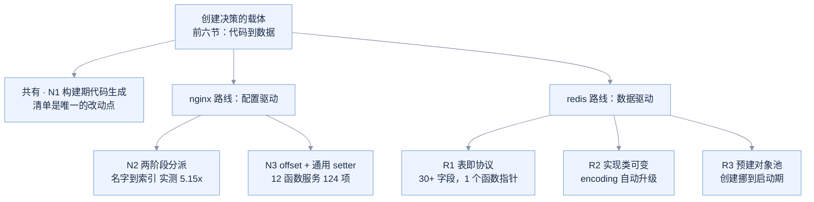

# A05 · nginx 与 redis 里的工厂

> 读的是两个真库的源码：**nginx 1.31.7**、**redis unstable**。
> 本节只收**前面没出现过**的技巧。凡是与前六节 + A01~A04 重复的，第 0 节一句话带过，不展开。

---

## 0. 先说清楚：哪些不重复

你要求"重复的不用列举"，所以先把重复项清掉——这两个库里当然也有老面孔：

| 前面已讲的机制 | 在这两个库里的对应物 | 本节是否展开 |
|---|---|---|
| 简单工厂（字符串分派） | redis `PersistenceFactory` 式的按名建对象；`lookupCommand` 本质是**哈希版**简单工厂 | ✗ 不展开 |
| 函数指针表 | nginx 若手写模块数组，等价于 A04 档 2 的 `{key, handler}` 表 | ✗ 讲的是它**怎么被造出来**（§1） |
| 注册表存创建函数 | redis 命令表里那 1 个 `proc` 指针 | ✗ 只在新维度上讲（§4） |
| 编译期 `#if` 选定 | nginx 各 `ngx_*_module.c` 之间也这么选文件 | ✗ 已覆盖 |

**真正新的有六招**，其中 3 招属于 nginx，3 招属于 redis，另有 1 招（§1）两家**各用一套工具做同一件事**。

---

## 1. 【共有】清单是唯一的改动点：构建期代码生成

这是本节的第一个"没讲过"。

A04 讲过**链接器段自注册**——靠链接器收集符号，改动点为零。nginx 和 redis 都没走那条路，它们走的是更朴素、也更可控的一条：**用脚本把清单编译成 C 数组**。

### nginx：auto/modules 用 shell 生成 ngx_modules.c

`auto/modules:1594-1615` 是这样一段 shell：

```sh
for mod in $modules
do
    echo "extern ngx_module_t  $mod;"         >> $NGX_MODULES_C
done

echo 'ngx_module_t *ngx_modules[] = {'        >> $NGX_MODULES_C
for mod in $modules
do
    echo "    &$mod,"                         >> $NGX_MODULES_C
done
```

**关键不在生成了什么，在于"谁决定这个数组"。** 数组的内容来自 `$modules` 变量，而 `$modules` 是构建配置阶段算出来的。模块作者写自己的模块文件，**不需要碰任何中心清单**。

### redis：464 个 JSON → commands.def（Python 生成）

redis 把同一招做到了工业级：

```text
src/commands/ 下的 464 个 .json     ← 源数据，一命令一文件
utils/generate-command-code.py     ← 生成器
src/commands.def                   ← 产物，531 KB
```

`src/commands.def` 第一行自己写着：

```c
/* Automatically generated by generate-command-code.py, do not edit. */
```

### 实测：新增一个模块改几处

`code/A05_nginx_redis/04_*` 把 nginx 那套等比缩小复现了一遍——`04_modules.list` 是清单，`04_gen_modules.sh` 是同构的生成器，`04_main.c` 是消费者。实测输出：

```text
--- 初始 3 个模块 ---
  [0] mod_core init() = 100   handle(42) = 43
  [1] mod_http init() = 200   handle(42) = 44
  [2] mod_log  init() = 300   handle(42) = 45
共 3 个模块。main.c 里没有任何具体模块名。

--- 只往清单追加 1 行 mod_cache，重新生成 ---
  [3] mod_cache init() = 400   handle(42) = 46
共 4 个模块。main.c 里没有任何具体模块名。
```

| 动作 | 手写数组 | 构建期生成 |
|---|---|---|
| 加 `extern` 声明 | 1 处 | 0 |
| 改数组本体 | 1 处 | 0 |
| 改名字数组 | 1 处 | 0 |
| **改清单** | — | **1 处** |
| `04_main.c` | 需重编（有人会忘） | **一个字节没改** |

### 与段自注册的取舍

| | 段自注册（A04） | 构建期生成（本节） |
|---|---|---|
| 改动点 | 0 处（新增文件即注册） | 1 处（清单） |
| 可见性 | **差**——`grep` 找不到注册点 | **好**——清单就是全部注册点 |
| 条件编译 | 难 | 天然（清单本身可条件生成） |
| 顺序控制 | 段内顺序不可控 | **可控**（清单有序） |

**nginx 选生成而不是段，本质是用 1 处改动换"能一眼看全"**。一个 web server 的模块列表是架构信息，不是意外产物——它值得被显式写下来。

---

## 2. 【nginx】两阶段分派：把名字在配置期换成整数索引

### 机制

nginx 选事件后端（epoll / kqueue / select）分两步，中间隔着"配置解析"这条天然的分界线：

**阶段一 · 配置解析期**（`src/event/ngx_event.c:1100-1136`）——用户写 `use epoll;`：

```c
for (m = 0; cf->cycle->modules[m]; m++) {
    if (cf->cycle->modules[m]->type != NGX_EVENT_MODULE) continue;
    module = cf->cycle->modules[m]->ctx;
    if (module->name->len == value[1].len) {
        if (ngx_strcmp(module->name->data, value[1].data) == 0) {
            ecf->use  = cf->cycle->modules[m]->ctx_index;   /* ← 字符串换成了整数 */
            ecf->name = module->name->data;
```

**阶段二 · 启动时**（`ngx_event.c:680-698`）——拿整数去找模块，然后**一次结构体整体赋值**把函数指针搬进全局：

```c
if (cycle->modules[m]->ctx_index != ecf->use) continue;
module = cycle->modules[m]->ctx;
module->actions.init(cycle, ngx_timer_resolution);
```

`ngx_epoll_module.c:369` 就一行：

```c
ngx_event_actions = ngx_epoll_module_ctx.actions;
```

之后所有调用点走宏（`ngx_event.h:400-408`）：

```c
#define ngx_add_event   ngx_event_actions.add
```

### 实测：契约从"名字"降级到"索引"值多少

这是本节唯一一个能显著量化的点，我把**调用契约**设计成三种（`code/A05_nginx_redis/02_two_phase_dispatch.c`）：

| 方案 | 调用方拿什么换到函数 | 实测 |
|---|---|---|
| A | **名字**（字符串，每次 `strcmp`） | **2.928 ns/op** |
| B | **索引**（整数，直接索引表） | **0.568 ns/op** |
| C | **函数指针**（已固化到全局） | 0.569 ns/op |

**A → B 是 5.15x。** nginx 的两阶段做的事，就是把契约从 A 降级到 C。

### 两处必须诚实说明

**① B 和 C 在运行期没有差别（0.568 vs 0.569）。** 我本来预期 C 更快——把函数指针取到循环外，间接层更少。现代编译器把 B 也优化到了同一形态。
**C 换到的不是速度，是别的东西**：调用点从 `tab[idx].add(fd)` 变成 `ngx_add_event(fd)` 这个名字，以及"换后端只需重赋值一个全局变量、不必再碰模块数组"的自由度。**这是可读性和可替换性的收益，不是性能收益。**

**② 这个 5x 不等于"nginx 比别的服务器快 5 倍"。** A 代表的是"接口设计上把字符串当调用契约"这种选择——真实系统里很少每个请求都去比字符串。这里的价值是**量出一个量级**：字符串比较是 ns 级，索引是亚 ns 级，两者差 5 倍。当这个量出现在每秒百万次的热路径上，它就是真账。

**③ 修测量方法的记录**：这版之前我跑出过 A = 0.256 ns/op——**比 B 还快**，显然荒谬。原因是 `g_want` 是 `const char*` 指向字面量，`strcmp` 被编译器提升到循环外了。加 `volatile` 才拿到 2.928。**反常的数字先怀疑测法**，这条已经是第三次踩（06 节的 0.00 ns/op、A05 的这次）。

### 一个对照：redis 走了另一条路

redis 的 `lookupCommand` **契约也是名字**（`src/server.c:3675`）：

```c
struct redisCommand *base_cmd = dictFetchValue(commands, argv[0]->ptr);
```

但它没把名字换成索引，而是**给名字建了哈希字典**（`server.c:2557` 运行期由静态表建成 dict），把"名字契约"的代价压成 O(1)。

> **同一个问题两条解法**：nginx 在配置期把名字**烧成整数**；redis 在启动期把名字**建成哈希**。前者省掉每次查找，后者让查找变便宜。选哪条取决于契约稳不稳定——平台/后端在进程生命周期内不变，就烧成整数；命令名由客户端随时指定，就建哈希。

---

## 3. 【nginx】offset + 通用 setter：表里存的是「字段偏移」

这一招我认为是整节里最巧的一个，因为**它把表的语义从"调用什么"改成了"写到哪"**。

### 结构定义（`src/core/ngx_conf_file.h:77-84`）

```c
struct ngx_command_s {
    ngx_str_t             name;
    ngx_uint_t            type;     /* 位掩码：上下文(MAIN/SRV/LOC) + 参数个数(TAKE1/TAKE2...) */
    char               *(*set)(ngx_conf_t *cf, ngx_command_t *cmd, void *conf);
    ngx_uint_t            conf;
    ngx_uint_t            offset;   /* ★ 字段在结构体里的偏移 */
    void                 *post;
};
```

### 使用形态（`src/http/ngx_http_core_module.c:185-190`）

```c
{ ngx_string("variables_hash_max_size"),
  NGX_HTTP_MAIN_CONF|NGX_CONF_TAKE1,
  ngx_conf_set_num_slot,                                   /* ← 共用同一个函数 */
  NGX_HTTP_MAIN_CONF_OFFSET,
  offsetof(ngx_http_core_main_conf_t, variables_hash_max_size),   /* ← 只有这一行不同 */
  NULL },
```

### 那个函数体内不认识任何字段名（`ngx_conf_file.c:1173`）

```c
ngx_conf_set_num_slot(ngx_conf_t *cf, ngx_command_t *cmd, void *conf)
{
    char  *p = conf;
    ngx_int_t *np;

    np = (ngx_int_t *) (p + cmd->offset);      /* ★ 指针算术定位，仅此一行 */
    if (*np != NGX_CONF_UNSET) return "is duplicate";
    *np = ngx_atoi(value[1].data, value[1].len);
    ...
}
```

### 规模（源码实测）

| 项 | 数量 |
|---|---|
| 通用 setter 函数 | **12 个**（flag / str / str_array / keyval / num / size / off / msec / sec / bufs / enum / bitmask） |
| `command` 表（全仓） | **107 张** |
| 仅 `ngx_http_core_module` 一张表 | **124 个配置项** |

> **124 个配置项由 12 个函数服务。** 若按"一项一个 setter"写，就是 124 个函数。

扩展开销实测（`code/A05_nginx_redis/01_offset_setter.c`）：

| | 新增第 7 项配置 |
|---|---|
| 逐项 setter | 写新函数 + 表里加一行 + 改 switch = **3 处** |
| offset + 通用 setter | 表里加一行 = **1 处** |

### 它和"表驱动"差在哪

前面讲的表驱动，表里存的是**函数指针**——回答"调用哪个函数"。
nginx 这张表存的是**字段偏移**——回答"写到哪个地址"。

两者都在"用数据代替代码"，但 nginx 这一招更狠：**它把"处理逻辑"也归约掉了**。因为"把一个数写进一个 int 字段"这件事本身就那几种，12 个函数覆盖了全部类型，剩下的差异纯粹是**位置**——而位置用 `offsetof` 表达，编译期算好，零运行期开销。

**能这么干的前提**：所有配置项的处理逻辑真的是同构的（解析 → 校验 → 写字段）。一旦某个配置项有独有逻辑，就得回到 `set` 里写专用函数——nginx 的表里也确实还有一批专用 setter。**通用 setter 是主流，专用 setter 是例外**，这个比例（12 : 124）正是"同构性有多高"的度量。

---

## 4. 【redis】表即协议：30+ 字段，其中只有 1 个是函数指针

### 结构（`src/server.h:3103-3135`，节选）

```c
struct redisCommand {
    /* Declarative data */
    const char *declared_name;
    const char *summary;          /* 文档 */
    const char *complexity;       /* 文档 */
    const char *since;            /* 文档 */
    int         doc_flags;
    const char *replaced_by;      /* 已弃用 -> 后继是谁 */
    const char *deprecated_since;
    redisCommandGroup group;      /* 分类 */
    commandHistory *history;      /* 版本历史 */
    const char **tips;
    redisCommandProc *proc;       /* ★ 30+ 字段里，这是唯一一个函数指针 */
    int         arity;            /* 参数个数，负数表示「至少 N 个」 */
    uint64_t    flags;            /* CMD_WRITE / CMD_READONLY / CMD_FAST ... */
    uint64_t    acl_categories;
    keySpec    *key_specs;        /* 集群路由 */
    int         key_specs_num;
    redisGetKeysProc *getkeys_proc;
    struct redisCommand *subcommands;   /* ★ 表项里又有一张表 */
    struct redisCommandArg *args;
    ...
};
```

看到这个结构，前六节所有"表"的对比就出来了：

| 表 | 字段数 | 函数指针数 | 表在回答什么 |
|---|---|---|---|
| 04a 注册表 | 2 | 1 | 谁来创建 |
| nginx 指令表 | 6 | 1 | 谁来解析 + 写到哪 |
| **redis 命令表** | **30+** | **1** | **谁来执行 + 怎么校验 + 怎么分类 + 怎么文档化 + 哪些 key 要转发** |

**redis 这张表不只是分派表，它是命令的单一事实源。**

### 一表六用（`code/A05_nginx_redis/03_meta_table.c` 实测）

同一张表，实测驱动了 6 个消费方：

```text
[1] 执行分派 lookup("lpush")          -> [执行] LPUSH
[2] 参数校验 check_arity              -> SET a b(3)=OK  GET a(2)=OK  GET(1)=ERR
[3] COMMAND COUNT                     -> 4
[4] COMMAND DOCS                      -> set/get/del/lpush 各自的 summary
[5] 按 group 统计                     -> string: 2 条  generic: 1 条  list: 1 条
[6] ACL 只读通道 / 集群 key 定位       -> ACL只读: get   有key: set get del lpush
```

**量化**：4 条命令 × 6 个消费方 = 24 处知识需要同步；用表则是 **4 行表项 + 6 个通用遍历器**（遍历器不认识任何具体命令）。新增一条命令：表里加 1 行，6 个视图全部自动跟上。

### 两个细节

**① 表项里的表（子命令）。** `subcommands` 字段指向**另一张同类型表**，查找时先查一级字典再查二级（`server.c:3675-3688`，注释写着 `Currently we support just one level of subcommands`）。这是前面所有方案都没有的**层级表**。

**② 生成代码用位置参数。** `commands.def` 里长这样：

```c
MAKE_CMD("set","Set the string value of a key","O(1)","1.0.0",CMD_DOC_NONE,NULL,NULL,
         "string",COMMAND_GROUP_STRING,SET_History,4,SET_Tips,0,setCommand,-3,
         CMD_WRITE|CMD_DENYOOM,ACL_CATEGORY_STRING,SET_Keyspecs,1,setGetKeys,5),
```

**21 个位置参数**。JSON 源数据里是有名字的（可读、可校验），生成成 C 时换成位置参数（紧凑、省符号）。**"源码可读"和"产物紧凑"分开兑现**——这是代码生成特有的收益。

---

## 5. 【redis】对象运行期换实现类（encoding 自动升级）

前面所有方案里，"实现类"一旦选定就是固定的。redis 不是。

一个 list 对象有两套实现：`OBJ_ENCODING_LISTPACK`（连续内存，小数据快）和 `OBJ_ENCODING_QUICKLIST`（分块，大数据省）。**同一个对象会随着数据增长换实现**（`src/t_list.c`）：

```c
listTypeTryConversionRaw(...) {
    if (o->encoding == OBJ_ENCODING_QUICKLIST) {
        if (lct == LIST_CONV_GROWING) return;
        listTypeTryConvertQuicklist(o, lct == LIST_CONV_SHRINKING, fn, data);
    } else if (o->encoding == OBJ_ENCODING_LISTPACK) {
        if (lct == LIST_CONV_SHRINKING) return;
        listTypeTryConvertListpack(o, argv, start, end, fn, data);
    } else {
        serverPanic("Unknown list encoding");
    }
}
```

**和工厂的关系**：常规工厂在"创建时"决定实现类；redis 把实现类做成**可变的运行时状态**（`o->encoding`），于是分派变成两段——`type`（这是什么）+ `encoding`（现在用哪套实现）。

两个值得学的点：
1. **分派维度从一个变两个**，而且第二个**会变**。这使得 `else { serverPanic(...) }` 这种兜底成了必需——新增编码时编译器不会提醒你（与 06 节 `variant` 的 `if constexpr` 陷阱同一个坑）。
2. **收益很实在**：小数据走 listpack，大数据自动转 quicklist，用户完全无感。用固定实现的话，要么小数据浪费内存，要么大数据慢。**"类型固定、实现可变"是把这条取舍推给运行期的经典手法。**

---

## 6. 【redis】预建对象池：工厂也可以"提前把货备好"

`createSharedObjects()`（`src/server.c:2217`）在启动时把一批对象全造好：

```c
void createSharedObjects(void) {
    shared.ok         = createObject(OBJ_STRING, sdsnew("+OK\r\n"));
    shared.emptybulk  = createObject(OBJ_STRING, sdsnew("$0\r\n\r\n"));
    shared.czero      = createObject(OBJ_STRING, sdsnew(":0\r\n"));
    shared.cone       = createObject(OBJ_STRING, sdsnew(":1\r\n"));
    ...
    for (j = 0; j < OBJ_SHARED_INTEGERS; j++) {
        shared.integers[j] = makeObjectShared(createObject(OBJ_STRING, ...));
    }
}
```

`OBJ_SHARED_INTEGERS` = **10000**（`src/server.h:144`）。

**关键**：这些对象带 `OBJ_SHARED_REFCOUNT`，运行期返回它们时**不做引用计数增减**，也不新建。省掉的是"频繁创建/销毁"和"引用计数的原子操作"。

与前面所有"工厂"的差别：**它把创建从运行期挪到了启动期**。
- 常规工厂：调用时创建（延迟、按需、对象各自独立）
- 预建池：启动时全部创建，运行期只返回共享实例（快、省内存、但**对象必须是不可变的**——一旦某处改了 `shared.ok`，全服务器跟着错）

**这是"用不可变性换掉分配开销"**，不是通用的工厂技巧，只在响应常量这类场景成立。

---

## 7. 技巧多样性总表

六招挂在两棵树上——nginx 走「配置驱动」、redis 走「数据驱动」，另有构建期生成这一招两家共有：




| # | 技巧 | 载体 | 出处 | 核心动作 | 实测/量化 |
|---|---|---|---|---|---|
| N1 | **构建期代码生成** | shell / Python | `auto/modules:1594`、`generate-command-code.py` | 清单 → 生成 C 数组 | 加模块改 **1 行** |
| N2 | **两阶段分派** | 整数索引 | `ngx_event.c:1100/680` | 名字在配置期烧成索引 | **5.15x**（2.928→0.568 ns） |
| N3 | **offset + 通用 setter** | 字段偏移 | `ngx_conf_file.c:1173` | 表里存"写到哪"而非"调谁" | **12 函数服务 124 项** |
| R1 | **表即协议** | 30+ 字段元数据 | `server.h:3103` | 一张表驱动多个消费方 | 一表六用；24 处 → 4 行 |
| R2 | **实现类可变** | `o->encoding` | `t_list.c:117` | 分派维度 1 → 2，且第二个会变 | 小数据 listpack / 大数据 quicklist |
| R3 | **预建对象池** | 共享实例 | `server.c:2217` | 创建从运行期挪到启动期 | 10000 个整数对象 |

### 这六招各自的"新意"在哪

- **N1** 新在：**改动点是清单，不是代码**
- **N2** 新在：**同一个名字只在配置期出现一次**，运行期全是整数
- **N3** 新在：**表里存数据（偏移）而不是代码（函数）**
- **R1** 新在：**表不只是分派表，它是这个领域的单一事实源**
- **R2** 新在：**"是什么"和"怎么做"分成两个维度，后者可变**
- **R3** 新在：**把创建从运行期整体挪到启动期**

---

## 8. 能搬走 / 不能搬走

### 值得直接搬的

1. **N3（offset + 通用 setter）——最通用。** 任何"一大批同构的配置项/字段映射"都能用。C 里用 `offsetof`，C++ 里也可以用（`ngx_command_t` 是纯 C 但完全可以照搬）。判据很硬：**如果 10 个配置项的处理逻辑长得一样，就别写 10 个函数。**
2. **N2（两阶段分派）——最容易漏。** 只要存在"配置/启动期确定、运行期高频调用"的形状，就值得把字符串换成索引。**注意实测结论：省的是运行期查找，不是"更快"，B 和 C 没差别，别为后者付额外复杂度。**
3. **R1（表即协议）的先决条件检查法。** 不必照搬 redis 的 30 个字段，但要问一句：**这张表除了"找函数"，还能不能顺手回答别的问题？** 如果表外还有一堆 `switch (cmd)` 在回答"这个命令是不是只读""它的 key 在哪"，那就是把事实源的碎片散出去了。

### 不建议照搬的

- **N1 用在业务代码里**：生成代码的代价是"构建链多一环 + 生成物不可直读"。nginx/redis 值得付，因为它们有专门的构建脚本体系。业务项目上这个，收益通常小于维护成本。**判据**：清单的改动频率 × 清单被误改的后果，够不够付这条构建链。
- **R3（预建对象池）**：只在"对象不可变 + 高频重复"时成立。搞错前提就是全局状态污染。
- **R2（encoding 那套穷尽性靠 `serverPanic`）**：redis 自己也得靠运行期 panic 兜底。C++ 项目里用 `variant` + exhaustive overload 能在编译期拿到更强的保证（06 节实测）。

---

## 9. 踩坑记录

**① C 与 C++ 的 `const` 链接性差异（本轮实测踩到）。**
`04` 那组实验我一开始用 `g++` 编译纯 C 代码，链接直接失败：

```text
undefined reference to `mod_core'
```

根因：**C 里 `const` 全局变量是外部链接，C++ 里默认是内部链接**。`mod_core.c` 里的 `const module_t mod_core` 被 g++ 当 C++ 编 → 变成 `static` → 外部引用不到。
换成 `gcc -std=c11` 即通过。**纯 C 项目别用 g++ 编 `.c`**（nginx 用 gcc，正是这个原因之一）。

**② 基准测试第三次踩"常量提升"（本轮实测踩到）。**
02 第一版跑出 A = 0.256 ns/op（含 strcmp 却比索引还快）——`strcmp` 的输入是 `const char*` 指向字面量，被提升到循环外。加 `volatile` 后是 2.928。
**这条已是第三次：06 节的 `0.00 ns/op`、A05 的 `0.256`。规律很清楚——反常的数字先怀疑测法。**

**③ 生成的 C 文件缺 `#include <stddef.h>`，`NULL` 未定义。**
生成器输出里用了 `NULL` 却没带定义它的头。修法是把 `#include <stddef.h>` 放进契约头 `modules.h`——**生成物依赖的头，应由它 include 的那个头自己保证**，不该指望编译命令行补。

**④ C 文件注释里出现 `src/commands/*.json`，触发 `-Wcomment`。**
`/*` 出现在块注释内部会告警。**注释里写通配路径要当心**——与 A04 那次 `*/` 提前终止块注释是同一类坑的两个方向。

---

## 附：本节目录

```text
code/A05_nginx_redis/
├── 01_offset_setter.c          逐项 setter vs offset+通用 setter（量化 3 处 vs 1 处）
├── 02_two_phase_dispatch.c     契约=名字/索引/函数指针（实测 5.15x）
├── 03_meta_table.c             一表六用（量化 24 处 vs 4 行）
├── 04_gen_modules.sh           构建期生成器（对应 auto/modules）
├── 04_modules.list             模块清单（唯一的改动点）
├── 04_main.c                   消费者（不含任何具体模块名）
├── mod_core.c / mod_http.c / mod_log.c   模块（自包含）
├── modules.h                   模块契约（对应 ngx_module_t 的极简版）
└── build.sh                    一键跑全部（产物落 build/，已在 .gitignore）
```

复现：`sh code/A05_nginx_redis/build.sh`
