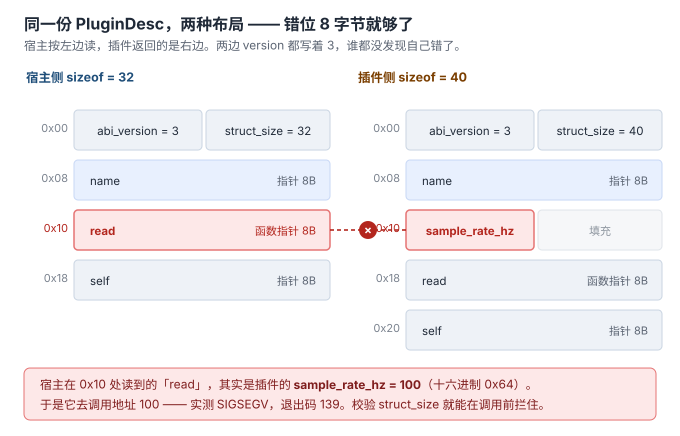
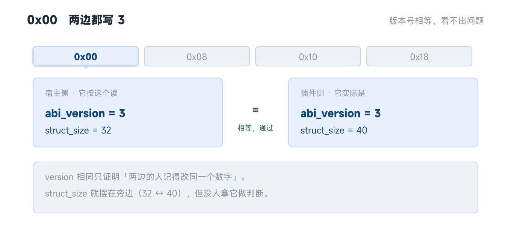

# A06 · 运行期插件工厂：`dlopen` / 导出宏 / ABI 双校验 / 卸载

> 追加专题。接 A02（`llvm::Registry`，链接期自注册）与 A04（内核 `initcall`，链接期段自注册）——
> 同一件事推到**运行期**，代价是开始出现 ABI 问题。
>
> 代码：[`code/A06_plugin/`](../code/A06_plugin/)（`bash build.sh` 一键复现全部四组实测）
> 实测环境：g++ 13.3 / libstdc++ / Linux x86_64（Itanium ABI）

## 0. 先分清三种「可插拔」

| 方式 | 谁决定装哪个 | 装配时机 | 有 ABI 问题吗 | 已在哪讲 |
|---|---|---|---|---|
| 链接期自注册（`llvm::Registry` / 内核 `initcall`） | 链接器（是否 `--whole-archive`） | 进程启动 | 无（同一个可执行文件） | A02 / A04 |
| **运行期 `dlopen`** | 配置文件 / 命令行 / 目录扫描 | **运行中** | **有** | **本节** |
| 独立进程 + IPC | 外部进程 | 任意 | 弱（跨进程只有线协议） | 不展开 |

一句话判据：

> **只有第二种，"工厂的返回值"会跨过一个「可能由不同编译单元、不同编译器版本、不同时间点编译」的边界。**

ABI 问题是这一步**带进来的新东西**，不是工厂模式本身的问题。

## 1. 协议：一个符号 + 一张 C 类型表

整个协议就是 [`code/A06_plugin/plugin_abi.h`](../code/A06_plugin/plugin_abi.h)，四十行：

```c
#define PLUGIN_ABI_VERSION 3u

typedef struct PluginDesc {
    uint32_t    abi_version;   /* 必须 == PLUGIN_ABI_VERSION          */
    uint32_t    struct_size;   /* 必须 == sizeof(PluginDesc) —— 第二道锁 */
    const char* name;
    int       (*read)(void* self);
    void*       self;
} PluginDesc;

typedef const PluginDesc* (*plugin_entry_fn)(uint32_t host_abi_version);
#define PLUGIN_ENTRY_SYMBOL "plugin_entry"
```

三条规则，缺一不可：

1. **只允许 C 类型。** 没有 `std::string`、没有虚函数、没有模板、没有异常跨边界。
2. **入口函数 `extern "C"`。** 因为 `dlsym` 是按字符串找的（实验 1）。
3. **入口收版本号、返回描述块，描述块里带 `struct_size`。**（实验 3）

宿主侧的装载流程（[`host.cpp`](../code/A06_plugin/host.cpp)）是四道门：

```mermaid
flowchart LR
    A["dlopen(path,<br/>RTLD_NOW｜RTLD_LOCAL)"] --> B["dlsym(h, \"plugin_entry\")"]
    B -->|"NULL"| X["拒绝：符号协议不通"]
    B --> C["entry(宿主 ABI 版本)"]
    C -->|"nullptr"| Y["拒绝：插件侧版本检查没过"]
    C --> D["检查 desc-&gt;abi_version"]
    D -->|"不等"| Z["拒绝：版本不符"]
    D --> E["检查 desc-&gt;struct_size"]
    E -->|"不等"| W["拒绝：布局不符"]
    E --> F["调用 desc-&gt;read(desc-&gt;self)"]
```

**四道门，一道都不能省。** 下面逐条给证据。

---

## 2. 实验 1：符号协议 —— 编译链接全过，只在 dlsym 时失败

同一份插件，只把入口函数的 `extern "C"` 去掉（[`plugin_mangled.cpp`](../code/A06_plugin/plugin_mangled.cpp)）：

```text
$ nm -D --defined-only libplugin_temp.so
0000000000001140 T plugin_entry

$ nm -D --defined-only libplugin_mangled.so
0000000000001110 T _Z12plugin_entryj        ← Itanium ABI 的名字修饰
```

```text
[host] dlsym("plugin_entry") ok -> 0x7204d9741140
[host] 校验通过 【version + struct_size 双校验】
[host] name=temp  read()=235
退出码=0

[host] dlsym("plugin_entry") 失败: ./libplugin_mangled.so: undefined symbol: plugin_entry
退出码=1
```

**这条坑危险在失败发生得极晚**：编译过、链接过、`.so` 正常生成、`dlopen` 也成功，只有最后一步按名字找符号时才失败。而报错文案 `undefined symbol` 长得像"链接期问题"、`dlopen 失败` 又长得像"路径错了"——实际是两个 `.so` 都在、都是好的、**只是名字对不上**。

> **判据：插件入口必须 `extern "C"`，整个入口层不许出现 C++ 类型。**
> 一旦入口签名里写了 `std::string`，即使加了 `extern "C"`，不同 libstdc++ 版本之间也会因为 `std::string` 布局不同而炸。

---

## 3. 实验 2：导出宏不是洁癖，是在划接口边界

[`plugin_temp.cpp`](../code/A06_plugin/plugin_temp.cpp) 里除了入口，还有三个"外部链接的实现细节"（真实插件里到处都是）：

| 构建方式 | `-O2` 导出符号数 | `-O0` 导出符号数 |
|---|---|---|
| `-fvisibility=hidden` + 导出宏 | **1** | **1** |
| 默认可见性 | 3 | 4 |

`-O0` 默认可见性下究竟导出了什么：

```text
00000000000011f9 W _Z19plugin_internal_maxIiET_S0_S0_   ← 模板实例化（weak 符号）
0000000000001159 T _Z20plugin_internal_gainv            ← 实现细节
0000000000001168 T _Z21plugin_internal_clampii          ← 实现细节
00000000000011d8 T plugin_entry                         ← 唯一该导出的
```

（表里 3 和 4 的差别是模板实例化：`-O2` 把它内联掉了，就不再有 weak 符号。所以**优化级别越低，泄漏越多**。）

**为什么这不是洁癖**，两条实打实的后果：

- **符号抢占（interposition）**：宿主进程里另一个 `.so` 定义了同名符号，谁先加载谁生效。插件的内部函数可能被别人的同名函数顶掉——这是最难查的一类 bug。
- **内部实现变成事实上的公开 ABI**：想改名、内联、删除，就会破坏已有第三方插件。

这正是 A02 里 `llvm::Registry` 那段"明确禁止重构"注释在防的东西。

> **做法：插件一律 `-fvisibility=hidden`，只把入口（和真想公开的符号）标 `PLUGIN_EXPORT`。**
> 注意 `-fvisibility=hidden` 也要加在宿主和静态库上——它防的是**所有**符号泄漏，不只防插件。

---

## 4. 实验 3：版本号是约定，`struct_size` 是机制

先看宿主侧布局（`host sizes`）：

```text
宿主侧 sizeof(PluginDesc) = 32
  offsetof(abi_version) = 0
  offsetof(struct_size) = 4
  offsetof(name)        = 8
  offsetof(read)        = 16
  offsetof(self)        = 24
```

现在让插件"演化"：在 `name` 后面插一个 `sample_rate_hz`，**但忘了改版本号**。
插件那份布局是 40 字节，`read` 被整体后移 8 字节：



宿主不是一步就崩的 —— 它按自己的字段表从 `0x00` 往下走，前两格恰好对齐，走到 `0x10` 才撞上错位。这个过程慢放一遍：



> 动图看**过程**（5 拍，偏移刻度逐格推进）；上面那张静图看**并置差异**。
> 两张图分工不同，配色共用同一套常量 —— `code/A06_plugin/make_a06_abi.py`。

三组实测（同一份漂移插件，宿主两种校验方式）：

| # | 输入 | 宿主校验 | 实测结果 |
|---|---|---|---|
| **3a** | 布局漂移 + 版本号**没改** | version + `struct_size` | `struct_size 不匹配（40 != 32）-> 拒绝`，退出码 1 ✅ |
| **3b** | **完全同上** | 只校验 version | 校验通过 → 读到 `read=0x64` → **SIGSEGV，退出码 139** ❌ |
| **3c** | 布局漂移 + 版本号**已改**（4） | version + `struct_size` | 插件自己拒绝（它那侧版本检查没过），退出码 1 ✅ |

3b 的关键三行：

```text
[host] 校验通过 【*** 只校验 version ***】
[host] 按宿主布局读到: read=0x64  self=0x74c50a5f2100
Segmentation fault (core dumped)
```

`0x64` = 十进制 **100** —— 正是插件里 `sample_rate_hz` 的值。宿主把这个 32 位整数当成 8 字节函数指针去调用，跳到地址 100，段错误。

**三个结论：**

1. **只校验版本号 = 把正确性押在"人记得改版本号"上。** 3b 里插件作者忘了改，宿主毫无察觉，直接崩在调用点。
2. **`struct_size` 是机制**：它不依赖任何人记得什么，宿主一算就知道布局对不对。**改动成本一行**（`sizeof(PluginDesc)` 本来就是常量，不用手写）。
3. 版本号和 `struct_size` 管的是**两件不同的事**，要一起用：
   - **版本号管语义**——尺寸没变但含义变了（比如 `self` 从"插件私有数据"变成"注册表句柄"）；
   - **`struct_size` 管布局**——字段增删改序，只要尺寸或偏移变了就拦得住。

> 更狠的做法是再加一个 **magic 值**，并把 `size` 放在**第一个字段**——这样后加的字段能被老宿主安全忽略。那就是 COM 那一套了（`IClassFactory` / `QueryInterface`），超出本节范围。

---

## 5. 实验 4：卸载 —— 对象生命周期被库的生命周期卡住了

```text
--- 4a dlclose 之后继续用 ---
[host] 卸载前: name=temp  read()=235  desc@0x7c17a535ee40
[host] dlclose 完成（flags=RTLD_NOW）
[host] 先只打印指针值（不访问内存）: desc=0x7c17a535ee40
[host] 再一次调用 d->read(d->self) ...
Segmentation fault (core dumped)
退出码=139

--- 4b 改用 RTLD_NODELETE ---
[host] dlclose 完成（flags=RTLD_NOW|RTLD_NODELETE）
[host] 再一次调用 d->read(d->self) ...
[host] read() = 235  <-- 没崩就说明代码段还在
退出码=0
```

**这里有一处容易看反的地方**：4a 的 `desc` 指针**没有被 `dlclose` 改动**（前后两次打印同一个地址），`dlopen`/`dlclose` 也不会去改你的指针。变的是**那个地址背后的页被解除映射了**——对象本身如果在堆上就还在，但描述块和 `read` 的代码都在 `.so` 的段里，已经没了。

`RTLD_NODELETE`（4b）让它不崩，但它**不是修复**：只是让 `dlclose` 不再真正卸载。库还占着内存、静态对象还活着、`atexit` 还挂着。**它把"生命周期错配"换成了"内存泄漏"**，只是把崩溃变成不崩溃。

真正的约束只有一条：

> **宿主的任何指针都不允许活过 `dlclose`。库的生命周期必须包含它造出来的所有对象的生命周期。**

这条落在工厂设计上，就是 A03 那个"工厂即容器"形态（`TopicProxyFactory`）在运行期的必然版本——**插件工厂必须提供 `destroy`，宿主必须在 `dlclose` 前把对象全部归还**。
对应到第 7 节（[`07-工厂接口契约.md`](07-工厂接口契约.md)）讲的所有权契约：**`dlclose` 就是那个"必须配对销毁"的硬截止点。**

---

## 6. 实验 5：跨 `.so` 的 RTTI —— 流传的说法在这台机器上不成立

先给结论：

> **「跨动态库不能用 `dynamic_cast`」这句话，在 GCC / libstdc++ / Itanium ABI 上是错的。**
> 它是 **Windows / MSVC** 的经验（每个模块各有一份 typeinfo，且不做名字回退）。

实测（宿主与插件各有一份 `TempSensor` 定义，对象在插件的 `.so` 里 `new` 出来交给宿主）：

| | 插件默认可见性 | 插件 `-fvisibility=hidden` |
|---|---|---|
| 虚调用 `s->read()` | 42 | 42 |
| `dynamic_cast<TempSensor*>(s)` | **成功** | **成功** |
| `typeid(*s) == typeid(TempSensor)` | **true** | **true** |
| `&typeid(*s)` vs `&typeid(TempSensor)` | **地址不同** | **地址不同** |

注意最后一行——**两份 typeinfo 的地址确实不一样**（`0x75d817889dc0` vs `0x6296a9ed3d68`），但比较仍然相等。

原因是 Itanium ABI 下 typeinfo 的名字是唯一的 C 字符串，**libstdc++ 的 `type_info` 相等比较在指针不相同时会退回按名字比较**。所以 `-fvisibility=hidden` 藏掉了 typeinfo 符号，却没能让比较失败。

**但 Linux 上真正会崩的那条在别处**（5c）：

```text
[rtti] dlclose 完成，宿主手里还攥着那个 Sensor*
[rtti] 卸载后 typeid(*s).name() ...
Segmentation fault (core dumped)
退出码=139
```

**`typeid(*s)` 要从对象的 vptr 里读 typeinfo 指针，而 vptr 指向插件的数据段**——库一卸载，取 typeid 本身就是越界访问。这跟实验 4 是同一个病：**不是 RTTI 跨不了边界，是对象活得比库长。**

所以真实约束是两条：

1. **别拿"跨 `.so` 禁 RTTI"当铁律。** 在 Linux/GCC 上它会误导你——你会以为躲开 `dynamic_cast` 就安全了，其实两件事无关。
2. **真正不能跨的是"库的加载边界"。** 任何指向插件内存的指针（vptr、typeinfo、函数指针、字符串字面量）在 `dlclose` 之后都作废。而且名字回退依赖运行时实现，**换到 MSVC 就是另一种行为**——所以它也不构成可移植设计的基础。

---

## 7. 三种注册时机放在一起看

| | A02 `llvm::Registry` | A04 内核 `initcall` | **本节 `dlopen`** |
|---|---|---|---|
| 注册动作发生在 | 静态对象构造（`main` 之前） | 内核启动早期 | **`dlopen` 那一行** |
| 由谁触发 | 链接器保证 `.o` 被拉入 | 链接脚本排段 | **宿主主动调** |
| 加一个新实现要改什么 | 加文件（**装配点仍要改**） | 加文件（连装配点都不用改） | **加文件 + 放进插件目录** |
| 不重编宿主能否加载 | 不能 | 不能 | **能** |
| 新增的代价 | 无 | 无 | **ABI 契约 + 卸载纪律** |
| 典型场景 | JIT / 后端注册 | 驱动探测 | ROS2 `pluginlib` / DDS 传输插件 / 数据库引擎 |

**这张表的读法**：从 A02 到 A04 到本节，每往右一列就多买一点"改动面更小"，也就多付一层契约成本。**运行期插件是这条线上最贵的一档**——它买的是"不重编宿主就能加载"，付的就是本节这四个实验。

---

## 8. 落到你的场景

**rpc 那条线要加传输插件，用到的就是这一节的全部内容。** 顺序建议：

1. **先定契约。** 一个 `extern "C"` 入口 + 一个 C 结构体（带 `abi_version` + `struct_size`）。
   **这两个字段要写进第一版，哪怕一开始只有一种传输**——后加等于做一次 ABI 破坏。
2. **导出宏从第一天就用**：`-fvisibility=hidden` + `PLUGIN_EXPORT`。等有第三方插件再补，代价是那时候已经有一批符号被别人依赖了。
3. **插件工厂必须带 `destroy`。** 见 [`07-工厂接口契约.md`](07-工厂接口契约.md)。在运行期插件里这条不是"好习惯"，是**唯一**能避免实验 4 的方式。
4. **`dlclose` 想清楚再调。** 要么严格"归还全部对象后再卸"，要么就用 `RTLD_NODELETE` 并承认它是一次有意的内存泄漏。**别在没想清楚时默认调用 `dlclose`。**
5. **别为了躲 RTTI 而重构。** Linux 上没必要（实验 5）。要躲的是"对象活得比库长"。

**一个反向参照**：Fast-DDS 的传输层是运行期多态 + 工厂，但它是**同一个 `.so` 内的工厂**（见 A03），不走 `dlopen`——所以它完全不需要这套 ABI 契约。
⇒ **先判断你到底需不需要"不重编宿主就能加载"；不需要就别上这一档。** 这也是第 6 节判据在运行期的版本。

---

## 9. 一句话总结

> 运行期插件工厂买的是「**不重编宿主就能加载**」，代价是三样东西：
> **① 符号协议**（`extern "C"` + 导出宏）——
> **② ABI 双校验**（`version` 管语义，`struct_size` 管布局）——
> **③ 生命周期纪律**（宿主指针不得活过 `dlclose`）。
>
> 前两样编译器和链接器都替你查不了，第三样要到运行期才崩。
> **三条都只能在写第一版时就定好。**

---

## 复现与代码清单

```bash
bash code/A06_plugin/build.sh
```

| 文件 | 作用 |
|---|---|
| [`plugin_abi.h`](../code/A06_plugin/plugin_abi.h) | 契约头（宿主与插件共用）：版本号 / 导出宏 / `PluginDesc` / 入口符号名 |
| [`plugin_temp.cpp`](../code/A06_plugin/plugin_temp.cpp) | 正常插件 A；含三个外部链接的实现细节，用于实验 2 的对照 |
| [`plugin_pressure.cpp`](../code/A06_plugin/plugin_pressure.cpp) | 正常插件 B：证明加插件不用改宿主 |
| [`plugin_mangled.cpp`](../code/A06_plugin/plugin_mangled.cpp) | **反例 1**：入口忘了 `extern "C"` |
| [`plugin_abi_drifted.cpp`](../code/A06_plugin/plugin_abi_drifted.cpp) | **反例 2**：布局漂移；`-DABI_BUMP` 编出"记得改版本号"的版本 |
| [`host.cpp`](../code/A06_plugin/host.cpp) | 宿主：`sizes` / `load` / `version-only` / `unload-use` / `unload-nodelete` |
| [`rtti_iface.h`](../code/A06_plugin/rtti_iface.h)、[`rtti_plugin.cpp`](../code/A06_plugin/rtti_plugin.cpp)、[`rtti_host.cpp`](../code/A06_plugin/rtti_host.cpp) | 实验 5：跨 `.so` 的 `dynamic_cast` / `typeid` / 卸载后访问 |
| [`build.sh`](../code/A06_plugin/build.sh) | 一键编译全部 `.so` 并跑完五组实验（含预期崩溃的两次） |
