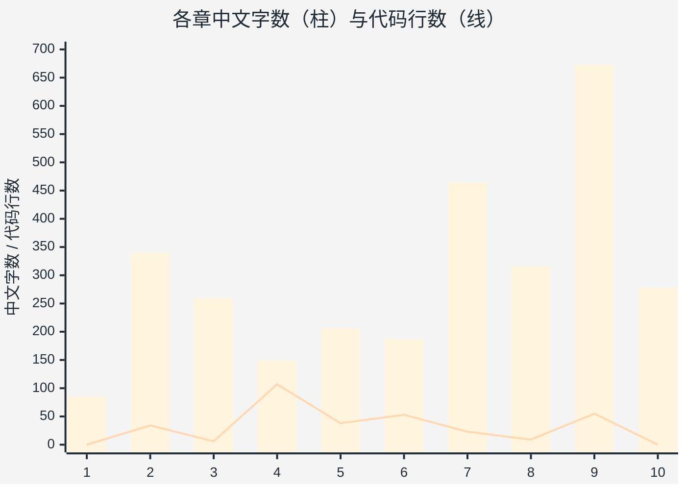
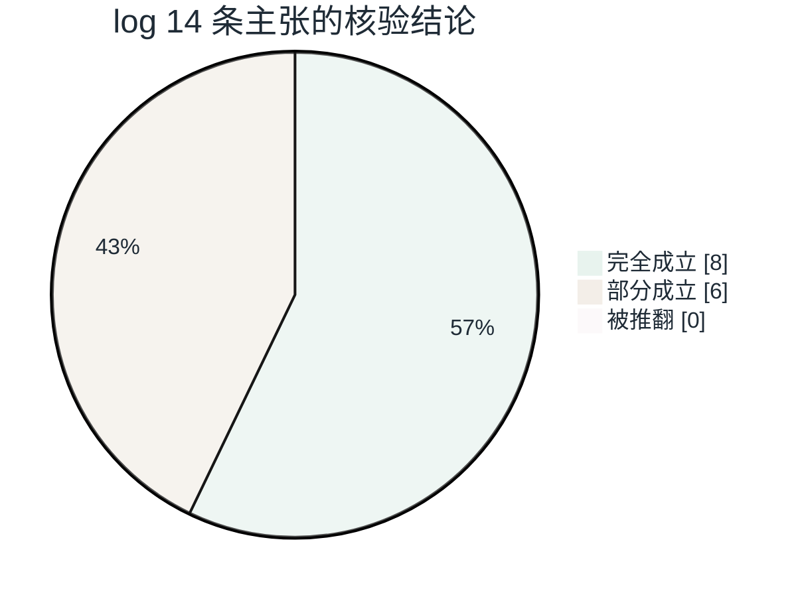
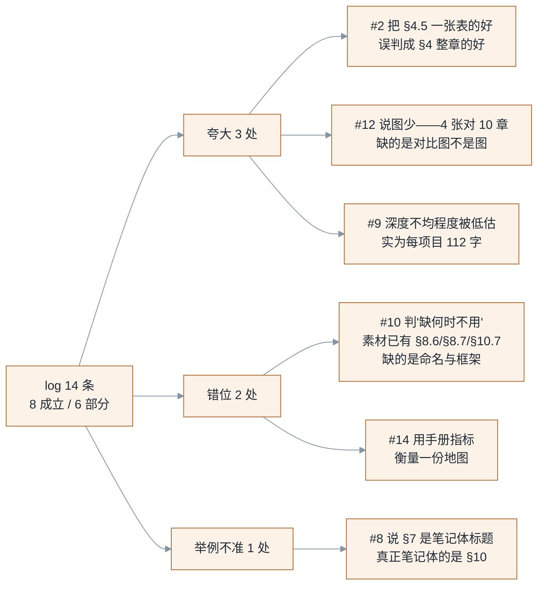
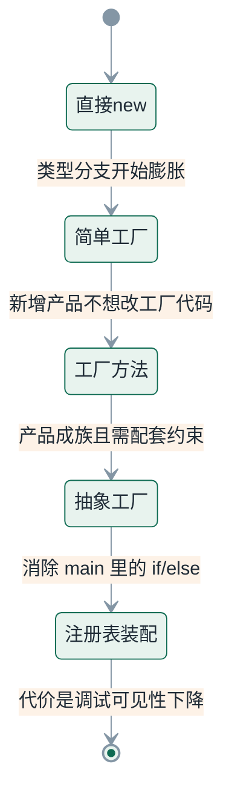
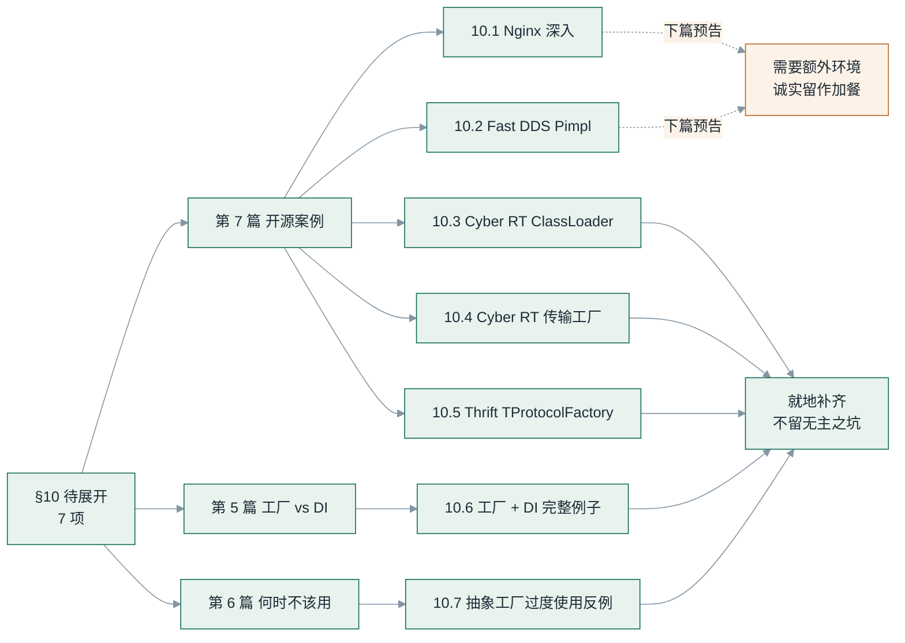
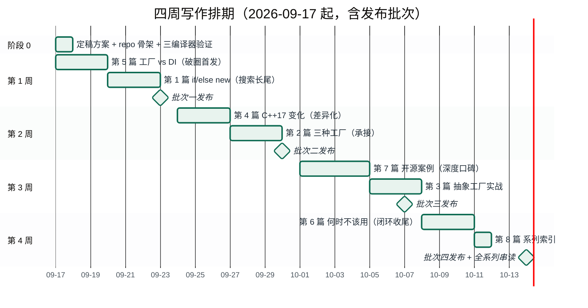
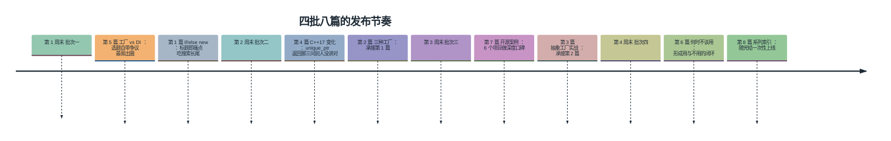

# 《C++ 工厂模式》Blog 系列：章节结构与执行计划

> **输入**：`../refs/工厂模式.md`（素材库 v1.0）× `../refs/工厂模式修改建议.log`（评审意见 v1）
> **方法**：两份文档各自独立读一遍 → 把 log 的每条主张回到 source 精确到小节号核验 → 反向审视 log 自身 → 用源文档的量化指标给结论定性 → 重组章节 → 出计划表
> **输出**：本文件 + `系列路线图.md`（13 张 Mermaid 图集，同目录）
> **版本**：v1.0 ｜ **日期**：2026-09-16

---

## 一、先量化，再判断

任何"要不要拆、拆几篇、缺口多大"的判断，都应该建立在源文档到底有多少东西之上。实测：

| 指标 | `工厂模式.md` | `工厂模式修改建议.log` |
|---|---|---|
| 体积 / 行数 | 27,406 B / 973 行 | 5,370 B / 116 行 |
| **中文字数** | **3,309** | **1,382** |
| 章节（h2） / 小节（h3） | 12 / 51 | 0 / 0 |
| 代码块 / 代码行数 | **34 块 / 343 行** | 0 / 0 |
| 其中含 `int main` | **1 块** | — |
| 其中含 `#include` | **3 块** | — |
| 最长单块 | 49 行 | — |
| Mermaid 图 | 4 张 | 0 张 |
| 表格行 | 78 行 | 0 行 |
| 状态标记 | ✅31 ⏸️9 ⬜1 | — |

三个反直觉的结论，log 和对照版都没有点出来：

**① 说"内容密度大"不准确——密度大的是代码，不是论述。**
27 KB 的体积里只有 3,309 个中文字，平均每 97 个中文字配 1 个代码块。把它当成一篇"长文"来讨论要不要拆，前提就错了：它不是长文，它是一份**带注释的代码标本集**。读者感到"信息量大"，来自 34 段代码的视觉压迫，不是来自论述的复杂度。

**② "缺可运行代码"不是缺，是碎。**
34 个代码块、343 行，但只有 1 块含 `int main`（§6.1）、3 块含 `#include`（§2.4、§4.1 等），最长单块 49 行，平均 10 行。也就是说：**全文没有一个可以独立编译的编译单元**。正确的表述是"代码碎片化、零可编译"，而不是"代码少"。这个区别决定了补做方式——不是"多写点代码"，而是"把现成的 34 块合并成 7 个能 `cmake && ./run` 的工程"。

**③ log 自己是"零图零表纯文本"，却给出"图表化"这条建议。**
log 全文 0 表格、0 标题、0 图，1,382 字纯段落。这不影响建议的正确性，但说明它给的是**读者视角的直觉**，不是结构化诊断。凡是这类直觉，都必须回源核验——见下一节。

### 论述量与代码量的倒挂

把 10 章的数字并排，能看到一个很清楚的错位——**柱子是论述，折线是代码**：



§4 是全场最极端的倒挂（149 字配 107 行代码）；§10 那张 278 字的"待展开清单"，比 §3、§4、§5、§6 任何一章的论述都长——**将来要写什么，比已经写了什么更占篇幅**。

### 由此得到的最重要一个数：存量覆盖率

如果接受"7 篇正文、每篇 3,000–4,000 字"的规模，全系列需要 **21,000–28,000 字**。存量 3,309 字，**覆盖率约 13%**。

> **这份计划的真实性质，不是"把 27 KB 拆成 7 份"，而是"用 13% 的存量撬动 87% 的新写"。**
>
> 所以 log 的"拆成系列"这条建议，字面上是"拆"，实质上是"重写 + 扩容"。计划表必须按**写作计划**来排（每篇要新写多少、写什么、工时多少），而不是按**拆分计划**来排（切哪几段）。这是本方案与 log、与对照版最大的方法论差异。

---

## 二、交叉验证：log 的每条主张回源核验

log 一共给出 6 条价值主张、7 条不足、4 条能力边界。逐条回源，判定如下（证据精确到小节号）：

| # | log 的主张 | source 中的证据（精确到节） | 判定 |
|---|---|---|---|
| 1 | 问题驱动叙事有价值 | §2.1 四个问题清单 + §2.3 构造变化案例 + §2.4 编译依赖案例，该章 340 字 / 7 个代码块 | ✅ 成立 |
| 2 | 三工厂同场景对比好 | §4.1–4.5：同一 Logger 场景三种写法 + §4.5 一屏对比表（7 行 4 列） | ⚠️ **部分成立**：§4 全章**仅 149 个中文字**，占全章 90% 的是代码。所谓"对比好"其实只有 §4.5 那张表在起作用，**没有任何一句"什么时候该选哪个"的论述**。log 把"表好"误判成了"章好" |
| 3 | C++17 变化清单是教科书没有的 | §7.1–7.8：6 个变化 + §7.8 变化总表，该章 464 字（全文第二密） | ✅ 成立，证据比 log 描述的更足 |
| 4 | 工厂 vs DI 边界最有工程价值 | §8.1–8.7：职责分工 + §8.2 七行职责表 + §8.5 三条判断标准 + §8.7 正确配合例 | ✅ 成立，全文辨识度最高处 |
| 5 | 开源案例有对照价值 | §9.1–9.7，共 **6 个项目**：Fast DDS / OpenCog / Cyber RT / gRPC / Thrift / Nginx | ✅ 成立，**但 log 只列了 4 个**（漏 OpenCog、gRPC），低估了素材 |
| 6 | 待展开标记设计好 | §10 共 7 项，全部标 ⏸️ | ✅ 成立，**但 log 没做归属映射**——标了不认领，等于没标 |
| 7 | 主线不清，BFS / DFS 混织 | 文档头自述"按 BFS 与 DFS 两种路径组织"，§10 即 DFS 待展开栈 | ✅ 成立 |
| 8 | 章节标题偏"笔记体"，如"变化一、变化二" | §7.1–7.7 的标题形如"变化一：返回类型从裸指针变成智能指针" | ⚠️ **部分成立，但举例不准**：§7 的标题带了具体内容，只是编号在前；真正笔记体的是 §10 的"10.1 / 10.2 / 10.3"。建议改 §10，不必改 §7 |
| 9 | 案例深度不均：Cyber RT 比 Fast DDS 深，Thrift 只有骨架 | §9.3 有 mermaid 时序图 + 6 行要素对齐表；§9.2 OpenCog 仅 1 段骨架；§9.5 Thrift 无代码，仅 4 行文字 | ✅ 成立，且**比 log 说的更严重**：§9 全章 673 字要塞 6 个项目，平均每项目 112 字 |
| 10 | 缺少"什么时候不该用工厂" | §8.6 已有"过度设计的信号"4 条；§8.7 有正确配合例；§10.7 有"抽象工厂被过度使用的反例" | ⚠️ **部分不成立**：素材在，缺的只是**命名与框架化**。§8.6 那 4 条被埋在 DI 章中间、无案例、无展开。不是"从零补"，是"归拢 + 命名 + 配案例" |
| 11 | 缺少可运行代码 | 34 个代码块中仅 1 块含 `int main`、3 块含 `#include`，平均 10 行/块 | ✅ 成立，**实际比 log 说的严重**（见第一节②） |
| 12 | Mermaid 图偏少 | 全文 4 张：§3.2 层次图、§6.2 组合根图、§9.3 创建时序图、附录路径图 | ⚠️ **部分成立**：4 张对应 10 章不算离谱。真正的缺口不是"数量少"，而是**缺对比类图**——三种工厂的演化关系和 naive vs factory 的依赖变化，都没有图 |
| 13 | 没有"踩坑清单" | §7.5 列了 3 个坑（静态初始化顺序 / 链接器丢弃未引用 `.cpp` / 调试可见性），是并列陈述、未成表 | ✅ 成立 |
| 14 | 没讲测试 / 异常安全 / 线程安全 / ABI | 全文无相关章节 | ⚠️ 成立，**但诉求错位**：这是"生产级手册"的验收项，log 自己在第三节也承认这份素材是"进阶地图"。正确做法是**开篇声明边界**，不是把系列硬撑成手册 |

**核验小结**：14 条判断中，**8 条完全成立、6 条部分成立、0 条被推翻**。log 的诊断方向是准的，问题集中在三类：

- **夸大 3 处**：#2（把一张表的好评成了整章）、#9（深度不均的程度被低估而非夸大——实为每项目 112 字）、#12（4 张图对 10 章不算"少"，缺的是对比图不是图）。
- **错位 2 处**：#10（素材已有，被判成"缺失"）、#14（用手册指标衡量地图）。
- **举例不准 1 处**：#8（§10 才是笔记体，§7 不是）。



六条"部分成立"并不是六种毛病，归拢起来只有三类：




---

## 三、反向审视：log 自身的 4 个问题

辩证阅读的另一半——评审意见也需要被评审。

**问题一：漏判了两个 source 亮点，而且是最不该漏的两个。**

1. **§7.2 `unique_ptr` 返回机制**。source 已把最容易被讲错的地方讲对了三句话：靠 `unique_ptr` 的**模板转换构造函数 + 向上转型**；`return` 局部 `unique_ptr` 时编译器**自动隐式移动，不必写 `std::move`**；**完美转发（`std::forward`）在这里不参与**。中文技术博客讲到这一步的极少，多数会顺手写成"这里会发生移动语义/完美转发"。这是差异化资产，log 的价值清单里一条没提。
2. **§9.6 Nginx（C 语言工厂变体）**。用函数指针结构体 `ngx_event_actions_t` 当"抽象接口"，用初始化时的一次赋值 `ngx_event_actions = ngx_epoll_module_ctx.actions;` 完成"把创建决策推迟到运行时"，并且 source 给出了与 Cyber RT 的五行对照。这是**全系列唯一的跨语言视角**——它证明工厂模式不依赖类和继承。log 只在案例清单里一笔带过。

**问题二：拆分方案自身不自洽。**
log 建议拆 5 篇，但它自己列的篇目里，《简单工厂、工厂方法、抽象工厂：不是三个并列模式》一篇要吞下 §3 + §4 + §5 + §6 共 4 章，反而变成全系列最长的一篇——与它同一份文档里"掘金读者对长文的耐心有限"直接矛盾。同时 **§6（组合根 / 注册表 / 装配）在 5 篇里没有归属**：它讲的是装配而不是层次关系，塞进第 2 篇会臃肿，塞进第 4 篇（C++17 变化）会主题错位。

**问题三："每篇加一个完整可运行例子"的成本被低估。**
5 篇独立例子 = 5 个独立 `main` + 5 套脚手架，读者要在工程之间来回跳，作者要维护 5 份重复的 `Logger`/`Payment` 定义。应改为**共享一个 repo，逐篇增量提交**：第 1 篇建骨架和 CMake，之后每篇只增加 `NN_xxx/main.cpp`。

**问题四：一边把"缺测试/线程安全/ABI"列为不足，一边结论说这是"进阶地图"。**
这两句在 log 内部互相抵消。正确做法是**在系列开篇显式声明边界**（"本系列讲创建与装配的职责划分，不覆盖线程安全与 ABI；测试只演示替换，不展开策略"），把"不覆盖"变成一种承诺，而不是一种缺陷。声明边界比补齐边界便宜得多，也更诚实。

---

## 四、source 里被两份文档同时低估的 3 处

除了 log 漏掉的 §7.2 与 §9.6，还有一处**连对照版也没抓到**：

**§6.4 的取舍表，是全文工程价值最高的表，却从未被任何评审提及。**

| 方案 | 具体类出现在哪 | 新增平台要改哪 | 复杂度 |
|---|---|---|---|
| 直接 new | 每个业务函数 | 所有业务函数 | 低 |
| 简单工厂 | 一个工厂类 | 工厂类 | 低 |
| 抽象工厂 + main 判断 | main | main + 新工厂类 | 中 |
| 抽象工厂 + 注册表 | 各工厂 `.cpp` | 只加新 `.cpp` | 高 |

这张表用"具体类出现在哪"一个维度，把四种方案的代价说清楚了。它和 §4.5 的对比表是两种不同的表：**§4.5 讲模式之间怎么演化，§6.4 讲工程上怎么选**。而 §4.5 恰恰缺"何时选哪个"这一列——把 §6.4 的判断维度补进 §4.5，是整个系列最划算的一处改动。

**另外两处需要修正的源文档硬伤（写作时必须修掉）：**

- **§6.1 的 `config.platform` 从未定义**，代码块直接使用了一个不存在的对象。这是"碎片化"的直接后果，第 3 篇必须补全为可编译版本。
- **§3.1 表格的"出身"列口径不一**：简单工厂写"非正式模式 / programming idiom"，另外两个写"GoF 正式模式"。这是对的，但第 2 篇要把 GoF 原文只承认两个的这一点讲透，否则读者仍会以为三家并列。

---

## 五、重组后的章节结构：7 篇正文 + 1 篇索引

**系列名**：《C++ 工厂模式：从 if/else 到架构边界》
**主线**：为什么需要 → 怎么选 → 现在怎么写 → 边界在哪（DI / 何时不用）→ 真实世界长什么样
**受众**：2–5 年 C++ 工程师（会写类、用过多态，但说不清工厂和 DI 的分工）
**平台**：掘金为主，知乎 / 公众号同步
**篇号 = 阅读顺序**，发布顺序见 §7.4

> **一处与对照版的明确分歧：不写独立"导读"篇。**
>
> 导读文在掘金属于低转化内容——它没有可被搜索命中的痛点标题，读者不点，算法也不推。把"本系列是进阶地图不是手册"这句边界声明**放进第 1 篇的开头**，反而能筛掉错误受众、提高完读率；系列目录则做成一篇**纯索引**（只有路线图和链接，1 屏以内），在系列结束后一次性上线，成本几乎为零。

全系列六段主线：


### 第 1 篇（2,500–3,500 字）《为什么你的 C++ 代码里到处都是 if/else new》｜P0

- **一句话**：直接 `new` 的四个问题 → 工厂的诞生
- **承接素材**：§1（85 字，需几乎全新写）、§2.1–2.4（340 字）
- **论证链**：类型分支膨胀 → 调用方认识所有具体类 → 构造变化波及所有调用点（§2.3 两个版本：构造签名变化 / 初始化步骤分散）→ 编译依赖变重（§2.4 对比表）
- **必须新增**：naive 版与 factory 版的**最小可编译对照**（同一 `main`、同一输出、`diff` 只有一处）；系列边界声明（放章首）
- **图**：before / after 依赖关系图（新增，替换附录那张"讨论路径图"）
- **缺口**：3,400 字新写，存量 425 字

### 第 2 篇（3,000–4,000 字）《简单工厂、工厂方法、抽象工厂：不是三个并列模式》｜P1

- **一句话**：GoF 只承认两个，简单工厂是 idiom；三者是一条演化线上的三个点
- **承接素材**：§3.1–3.3（259 字）、§4.1–4.5（149 字）
- **核心论点**：抽象工厂 = 多个工厂方法 + **产品族配套约束**，不是"工厂方法的集合"
- **必须新增**：同一 Logger 场景三份**可编译**代码；§4.5 对比表**补一列"何时选哪个"**，并把 §6.4 的四方案取舍并进来
- **图**：三工厂演化关系图（沿用 §3.2 并扩写：标注每条演化边解决什么问题、付出什么代价）
- **缺口**：3,500 字新写，存量 408 字

### 第 3 篇（3,000–4,000 字）《抽象工厂实战：产品族、组合根与自注册》｜P2

- **一句话**：产品族一致性 → 组合根 → 注册表消除 if/else → 代价是什么
- **承接素材**：§5.1–5.6（206 字）、§6.1–6.4（187 字）
- **核心论点**：抽象工厂不承诺消灭对具体类的引用，只承诺把引用**限制在组合根**（§6.2 与 §6.4 的"具体类出现在哪"一列是同一个论点的两种表达）
- **必须新增**：支付渠道**完整可运行 demo**（`PaymentFactoryRegistry` + 自注册 + 修掉 §6.1 未定义的 `config.platform`）；§5.5 的汽车/餐厅类比压缩到 3 行
- **图**：组合根结构图（沿用 §6.2）+ 注册表创建时序图（新增）
- **缺口**：3,600 字新写，存量 393 字

### 第 4 篇（3,500–4,500 字）《C++17 之后，工厂模式发生了哪些变化》｜P0

- **一句话**：6 个变化 + 1 张踩坑清单
- **承接素材**：§7.1–7.8（464 字，全系列存量最厚的一篇）
- **核心论点**：运行时多态仍是默认；模板工厂 / 编译期工厂是**局部优化，不是替代**
- **必须新增**：**§7.2 独立成节**，正面回答三问——怎么转型（模板转换构造函数 + 向上转型）、要不要写 `std::move`（不要，`return` 局部变量自动隐式移动）、`std::forward` 参不参与（不参与）；**踩坑清单表**（静态初始化顺序 / 链接器丢弃未引用 `.cpp` / `unique_ptr` 转换构造 / 自注册的调试可见性）
- **图**：C++17 前后变化总表（沿用 §7.8）
- **缺口**：3,500 字新写，存量 464 字（存量覆盖率最高，约 12%，仍以新写为主）

### 第 5 篇（2,500–3,500 字）《工厂和依赖注入，到底谁管什么》｜P0 ｜**建议破圈首发**

- **一句话**：工厂答"`new` 哪个、怎么 `new`"；DI 答"谁需要它、怎么给它"
- **承接素材**：§8.1–8.7（315 字）+ 就地补齐 §10.6
- **核心论点**：服务定位 ≠ 依赖注入（§8.4）；组合根同时使用工厂和 DI（§8.7）
- **必须新增**：`§10.6` 完整例子——组合根 + 工厂 + DI + **单元测试里替换实现**（测试只做这一件事，正好呼应边界声明）
- **图**：职责对比表（沿用 §8.2 七行表）
- **备注**：选题是高频困惑点，标题自带争议感，最易出圈
- **缺口**：3,000 字新写，存量 315 字

### 第 6 篇（2,000–3,000 字）《什么时候不该用工厂：过度设计的信号》｜P2

- **一句话**：只讲怎么用、不讲何时不用，就是误导
- **承接素材**：§8.6（4 条信号）、§8.7 + 就地补齐 §10.7
- **核心论点**：没有选择逻辑的 `make_unique<T>()` 不是工厂；一个实现配一个 DI 容器就是过度设计
- **必须新增**：§10.7 正反案例对照（该用 vs 不该用，各一个可编译例子）；把 §8.6 那 4 条从 DI 章里**提出来命名并配例**
- **图**：决策树（新增：先问有没有多个实现 → 再问选择时机 → 再问产品是否成族）
- **风险**：篇幅紧张时可并入第 5 篇作尾部小节；但**不建议**——"何时不用"单独成篇的说服力远大于作附注
- **缺口**：2,500 字新写，存量 60 字（关键素材在源文档中仅 4 条 bullet，几乎全新写）

### 第 7 篇（4,000–5,000 字）《从 Fast DDS 到 Nginx：开源项目里的工厂模式》｜P1

- **一句话**：6 个真实项目，看模式在不同层次的形态与克制
- **承接素材**：§9.1–9.7（673 字，全系列存量最厚的章）+ §10.1–10.5
- **核心论点**：**生产级项目对工厂是克制的**——Fast DDS 只用最简单的一种（单例 + 集中创建，无多态替换、无自注册），到 Cyber RT 才上自注册 + 动态库加载
- **结构**：按形态复杂度排序（简单工厂 → 工厂方法接口 → 工厂方法 + 自注册 → 抽象工厂 → 纯 C 变体），**以 §9.6 Nginx 压轴**——它证明"没有类和继承也能做工厂"，是全系列最反直觉的收尾
- **必须新增**：补深度——Thrift 从骨架补到"协议族配套一致性的具体体现"（§10.5）、Cyber RT 补 `ClassLoader` 引用计数机制（§10.3）；OpenCog 与 gRPC 定位为"骨架 / 最小接口"的**对照组**，明确说明它们为什么简单
- **图**：Cyber RT 创建时序图（沿用 §9.3）+ 案例对比总表（沿用 §9.7）
- **风险**：存量 673 字摊 6 个项目 = 每项目 112 字，是本系列最重的一篇。见 §7.7 风险表。
- **缺口**：4,500 字新写，存量 673 字

### 第 8 篇（纯索引，1 屏）《C++ 工厂模式系列：目录与阅读路径》｜P2

- **一句话**：路线图 + 8 篇链接 + 边界声明，不做内容
- **承接素材**：全文定位
- **上线时机**：第 7 篇发布后（系列完结时一次性上线）
- **成本**：约 0.5 小时

### 系列级约束（贯穿全部篇章）

1. **共享一个可编译 repo**：第 1 篇建骨架与 CMake，之后每篇只增 `NN_xxx/main.cpp`，`cmake -B build && cmake --build build && ctest` 一键跑通。
2. **开篇声明边界**（放第 1 篇章首）：本系列讲创建与装配的职责划分，**不覆盖**线程安全、异常安全、ABI 兼容；测试只演示"替换实现"，不展开测试策略。
3. **每篇结尾做下篇预告**：§10 待展开项按第六节映射挂账，不留无归属的坑。
4. **每篇图 ≥ 1 张**，且优先补**对比类图**（演化关系、依赖变化、决策树），而非再补结构图。
5. **所有代码必须能编译**：文中代码块与 repo 中的文件同名同序，读者可对照。

这 7 篇实际上是在讲同一条演化链——每一步都解决一个问题，也各付一次代价：




---

## 六、§10 待展开项归属映射

| §10 项 | 内容 | 归属 | 处理方式 |
|---|---|---|---|
| 10.1 | Nginx 深入（`ngx_event_actions_t` 完整函数指针表 / 各模块实现） | 第 7 篇 | **下篇预告**（需额外环境，作加餐） |
| 10.2 | Fast DDS Pimpl 惯用法（公开接口 vs `DomainParticipantImpl`） | 第 7 篇 | **下篇预告** |
| 10.3 | Cyber RT `ClassLoader` 引用计数 | 第 7 篇 | **就地补齐** |
| 10.4 | Cyber RT 传输工厂 vs 组件工厂 | 第 7 篇 | **就地补齐**（短，约 300 字） |
| 10.5 | Thrift `TProtocolFactory` 深入 | 第 7 篇 | **就地补齐** |
| 10.6 | 工厂 + DI 完整小例子 | 第 5 篇 | **就地补齐**（不预告） |
| 10.7 | 抽象工厂过度使用反例 | 第 6 篇 | **就地补齐**（不预告） |

**原则：能就地补的就别预告。** 只有确实需要额外环境或跨语言背景的 10.1、10.2 留作预告——它们各自都能撑起一篇独立文章，预告是诚实的；其余 5 项必须在系列内补完，否则系列自己就不完整。




---

## 七、计划表

以下计划表按第一节的定性给出——它是**写作计划**而不是拆分计划：先给执行总表与代码仓库骨架，再排工期、发布批次、与 log 的对账、验收清单与风险对策。

### 7.1 章节执行总表

| 篇 | 标题（简称） | 承接素材 | 核心论点 | 必须新增 / 补做 | 目标字数 | 存量 | 新写 | 优先级 |
|---|---|---|---|---|---|---|---|---|
| 1 | if/else new | §1、§2 | 四个问题推出工厂 | 可编译对照 + 依赖图 + 边界声明 | 2,500–3,500 | 425 | ~3,000 | P0 |
| 2 | 不是三个并列模式 | §3、§4（+§6.4） | 简单工厂是 idiom；抽象工厂含族约束 | 三份可编译代码 + 对比表补列 | 3,000–4,000 | 408 | ~3,500 | P1 |
| 3 | 抽象工厂实战 | §5、§6 | 引用只许出现在组合根 | 支付 demo + 时序图 + 修 `config.platform` | 3,000–4,000 | 393 | ~3,600 | P2 |
| 4 | C++17 之后的变化 | §7 | 运行时多态仍是默认 | §7.2 独立成节 + 踩坑清单表 | 3,500–4,500 | 464 | ~3,500 | P0 |
| 5 | 工厂 vs DI | §8、§10.6 | 服务定位 ≠ DI | §10.6 完整例 + 测试替换 | 2,500–3,500 | 315 | ~3,000 | P0 |
| 6 | 何时不该用 | §8.6/8.7、§10.7 | 无选择逻辑的不是工厂 | §10.7 正反案例 + 决策树 | 2,000–3,000 | 60 | ~2,500 | P2 |
| 7 | 开源案例 | §9、§10.1–10.5 | 生产级对工厂是克制的 | Thrift / Cyber RT 补深 + Nginx 压轴 | 4,000–5,000 | 673 | ~4,500 | P1 |
| 8 | 系列索引 | 全文定位 | — | 路线图 + 链接 | 1 屏 | — | ~0.2 | P2 |
| | **合计** | | | | **20,500–29,000** | **2,738** | **~23,800** | |

> 存量合计 2,738 字（扣掉目录、附录与重复表述后的可复用正文），新写约 23,800 字。**存量覆盖率约 11%**——这组数字请拿来校验排期，不要按"拆分已有文档"来估工时。

### 7.2 共享代码仓库骨架

一次搭好，后续每篇只增目录：

```
factory-pattern/
├── CMakeLists.txt              # C++17，add_subdirectory 逐个注册
├── README.md                   # 系列索引 + 构建说明
├── include/fp/
│   ├── logger.h                # Logger / Formatter 抽象接口
│   ├── payment.h               # PaymentProcessor / RefundProcessor / Reconciler
│   └── registry.h              # 通用注册表模板（第 3 篇用）
└── src/
    ├── 01_if_else_new/main.cpp        # naive vs factory 双版本，同一输出
    ├── 02_three_factories/main.cpp    # 简单/方法/抽象，三份并列
    ├── 03_assembly/main.cpp           # 组合根 + 注册表 + 自注册
    ├── 04_modern_cpp17/main.cpp       # §7.2 三问验证：打印转型/移动行为
    ├── 05_factory_vs_di/
    │   ├── main.cpp
    │   └── test_order_service.cpp     # 只演示"替换实现"
    ├── 06_when_not_to_use/main.cpp    # 正例 + 反例并排
    └── 07_read_the_sources/README.md  # 案例源码定位（行号 + 链接）
```

**构建约定**：`cmake -B build -DCMAKE_BUILD_TYPE=Release && cmake --build build && ctest --test-dir build`
**编译器矩阵**：GCC 11+ / Clang 14+ / MSVC 19.3+。**静态库 + MSVC 下自注册会被链接器裁剪**，第 3、4 篇的 demo 必须用 OBJECT 库或 `/WHOLEARCHIVE` 兜底，并把这个坑写进第 4 篇的踩坑表。

### 7.3 四周排期（含工时估算）

| 阶段 | 时间 | 任务 | 交付物 | 预计工时 | 验收标准 |
|---|---|---|---|---|---|
| 0 | 0.5 天 | 定稿本方案；搭 repo 骨架 + CMake + 三编译器验证 | 空工程可编译 | 4 h | 三个编译器各跑通一次空构建 |
| 1 | 第 1 周 | 写第 5 篇（破圈）+ 第 1 篇 | 2 篇 + 代码 | 14 h | 代码可跑、图 ≥1、有下篇预告 |
| 2 | 第 2 周 | 写第 4 篇 + 第 2 篇 | 2 篇 + 代码 | 15 h | 同上；第 4 篇踩坑表齐 |
| 3 | 第 3 周 | 写第 7 篇 + 第 3 篇 | 2 篇 + 代码 | 16 h | §9、§10 素材全部挂账完毕 |
| 4 | 第 4 周 | 写第 6 篇 + 第 8 篇索引 + 全系列串读修订 | 2 篇 + 系列索引 | 9 h | 全系列可串读、代码全绿 |
| 贯穿 | 每周 | 编译验证、图表渲染检查、字数统计、代码与正文一致性核对 | — | 2 h/周 | 见 7.6 验收清单 |
| | | | | **≈ 66 h** | |




### 7.4 发布批次建议

| 批次 | 时间 | 篇目 | 理由 |
|---|---|---|---|
| 第一批 | 第 1 周末 | **第 5 篇**、第 1 篇 | 第 5 篇选题自带争议、最易出圈，用作文末挂系列目录的引流入口；第 1 篇标题即痛点，负责搜索长尾 |
| 第二批 | 第 2 周末 | 第 4 篇、第 2 篇 | 第 4 篇是差异化内容（§7.2 那三问别人没讲对）；第 2 篇承接第 1 篇 |
| 第三批 | 第 3 周末 | 第 7 篇、第 3 篇 | 案例篇做深度口碑；第 3 篇承接第 2 篇 |
| 第四批 | 第 4 周末 | 第 6 篇、第 8 篇索引 | 第 6 篇形成"用 → 不用"的闭环收尾；索引随系列完结上线 |




### 7.5 与 log 五条建议的对账

| log 建议 | 本方案落地 | 差异说明 |
|---|---|---|
| 一：拆成系列，而非一篇长文 | ✅ 拆 7 篇正文 + 1 篇索引（log 为 5 篇） | 第 2 篇再拆为第 2、3 篇（避免它变成最长篇）；新增第 6 篇"何时不用"；**不加导读篇**，改为结尾一篇纯索引 |
| 二：每篇加一个完整可运行例子 | ✅ 改为**共享单 repo 逐篇增量** | 5 套独立脚手架会让读者跨工程跳转、作者维护重复定义 |
| 三：加"什么时候不该用工厂" | ✅ 独立为第 6 篇 | 素材从 §8.6 / §8.7 / §10.7 归拢并命名（log 误判为"缺失"） |
| 四：把待展开标记变成下篇预告 | ✅ 增加归属映射表（第六节） | 7 项中 5 项就地补齐、仅 2 项作预告。"能补就别预告" |
| 五：图表化 | ✅ 沿用 4 张 + 新增约 7 张，**优先补对比类图** | 缺口不是数量而是类型：演化关系、依赖变化、决策树 |

### 7.6 每篇发布前验收清单

1. **代码可编译可运行**：本地 `cmake --build` 通过，`ctest` 全绿，有可见输出；代码块与 repo 文件同名同序。
2. **素材覆盖核对**：本篇承接的 source 小节要点全部用到，无遗漏、无"预告了但没写"。
3. **图 ≥ 1 张**，Mermaid / HTML 渲染无错，且优先为对比类图。
4. **篇末有下篇预告**，指向正确，且预告项在第六节映射表内有归属。
5. **字数落在目标区间**；标题、摘要、标签齐备；标题中无"变化一""10.1"这类笔记体编号。
6. **数据一致性**：文中出现的数字（行数、字数、类数、编译时间）可复现。

### 7.7 风险与对策

| 风险 | 触发条件 | 对策 |
|---|---|---|
| 第 7 篇写不深 | §9 存量 673 字摊 6 个项目，每项目仅 112 字 | 第 3 周预留源码阅读时间；必要时把 OpenCog 与 gRPC 压缩为一段对照，把篇幅让给 Cyber RT 与 Nginx |
| 自注册 demo 在 MSVC + 静态库下失效 | 链接器丢弃未被引用的 `.cpp`（§7.5 已预警） | demo 改用 OBJECT 库或 `/WHOLEARCHIVE`；把该坑作为第 4 篇踩坑表的第 2 条 |
| `std::expected` 需 C++23 | 读者主流编译器仍是 C++17 | 主代码保持 C++17 兼容，`expected` 用条件编译，正文给出 `optional` 降级写法 |
| 单篇字数膨胀失控 | 每篇超 5,000 字 | 超 4,500 字强制拆节或把该节下沉到下一篇；按 7.1 的上限硬卡 |
| 拆 7 篇后单篇素材不足 | 存量覆盖率仅约 11% | 接受"新写"定位（见第一节）；把 §10 的就地补齐写成正文而非预告；每周核对 7.1 的新写字数进度 |
| 系列中途断更 | 4 周 × 2 篇的节奏偏紧 | 已按"写作 2 篇 / 周"排期（第 1–4 周），若某周未完成，**停止发布但不降质**，宁可延后一批 |

---

## 八、需要你拍板的 3 件事

1. **篇数**：7 篇正文 + 1 篇索引（本方案）？还是把第 6 篇并回第 5 篇、压成 6 篇？（本方案不推荐合并，见第 6 篇风险栏）
2. **首发**：第 5 篇破圈首发 + 第 1 篇同步引流（本方案）？还是严格按 1→7 顺序发？（本方案不推荐顺序发：破圈文越早发，系列目录的引流窗口越长）
3. **代码仓库**：随本仓库 `factory-pattern/code/` 一同演进，先本地跑通、发布前再推公开远端。写作期不外露，避免中途半成品被人看到。

定了这三件，我按 P0 顺序（第 5 篇 → 第 1 篇 → 第 4 篇）开始写正文与代码。

---

*文档版本：v1.0*
*产出：量化诊断 + 14 条交叉验证 + log 自身 4 个问题 + 7 篇正文结构 + §10 归属映射 + 计划表（执行 / 排期 / 发布 / 对账 / 验收 / 风险）*
*配套：`系列路线图.md`（13 张 Mermaid 图集，同目录）*
