# 《C++ 工厂模式：从 if/else 到架构边界》系列路线图

> **形态**：纯 Markdown + Mermaid ｜ 无 HTML、无外链图片、无构建依赖，可直接进 git / 掘金 / 知乎 / 语雀
> **配套**：`工厂模式Blog章节与计划.md`（正文与计划表，同目录）
> **版本**：v1.0 ｜ 2026-09-16

**记号约定**

| 记号 | 含义 |
|---|---|
| P0 / P1 / P2 | 首发核心 / 主力内容 / 深度收尾 |
| 存量 | 源文档中可直接复用的正文，合计 **2,738 字** |
| 新写 | 必须原创的部分，合计约 **23,800 字** |

---

## 0 · 先看兼容性分层，再决定用哪张图

Mermaid 各图类型被平台支持的时间不同。下表把本文 13 张图按"渲染门槛"分三层——**A 层可以闭眼用，B/C 层发到掘金前先本地预览**。

| 层 | 图 | 类型 | 最低 Mermaid | 掘金 | 语雀 / VS Code | 备注 |
|---|---|---|---|---|---|---|
| **A** | 图 1、3、4、7、9、10、11、12、13 | flowchart / pie / gantt / stateDiagram / sequence | 9.x | ✅ | ✅ | 稳，无需顾虑 |
| **B** | 图 5、8 | mindmap / timeline | 10.0 | ⚠️ 视版本 | ✅ | 若平台不渲染，用下方同级 markdown 表格兜底 |
| **C** | 图 2 | xychart-beta | 10.1 | ⚠️ 常不支持 | ✅ | 价值最高但最易翻车，发前务必本地渲染 |

> **实用建议**：把 C 层那张图本地渲染成 PNG 再上传（`npx @mermaid-js/mermaid-cli -i x.mmd -o x.png`），正文里 A/B 层保持活图、C 层用图片——既保留编辑自由度，又不受平台版本限制。

---

## 图 1 · 系列主线

六段递进：为什么需要 → 怎么选 → 怎么落地 → 现在怎么写 → 边界在哪 → 真实世界。


---

## 图 2 · 各章论述与代码的倒挂

这张图是整份计划的诊断核心：**论述量（柱）与代码量（折线）严重错位**。

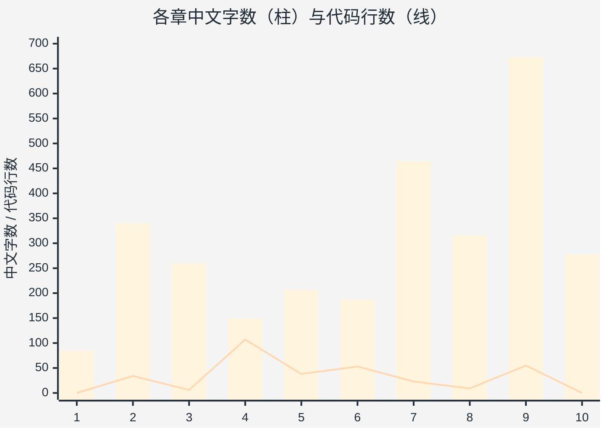

读法（三个反直觉点）：

1. **§4 是全场最极端的倒挂**：149 个中文字配 107 行代码——它几乎不是一"章"，而是一组代码标本。log 说"§4 三工厂对比好"，实际起作用的是 §4.5 那一张表，不是这一章的论述。
2. **§10 比大多数正文章节还长**：278 字的"待展开清单"，长过 §3（259）、§4（149）、§5（206）、§6（187）。**将来要写什么，比已经写了什么更占篇幅**——这正是"素材是地图不是手册"的量化证据。
3. **§9 论述最多（673）但摊到 6 个项目**，每个项目仅 112 字，是全系列最难写的一篇。

**降级表格**（平台不支持 xychart 时用）：

| 章 | 1 | 2 | 3 | 4 | 5 | 6 | 7 | 8 | 9 | 10 |
|---|---|---|---|---|---|---|---|---|---|---|
| 中文字数 | 85 | 340 | 259 | **149** | 206 | 187 | 464 | 315 | **673** | **278** |
| 代码行数 | 0 | 34 | 6 | **107** | 38 | 53 | 23 | 9 | 55 | 0 |

---

## 图 3 · log 的 14 条主张，回源核验结果

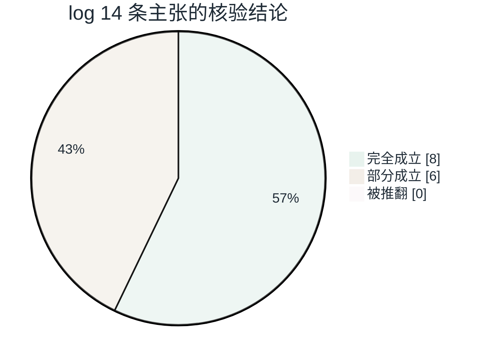

方向是准的，问题集中在 6 条"部分成立"上——见图 4。

---

## 图 4 · 6 条"部分成立"归为三类

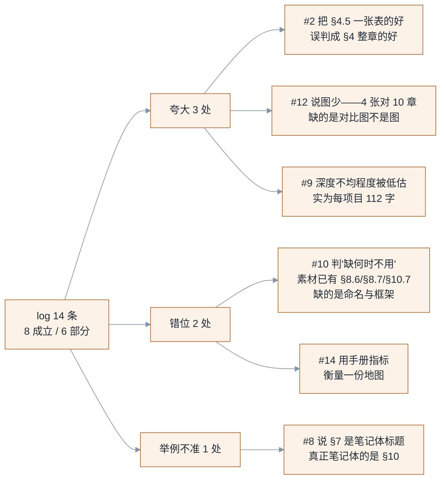

---

## 图 5 · 8 篇结构全景

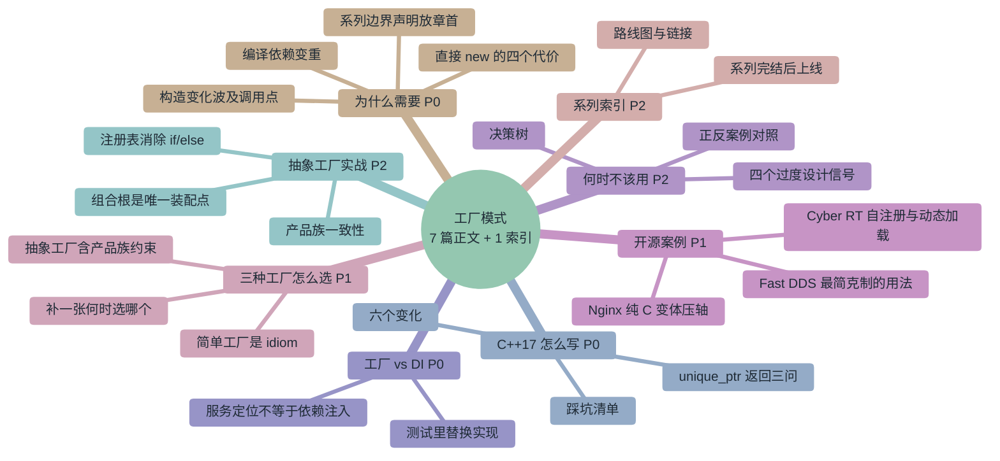

> 平台不支持 mindmap 时，直接用主文档 `工厂模式Blog章节与计划.md` 第五节的 8 篇小节列表——内容同源。

---

## 图 6 · 字数构成：存量 vs 新写

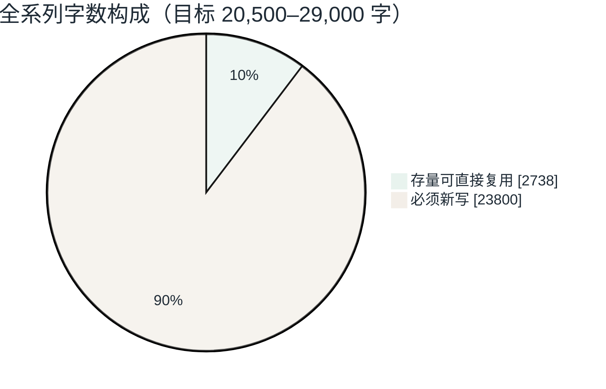

**新写体量是存量的 8.7 倍。** 这个 11% 的覆盖率是排期时唯一需要盯住的数——它把"拆分已有文档"直接判成了"重写 + 扩容"。逐篇的存量 / 新写拆分见配套主文档的 §7.1 执行总表。
---

## 图 7 · 四周写作排期

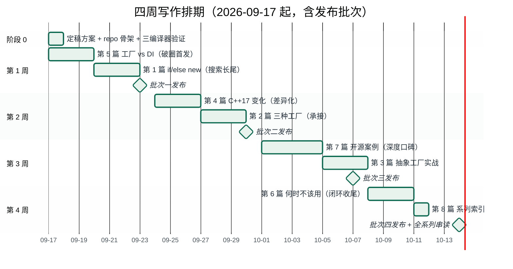

**总计 ≈ 66 小时**（写作 54 h + 阶段 0 的 4 h + 贯穿性验证 8 h）。

---

## 图 8 · 发布批次节奏

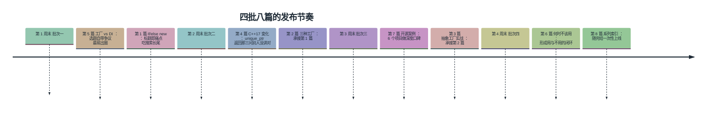

---

## 图 9 · §10 七项待展开的归属

原则：**能就地补的就别预告**。

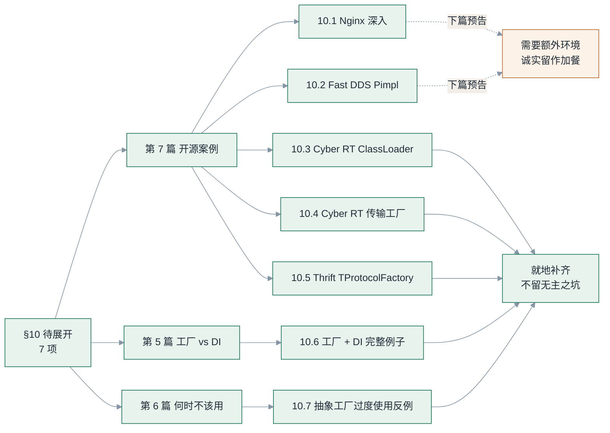

只有 10.1、10.2 作预告（各自都能撑一篇）；其余 5 项必须在系列内写完，否则系列自己不完整。

---

## 图 10 · 工厂形态的演化路径

这是系列第二条主线，也是第 2、3 篇的骨架：

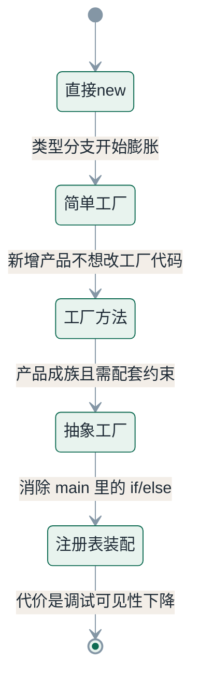

每一步都解决一个问题，也各付一次代价——**这条链上没有一个"免费的午餐"**，这正是第 2 篇"不是三个并列模式"的论据。

---

## 图 11 · 工厂与 DI 的职责分工

第 5 篇（破圈首发）的核心图：

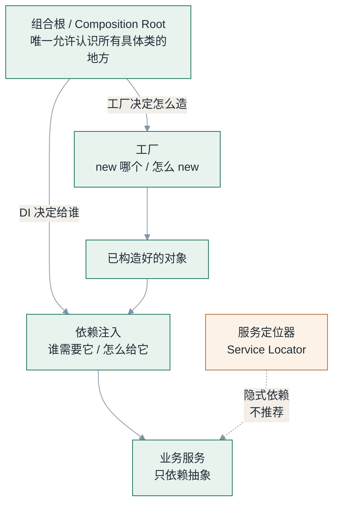

一句话记忆：**工厂答"new 哪个"，DI 答"给谁"**；服务定位是 DI 的冒牌替代品（第 5 篇必须讲透的分歧点）。

---

## 图 12 · 何时不该用工厂（决策树）

第 6 篇的核心图——三个问题就能筛掉大部分过度设计：

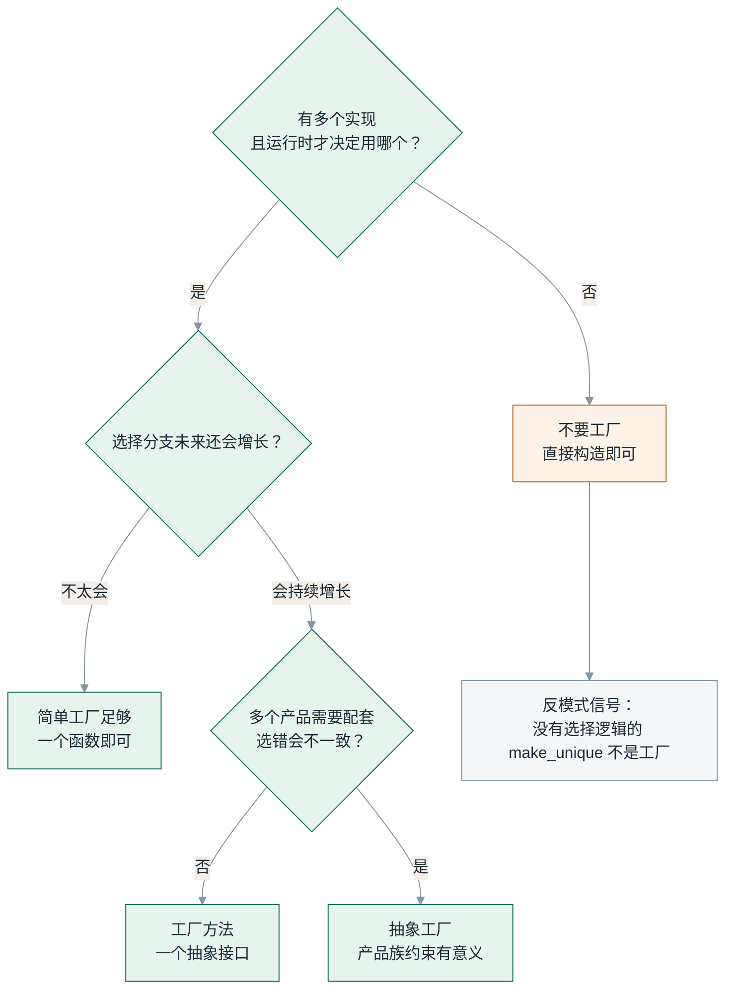

---

## 图 13 · 组合根 + 注册表装配时序

第 3 篇的支付渠道 demo，也解释了为什么"自注册"会付出调试代价：

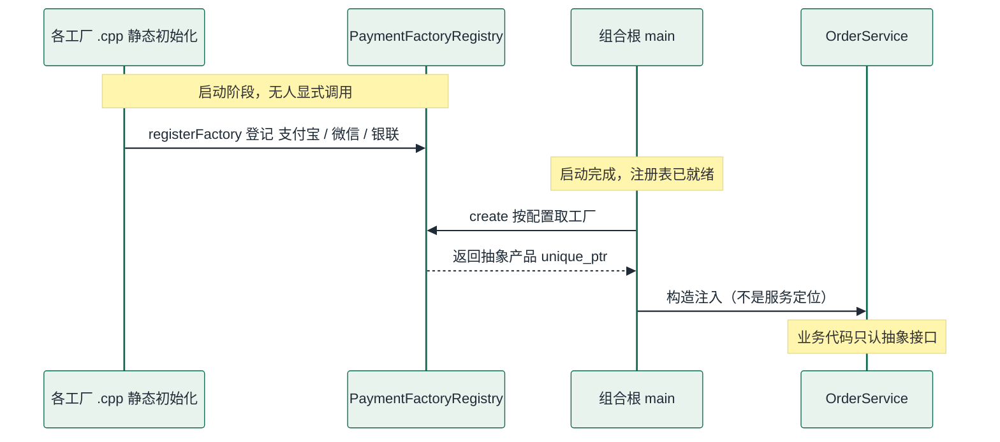

**代价就在这里**：注册发生在"无人显式调用"的静态初始化阶段，所以 MSVC + 静态库下会被链接器裁掉——这个坑必须写进第 4 篇的踩坑清单。

---

## 附 · 沿用同一套色板的 init 片段

所有图共用这段主题变量，改一处即可整体换肤（删掉 init 即恢复平台默认配色）：

```text
%%{init: {'theme':'base','themeVariables':{
  'primaryColor':'#e8f3ee','primaryTextColor':'#1f2b36','primaryBorderColor':'#0e6b52',
  'secondaryColor':'#fdf2e7','tertiaryColor':'#f4f6f8','lineColor':'#8496a5',
  'fontFamily':'Microsoft YaHei'
}}}%%
```

| 用途 | 色值 | 语义 |
|---|---|---|
| 主色 | `#0e6b52` / 底 `#e8f3ee` | 存量可复用、正向结论、推荐路径 |
| 强调 | `#b4652a` / 底 `#fdf2e7` | 新写、风险、反模式、需注意 |
| 中性 | `#3d7ea6` | P1 主力内容 |
| 弱化 | `#8895a3` / 底 `#f4f6f8` | P2 深度收尾、不适用项 |

---

*路线图版本：v1.0 · 13 张图 · 2026-09-16*
*配套：`工厂模式Blog章节与计划.md`（正文与计划表）*
