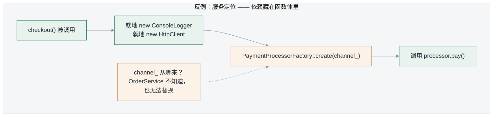
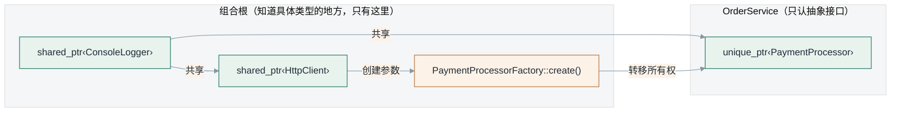
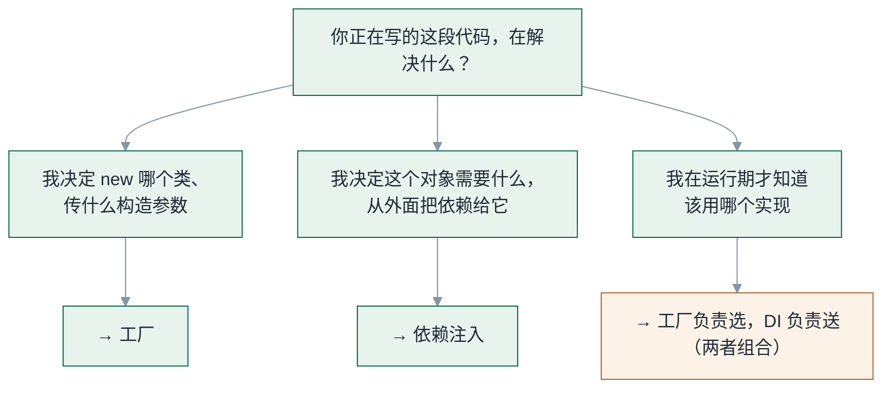
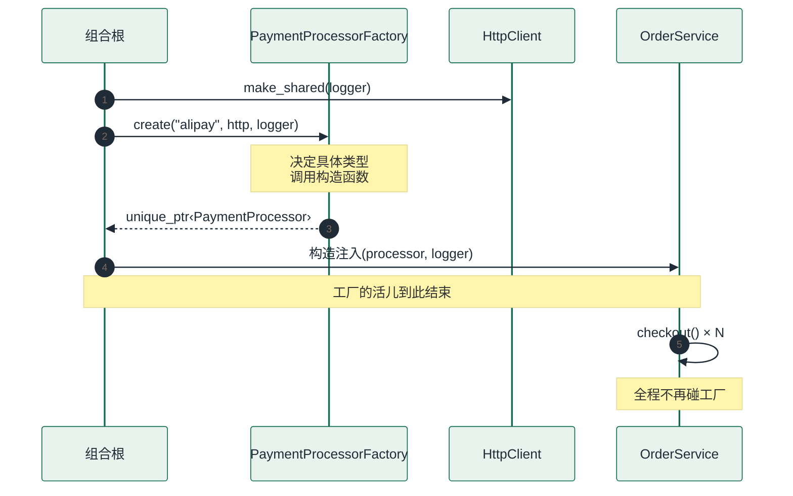

# 工厂和依赖注入，到底谁管什么

> 《C++ 工厂模式：从 if/else 到架构边界》第 5 篇
>
> 配套代码：`factory-pattern/src/05_factory_vs_di/`｜代码块逐块标注来源：出自仓库的与文件同名同序，标「示意」的不在仓库中
>
> 系列边界：本系列只讨论**创建与装配的职责划分**，不覆盖线程安全、异常安全与 ABI 兼容；测试只演示"替换实现"这一件事，不展开测试策略。

---

## 一、一段"我用了工厂，所以解耦了"的代码

假设你在 review 这样一段代码：

```cpp
// 反例，出自 src/05_factory_vs_di/service_locating.h
class ServiceLocatingOrderService {
public:
    explicit ServiceLocatingOrderService(std::string channel);

    PaymentResult checkout(const PaymentRequest& request);

private:
    std::string channel_;
};
```

实现是这样的：

```cpp
// src/05_factory_vs_di/service_locating.cpp
PaymentResult ServiceLocatingOrderService::checkout(const PaymentRequest& request) {
    auto logger = std::make_shared<ConsoleLogger>();
    auto http   = std::make_shared<HttpClient>(logger);

    auto processor = PaymentProcessorFactory::create(channel_, http, logger);
    if (!processor) {
        return PaymentResult{false, "", "unsupported channel: " + channel_};
    }
    if (request.amount_cents <= 0) {
        return PaymentResult{false, "", "invalid amount"};
    }
    return processor->pay(request);
}
```

作者大概率会说：**"我用了工厂模式，所以已经解耦了。"**

这句话一半是对的，另一半错得很典型。工厂确实把"创建哪个支付渠道"这件事从 `OrderService` 里挪走了——但它同时把 `OrderService` 和**工厂本身**、和**渠道名这个概念**、和 `HttpClient` 的构造方式全部焊在了一起。

更要命的是：**这个类的构造签名看不出它需要一个 `PaymentProcessor`。**

这就是工厂和依赖注入的第一个分界点。它们不是同一个问题的两种解法，它们回答的是两个不同的问题。

---

## 二、两个词，两个问题

把两个词各自的职责用一句话写清楚：

- **工厂**回答：`new` 哪个？怎么 `new`？
- **依赖注入**回答：谁需要它？怎么给它？

工厂管的是**创建**——决定具体类型、调用构造函数、处理创建参数。依赖注入管的是**传递**——决定一个对象依赖什么，以及把依赖送进去。

逐项拆开，职责边界是这样的：

| 职责 | 工厂 | 依赖注入 |
|---|---|---|
| 决定创建哪个具体类 | ✅ | ❌ |
| 调用构造函数 | ✅ | ❌ |
| 管理创建参数 | ✅ | ❌ |
| 决定对象依赖什么 | ❌ | ✅ |
| 把依赖送进对象 | ❌ | ✅ |
| 管理生命周期 | 部分 | ✅ |
| 决定用哪个工厂 | ❌ | ✅ |

这张表里最值得看的是**最后三行**。

"管理生命周期"，工厂只承担一部分：它创建完对象、把所有权交出去之后，就不该再管这个人了。**"决定用哪个工厂"这一格，工厂自己是打着 ❌ 的**——谁来决定用哪个工厂？是依赖注入那一边，具体说是组合根。

这解释了开头那段反例的根本问题：`ServiceLocatingOrderService` 把"决定用哪个工厂"这件事，从外面挪到了自己肚子里。

---

## 三、同一件事，两条路径

同样一句"给 `OrderService` 一个支付处理器"，两种写法的流向完全不同。





左边那张图里，工厂出现在**每次调用**的路径上；右边那张图里，工厂只出现在**装配阶段**，被调用一次，之后全部是传递。

这就是两者最实用的分工：**工厂是一次性的创建动作，DI 是持续存在的传递结构。**

---

## 四、依赖可见吗

两张图还漏掉了最关键的一处差异：**依赖是否出现在签名里。**

```cpp
// 示意：两种构造签名对比，本段不在配套仓库中
// 反例：
ServiceLocatingOrderService(std::string channel);   // 它需要什么？签名没说

// 正例：
OrderService(std::unique_ptr<PaymentProcessor> processor,
             std::shared_ptr<Logger>           logger);   // 依赖清单就是签名
```

这不是风格问题。它有三个可以验证的后果：

**第一，读代码的人不需要往下翻。** 正例一眼就能看出 `OrderService` 需要一个支付处理器和一个日志器；反例必须把 `checkout()` 读完，才能发现它其实偷偷依赖了 `HttpClient` 和工厂。

**第二，测试成本不同。** 正例可以在测试里直接塞一个假实现——不需要工厂、不需要网络、不需要任何真实渠道。反例做不到：要跑 `checkout()`，就得把整条 `ConsoleLogger → HttpClient → Factory → AlipayProcessor` 的构造链全部跑一遍，而这条链跟你要测的订单逻辑毫无关系。

**第三，依赖被创建几次不同。** 反例每次 `checkout()` 都新建一份 `HttpClient`——真实项目里那是连接池和重试策略的灾难。正例里，`HttpClient` 由组合根建一次，被两个对象共享。

第二条是本文最想强调的：**依赖注入真正换来的不是"解耦"这种模糊说法，而是"依赖成了编译期可见、运行期可替换的契约"。**

---

## 五、三种具体的混淆

### 5.1 把工厂当 DI 用：这就是服务定位

开头那段反例的学名是**服务定位（Service Locating）**——对象自己去某个全局可达的地方（工厂、单例、容器）把依赖"要"过来。

它在 DI 圈子里被普遍视为反模式，原因不是"不好看"，而是它把依赖关系从**静态可见**退化成了**运行期才知道**：编译器帮不上忙，IDE 的"查找引用"也会漏掉真实依赖。

要区分这两个词，看一件事就够了：**依赖是"被送进来"的，还是"被要过去的"。**

### 5.2 把 DI 当工厂用：名字叫 Factory，做的是装配

反过来也常见。下面这个类名字里有 Factory，但它一行创建代码都没有：

```cpp
// 名字叫 Factory，做的事却是"决定对象依赖什么"——这是装配，不是创建
// （示意代码，不在配套仓库中）
class ServiceProviderFactory {
public:
    ServiceProviderFactory(std::shared_ptr<HttpClient> http,
                           std::shared_ptr<Logger>     logger);
    std::shared_ptr<OrderService> build();
};
```

它没有决定创建哪个具体类，参数里也没有任何类型分支。它做的是**把已有依赖组装起来**——这件事更准确的名字是 Provider / Assembler，或者干脆就是组合根的一段。

命名错位的代价很实在：下一个读代码的人会以为创建逻辑藏在这里，于是去找工厂方法、去找注册表，最后发现什么都没有。

### 5.3 以为 DI 容器就是工厂

DI 容器经常被描述成"一个超级工厂"，这个类比在容器内部其实成立——容器确实要调构造函数、确实要处理参数。

但**对使用者来说，它的职责是注入而不是创建**。你用容器的目的是"我不想手动写这一堆 `make_shared` 和传递"，而不是"我需要在运行期按名字选一个类型"。后者才是工厂的问题。

这也解释了一个常见现象：**一个已经有 DI 容器的项目，往往仍然需要工厂。** 因为容器解决的是"装配谁",工厂解决的是"运行期才知道要给谁"。这两件事不重叠。

---

## 六、判断标准

把上面的讨论压成三条可以当场用的判断：



- 写"`new` 哪个类、传什么参数"→ **工厂**。
- 写"这个对象需要什么，我从外面给它"→ **依赖注入**。
- 写"运行时决定用哪个实现"→ **工厂 + DI 的组合**。

第三条是绝大多数真实项目的状态。它意味着这两者本来就不该二选一——下面看它们在同一段代码里怎么配合。

---

## 七、完整例子：组合根同时使用两者

### 7.1 装配发生在同一个地方

一个真实程序里，"知道具体类型"的代码应该只有一个地方：**组合根（Composition Root）**。在这里，工厂和 DI 各做各的那一半。

```cpp
// src/05_factory_vs_di/main.cpp（节选）
// ------------------------ 组合根开始 ------------------------
// 1) 共享资源只建一次，用 shared_ptr 分发。
//    logger 会被 HttpClient 和 OrderService 同时持有。
auto logger = std::make_shared<fp::ConsoleLogger>();
auto http   = std::make_shared<fp::HttpClient>(logger);

// 2) 工厂回答：「创建哪个具体类、怎么创建」。
//    返回值是 unique_ptr —— 所有权在工厂手里结束。
const std::string channel = "alipay";
auto processor = fp::PaymentProcessorFactory::create(channel, http, logger);
// ------------------------ 组合根结束 ------------------------

// 3) 依赖注入回答：「谁需要它、怎么给它」。
//    这里没有 new，没有工厂调用，只有「把东西交出去」。
fp::OrderService order_service(std::move(processor), logger);
```

时序上，创建只发生一次，之后全是传递：



**工厂只被调用一次，`OrderService` 全程不碰工厂。** 这是判断一个项目里工厂用得对不对的最快办法：如果工厂出现在业务方法的调用链上（像开头那个反例），那它多半被当成取物窗口用了。

### 7.2 两种依赖，两种所有权

组合根里有个细节值得单独说：`processor` 用 `unique_ptr`，`logger` 用 `shared_ptr`。这不是随手选的。

```cpp
// src/05_factory_vs_di/order_service.h（节选）
class OrderService {
public:
    OrderService(std::unique_ptr<PaymentProcessor> processor,
                 std::shared_ptr<Logger>           logger);
private:
    std::unique_ptr<PaymentProcessor> processor_;
    std::shared_ptr<Logger>           logger_;
};
```

| 依赖 | 智能指针 | 理由 |
|---|---|---|
| `processor` | `unique_ptr` | 本服务**独占**它；别人拿到同一个支付处理器实例是设计事故 |
| `logger` | `shared_ptr` | 多个组件**共享**同一个日志器；它的生命周期独立于任何一个使用者 |

对应到工厂的接口设计：`PaymentProcessorFactory::create()` 返回 `unique_ptr`——**所有权被显式转交出去，工厂造完就撒手**，不缓存、不持有、不参与后续生命周期。这与表格里"管理生命周期：工厂只承担一部分"那一格完全一致。

反过来说，如果工厂返回 `shared_ptr`，就等于工厂悄悄承诺了一份共享所有权——而多数情况下那个共享是没有人需要的。**返回值类型本身就是一份设计声明**，用 `unique_ptr` 是把"我不管了"写进签名。

### 7.3 测试里替换实现

现在看依赖注入换来的东西。下面是 `OrderService` 的全部测试代码——注意它**没有**出现工厂、`HttpClient`、`AlipayProcessor` 中的任何一个：

```cpp
// src/05_factory_vs_di/test_order_service.cpp（节选）
class RecordingProcessor final : public fp::PaymentProcessor {
public:
    std::string channel() const override { return "recording"; }

    fp::PaymentResult pay(const fp::PaymentRequest& request) override {
        calls.push_back(request.amount_cents);
        return fp::PaymentResult{true, "FAKE-TXN-1", ""};
    }

    std::vector<long long> calls;
};

// ...
    auto  processor = std::make_unique<RecordingProcessor>();
    auto* observed  = processor.get();
    auto  logger    = std::make_shared<SilentLogger>();

    fp::OrderService service(std::move(processor), logger);
    const auto       result = service.checkout(order_with(128800));

    check(result.ok, "假实现返回成功");
    check(result.transaction_id == "FAKE-TXN-1", "结果确实来自注入的实现");
    check(observed->calls.size() == 1, "支付实现被调用了 1 次");
```

假实现整个类的有效代码不到 8 行。**抽象接口越小，替身越廉价**——`PaymentProcessor` 只有 `channel()` 和 `pay()` 两个方法，所以替身只需要实现两个方法。

这不是巧合，是接口设计的直接收益：接口上每多一个方法，每一个替身都要多写一份空实现。

---

## 八、一个可以被验证的断言

"测试不需要工厂"这句话，在这套代码里不是修辞，是可以编译、也可以被 `nm` 检查的事实。

第 5 篇的测试目标在 CMake 里**没有链接工厂库**：

```cmake
# src/05_factory_vs_di/CMakeLists.txt（节选）
# 单元测试：只链接 order_service.cpp。
# 注意它 **没有** 链接 fp_05_factory —— 因为 OrderService 不需要工厂。
# 这不是省略，这是一句可以编译的断言。
add_executable(fp_05_test_order_service
    test_order_service.cpp
    order_service.cpp)
target_link_libraries(fp_05_test_order_service PRIVATE fp_core)
```

如果 `OrderService` 真的依赖工厂，这个目标**链接不过**。它链接通过了，说明依赖关系确实如声明的那样。

进一步，可以直接查符号表：

```bash
$ nm -C build/src/05_factory_vs_di/fp_05_test_order_service | grep -E "Factory|Alipay|HttpClient"
# 无输出
$ nm -C build/src/05_factory_vs_di/fp_05_main | grep AlipayProcessor | head -2
00000000000051e0 T fp::AlipayProcessor::pay(fp::PaymentRequest const&)
00000000000076a0 T fp::AlipayProcessor::AlipayProcessor(std::shared_ptr<fp::HttpClient>, std::shared_ptr<fp::Logger>)
```

同一份 `order_service.cpp`，在演示程序里和具体渠道一起被链接，在测试里则完全不带它们。

> 复现：`cmake -B build -DCMAKE_BUILD_TYPE=Release && cmake --build build -j && ctest --test-dir build --output-on-failure`。验证环境 GCC 13.3.0，`-Wall -Wextra -Wpedantic -Wshadow -Wnon-virtual-dtor` 下零警告。

---

## 九、回到开头那段代码

现在可以给那位作者一个准确的答复了。

**"我用了工厂，所以解耦了"——解耦的是创建，没解耦的是依赖。**

他真正的损失有三条，都跟工厂没关系：

1. `OrderService` 的依赖不出现在签名里，读代码的人必须读实现才知道。
2. 这些依赖没法在测试里替换，因为它们是就地 `new` 的。
3. `HttpClient` 被反复重建，共享资源退化成逐次消耗品。

而修复方案不是"去掉工厂"——工厂在他那段代码里是正确使用的。要改的只有一处：**把创建挪到组合根，把对象送进构造函数。**

```cpp
// 示意：改法对照，本段不在配套仓库中
// 改法：工厂留在组合根，服务只收接口
auto processor = fp::PaymentProcessorFactory::create(channel, http, logger);
fp::OrderService order_service(std::move(processor), logger);
```

---

## 十、下一篇：什么时候不该用工厂

这一篇都在讲"怎么用对"。但如果只讲怎么用、不讲何时不用，就是在误导——**世界上确实存在用了工厂反而更糟的代码**。

下一篇会正面回答：

- 工厂里只做 `make_unique<T>()`、没有任何选择逻辑，它还算工厂吗？
- 一个接口只有一个实现、一个 DI 容器里注册的类从来没有第二个实现，是设计还是仪式？
- "为了解耦"把一句 `new` 改成三层工厂，什么时候这笔账是亏的？

判断标准会做成决策树：**先问有没有多个实现 → 再问选择时机 → 再问产品是否成族。**

（系列前 4 篇按发布批次排期，本篇为首发。系列目录与阅读路径见第 8 篇索引。）

---

*本文配套代码：`factory-pattern/src/05_factory_vs_di/`*
*`cmake -B build && cmake --build build -j && ctest --test-dir build` 一键复现*
