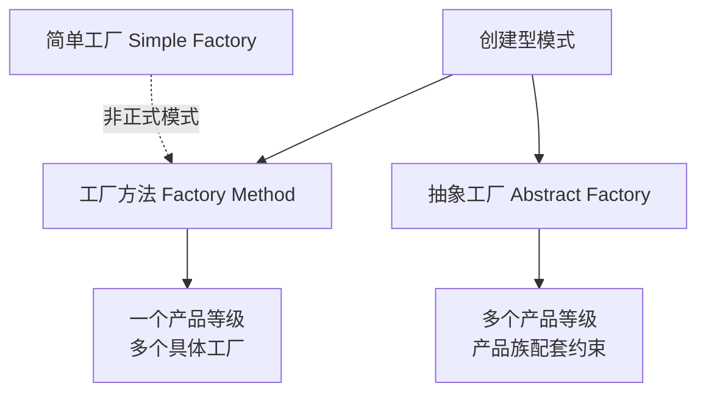
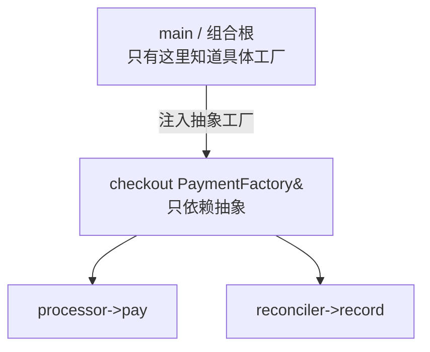
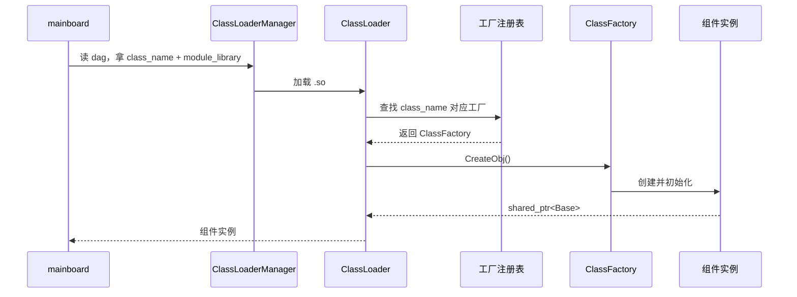
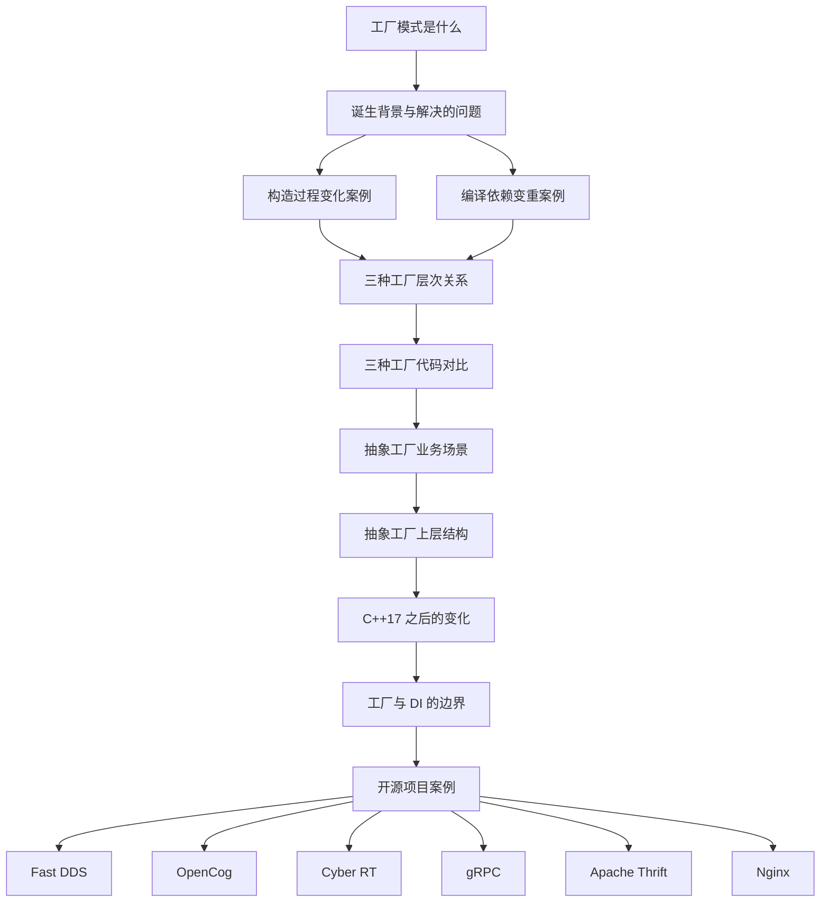

# 工厂模式拆解笔记（C++17+）

> 本文档记录了一次围绕工厂模式的递进式讨论，按 BFS（广度铺开）与 DFS（深度展开）两种路径组织。
> 标记 ✅ 表示已展开，⏸️ 表示已标记但未展开，⬜ 表示待补充。

---

## 目录

- [1. 工厂模式是什么](#1-工厂模式是什么)
- [2. 诞生背景与解决的问题](#2-诞生背景与解决的问题)
- [3. 三种工厂的层次关系](#3-三种工厂的层次关系)
- [4. 三种工厂的代码对比](#4-三种工厂的代码对比)
- [5. 抽象工厂的业务场景](#5-抽象工厂的业务场景)
- [6. 抽象工厂的上层结构](#6-抽象工厂的上层结构)
- [7. C++17 之后工厂模式的变化](#7-c17-之后工厂模式的变化)
- [8. 工厂与依赖注入的边界](#8-工厂与依赖注入的边界)
- [9. 开源项目案例拆解](#9-开源项目案例拆解)
- [10. 待展开标记](#10-待展开标记)

---

## 1. 工厂模式是什么

✅ 已展开

工厂模式是一种创建型设计模式。核心思想：**把对象的创建和对象的使用分开**。

调用方不直接 `new` 具体类，而是通过工厂拿到对象。调用方通常只依赖抽象接口，不关心背后是哪个具体类型。

---

## 2. 诞生背景与解决的问题

✅ 已展开

### 2.1 诞生背景

早期面向对象代码里常见：

```cpp
if (type == "A") {
    obj = new ConcreteA();
} else if (type == "B") {
    obj = new ConcreteB();
}
```

问题：
- 每新增一种类型，就要改这个 `if/else`。
- 调用方必须知道所有具体类，还要包含它们的头文件。
- 具体类的构造过程一旦变化，所有调用点都要改。
- 编译依赖变重，改一个具体类可能触发大量重新编译。

### 2.2 解决的问题

1. **解耦创建与使用**
2. **集中管理创建逻辑**
3. **方便扩展新类型**
4. **隐藏具体类型和头文件**
5. **统一控制生命周期和资源**

### 2.3 案例：构造过程变化导致所有调用点都要改

✅ 已展开

直接 `new` 版本：

```cpp
auto logger = std::make_unique<FileLogger>("app.log", true, 100);
```

当 `FileLogger` 构造函数变成：

```cpp
FileLoggerConfig cfg{"app.log", true, 100, "utf-8"};
auto logger = std::make_unique<FileLogger>(cfg);
```

所有调用点都要改。

更糟的是初始化步骤分散：

```cpp
auto logger = std::make_unique<FileLogger>();
logger->setPath("app.log");
logger->setAppend(true);
logger->setFlushInterval(100);
logger->setEncoding("utf-8");
if (!logger->open()) { /* ... */ }
```

用工厂后：

```cpp
auto logger = LoggerFactory::create("file");
```

只改工厂一处。

### 2.4 案例：编译依赖变重

✅ 已展开

直接 `new` 时，`App.cpp` 包含 `FileLogger.h`：

```cpp
// App.cpp
#include "FileLogger.h"
#include "ConsoleLogger.h"

void doWork() {
    auto logger = std::make_unique<FileLogger>("app.log", true);
    logger->log("start");
}
```

`FileLogger.h` 里任何变化——加私有成员、改构造签名、加虚函数——都会触发 `App.cpp` 重新编译。

工厂版本：

```cpp
// Logger.h
class Logger { /* 抽象接口 */ };
class LoggerFactory { /* 声明 */ };

// App.cpp
#include "Logger.h"

void doWork() {
    auto logger = LoggerFactory::create("file");
    logger->log("start");
}
```

`FileLogger.h` 只被 `LoggerFactory.cpp` 包含。改 `FileLogger` 不影响 `App.cpp`。

**对比表：**

| 方面 | 直接 `new` | 工厂 |
|---|---|---|
| `App.cpp` 包含什么 | `FileLogger.h`、`ConsoleLogger.h` | 只有 `Logger.h` |
| 改 `FileLogger` 私有成员 | `App.cpp` 重编 | 不重编 |
| 改 `FileLogger` 构造签名 | 所有调用点重编 | 只工厂重编 |
| 新增具体类 | 调用方可能要改 | 只改工厂 |
| 编译依赖 | 重 | 轻 |

---

## 3. 三种工厂的层次关系

✅ 已展开

### 3.1 关键真相

**简单工厂不是 GoF 官方分类里的模式。** GoF 只有工厂方法和抽象工厂。

| 中文 | 英文 | 出身 |
|---|---|---|
| 简单工厂 | Simple Factory | 非正式模式，英文社区承认它是 programming idiom |
| 工厂方法 | Factory Method | GoF 正式模式 |
| 抽象工厂 | Abstract Factory | GoF 正式模式 |

### 3.2 层次关系



- **简单工厂**：一个具体类里 `if/else`，集中创建。
- **工厂方法**：一个产品等级，多个具体工厂，把创建延迟到子类。
- **抽象工厂**：多个产品等级，多个具体工厂，保证产品族配套一致性。

### 3.3 抽象工厂的精确定义

**抽象工厂 = 多个工厂方法 + 产品族配套约束。**

不是简单的“工厂方法集合”。核心是约束：同一个具体工厂造出来的所有产品必须属于同一族。

---

## 4. 三种工厂的代码对比

✅ 已展开

场景：创建日志器 `Logger`。

### 4.1 公共部分

```cpp
#include <memory>
#include <string>
#include <string_view>
#include <iostream>

class Logger {
public:
    virtual ~Logger() = default;
    virtual void log(const std::string& msg) = 0;
};

class FileLogger : public Logger {
public:
    void log(const std::string& msg) override {
        std::cout << "[File] " << msg << "\n";
    }
};

class ConsoleLogger : public Logger {
public:
    void log(const std::string& msg) override {
        std::cout << "[Console] " << msg << "\n";
    }
};
```

### 4.2 简单工厂

```cpp
class LoggerFactory {
public:
    static std::unique_ptr<Logger> create(std::string_view type) {
        if (type == "file")    return std::make_unique<FileLogger>();
        if (type == "console") return std::make_unique<ConsoleLogger>();
        return nullptr;
    }
};

auto logger = LoggerFactory::create("file");
logger->log("hello");
```

### 4.3 工厂方法

```cpp
class LoggerFactory {
public:
    virtual ~LoggerFactory() = default;
    virtual std::unique_ptr<Logger> create() = 0;
};

class FileLoggerFactory : public LoggerFactory {
public:
    std::unique_ptr<Logger> create() override {
        return std::make_unique<FileLogger>();
    }
};

class ConsoleLoggerFactory : public LoggerFactory {
public:
    std::unique_ptr<Logger> create() override {
        return std::make_unique<ConsoleLogger>();
    }
};

std::unique_ptr<LoggerFactory> factory = std::make_unique<FileLoggerFactory>();
auto logger = factory->create();
logger->log("hello");
```

### 4.4 抽象工厂

```cpp
class Formatter {
public:
    virtual ~Formatter() = default;
    virtual std::string format(const std::string& msg) = 0;
};

class PlainFormatter : public Formatter {
public:
    std::string format(const std::string& msg) override { return msg; }
};

class JsonFormatter : public Formatter {
public:
    std::string format(const std::string& msg) override {
        return R"({"msg":")" + msg + R"("})";
    }
};

class LoggerSuiteFactory {
public:
    virtual ~LoggerSuiteFactory() = default;
    virtual std::unique_ptr<Logger> createLogger() = 0;
    virtual std::unique_ptr<Formatter> createFormatter() = 0;
};

class FileSuiteFactory : public LoggerSuiteFactory {
public:
    std::unique_ptr<Logger> createLogger() override {
        return std::make_unique<FileLogger>();
    }
    std::unique_ptr<Formatter> createFormatter() override {
        return std::make_unique<PlainFormatter>();
    }
};

class ConsoleSuiteFactory : public LoggerSuiteFactory {
public:
    std::unique_ptr<Logger> createLogger() override {
        return std::make_unique<ConsoleLogger>();
    }
    std::unique_ptr<Formatter> createFormatter() override {
        return std::make_unique<JsonFormatter>();
    }
};

std::unique_ptr<LoggerSuiteFactory> factory = std::make_unique<ConsoleSuiteFactory>();
auto logger = factory->createLogger();
auto formatter = factory->createFormatter();
logger->log(formatter->format("hello"));
```

### 4.5 一屏对比

| | 简单工厂 | 工厂方法 | 抽象工厂 |
|---|---|---|---|
| 工厂形态 | 一个具体类 | 抽象工厂 + 具体工厂 | 抽象工厂 + 具体工厂 |
| 创建方式 | `if/else` | 多态 | 多态 |
| 产品数量 | 一种 | 一种 | 一族（多个产品等级） |
| 新增产品 | 改工厂 | 加工厂类 | 加整个族 |
| 类数量 | 少 | 中 | 多 |
| GoF 正式模式 | 否 | 是 | 是 |
| 核心解决 | 集中创建 | 延迟创建到子类 | 产品族一致性 |

---

## 5. 抽象工厂的业务场景

✅ 已展开

### 5.1 跨平台 UI 一致性

```cpp
class UIFactory {
public:
    virtual std::unique_ptr<Button> createButton() = 0;
    virtual std::unique_ptr<Checkbox> createCheckbox() = 0;
    virtual std::unique_ptr<Scrollbar> createScrollbar() = 0;
};

class WinUIFactory : public UIFactory { /* 全造 Win 控件 */ };
class MacUIFactory : public UIFactory { /* 全造 Mac 控件 */ };
```

### 5.2 通讯设备基站，多厂商配套

```cpp
class BaseStationFactory {
public:
    virtual std::unique_ptr<RadioUnit> createRadioUnit() = 0;
    virtual std::unique_ptr<BasebandUnit> createBasebandUnit() = 0;
    virtual std::unique_ptr<AlarmCollector> createAlarmCollector() = 0;
};

class HuaweiFactory : public BaseStationFactory { /* 全套华为 */ };
class EricssonFactory : public BaseStationFactory { /* 全套爱立信 */ };
```

### 5.3 机器人场景，多型号配套

```cpp
class RobotFactory {
public:
    virtual std::unique_ptr<MotionController> createMotionController() = 0;
    virtual std::unique_ptr<SensorSuite> createSensorSuite() = 0;
    virtual std::unique_ptr<CommModule> createCommModule() = 0;
};

class ArmRobotFactory : public RobotFactory { /* 机械臂全套 */ };
class MobileRobotFactory : public RobotFactory { /* 移动机器人全套 */ };
class DroneFactory : public RobotFactory { /* 无人机全套 */ };
```

### 5.4 电商场景，多支付渠道配套

```cpp
class PaymentFactory {
public:
    virtual std::unique_ptr<PaymentProcessor> createPaymentProcessor() = 0;
    virtual std::unique_ptr<RefundProcessor> createRefundProcessor() = 0;
    virtual std::unique_ptr<Reconciler> createReconciler() = 0;
};

class AlipayFactory : public PaymentFactory { /* 全套支付宝 */ };
class WeChatFactory : public PaymentFactory { /* 全套微信 */ };
class UnionPayFactory : public PaymentFactory { /* 全套银联 */ };
```

### 5.5 生活中的非代码例子

- **汽车零部件配套**：宝马工厂造宝马发动机 + 宝马变速箱 + 宝马底盘。
- **餐厅套餐**：牛肉套餐 = 牛肉汉堡 + 薯条 + 可乐。

### 5.6 抽象工厂的业务本质

1. 同一业务实体的多个组件必须配套。
2. 整套切换，而不是逐个切换。
3. 防止跨族混用导致语义错误。
4. 让上层逻辑不感知具体族。

---

## 6. 抽象工厂的上层结构

✅ 已展开

### 6.1 上层只依赖抽象

```cpp
void checkout(PaymentFactory& factory) {
    auto processor = factory.createPaymentProcessor();
    auto reconciler = factory.createReconciler();
    processor->pay(100);
    reconciler->record(100);
}

int main() {
    std::unique_ptr<PaymentFactory> factory;
    if (config.platform == "alipay") {
        factory = std::make_unique<AlipayFactory>();
    } else if (config.platform == "wechat") {
        factory = std::make_unique<WeChatFactory>();
    } else if (config.platform == "duxiaoman") {
        factory = std::make_unique<DuxiaomanFactory>();
    }

    checkout(*factory);
}
```

### 6.2 组合根的概念



- 业务逻辑：不知道具体类。
- 组合根：必须知道具体类。
- 抽象工厂不承诺消灭所有对具体类的引用，只承诺把引用限制在组合根。

### 6.3 用注册表消除组合根的 if/else

```cpp
class PaymentFactoryRegistry {
public:
    using Creator = std::function<std::unique_ptr<PaymentFactory>()>;

    static void registerFactory(std::string_view name, Creator creator) {
        registry()[std::string(name)] = std::move(creator);
    }

    static std::unique_ptr<PaymentFactory> create(std::string_view name) {
        auto it = registry().find(std::string(name));
        if (it == registry().end()) return nullptr;
        return it->second();
    }

private:
    static std::unordered_map<std::string, Creator>& registry() {
        static std::unordered_map<std::string, Creator> r;
        return r;
    }
};
```

自注册：

```cpp
// AlipayFactory.cpp
namespace {
    struct AlipayRegistrar {
        AlipayRegistrar() {
            PaymentFactoryRegistry::registerFactory("alipay", [] {
                return std::make_unique<AlipayFactory>();
            });
        }
    } alipayRegistrar;
}
```

### 6.4 取舍表

| 方案 | 具体类出现在哪 | 新增平台要改哪 | 复杂度 |
|---|---|---|---|
| 直接 new | 每个业务函数 | 所有业务函数 | 低 |
| 简单工厂 | 一个工厂类 | 工厂类 | 低 |
| 抽象工厂 + main 判断 | main | main + 新工厂类 | 中 |
| 抽象工厂 + 注册表 | 各工厂 `.cpp` | 只加新 `.cpp` | 高 |

---

## 7. C++17 之后工厂模式的变化

✅ 已展开

### 7.1 变化一：返回类型从裸指针变成智能指针

✅ 已展开

```cpp
// 旧
Logger* logger = LoggerFactory::create("file");
delete logger;

// 新
auto logger = LoggerFactory::create("file");
// 自动释放
```

### 7.2 补充：`unique_ptr` 返回的机制

✅ 已展开

- `return std::make_unique<FileLogger>();` 返回 `unique_ptr<Logger>`，靠的是 `unique_ptr` 的**模板转换构造函数 + 向上转型**。
- `return` 局部 `unique_ptr` 时，编译器自动隐式移动，**不需要写 `std::move`**。
- 完美转发（`std::forward`）在这里没有参与。

### 7.3 变化二：工厂方法出现模板工厂

✅ 已展开

```cpp
template <typename T>
class LoggerFactory : public LoggerFactoryBase {
public:
    std::unique_ptr<Logger> create() override {
        return std::make_unique<T>();
    }
};

std::unique_ptr<LoggerFactoryBase> factory =
    std::make_unique<LoggerFactory<FileLogger>>();
```

限制：要求所有产品构造方式一致。

**业界倾向：传统虚函数工厂方法仍是主流，模板工厂更多是局部优化。**

### 7.4 变化三：抽象工厂出现 `variant` / concept / 类型擦除

✅ 已展开

- `std::variant` + `std::visit`：产品族封闭时可用，值语义，无 vtable。
- C++20 concepts：编译期多态，零开销。
- 类型擦除：值语义 + 运行时切换。

**现实：纯虚接口仍是抽象工厂主流写法。**

### 7.5 变化四：自注册工厂

✅ 已展开

- 每个具体工厂在自己的 `.cpp` 里通过静态初始化自动注册。
- C++17 的 `std::string_view`、`inline static`、`std::function` + lambda 让这更自然。
- 坑：静态初始化顺序、链接器丢弃未引用 `.cpp`、调试可见性。

### 7.6 变化五：失败处理从 `nullptr` 走向 `std::expected`

✅ 已展开

| 标准 | 失败表达 |
|---|---|
| C++11/14 | `nullptr` 或异常 |
| C++17 | `std::optional` |
| C++23 | `std::expected` |

```cpp
static std::expected<std::unique_ptr<Logger>, CreateError>
create(std::string_view type) {
    if (type == "file")    return std::make_unique<FileLogger>();
    if (type == "console") return std::make_unique<ConsoleLogger>();
    return std::unexpected(CreateError::UnknownType);
}
```

### 7.7 变化六：编译期多态成为补充选项

✅ 已展开

| | 运行时工厂 | 编译期工厂 |
|---|---|---|
| 决定时机 | 运行时 | 编译期 |
| 能否读配置文件 | 能 | 不能 |
| 能否插件化 | 能 | 不能 |
| 虚函数开销 | 有 | 无 |
| 适合场景 | 配置驱动、插件、跨平台 | 性能敏感、类型固定 |

**结论：运行时多态仍是默认选择。**

### 7.8 变化总表

| 工厂要素 | C++17 之前 | C++17 之后 |
|---|---|---|
| 返回所有权 | 裸指针 | `unique_ptr` / `shared_ptr` |
| 创建方式 | `if/else` | 模板、`if constexpr`、concept |
| 注册方式 | 集中注册 | 自注册 |
| 失败处理 | `nullptr` / 异常 | `optional` / `expected` |
| 多态形态 | 虚函数 | 虚函数 + variant + concept + 类型擦除 |
| 装配职责 | 工厂全包 | 工厂创建，DI 装配 |

---

## 8. 工厂与依赖注入的边界

✅ 已展开

### 8.1 两个词的分工

- **工厂**：解决“对象怎么创建”。
- **依赖注入**：解决“对象怎么拿到它需要的东西”。

### 8.2 职责对比

| 职责 | 工厂 | 依赖注入 |
|---|---|---|
| 决定创建哪个具体类 | ✅ | ❌ |
| 调用构造函数 | ✅ | ❌ |
| 管理创建参数 | ✅ | ❌ |
| 决定对象依赖什么 | ❌ | ✅ |
| 把依赖送进对象 | ❌ | ✅ |
| 管理生命周期 | 部分 | ✅ |
| 决定用哪个工厂 | ❌ | ✅ |

### 8.3 一句话

- **工厂**回答：`new` 哪个？怎么 `new`？
- **依赖注入**回答：谁需要它？怎么给它？

### 8.4 常见混淆

- 把工厂当 DI 用：`OrderService` 自己调工厂，是服务定位，不是依赖注入。
- 把 DI 当工厂用：类名叫 `Factory`，实际在做装配，更准确的叫法是 Provider / Assembler。

### 8.5 判断标准

- 写“`new` 哪个类、传什么参数”：工厂。
- 写“这个对象需要什么，我从外面给它”：依赖注入。
- 写“运行时决定用哪个实现”：工厂 + DI 的组合。

### 8.6 过度设计的信号

- 只有一个实现，却搞了抽象工厂 + DI 容器。
- 工厂里只做 `make_unique<T>()`，没有选择逻辑。
- DI 容器里注册的类，从来没有第二个实现。
- 为了“解耦”把简单 `new` 改成三层工厂。

### 8.7 一个正确配合的例子

```cpp
// 组合根
auto httpClient = std::make_shared<HttpClient>();
auto logger = std::make_shared<Logger>();

// 工厂负责创建
auto processor = AlipayProcessorFactory::create(httpClient, logger);

// DI 负责注入
auto service = std::make_unique<OrderService>(std::move(processor));
```

---

## 9. 开源项目案例拆解

### 9.1 Fast DDS（3.x）

✅ 已展开

**`DomainParticipantFactory`：极简简单工厂**

```cpp
auto participant = DomainParticipantFactory::get_instance()
    ->create_participant(0, PARTICIPANT_QOS_DEFAULT);
```

- 单例，集中创建。
- 无多态替换，无自注册。
- 失败返回 `nullptr`。
- 3.x 新增 `create_participant` 重载，接受 `DomainParticipantExtendedQos`。

**Dynamic Types 模块：简单工厂 + Builder**

```cpp
DynamicTypeBuilder_ptr struct_builder =
    DynamicTypeBuilderFactory::get_instance()->create_struct_builder();
struct_builder->add_member(0, "index",
    DynamicTypeBuilderFactory::get_instance()->create_uint32_type());
DynamicType_ptr dynType = struct_builder->build();
```

- `DynamicTypeBuilderFactory`：简单工厂，创建 Builder。
- `DynamicTypeBuilder::build()`：实例工厂方法。
- `DynamicDataFactory`：简单工厂，创建数据实例。

**结论：Fast DDS 整体是“克制的简单工厂”实践者，没有工厂方法或抽象工厂。**

### 9.2 OpenCog

✅ 已展开（作为对照）

`opencog/cogserver/server/Factory.h`，文件头注释：**“simple implementation of a AbstractFactory + Factory pattern”**。

```cpp
template<typename _BaseType>
class AbstractFactory {
public:
    virtual _BaseType* create(CogServer&) const = 0;
    virtual const ClassInfo& info() const = 0;
};

template<typename _Type, typename _BaseType>
class Factory : public AbstractFactory<_BaseType> {
public:
    virtual _BaseType* create(CogServer& cs) const override {
        return new _Type(cs);
    }
    virtual const ClassInfo& info() const override {
        return _Type::info();
    }
};
```

- 教科书级骨架。
- 模板化工厂方法。
- 适合看最干净的骨架，不适合看生产级工程考量。

### 9.3 Cyber RT 组件工厂

✅ 已展开

**角色对应：**

- 抽象产品：`ComponentBase`
- 具体产品：`CommonComponentSample` 等
- 抽象工厂：`AbstractClassFactoryBase`
- 具体工厂：`ClassFactory<Derived, Base>`

**注册宏：**

```cpp
CYBER_REGISTER_COMPONENT(CommonComponentSample)
```

展开后创建全局静态变量，程序启动时自动调用 `RegisterClass<Derived, Base>()`。

**工厂表：**

```cpp
map<string, map<string, AbstractClassFactoryBase*>>
//   base_class_name  →  class_name  →  工厂实例
```

**运行时创建流程：**



**要素对齐：**

| 要素 | Cyber RT 中的体现 |
|---|---|
| 工厂方法的多态 | `AbstractClassFactoryBase` → `ClassFactory` |
| 自注册 | `CYBER_REGISTER_COMPONENT` 宏 |
| 注册表 | 双层 map |
| 配置驱动 | dag 文件 |
| 动态库加载 | `ClassLoader` |
| 智能指针 | `shared_ptr` + 自定义删除器 |

**传输工厂：简单工厂 + 多态**

- `Transport` 类负责创建 `Transmitter`、`Receiver`、`Dispatcher`。
- 根据通信模式（intra、shm、rtps、hybrid）选择实现。
- 没有自注册机制。

### 9.4 gRPC 拦截器工厂

✅ 已展开（作为补充）

```cpp
class ClientInterceptorFactoryInterface {
public:
    virtual ClientInterceptor* CreateClientInterceptor() = 0;
};
```

- 标准工厂方法接口。
- 职责单一，轻量。
- 适合作为“工厂方法最小接口示例”。

### 9.5 Apache Thrift

✅ 已展开（生产级抽象工厂案例）

`TProtocolFactory` 体系：

- 抽象工厂：`TProtocolFactory`，纯虚 `getProtocol()`。
- 具体工厂：`TJSONProtocolFactory`、`TBinaryProtocolFactory`、`TCompactProtocolFactory`。
- 抽象产品：`TProtocol`。
- 具体产品：`TJSONProtocol`、`TBinaryProtocol` 等。

`TServer` 持有 `std::shared_ptr<TProtocolFactory>`，可在运行时注入不同协议工厂。

**这是抽象工厂在生产环境里最直接的落地方式。**

### 9.6 C 语言里的工厂变体：Nginx

✅ 已展开

**关键结构：`ngx_event_actions_t`**

```c
typedef struct {
    ngx_int_t (*add)(...);
    ngx_int_t (*del)(...);
    ngx_int_t (*enable)(...);
    ngx_int_t (*disable)(...);
    // ... 共 10 个函数指针
} ngx_event_actions_t;
```

- 函数指针集合 = C 里的“抽象接口”。
- `epoll`、`kqueue`、`poll` 各自实现这一整套函数 = “具体产品”。
- 全局变量 `ngx_event_actions` = “抽象接口变量”。
- 宏调用：`#define ngx_add_event ngx_event_actions.add`

**“工厂”动作发生在初始化时：**

```c
ngx_event_actions = ngx_epoll_module_ctx.actions;
```

**与 Cyber RT 的对应：**

| Cyber RT 组件工厂 | Nginx 事件模块 |
|---|---|
| `AbstractClassFactoryBase` | `ngx_event_actions_t` |
| `ClassFactory<EpollComponent>` | `ngx_epoll_module_ctx.actions` |
| 运行时从注册表查找 | 初始化时按平台赋值 |
| 客户代码调 `factory->create()` | 客户代码调 `ngx_event_actions.add()` |

**价值：没有类和继承时，函数指针结构体 + 初始化时赋值，同样能实现“把创建决策推迟到运行时”。**

### 9.7 案例对比总表

| 项目 | 模式 | 特点 |
|---|---|---|
| Fast DDS | 简单工厂 | 极简，无多态替换 |
| OpenCog | 工厂方法 + 抽象工厂骨架 | 教科书级，模板化 |
| Cyber RT | 工厂方法 + 自注册 + 注册表 | 生产级，动态库加载 |
| gRPC | 工厂方法接口 | 轻量，职责单一 |
| Apache Thrift | 抽象工厂 | 生产级，协议族配套 |
| Nginx | C 语言工厂变体 | 函数指针结构体 + 初始化赋值 |

---

## 10. 待展开标记

⏸️ 已标记但未展开

### 10.1 Nginx 深入

⏸️ 待展开

- `ngx_event_actions_t` 的完整函数指针列表。
- `epoll`、`kqueue`、`poll` 模块如何实现这套接口。
- 初始化时如何选择并赋值。
- 与 Cyber RT 工厂的深入对比。

### 10.2 Fast DDS Pimpl 惯用法

⏸️ 待展开

- `DomainParticipant` 公开接口 vs `DomainParticipantImpl` 实现。
- 工厂如何与 Pimpl 配合。
- 生命周期管理。

### 10.3 Cyber RT `ClassLoader` 引用计数机制

⏸️ 待展开

- `ClassLoader` 如何管理对象生命周期。
- 自定义删除器如何维护引用计数。
- 与 `shared_ptr` 的配合。

### 10.4 Cyber RT 传输工厂 vs 组件工厂对比

⏸️ 待展开

- 两种不同风格的取舍。
- 为什么组件工厂用自注册，传输工厂不用。

### 10.5 Apache Thrift `TProtocolFactory` 深入

⏸️ 待展开

- `TServer` 如何注入不同 `TProtocolFactory`。
- 协议族配套一致性的具体体现。
- 与抽象工厂理论模型的对应。

### 10.6 工厂与 DI 正确配合的完整小例子

⏸️ 待展开

- 组合根如何同时使用工厂和 DI。
- 生命周期管理。
- 单元测试中的替换。

### 10.7 抽象工厂被过度使用的反例

⏸️ 待展开

- 本来只需要工厂方法，却硬上抽象工厂。
- 类数量爆炸、维护困难。
- 判断标准。

---

## 附录：讨论路径回顾

本次讨论按 BFS → DFS 两种路径组织：



---

*文档版本：1.0*
*讨论范围：C++17 及以上*
*最后更新：2026-09-16*