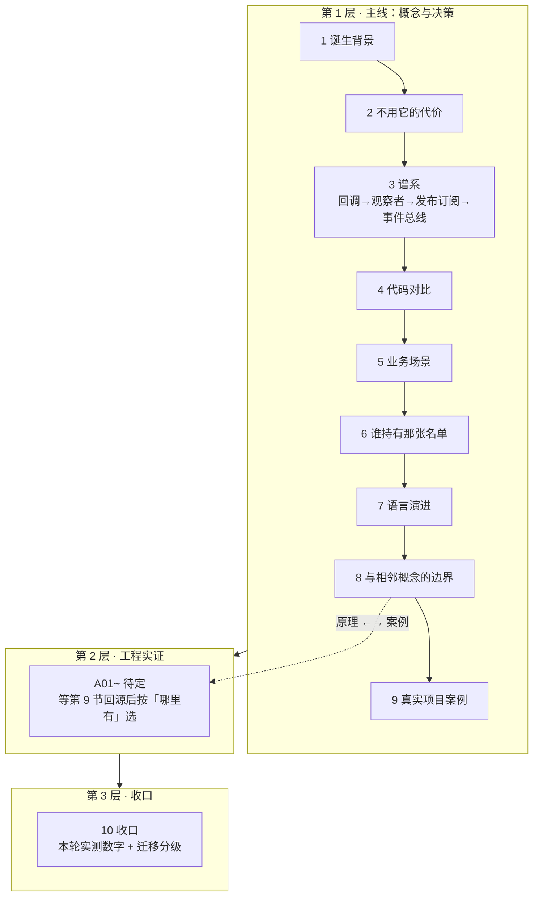

# 讲解计划 · 观察者模式

> 定位：面向 10+ 年 Linux C++ 工程师的问题驱动式讲解，不从「是什么」开始，从「为什么需要」开始。
> 协作：小步快走，一问一答，每节配最小可运行代码。
> 物料分工：概念与决策 → 第 1 层；真实仓库里的实现 → 第 2 层；流程收口 → 第 3 层。
> **骨架已过拍板（2026-09-30）：谱系取宽口径。**

## 三层结构

---

## 第 1 层 · 主线：概念与决策

### 1. 诞生背景：一个对象变了，谁该知道
不谈定义。回源 Smalltalk-80 里 Model 变化后怎么通知 View（`changed` / `update:` 这条协议链），
以及 MVC 在 Xerox PARC 的原始备忘录。要回答的是：**「观察者」这个名字是从哪冒出来的**
——它在被 GoF 命名之前叫什么，那个更早的名字暴露了什么。
⚠️ 硬要求：来历逐条可查一手出处（Krasner & Pope 1988 / Reenskaug 1979 备忘录 / GoF 1994 第 5 章），
不接受百科转述。

### 2. 不用它的代价：轮询空转与改一处的扩散
一个温度传感器 + 两个显示端。两条错误路线各有各的代价：
**硬编码调用**——加第三个显示端必须改传感器；**轮询**——CPU 空转、延迟不可控。
两版都能编译、输出逐行可比。这一节回答「观察者到底解决什么」。

### 3. 谱系：四层不是并列，是「谁知道谁」在变
回调列表 → 观察者 → 发布订阅 → 事件总线/响应式流。
**必须回答它们是不是并列的**：不是——判据是**谁知道谁**。回调是调用方持有被调方；
观察者是**被观察方持有观察者列表**（方向反过来）；发布订阅是**双方都不持有对方**，中介持有；
事件总线是中介从「一对一主题」变成「分层路由」。
本节给出**什么时候该升到下一层**，以及**升一层要多付什么**。

### 4. 代码对比：同一份场景贯穿四层
同一份传感器场景，四层各写一遍并排。**不许每层换一个例子**——换了就不是对照，是四篇独立教学。

### 5. 业务场景：什么时候真的需要它
真实场景 ≥ 3 个（候选：GUI 事件、配置热更新、缓存失效、行情推送）＋ 生活类比 ≥ 1 个。
**类比必须能指出「在哪里失效」**，不能只做修辞。

### 6. 谁持有那张名单：生命周期负债
谁负责注册（**组合根 = 注册订阅的调用处，不是构造函数**）、谁负责注销、不注销会怎样
（悬垂回调 / 内存泄漏 / 幽灵通知）。这是观察者相对创建型模式最大的一处不同：
它天生带着一份**生命周期负债**，前 5 节攒下的每个订阅点，这里都要结账。

### 7. 语言演进：从虚基类到可调用对象
`Observer` 抽象基类 → `std::vector<std::function<...>>` → concepts 约束的回调类型。
**必须落成编译期装置**（候选 `static_assert(std::is_invocable_v<...>)` ＋ 两种标准下的对照构建），
不能只写在正文。同时要回答：换掉虚基类之后，第 6 节那份生命周期负债是变轻了还是变重了。

### 8. 与相邻概念的边界：看着像但不是
第 3 节已经排过谱系，本节**不重复分层**，只做两件事：
给出**可操作的判断标准**（候选：发布者是否持有订阅者列表），以及收「看着像但其实不是」的反例
（把中介者说成观察者、把一次回调说成订阅、把广播说成通知）。
另与回调（一对一 vs 一对多）、迭代器（推 vs 拉）、中介者（一对多分发 vs 多对多集中）划界。

### 9. 真实项目案例：≥ 3 个，每个都回源
候选：Fast-DDS `DataReaderListener`、Qt signals/slots、Boost.Signals2、
Linux `notifier_chain`（`include/linux/notifier.h`）、nginx。
**每个都必须读真实代码或头文件，能指出文件与函数名，不接受转述。**
本节的回源结果同时决定第 2 层专题篇选谁。

### 10. 收口：把这一轮变成一把尺子
不做新知识，只结账：本轮实测数字（篇数 / 行数 / 图数 / 图密度 / 场景数 / 构建入口数）、
迁移分级（哪些框架要素在观察者这里依然成立、哪些是「因为它是工厂」才成立的）、
以及本轮对框架的改动记录。

---

## 第 2 层 · 工程实证（追加专题）

**暂不预设。** 专题篇的选对象服从第 9 节的回源结果——**该模式在真实仓库里哪里有，就考据哪里**，
不是先定名单再去找。参照实例 A01~A06 的六个对象也是这么长出来的。

---

## 产出约定

- 每节一个 `docs/NN-标题.md`，正文内引用 `code/` 相对路径
- **一节一提交**，随时可停；`git add` 显式给路径
- **图密度**：主线每篇至少 1 张图；全库目标 ≥ 1 图 / 200 行
  - 口径：`docs/*.md` 正文**内嵌**的图；排除本编排文件与 `10-收口`；只在图注里以链接形式保留的矢量备份不计
  - 参照实例实测 ≈ **169 行 / 图**（4 052 行 ÷ 24 图）；本模式按 9 篇主线的规模估 ≈ **13 张**
  - 补图前先 grep 查该知识点是否已在别篇画过（**权属归先写的那篇**）
- **图的画法**：结构类走 Mermaid 内嵌；具象类走手写 SVG 存 `docs/assets/`，
  正文用 `` 引用 —— **不要把 SVG 源码直接贴进正文，GitHub 会过滤内联 `<svg>`**
  - ⚠️ SVG 作为**外部引用**时是独立文档，拿不到宿主 CSS：`var(--...)` 与 `currentColor` 会**静默失效**，
    `width` / `height` 与白底 `<rect>` 必须显式写出。自检：`grep -c 'var(--' docs/assets/*.svg` 必须全为 0
- **不做动图**（本模式起执行）：图全部是矢量、不需要栅格化，也不引入 `rsvg-convert` / `Pillow`
- **收敛原则：单点权威 + 交叉引用。** 同一个知识点只在一处讲全，其它地方写引用；收敛只补引用、不搬文件
- **本仓库为公开交付物**：不带本机绝对路径、不带账号、不带过程管理队列
- ⚠️ **WSL 内源码的中文字符串一律用「」，不要用弯引号** —— 弯引号会被 gcc 当成 ASCII 引号，字符串提前终止
- 通用体例（分工、体例、停机口径）不在仓库内重述，本文件只记本模式特有约定与实测数字

## 待展开清单（节 10 的落点）

讲解过程中遇到「这个词需要单独讲清楚」的概念，先记在这里，等进度合适时展开。

| 概念 | 挂起于 | 归属 |
|---|---|---|
| 弱引用 / 弱回调（`weak_ptr` 破环） | 第 6 节的生命周期负债 | 待判：独立成篇 or 回流第 6 节 |
| 回调对象按值还是按引用捕获 | 第 7 节 | 回流第 7 节（属接口形状的一个维度） |
| 跨线程投递与「通知期间不得改名单」 | 第 3、6 节都会碰到 | 待判 |
| 信号槽的线程亲和性（Qt 的排队连接） | 第 9 节案例 | 待判：可能进第 2 层专题 |
| 反应式流（背压 / 取消传播）与观察者的关系 | 第 3 节谱系的最右端 | 待判：可能只在第 8 节画一条界线 |
| 忙轮询 / 定时器轮询 / 事件驱动（epoll）的实际开销对比 | 第 2 节的空转账 | 待判：可能只在第 2 节留一句，不展开 |

## 当前进度

- [x] 1 诞生背景
- [x] 2 不用它的代价
- [ ] 3 谱系：四层不是并列
- [ ] 4 代码对比
- [ ] 5 业务场景
- [ ] 6 谁持有那张名单
- [ ] 7 语言演进
- [ ] 8 与相邻概念的边界
- [ ] 9 真实项目案例
- [ ] 10 收口
