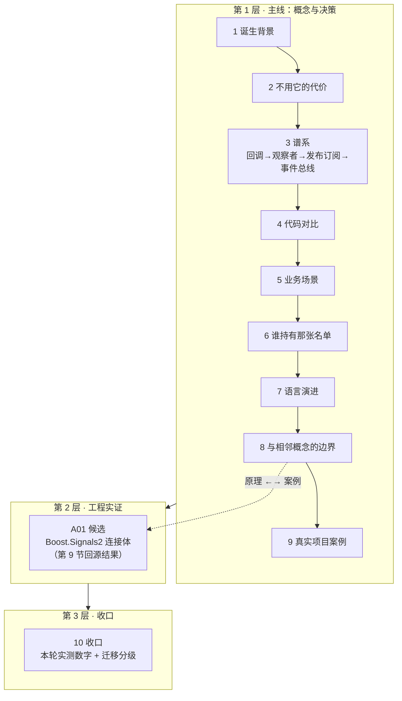

# 讲解计划 · 观察者模式

> 定位：面向 10+ 年 Linux C++ 工程师的问题驱动式讲解，不从「是什么」开始，从「为什么需要」开始。
> 协作：小步快走，一问一答，每节配最小可运行代码。
> 物料分工：概念与决策 → 第 1 层；真实仓库里的实现 → 第 2 层；流程收口 → 第 3 层。
> **骨架已过拍板（2026-09-30）：谱系取宽口径。**

## 三层结构

---

## 第 1 层 · 主线：概念与决策

### 1. 诞生背景：一个对象变了，谁该知道
不谈定义。回源 Smalltalk-80 里 Model 变化后怎么通知 View（`changed` / `update:` 这条协议链），
以及 MVC 在 Xerox PARC 的原始备忘录。要回答的是：**「观察者」这个名字是从哪冒出来的**
——它在被 GoF 命名之前叫什么，那个更早的名字暴露了什么。
⚠️ 硬要求：来历逐条可查一手出处（Krasner & Pope 1988 / Reenskaug 1979 备忘录 / GoF 1994 第 5 章），
不接受百科转述。

### 2. 不用它的代价：轮询空转与改一处的扩散
一个温度传感器 + 两个显示端。两条错误路线各有各的代价：
**硬编码调用**——加第三个显示端必须改传感器；**轮询**——CPU 空转、延迟不可控。
两版都能编译、输出逐行可比。这一节回答「观察者到底解决什么」。

### 3. 谱系：四层不是并列，是「名单放在哪」在变
回调 → 观察者 → 发布订阅 → 事件总线 / 响应式流。
**必须回答它们是不是并列的**：不是。回源后的准确结论是 —— **前三层共线，刻度可数（0 / 1 / 3），
斜率由「名单放在哪」决定；第四层的两个名字不在同一根轴上**（事件总线是退回进程内换路由 + 通配符，
响应式流是加第 4 维：速率 / 背压）。判据有两条：发布方**持有**订阅方的名单吗；发布方**数得出**
有几个人在听吗 —— 后者可以从代码直接 grep 出来。
本节给出**什么时候该升到下一层**，以及**升一层多付什么**
（一手依据：GoF94 / Eugster03 表 1 / EIP / Guava javadoc / JEP 266）。
### 4. 代码对比：同一份场景贯穿四层
同一份传感器场景（`Sensor` + 两个显示端 + 撤销演示），四层各写一遍并排。
**不许每层换一个例子**——换了就不是对照，是四篇独立教学。
本节把第 3 节的刻度从**文献推论**补成**代码实测**：回调 0 / 观察者 1 / **事件总线 2** / 发布订阅 3，
每一级的价格当场标出。三条度量：分发时机（`pending=3 dispatched=0`）、
可数性（grep 出「生产方这一侧的人数接口」）、场景长大时编译器拦下谁（`check_growth.py`）。

### 5. 业务场景：什么时候真的需要它
三个真实系统各量一遍，材料都在本机可查：
**Qt 5.15 signal/slot**（真编译真跑）、**内核通知链** `include/linux/notifier.h`、**inotify**（真编译真跑）。
结论：四个落点**全在刻度 2 与 3** —— 0 / 1 一个都没有，因为这三个都是「必须让第三方不改源码就接入」的框架
（落点 1 的样本留给第 9 节）。
两条反直觉发现：内核通知链的回调**返回值能中止链**（混进了责任链语义）；
inotify 对过载的答案是**丢弃 + 通告 `IN_Q_OVERFLOW`**（与响应式流的背压相反）。
生活类比（订阅号）给出**两处失效**：类比里的平台既有账本又有历史，进程内的通知机制两样都没有。

### 6. 谁持有那张名单：生命周期负债
注册点是**组合根**（不能是构造函数：那时对象还没构造完，注册出去的是半成品）。
三种坏账各跑一个探针，每个都跑**带 / 不带 `-fsanitize=address` 两遍**并用 `cmp` 判逐字节是否相同：
悬垂（`heap-use-after-free`）与引用环（LeakSanitizer）报得出来；
**「遍历名单的过程中名单被改」两遍输出逐字节相同，一条都不报** —— 它是**协议错误**，不是内存错误。
内核的答案是**链内禁止注销**，并把四种通知链的锁策略与价格摆开（SRCU 的取舍：通知频繁、注销罕见）。
最后排「谁负责让借据作废」的六种答案：只有**弱引用 + 惰性清理**是忘不掉的。

### 7. 语言演进：从虚基类到可调用对象
三代并排：虚基类 → `std::function` → concepts 约束的 `Attach`。
**编译期装置 = 一个 7 反例 × 3 代的拦截矩阵**（`examples/`，`-DGEN=1|2|3` 切换接口），
每格记 通过/失败 ＋ 首条错误落点（约束声明 / 调用方 / 标准库）＋ error 行数。
实测三条：① 三代**运行输出逐字节相同**（`cmp` 判）⇒ 差异全在编译期；
② **第 2 代与第 3 代逐格判定相同** —— concepts 不增加检查，只改变错误落点；
③ 「参数收窄」「返回值不符」**只有虚基类拦得住**（`override` 检查签名，可调用性判据只问能否调用）。
负债那一问的答案：**变重** —— 多一次分配（>16 字节）、多一个自己造的句柄（`std::function` 无 `==`）、
生产者类体里的接收方类型名从 4 次变 0 次（故障更难搜）。

### 8. 与相邻概念的边界：判据要能在代码上判
第 3 节已经排过谱系，本节**不重复分层**。做法是**五个能落到源码上的判据**（名单在谁手上 /
数据随通知走还是自己去取 / 通知的回答被读了吗 / 注册持续到撤销吗 / 发布方自己调用任何人吗），
再拿**六种形态跑同一份场景**去判 —— 差异只有靠逐字节比对才看得见（`code/08_boundary/`）。
实测三条：① **`ChangeManager` 形态与基线逐字节相同**（名单搬到中介，行为一点没变）⇒
有一种「像」跑不出来，判据必须是结构判据；② GoF 自己写
`ChangeManager is an instance of the Mediator pattern` ⇒ **两个名字可以同时成立**，
取决于你看哪个对象，「看着像但不是」这个问法本身要修；③ 「是哪个」不是二值问题，
是**要付多少代价才能判出来** —— 首次可见差异落在第 1 / 从不 / 2 / 4 轮。
顺带结账两条：名单条目从「名字」变成「规则」（通配符让发布方连匹配结果都算不出）；
F 形态补上判据的左端（谁都没有名单，连通知都没有）。
### 9. 真实项目案例：四个系统，四种放法
候选五个，核完用了四个；nginx 核过之后不入列（模块名单是构建脚本生成的数组，配置期填一次、无注销入口）。
**前两个真编真跑**：Qt 5.15 signals/slots（`moc` + `g++`）、Boost.Signals2 1.83（header-only）；
**后两个就地摘引**：Linux 6.8 `notifier_chain`（本机内核头文件 243 行）、Fast-DDS 3.6.2 `DataReaderListener`
（已用 `git diff --quiet v3.6.2` 核出五个文件与上游逐字节相同）。
实测三条：① 四个项目**没有一个是「发布方私有名单」**那个教科书形状；
② 「通知遍历中改名单」分两派 —— Qt 允许（连直接 `delete` 兄弟都不崩）、内核禁止（写进头文件注释），分野在「谁承担并发责任」；
③ Boost 的弱引用是 **any-of** —— 一个槽跟踪两个对象，死一个全废（§6「唯一忘不掉的答案」要补粒度）。
顺带收窄一条旧结论：§5 的「可数性三系统一致缺失」是样本偏向，**能不能报数取决于名单挂在有主人的对象上，还是挂在全局结构上**。
本节回源结果同时决定第 2 层专题篇走向：**A01 候选 = Boost.Signals2 的连接体**。

### 10. 收口：把这一轮变成一把尺子
不做新知识，只结账，四样：**实测数字**（9 篇 / 2953 行 / 20 图 ≈ 148 行每图 / 7 场景 / 8 构建入口）、
**迁移分级**（哪些要素直接搬、哪些搬实质不搬形状、哪些「因为它是观察者」才成立）、
**待展开清单 17 条逐条结账**（15 条结账、2 条分流）、**本轮对框架的 11 处改动记录**。
⚠️ 一条新判据：**当一篇超标的重量来自「装置 + 逐行输出」时，加图不如加代码** ——
`06` / `09` 两篇据此不补图（它们是全库最重的两篇，但重量来自探针与逐行输出，不是叙述）。

---

## 第 2 层 · 工程实证（追加专题）

**已定选（2026-09-30 收口时拍板）：A01 = Boost.Signals2 的连接体。**

选择过程仍是「**先回源、再定选**」：第 9 节核完四个案例后，唯一一处「结论已写下、机制还没看到」
的地方是第 6 节那句「弱引用是唯一忘不掉的答案」—— `boost::signals2::slot::track()`
凭什么知道对象死了？A01 要读的就是这条链：

`trackable.hpp`（`expired()` / 私有析构）→ `tracked_objects_visitor`（注册哪些对象算被跟踪）
→ `slot_base` 的 `weak_ptr` 集合 → `connection_body` 的断开位与惰性清理 → `shared_connection_block`
（第 6 节七种答案里的动态那一种）。

⚠️ 接手时的入口：本机 Boost 1.83 是 **header-only，全部实现可读**，不用下载源码树；
`grep -n 'track' /usr/include/boost/signals2/*.hpp` 即可起头。
顺带承接一条分流出主线的待展开项：**信号槽的线程亲和性**（Qt 排队连接，见第 10 节 §7.3）。

---

## 产出约定

- 每节一个 `docs/NN-标题.md`，正文内引用 `code/` 相对路径
- **一节一提交**，随时可停；`git add` 显式给路径
- **图密度**：主线每篇至少 1 张图；全库目标 ≥ 1 图 / 200 行
  - 口径：`docs/*.md` 正文**内嵌**的图；排除本编排文件与 `10-收口`；只在图注里以链接形式保留的矢量备份不计
  - 参照实例实测 ≈ **169 行 / 图**（4 052 行 ÷ 24 图）；本模式按 9 篇主线的规模估 ≈ **13 张**
  - 补图前先 grep 查该知识点是否已在别篇画过（**权属归先写的那篇**）
- **图的画法**：结构类走 Mermaid 内嵌；具象类走手写 SVG 存 `docs/assets/`，
  正文用 `` 引用 —— **不要把 SVG 源码直接贴进正文，GitHub 会过滤内联 `<svg>`**
  - ⚠️ SVG 作为**外部引用**时是独立文档，拿不到宿主 CSS：`var(--...)` 与 `currentColor` 会**静默失效**，
    `width` / `height` 与白底 `<rect>` 必须显式写出。自检：`grep -c 'var(--' docs/assets/*.svg` 必须全为 0
- **不做动图**（本模式起执行）：图全部是矢量、不需要栅格化，也不引入 `rsvg-convert` / `Pillow`
- **收敛原则：单点权威 + 交叉引用。** 同一个知识点只在一处讲全，其它地方写引用；收敛只补引用、不搬文件
- **本仓库为公开交付物**：不带本机绝对路径、不带账号、不带过程管理队列
- ⚠️ **WSL 内源码的中文字符串一律用「」，不要用弯引号** —— 弯引号会被 gcc 当成 ASCII 引号，字符串提前终止
- 通用体例（分工、体例、停机口径）不在仓库内重述，本文件只记本模式特有约定与实测数字

## 待展开清单（节 10 的落点）

讲解过程中遇到「这个词需要单独讲清楚」的概念，先记在这里，等进度合适时展开。

> **全部结账完毕（2026-09-30 第 10 节）**：17 条 = **15 条结账** ＋ **2 条分流**
> （转 A01 / 不展开）。逐条处置与理由见 [`10-收口.md`](10-收口.md) 第七节。
> **下一个模式重新起一张空表** —— 清单跟着模式走，不跨模式继承。

| 概念 | 挂起于 | 归属 |
|---|---|---|
| 弱引用 / 弱回调（`weak_ptr` 破环） | 第 6 节的生命周期负债 | ✅ 第 6 节结账；第 9 节补**粒度**：any-of，粒度是「槽」不是「对象对」 |
| 回调对象按值还是按引用捕获 | 第 7 节 | ✅ 第 10 节结账：**语言装置拦不住捕获语义**（第 7 节矩阵第 7 反例三代全过）⇒ 归第 6 节，不单开 |
| 跨线程投递与「通知期间不得改名单」 | 第 3、6 节都会碰到 | ✅ 第 6 节已结账（快照拷贝 vs 内核「链内禁止注销」） |
| 信号槽的线程亲和性（Qt 的排队连接） | 第 9 节案例 | ➡️ **转 A01**（第 5 节已量过落点从刻度 2 跳到刻度 3，主线留一格，展开留给专题） |
| 反应式流（背压 / 取消传播）与观察者的关系 | 第 3 节谱系的最右端 | ✅ 第 8 节已指认归属：界线在第 3 节的第 4 维（速率），本节不重开 |
| 忙轮询 / 定时器轮询 / 事件驱动（epoll）的实际开销对比 | 第 2 节的空转账 | ➡️ **不展开**：那是**事件循环**的账，不是观察者的账（观察者讲「名单放在哪」，`epoll` 讲「等待在哪」） |
| 无接收者的事件（Guava 的 `DeadEvent` 类）算不算故障 | 第 3 节「通道带来的新故障模式」 | ✅ 第 10 节结账：**不是故障，是通道层删掉「发布方知道谁在听」之后的必然结果**；它靠「补票」把不可观测性买回来 |
| `Subscription.cancel()` 与注销协议的关系 | 第 3 节响应式流 | ✅ 第 6 节已结账（归入「调用方手工配对」一行） |
| 事件总线的通配符与分层主题 | 第 4 节第 3 层（`EventBus` 只有字符串精确匹配） | ✅ 第 8 节已结账（名单条目从名字变成规则；同名字串命中 3 / 2 / 1 条，发布方算不出） |
| IN_Q_OVERFLOW 的丢弃语义 vs 背压 | 第 5 节场景三 | ✅ 第 8 节已指认归属：权威在第 5 / 3 节，本节不重开 |
| 模板化的 `Sensor<Sink>`（零分配，但 `Sensor` 不再是单一类型） | 第 7 节判据表末行 | ✅ 第 10 节结账：**不是跨模式边界，是判据 Q1 的上界**（名单从运行期的表搬到编译期的类型）⇒ 展开它就是另一个模式 |
| 内存工具按定义看不见「协议错误」（第 6 节故障二） | 第 6 节 | ✅ 第 10 节结账：已是第 6 节结论句；第 8 节 C 形态补了**另一半证据**（有一种「像」连行为都量不出来） |
| 第 6 节「六种答案」要不要补第 7 种（不改名单、加开关） | 第 9 节 Signals2 `shared_connection_block` | ✅ 第 10 节结账：**补，且不在前六种那条轴上**（前六种答「条目在不在表里」，它答「在表里但这次不叫它」）；静态实现是 Fast-DDS 的 `StatusMask` |
| 弱引用的粒度是「槽」而不是「对象对」（any-of） | 第 9 节 Signals2 A2 实测 | ✅ 第 9 节已结账（各自独立必须拆槽） |
| §5「可数性三系统一致缺失」的范围收窄 | 第 9 节四个项目对照 | ✅ 第 10 节结账：**已改 §5 正文（加括注）** —— 分界在「名单挂在有主人的对象上还是全局结构上」 |
| Fast-DDS 的 `StatusMask`：名单之外的第二层过滤 | 第 9 节案例 4 | ✅ 第 10 节结账：并入第 7 种答案的**静态实现**（动态那一种是 `shared_connection_block`） |
| 第 2 层专题篇选谁 | 第 9 节回源结果 | ✅ **已拍板：A01 = Boost.Signals2 的连接体** |

## 当前进度

- [x] 1 诞生背景
- [x] 2 不用它的代价
- [x] 3 谱系：四层不是并列
- [x] 4 代码对比
- [x] 5 业务场景
- [x] 6 谁持有那张名单
- [x] 7 语言演进
- [x] 8 与相邻概念的边界
- [x] 9 真实项目案例
- [x] 10 收口
- [ ] A01 Boost.Signals2 的连接体（第 2 层专题，已定选，未开工）
