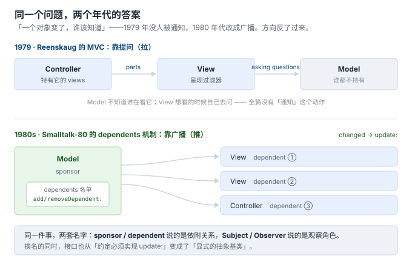
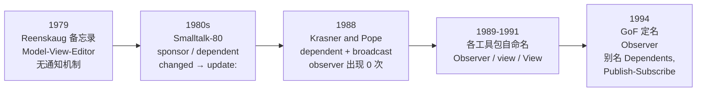

# 1. 诞生背景：一个对象变了，谁该知道

> 本节的一手材料（都可自行下载核对，不接受转述）：
> - Trygve Reenskaug，*Thing-Model-View-Editor*（1979-05-12，11 页）与 *Models-Views-Controllers*（1979-12-10，2 页）合订本：[MVC_Originals.pdf](https://folk.universitetetioslo.no/trygver/2007/MVC_Originals.pdf)
> - Glenn E. Krasner & Stephen T. Pope，*A Cookbook for Using the Model-View-Controller User Interface Paradigm in Smalltalk-80*，JOOP 1(3)，1988，pp. 26–49（下称 **KP88**）：[PDF](https://iihm.imag.fr/blanch/ens/2006-2007/RICM3/IHM/documents/krasner-MVC.pdf)
> - Erich Gamma、Richard Helm、Ralph Johnson、John Vlissides，*Design Patterns*，第 5 章 Observer，1994（下称 **GoF94**）：[该章全文](https://people.csail.mit.edu/addy/pattern/pat5g.htm)

## 先说结论：这个名字是 1994 年才有的

「观察者」这个叫法，在它的事实源头里**一次都没出现过**。这不是修辞，是可数的：

| 文献 | 年份 | `observ*` | `depend*` | `notif*` | `broadcast*` | `subscrib*` |
|---|---|---|---|---|---|---|
| Reenskaug 两篇 MVC 原始备忘录 | 1979 | **0** | 5（全是普通英文） | **0** | **0** | **0** |
| Krasner & Pope（JOOP 1(3)） | 1988 | **0** | 33 | 4 | 5 | **0** |

复现方式（`pdftotext` 由 poppler-utils 提供）：

```bash
pdftotext -layout MVC_Originals.pdf - | grep -o -i 'observ[a-z]*'  | wc -l   # 0
pdftotext -layout krasner-MVC.pdf  - | grep -o -i 'observ[a-z]*'  | wc -l   # 0
pdftotext -layout krasner-MVC.pdf  - | grep -o -i 'depend[a-z]*'  | wc -l   # 33
pdftotext -layout krasner-MVC.pdf  - | grep -o -i 'broadcast[a-z]*'| wc -l  # 5
```

> 口径说明：两份 PDF 的文字层都来自扫描件 OCR（KP88 把 `Menlo Park` 错读成 `Menio Park`，实测 2 处）。所以上表是「**该文字层里检索为 0**」，不是「原件印刷品一定没有」。但 `observ*` 为 0 有独立旁证——GoF94 自己在别名栏承认了前身的名字，见下。

KP88 全文里 `publish` 只出现在出版社名 `Addison-Wesley Publishers`。也就是说，**连今天被当作同义词的「发布/订阅」，1988 年也还不存在**。

那 1994 年发生了什么？GoF 给它定了名，并把两个旧名字留在了别名栏：

> **Observer**
> **Intent**　Define a one-to-many dependency between objects so that when one object changes state, all its dependents are notified and updated automatically.
> **Also Known As**　Dependents, Publish-Subscribe

别名栏是 GoF 自己写的「它以前叫什么」。所以本节的问题——**「观察者」这个名字是从哪冒出来的**——答案的前一半已经有了：它冒出来，是为了**取代**一个更早的名字。

更早的名字暴露了什么，要看机制本身是哪一年、以什么形态出现的。

## 1979：MVC 诞生，但「通知」根本不在里面

Reenskaug 对命名的回忆很短，信息量却很大：

> The hardest part was to hit upon good names for the different architectural components. Model-View-Editor was the first set.
> —— [Reenskaug 的 MVC 页面](http://folk.uio.no/trygver/themes/mvc/mvc-index.html)

第一版是**四件套**：Thing-Model-View-**Editor**（1979-05-12 备忘录的标题就是这四个词）。第二版才是今天的三件套 Model-View-Controller（1979-12-10）。他说改名是「after long discussions, particularly with Adele Goldberg」。

但把这两篇原文通读一遍会发现一件更意外的事：**「一个对象变了，别的对象怎么知道」这个问题，1979 年压根没被回答——因为当年的设计里不需要回答。**

1979-12-10 那篇对 View 的定义（原文）：

> A view is attached to its model (or model part) and **gets the data necessary for the presentation from the model by asking questions**. It may also update the model by sending appropriate messages.

View 是**主动去问**的（今天叫 pull）。同一篇里 Controller 的职责是「接收用户输入，翻译成消息，**把消息传给一个或多个 View**」；并且明确写着：

> A controller is connected to all its views, they are called **the parts of the controller**.

把这几句拼起来，1979 年的拓扑是：

- **Controller 持有 View**（views 是 controller 的「parts」）
- **View 持有 Model 的引用**，要数据时自己去问
- **Model 谁都不持有**——它不知道有谁在看它

这和今天的观察者**方向正好相反**。今天说「Model 持有那张观察者名单」；1979 年说「Controller 持有 View」。模型变化后多个显示端怎么同步？原文里没有这个机制——不是换了个名字，是**还没有**。



## 1980 年代：机制补上了，名字叫 dependency mechanism

MVC 从备忘录变成 Smalltalk-80 类库时，机制才被补进去。Reenskaug 把这段工作明确划到别人名下：

> **Jim Althoff** and others implemented a version of MVC for the Smalltalk-80 class library **after I had left Xerox PARC**; I was not involved in this work.

补进去的东西有三件，命名是：

| 概念 | Smalltalk-80 里的名字 |
|---|---|
| 两个角色 | **sponsor**（被依赖者）／ **dependent**（依赖者） |
| 两条消息 | `changed`（我变了）／ `update:`（你更新一下） |
| 登记协议 | `addDependent:` / `removeDependent:` / `release` / `dependents` |

「我变了」这条消息的名字值得停下来看一眼：**`changed` 不指定接收方**。发送方只说「我变了」，由运行时的依赖表负责派发。KP88 转述 Smalltalk-80 的源码语义非常直白：

> Sending the message `changed` to a Model causes the message `update` to be sent to each of its dependents.

**这就是「广播」一词的出处**——不是设计者想强调「一对多」，而是因为发送方手里根本没有接收方。它只能喊一嗓子。

## 1988：第一次公开描述，全篇没有 observer

MVC 在 PARC 内部用了近十年，才第一次被完整公开描述，就是 KP88 那篇 Cookbook（JOOP 1(3)，正文 24 页）。它今天被引用 400 次以上，也是 GoF94 的 Observer 章 Motivation 里引用的第一篇文献。而它的用词是：

> **Dependents** — To manage change notification, the notion of objects as dependents was developed. Views and controllers of a model are registered in a list as dependents of the model, to be informed whenever some aspect of the model is changed. When a model has changed, a message is **broadcast** to notify all of its dependents about the change.

注意登记进名单的是 **Views 和 Controllers 两个**（GoF94 的 Observer 只对应 View 的角色）。原因是 1980 年代的 Smalltalk 里，Controller 也需要知道模型状态才能决定交互方式。

### 顺带捞到两条线索

**① 生命周期负债在 1988 年就已经点名**（第 6 节的主线，这里先埋）：

> Since views and controllers hold **direct pointers** to their models, the `DependentsFields` dictionary creates a type of **circularity that most storage managers cannot reclaim**. One by-product of the `release` mechanism is to remove an object's dependents which will break these circularities... Therefore, we encourage the use and sub-classing of `Model`.

即：View 持有 Model 的指针、全局字典又持有 View ⇒ **引用环，多数存储管理器回收不了**；解法是在 `release` 时把 dependent 摘掉。KP88 还给了个建议——用 `Model` 类（依赖表放实例变量），别用挂在 `Object` 上的全局字典 `DependentsFields`，因为后者造成的环「多数存储管理器无法回收」，而前者是「direct kind，收得掉」。

**「谁持有那张名单」这个问题，从机制诞生第一天就有代价**，不是现代 C++ 才有的新问题。

**② GoF 的 Observer 不是凭空提炼的，路径就在 KP88 的 Further Reading 里**：

> Ralph E. Johnson. "Model/View/Controller" Department of C.S., U. of Illinois, Urbana-Champaign, November, **1987**

Ralph Johnson 正是 GoF 四人之一。**他在 1987 年就写过一篇专讲 MVC 的内部文档**，七年后这本书里的 Observer 章成型。

## 1989 → 1994：同一个机制，每个工具包起一个名

先看整条链：



GoF94 的 Known Uses 一节列了同期各自命名的实现——这说明「Observer」并不是唯一自然的名字：

> The first and perhaps best-known example of the Observer pattern appears in Smalltalk Model/View/Controller (MVC)... MVC's `Model` class plays the role of **Subject**, while `View` is the base class for **observers**.
>
> Other user interface toolkits that employ this pattern are InterViews [LVC89], the Andrew Toolkit [P+88], and Unidraw [VL90]. **InterViews defines `Observer` and `Observable` (for subjects) classes explicitly. Andrew calls them "view" and "data object," respectively. Unidraw splits graphical editor objects into `View` (for observers) and `Subject` parts.**

| 系统 | 观察者一侧 | 被观察一侧 |
|---|---|---|
| Smalltalk-80 MVC（1980s） | dependent（实现 `update:`） | Model / sponsor |
| InterViews（1989） | **Observer** | Observable |
| Andrew Toolkit（1988） | view | data object |
| Unidraw（1990） | View | Subject |
| GoF94（1994） | **Observer** | **Subject** |

GoF 做的事，是把这堆各自为政的命名收敛成一组角色名，并宣布它是个模式。

## 三个名字差在哪

这一节要回答的是「更早的名字暴露了什么」。把三代用词并排放：

| | `dependent`（1980s–1988） | `publish-subscribe`（1994 列为别名） | `observer`（1994 定名） |
|---|---|---|---|
| 描述的是 | **关系**：谁依附于谁 | **通信方式**：发与收 | **角色**：谁在看 |
| 对生命周期的暗示 | 强——dependent 依附于 sponsor，天然要问「什么时候解除」 | 中——订阅是可撤销、有期限的 | 弱——observer 看起来随时可以走 |
| 对接口的要求 | **隐式**：约定必须实现 `update:` | 无规定，只描述通信模式 | **显式**：GoF94 给出抽象基类 `Observer` |

前两行是对语义的解读，第三行是硬事实——GoF94 的 Sample Code 直接给了接口：

```cpp
class Observer {
public:
    virtual ~Observer();
    virtual void Update(Subject* theChangedSubject) = 0;
protected:
    Observer();
};
```

**从 `dependent` 到 `observer`，换掉的不只是一个词，还有「接口是约定还是契约」。** Smalltalk 里 `update:` 是一条约定的消息名——你不实现它，编译器不管，运行到广播那一刻才炸；`Observer::Update` 是一个虚函数——不实现它，**编译期**就过不去。

这一点解释了第 8 节要做的事为什么有意义：今天讨论「观察者和发布订阅是不是一回事」，争论的正是这两套名字各自的隐含假设，而不是某个技术细节。

## 这一节要你带走的

1. **「观察者」是 1994 年 GoF 起的名，前身叫 `Dependents` 和 `Publish-Subscribe`**（GoF94 的别名栏）。改名换的不是技术，是视角：从「谁依附于谁」换成「谁在看谁」。
2. **这个机制出现的前提是一次方向反转。** 1979 年：Controller 持有 View，View 想看了自己去问。1980 年代：Model 持有名单，Model 变了自己喊。观察者的全部性质——解除耦合、广播、意外更新、生命周期负债——都是这次反转的后果。
3. **它自带一份生命周期负债，1988 年就被点名。** 谁持有名单、谁负责注销，是第 6 节要结的账。

## 进度

- [x] 1 诞生背景
- [ ] 2 不用它的代价
- [ ] 3 谱系：四层不是并列
- [ ] 4 代码对比
- [ ] 5 业务场景
- [ ] 6 谁持有那张名单
- [ ] 7 语言演进
- [ ] 8 与相邻概念的边界
- [ ] 9 真实项目案例
- [ ] 10 收口
