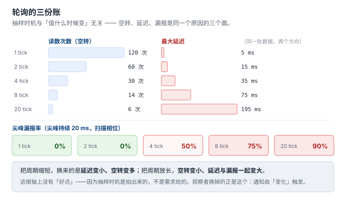
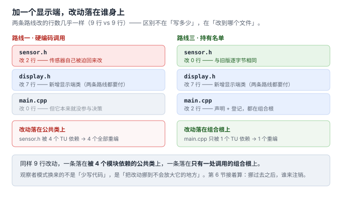
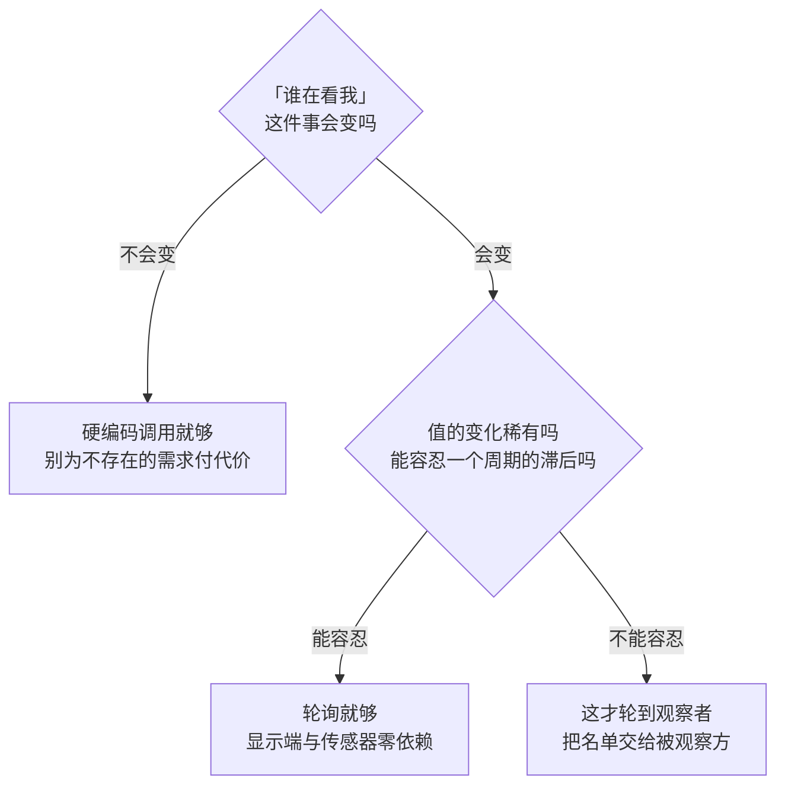

# 2. 不用它的代价：轮询空转与改一处的扩散

> 前置：第 1 节的结论 —— 这个机制诞生于一次**方向反转**（1979 年 View 主动去问 Model，1980 年代改成 Model 变了喊一嗓子）。
> 代码：[`code/02_cost/`](../code/02_cost/)（`bash build.sh` 一键编译运行全部；g++ 13.3 `-std=c++17 -O2 -Wall` 实测通过）
> 本节**不引入观察者**，先只算账：不用它，要付什么。谱系在第 3 节排，四层贯穿在第 4 节做。

## 固定场景：一个温度传感器 + 两个显示端

| 角色 | 是什么 | 代码里 |
|---|---|---|
| 被看的 | 一个温度值，会变 | `TempSensor` |
| 看的 | 两个显示端，值一变都要跟着变 | `NumberDisplay`（数字）/ `BarDisplay`（柱状） |

时间轴只有三拍：`23.5 → 24.1 → 25.0`。小到可以把每一条调用链摊开逐行看。

第 3、4 节都用这**同一个**场景，不许每节换一个例子 —— 换了就不是对照，是几篇独立的教程。

下面两条路线都能编译、都能跑出完全正确的结果（`build.sh` 里把两者的输出逐行 diff 过：**6 行全等**）。问题不在「对不对」，而在**加第三个显示端时，你要动谁**。

## 路线一：硬编码调用 —— 传感器认识每个显示端

[`code/02_cost/hardcoded/sensor.h`](../code/02_cost/hardcoded/sensor.h)：

```cpp
class TempSensor {
public:
    void set(double t) {
        t_ = t;
        number_.show(t_);   // ← 调用点 ①
        bar_.show(t_);      // ← 调用点 ②
    }
    double get() const { return t_; }

private:
    double        t_ = 0.0;
    NumberDisplay number_;   // ← 具体类型成员 ①
    BarDisplay    bar_;      // ← 具体类型成员 ②
};
```

实测输出：

```text
[ 23.5] NumberDisplay    23.5 C
[ 23.5] BarDisplay     #######################----------------- 23/40
[ 24.1] NumberDisplay    24.1 C
...
```

现在要加第三个显示端（`AlertDisplay`，超过 24 ℃ 报 `!! HIGH`）。改动落在这两处：

```diff
--- hardcoded/sensor.h
+++ hardcoded_3rd/sensor.h
@@
         number_.show(t_);   // ← 调用点 ①
         bar_.show(t_);      // ← 调用点 ②
+        alert_.show(t_);    // ← 调用点 ③
@@
     NumberDisplay number_;   // ← 具体类型成员 ①
     BarDisplay    bar_;      // ← 具体类型成员 ②
+    AlertDisplay  alert_;    // ← 具体类型成员 ③
```

**`main.cpp` 一行没动。** 那看着像好事，其实是坏事：**改动全压到了 `sensor.h` 上** —— 一个被别处依赖的公共类。

代价有两层：

**① 改了一个本来不该因为它而改的类。** 传感器关心的是「温度是多少」。谁来显示、有几个人显示，是别人的事，现在却要回到传感器里改。第 1 节那个方向反转说的正是这件事：名单在谁手里，谁就得跟着名单变。

**② 这个类被 4 个翻译单元依赖。** 不是推断，是实测 —— [`code/02_cost/fanout/`](../code/02_cost/fanout/) 里 4 个 TU（`main` + 三个业务模块）都 `#include "sensor.h"`，用 `-MMD` 让 make 认头依赖：

```text
--- 改 sensor.h（被 4 个 TU 直接依赖的公共头）---
      CXX main.cpp
      CXX a.cpp
      CXX b.cpp
      CXX c.cpp
    → 重编 TU 数：4

--- 改 main.cpp（只被 1 个 TU 依赖的组合根）---
      CXX main.cpp
    → 重编 TU 数：1

--- 改 display.h（4 个 TU 经 sensor.h 间接依赖）---
    → 重编 TU 数：4
```

**改动落在公共头上，代价按依赖面放大；落在组合根上，代价只有 1 个 TU。** 这一点本节结尾还要用。

## 路线二：轮询 —— 谁也不认识谁，但一直在问

另一条常见路线：传感器不通知任何人，显示端自己按固定周期去问。
每个显示端手里就这一小段循环（`polling.cpp` 里对应 `experiment_a` 的模拟）：

```cpp
for (;;) {
    wait_until_next_period();            // ← 循环里唯一的时间信息
    double v = sensor.read();            // ← 空转就记在这儿
    if (v != last_seen) { refresh(v); last_seen = v; }
}
```

把这个循环拆开看，会注意到一件事：**循环里唯一的时间信息是「到我的周期了吗」，它不知道「值什么时候变」。**

这句话推出三份账单（[`code/02_cost/polling.cpp`](../code/02_cost/polling.cpp)，时间轴 60 tick，1 tick = 10 ms，期间值只变了 3 次，两个显示端各自独立轮询）。

### 账一：延迟与空转是同一根轴的两端

| 轮询周期 | 读数次数 | 最大延迟 | 平均延迟 |
|---|---|---|---|
| 1 tick (10 ms) | 120 | 0.5 tick (5 ms) | 0.5 tick (5 ms) |
| 2 tick (20 ms) | 60 | 1.5 tick (15 ms) | 1.2 tick (12 ms) |
| 4 tick (40 ms) | 30 | 3.5 tick (35 ms) | 2.5 tick (25 ms) |
| 8 tick (80 ms) | 14 | 7.5 tick (75 ms) | 6.5 tick (65 ms) |
| 20 tick (200 ms) | 6 | 19.5 tick (195 ms) | 14.5 tick (145 ms) |



规律很干净：**读数次数 ∝ 1/周期**（120 → 6，正好 20 倍），**最大延迟 ≈ 周期**（0.5 → 19.5 tick）。

所以没有可调的好点：想让报警快，就把一个核烧掉；想省 CPU，就把报警拖到 195 ms 之后。**这不是调参问题，是抽样原理决定的** —— 抽样时机是拍出来的，跟「值什么时候变」没有因果关系。

### 账二：还会漏

延迟大只是慢，漏是另一种性质的错。一次尖峰（温度瞬时过冲 20 ms 又落回来），轮询能不能看见它，取决于**尖峰窗口里恰好有没有一个轮询时刻** —— 也就是相位，而相位是随机的。把相位扫一遍：

| 轮询周期 | 试验次数 | 漏报次数 | 漏报率 |
|---|---|---|---|
| 1 tick (10 ms) | 5 | 0 | **0%** |
| 2 tick (20 ms) | 10 | 0 | **0%** |
| 4 tick (40 ms) | 20 | 10 | **50%** |
| 8 tick (80 ms) | 40 | 30 | **75%** |
| 20 tick (200 ms) | 100 | 90 | **90%** |

规律同样干净：**周期 ≤ 尖峰时长，一次都漏不掉；周期一长过它，漏报率 = (周期 − 尖峰时长) / 周期。** 上表最后一列 50/75/90% 与这个公式逐个吻合。

这一条比账一严重：账一是「晚知道」，账二是「永远不会知道」。而且**同样的代码，这一次报警响了，下一次可能就没响** —— 这种缺陷不带规律，现场复现不了。

### 账三：忙轮询占满一个核

`polling.cpp` 第 C 段实测（本机）：

```text
   墙钟 200 ms 内问了 10112668 次（约 5056 万次/秒）
   进程 CPU 时间 218 ms —— 与墙钟时间基本相同，即这一个核被占满
   同一段时间里，值变化次数：0
```

**不管有没有变化，它都在问。** 这句就是「空转」的定义。平稳一点的写法会 `usleep` 到下一个周期，那时代价从「烧 CPU」变成「定时器唤醒 + 总线/寄存器访问」，但账一、账二一分不少 —— 因为它们与怎么等无关，只与「什么时候问」有关。

## 路线三：让被观察方持有名单

把名单从「传感器认识每个显示端」改成「传感器持有一张接口指针的名单」，值一变就对名单里的每个对象说一声（[`code/02_cost/observer/sensor.h`](../code/02_cost/observer/sensor.h)）：

```cpp
class TempSensor {
public:
    void attach(Display* d) { viewers_.push_back(d); }   // 登记
    void detach(Display* d) { /* ... */ }                // 注销

    void set(double t) {
        t_ = t;
        for (Display* v : viewers_) v->show(t_);   // ← 一句话，与名单长度无关
    }

private:
    double                t_ = 0.0;
    std::vector<Display*> viewers_;   // ← 名单
};
```

加第三个显示端，改动是：

```diff
--- observer/main.cpp
+++ observer_3rd/main.cpp
@@
     NumberDisplay number;
     BarDisplay    bar;
+    AlertDisplay  alert;      // ← 新增：第 3 个显示端
     sensor.attach(&number);   // ← 登记
     sensor.attach(&bar);      // ← 登记
+    sensor.attach(&alert);    // ← 登记
```

`observer_3rd/sensor.h` 与 `observer/sensor.h` **逐字节相同**（`build.sh` 里 `diff` 输出为空）。

### 这里有一个反直觉的数字

把两条路线的改动面并排放，`build.sh` 第 4 段的实测：

| 文件 | 硬编码调用 | 持有名单 |
|---|---|---|
| `display.h` | 7 | 7 |
| `sensor.h` | **2** | **0** |
| `main.cpp` | **0** | **2** |
| **合计** | **9** | **9** |

**总改动行数一样，都是 9 行。** 差别不在「写多少」，而在「改到谁身上」：



回到路线一测出的重编面：改 `sensor.h` → 4 个 TU 重编；改 `main.cpp` → 1 个。**观察者换来的不是更少的代码，是把改动挪到不会放大它的地方。**

这也解释了为什么「要不要用观察者」不能按代码行数判断 —— 9 行对 9 行，看不出区别；要按**改动位置**判断。

> `detach` 在本节只是一行摆设：没有任何地方调用它。这不是省略 —— **它是这份名单欠下的第一笔账**，第 6 节整节都在结这笔账（谁注册、谁注销、不注销会怎样）。

## 三条路线对照

| | 硬编码调用 | 轮询 | 持有名单 |
|---|---|---|---|
| **谁认识谁** | 传感器认识每个显示端 | 谁也不认识谁 | 传感器认识「一张名单」，不认识名单里的具体类型 |
| **值变了怎么传播** | 传感器逐个点名调用 | 没人传播，显示端下次轮到才发现 | 传感器对名单广播一次 |
| **加第三个显示端** | 改传感器（公共类，4 TU 重编） | 显示端自己加就行，但要点对周期 | 改组合根（1 TU 重编） |
| **延迟** | 0（同步调用） | 最坏 ≈ 一个轮询周期 | 0（同步调用） |
| **漏报** | 不会漏 | 周期长过瞬变时长就漏 | 不会漏 |
| **空转** | 无 | ∝ 1/周期 | 无 |
| **代价** | 改动落在公共类上 | 延迟、漏报、空转三笔一起付 | 多一层接口；欠一笔注销的账 |

## 判据：什么时候两条「错误路线」其实是对的

叫它们「错误路线」只在**显示端会变**的前提下成立。判据是这句：

> **「谁在看我」这件事，会不会变？**



树上两个问句就是判据：**「谁在看我」会不会变**、**能不能容忍一个周期的滞后**。三条支路的理由都写在框里；第 1 节那次方向反转，成立的前提正是最上面那个「会变」。

判据落在「变化频率」和「要不要漏」上，不落在「哪个模式更高级」上。这是本节和后面每一节都要用的尺子。

## 一句话总结

> **硬编码调用把改动摊在公共类上，轮询把改动换成延迟与漏报；观察者不是让代码变短，是把改动挪到一个不会放大它的地方 —— 但它自己留下一笔注销的账。**

## 进度

- [x] 1 诞生背景
- [x] 2 不用它的代价
- [ ] 3 谱系：四层不是并列
- [ ] 4 代码对比
- [ ] 5 业务场景
- [ ] 6 谁持有那张名单
- [ ] 7 语言演进
- [ ] 8 与相邻概念的边界
- [ ] 9 真实项目案例
- [ ] 10 收口
