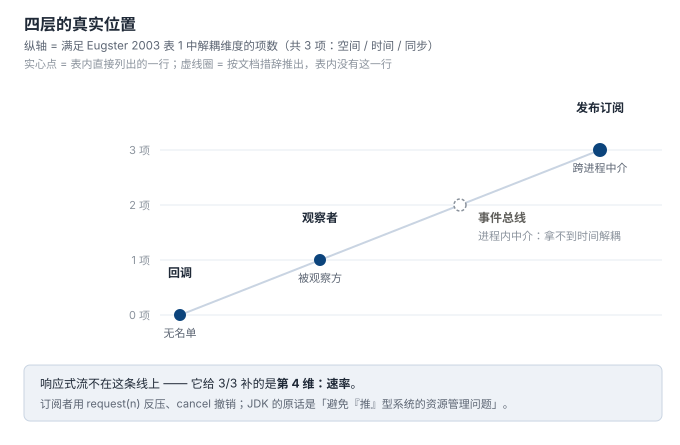
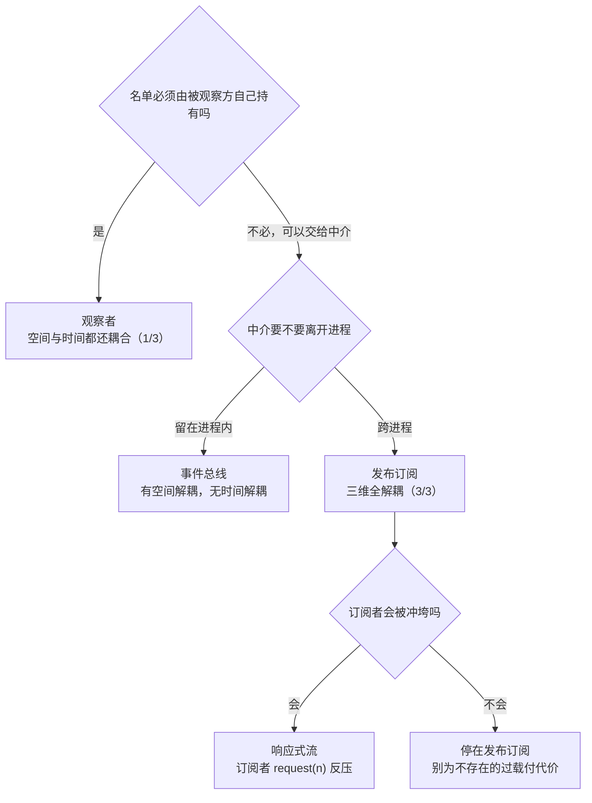

# 3. 谱系：四层不是并列，是「名单放在哪」在变

> **本节的一手材料**（都可自行下载核对，不接受转述）：
> - Erich Gamma、Richard Helm、Ralph Johnson、John Vlissides，*Design Patterns*，第 5 章 Observer，1994（下称 **GoF94**）：[该章全文](https://people.csail.mit.edu/addy/pattern/pat5g.htm)
> - Patrick Th. Eugster、Pascal A. Felber、Rachid Guerraoui、Anne-Marie Kermarrec，*The Many Faces of Publish/Subscribe*，**ACM Computing Surveys 35(2)**，2003，pp. 114–131（下称 **Eugster03**）：[PDF](https://se.inf.ethz.ch/old/people/eugster/papers/manyfaces.pdf)
> - Gregor Hohpe & Bobby Woolf，*Enterprise Integration Patterns*，Publish-Subscribe Channel 一节，2003（下称 **EIP**）：[InformIT 官方章节](https://www.informit.com/articles/article.aspx?p=1398615)
> - `com.google.common.eventbus` 官方 javadoc：[guava.dev](https://guava.dev/releases/30.1.1-jre/api/docs/com/google/common/eventbus/package-summary.html)
> - Reactive Streams 官方接口定义：[reactive-streams-jvm](https://github.com/reactive-streams/reactive-streams-jvm)；JDK 收录记录见 [JEP 266](https://openjdk.org/jeps/266)
>
> 例证复用第 2 节的同一份场景（[`code/02_cost/`](../code/02_cost/)）—— **本节不引入新代码**。它是谱系与判据节，靠一手文献说话。

## 先说结论

第 1 节末尾留了一句：今天讨论「观察者和发布订阅是不是一回事」，争论的正是这两套名字各自的隐含假设。

这一节把那场争论摊开。摊完之后，「四层不是并列」这句话要收紧一档：

> **前三层是一条线，刻度可数：0 / 1 / 3 —— 斜率由「名单放在哪」决定。**
> **第四层不在这条线上。**

先说清「四层」指哪四个名字，以免混淆：**回调 / 观察者 / 发布订阅** 是前三层；**第四层是两个名字的合称 —— 事件总线 与 响应式流**。合称这件事本身就是本节要拆的东西：这两个名字**不在同一根轴上**，把它们并排放在第四层是权宜之计。

下面按时间顺序，把上面两句话拆开。

## 1994：GoF 的判据只算了一半

GoF94 在 Implementation 一节里写了这句 —— 这是它把 `Publish-Subscribe` 放进别名栏的理由：

> This kind of interaction is also known as **publish-subscribe**. The subject is the publisher of notifications. It sends out these notifications **without having to know who its observers are**. Any number of observers can subscribe to receive notifications.

（别名栏 `Dependents, Publish-Subscribe` 本身在第 1 节引过，这里不重复。）

这句话里的判据是「**不知道观察者是谁**」。但回头看 GoF94 自己给的 Sample Code —— `Subject::Attach` / `Detach` / `Notify` —— **名单还在 subject 手里**。它不知道的是名单里那些对象的**类型**（只知道 `Observer` 抽象接口），不是**有没有人在听**。

于是判据其实是两问，GoF 只答了第一问：

| 问 | GoF 的观察者 | 真正的发布订阅 |
|---|---|---|
| 发布方知道订阅方的**类型**吗 | 不知道 | 不知道 |
| 发布方持有订阅方的**名单**吗 | **持有** | **不持有** |

这是 1994 年的口径：**判据是面向对象的**。`Observer` 那个抽象基类把「不知道具体类」做成了编译期契约（第 1 节那张「接口是约定还是契约」的表），于是「解耦」的目标看起来就达成了。

## 2003：判据换成三个可数的维度

九年后，一篇分布式系统方向的综述把尺子换了。Eugster03 给观察者的定义是这句：

> This type of interaction—where subscribers register their interest **directly with publishers, which manage subscriptions** and send events—corresponds to the **so-called observer design pattern** [Gamma et al. 1995] … Although publishers notify subscribers asynchronously, they **both remain coupled in time and in space**. Furthermore the communication management is **left to the publisher** and can become burdensome as the system grows in size.

给发布订阅的定义是这句：

> In other words, producers publish information on a **software bus (an event manager)** and consumers subscribe to the information they want to receive from that bus.

**判据从「不知道具体类」换成了「名单在不在发布方手里」**，并且拆成了三个维度。Eugster03 表 1（p. 121）可以逐格核对：

| Abstraction | 空间解耦 | 时间解耦 | 同步解耦 | 中几项 |
|---|---|---|---|---|
| Message passing | No | No | Producer-side | 0 |
| RPC/RMI | No | No | Producer-side | 0 |
| Asynchronous RPC/RMI | No | No | Yes | 1 |
| Future RPC/RMI | No | No | Yes | 1 |
| **Notifications（observer pattern）** | No | No | **Yes** | **1** |
| Tuple spaces | Yes | Yes | Producer-side | 2 |
| Message queuing (Pull) | Yes | Yes | Producer-side | 2 |
| **Publish/subscribe** | **Yes** | **Yes** | **Yes** | **3** |

表格里的每一个 `Yes` / `No` 都是原文照抄；最后一列「中几项」是我加的统计，规则：`Yes` 计 1，`Producer-side` 与 `No` 都不计（`Producer-side` 原文单列成一档，不是 `Yes`）。

**观察者中 1 项，发布订阅中 3 项。** 这不是「谁更高级」，而是**同一条轴上更远的一格**。

表里 observer 那一行的名字也值得看一眼：**Notifications (observer pattern)**。Eugster 把「事件通知」和「观察者」当同一格 —— 这正是它要做的事：**把机制的公共名字（通知）与某个具体模式的专名（observer）分开。** 所以 1994 年那次「改名」，其实没有改变机制，只是给机制换了个更窄的名字。

词频在说同一件事：

| 词 | Eugster03 全文出现次数 |
|---|---|
| `publish` + `subscribe` 连写 | **72** |
| `decoupl` | 31 |
| `notif` | 26 |
| `observ` | **4** |

```bash
pdftotext -layout manyfaces.pdf manyfaces.txt
python3 - <<'PY'
import re
t = open('manyfaces.txt', encoding='utf-8', errors='replace').read()
for pat in [r'publish[/\- ]{0,2}\s*subscribe', 'observ', 'decoupl', 'notif']:
    print(f'{pat:32s}', len(re.findall(pat, t, re.I)))
PY
```

比值约 **18 : 1**。那 4 次 `observ` 里还有 1 次写的是「**so-called** observer design pattern」—— 这个限定词是立场信号：**作者不把 observer 当母概念，只当这个范式的一个特例。**

> 口径说明：Eugster03 的 PDF 是双栏排版，`pdftotext -layout` 提取后左右栏会交错，读上下文要按行号定位而不是连续行。上面第一条正则是跨行版（`\s*` 含换行）；只用不跨行的 `publish[/\- ]*subscribe` 得 71 次，差的那 1 次就是折行。

### 补上第二问：发布方数得出有几个人在听吗

Eugster03 在讲系统模型时，给了判据最直接的一段描述：

> Subscribers register their interest in events by typically calling a `subscribe()` operation on the event service, **without knowing the effective sources of these events**. This subscription information **remains stored in the event service and is not forwarded to publishers**. The symmetric operation `unsubscribe()` terminates a subscription.

> The publishers **do not usually hold references to the subscribers, neither do they know how many of these subscribers are participating** in the interaction. Similarly, subscribers do not usually hold references to the publishers, neither do they know how many of these publishers are participating in the interaction.

**「不持有引用」+「不知道有多少」** —— 这才是 1994 年那句话缺的另一半。把它和第 2 节的代码对上，一行都不用改，读一眼就行：

| | 名单长在哪 | 发布方能数出人数吗 |
|---|---|---|
| 第 2 节路线一 · 硬编码 | 没有名单，调用点写死 | 能（全在源码里） |
| 回调 | 调用方手里一根指针 | **不能**（是不是空的、指向谁，都看不出来） |
| 第 2 节路线三 · 持有名单 | `TempSensor::viewers_` | **能**（`viewers_.size()`） |
| 发布订阅 | event service 里，不转发给发布方 | **不能** |

第 2 节的判据是「**谁在看我这件事会不会变**」；这里补上第二问「**我看不看得到有谁在看我**」。两问合起来，才够区分这四层。

## 那一刀是谁切的：一个 event channel

分离动作发生在同一年（2003），是 EIP 干的。它把两个名字的关系写成了一句话：

> The **Observer pattern [GoF]** describes the need to decouple observers from their subject (that is, the originator of the event) so that the subject can easily provide event notification to all interested observers no matter how many observers there are (even none). The **Publisher-Subscriber pattern [POSA] expands upon Observer by adding the notion of an event channel** for communicating event notifications.

**「expands upon Observer by adding the notion of an event channel」** —— 这是「升一层多付什么」最精确的一手答案：**多付一个通道**。而通道一出现，名单就不在发布方手里了，前面那几个 `No` 才可能变成 `Yes`。

EIP 还顺手记下了通道带来的一个新能力（这是总线层特有的，观察者没有）：

> Many messaging systems allow subscribers to Publish-Subscribe Channels to specify special **wildcard** characters. … an application could subscribe to `MyCorp/Prod/OrderProcessing/*` and receive all messages related to order processing.

**按通配符路由**。观察者的名单里没有「主题」这个概念 —— 它只有「谁」，没有「哪一类」。

## 事件总线：中介化了，但没有离开进程

Guava 的官方 javadoc 是这一层的一手件：

> The EventBus allows **publish-subscribe-style** communication between components **without requiring the components to explicitly register with one another** (and thus be aware of each other). It is designed **exclusively to replace traditional Java in-process event distribution using explicit registration**. It is **not a general-purpose publish-subscribe system, nor is it intended for interprocess communication**.

三句话，三个事实：

1. **它替代的是「显式注册的进程内事件分发」** —— 那正是观察者的形态（我持有名单，你注册到我这儿）。所以 EventBus 的直接对手是**观察者**，不是发布订阅。「publish-subscribe-style」这个词是在说**它的形状**，不是它的定位。
2. **它留在进程内** —— 订阅者必须在发布那一刻是活着的。**时间解耦没有拿到。** Eugster03 表 1 里，只要有一维不是 `Yes`，就不在 `Publish/subscribe` 那一行。
3. 它换来的是**按类型路由**：同一份 javadoc 明写 `events are automatically dispatched to listeners of any supertype, allowing listeners for interface types or "wildcard listeners" for Object`。

所以「事件总线」落在观察者与发布订阅**之间**：拿到了空间解耦（组件之间不用互相知道），没拿到时间解耦。

> ⚠️ **这一格是推论，不是 Eugster03 表里的一行** —— 原表没有 `Event bus` 行。依据是 Guava javadoc 的两句自述：「不需要互相显式注册」⇒ 空间解耦成立；「不做进程间通信」⇒ 时间解耦不成立。至于同步那一维，取决于同步还是异步实现（`EventBus` 的 `post()` 会阻塞到所有订阅者执行完，`AsyncEventBus` 不阻塞），所以这里不给确定刻度。

## 响应式流：补的是速率

JEP 266（Owner: **Doug Lea**，Release **9**）的 Summary 第一句就是：

> An **interoperable publish-subscribe framework**, enhancements to the `CompletableFuture` API, and various other improvements.

**JDK 自己把 Reactive Streams 归类为发布订阅** —— 所以它不是新的一层。Description 里接着说明它补的是什么：

> … each managed by a `Subscription`. Communication relies on a simple form of **flow control** (method `Subscription.request`, for communicating **back pressure**) that can be used to avoid **resource management problems that may otherwise occur in "push" based systems**.

**「避免『推』型系统的资源管理问题」** —— 这句话把前三层归成了一类：**它们在数据流方向上都是「推」。** 响应式流给「推」加了一个反向信号。

Reactive Streams 的接口一共三件（原文签名）：

```java
public interface Publisher<T>  { void subscribe(Subscriber<? super T> s); }
public interface Subscriber<T> { void onSubscribe(Subscription s);
                                 void onNext(T t);
                                 void onError(Throwable t);
                                 void onComplete(); }
public interface Subscription  { void request(long n);
                                 void cancel(); }
```

> A `Subscriber` **MUST signal demand** via `Subscription.request(long n)` to receive `onNext` signals.

**订阅者不主动要，就收不到。** 而且 `onSubscribe(Subscription s)` 把「订阅」本身做成了一个**可以被传递、被计数、被取消的一等对象** —— 第 2 节里那行没人调用的 `detach`，在这里变成了协议的一部分（这笔账第 6 节结）。

Eugster03 的三个维度里**没有这一维**。它给同步解耦的定义是：

> **Synchronization decoupling**: Publishers are **not blocked** while producing events, and subscribers can get asynchronously notified (**through a callback**) of the occurrence of an event while performing some concurrent activity. The production and consumption of events do not happen in the main flow of control of the publisher.

通篇讲的是「**发布方**不被阻塞」，**没有回答订阅方处理不过来时会发生什么**。这正是响应式流补上的第 4 维。

> 顺带一个有用的细节：这段定义里出现了 `through a callback`。**回调是这一族机制共同的实现载体** —— 观察者用回调，发布订阅用回调，响应式流也用回调。它们的差别从来不在「用不用回调」，只在**那张名单放在哪**。

## 四层的真实位置

把上面几节的结果画在一起：



图怎么读：横轴是「名单放在哪」（没有 → 被观察方 → 中介），纵轴是「中了 Eugster03 表 1 的几项」。**实心点是表里直接有的行，虚线圈是按文档措辞推出来的位置。**

## 什么时候该升到下一层

第 2 节那棵判据树停在一句「这才轮到观察者，把名单交给被观察方」。本节从那里接着往下问：



每次升一格的账单，逐条列出来：

| 升格 | 多付 | 换来 | 依据 |
|---|---|---|---|
| 硬编码 → 回调 | 一个间接层；名单长度 1，**不可枚举** | 调用点在运行期可变 | Eugster03 把回调记为同步解耦的实现载体 |
| 回调 → 观察者 | ① 抽象接口（编译期契约）② **登记 / 注销协议** | 名单变成 N，**可枚举**（`viewers_.size()`） | GoF94 的 `Observer` 接口 + `Attach`/`Detach` |
| 观察者 → 发布订阅 | ① **一个额外的组件**（event channel）② 发布方再也数不出有几个人在听 ③ 事件可能**没有接收者** | 空间与时间解耦 | EIP「adds an event channel」；Guava 为此专门提供 `DeadEvent` |
| 发布订阅 → 事件总线 | **时间解耦**（退回进程内） | 按类型 / 通配符路由；总线可以不止一条 | Guava javadoc；EIP 的通配符订阅 |
| → 响应式流 | 订阅者必须**主动报需求**（`request(n)`），不能再被动等推 | 背压：快发布方压不垮慢订阅者 | JEP 266 |

注意第三行第 ③ 条：**「事件可能没有接收者」是通道带来的新故障模式**，不是解耦的副产品 —— 它是「发布方不知道有谁在听」的直接后果。观察者没有这个问题（名单空了就是没人，数一下就知道），发布订阅有，所以 Guava 得专门做一个 `DeadEvent` 来兜它：

> subscribe to `DeadEvent`. The EventBus will notify you of any events that were posted but not delivered. (Handy for debugging.)

## 判据：三条能从代码里直接读出来的

把上面所有文献的结论压成三个可以 grep 的问题：

| # | 问题 | 回调 | 观察者 | 发布订阅 |
|---|---|---|---|---|
| 1 | 发布方**持有**订阅方的引用吗 | 持有（一根指针） | **持有**（一张名单） | 不持有 |
| 2 | 发布方**数得出**有几个人在听吗 | 数不出 | **数得出** | 数不出 |
| 3 | 订阅方**数得出**有几个发布方吗 | — | 通常数得出（反向引用） | 数不出 |

第 2 条是本节补的，也是最好用的：**它可以从代码直接读出来**。第 2 节的例子就在那里 ——

```bash
grep -n 'viewers_\|attach\|detach' code/02_cost/observer/sensor.h
```

只要名单是 `TempSensor` 的一个成员，它就在轴上的「观察者」那一格；只要名单搬进了一个 `EventService` 之类的第三方对象、且不再转发给发布方，它才升到「发布订阅」。

> 这条判据与第 2 节的那棵判据树是同一把尺子的两面：**第 2 节问「要不要建立这张名单」，本节问「名单建好了放在谁家」。**

## 这一节要你带走的

1. **「观察者」和「发布订阅」在 1994 年是同义词**（GoF94 的 Implementation 节原文），**在 2003 年才分开**（Eugster03 的三维表 + EIP 的 event channel）。分开的原因不是有人改了定义，而是**判据从严了**：从「不知道具体类」严到「不持有名单、不知道人数」。
2. **前三层是一条线，刻度可以数**：0 / 1 / 3。斜率只由一件事决定 —— **名单放在哪**。所以「哪个更高级」是个假问题，真问题是「这份名单该由谁持有」。
3. **第四层的两个名字不在同一根轴上**：事件总线是**退回进程内**换路由，响应式流是**加第 4 维（速率）**。把它们并排叫「第四层」只是叙述方便，不是结构事实。
4. **回调不是一层，是这一族共同的载体**（Eugster03 定义里那个 `through a callback`）。四层的差别从来不在「用不用回调」。

## 进度

- [x] 1 诞生背景
- [x] 2 不用它的代价
- [x] 3 谱系：四层不是并列
- [ ] 4 代码对比
- [ ] 5 业务场景
- [ ] 6 谁持有那张名单
- [ ] 7 语言演进
- [ ] 8 与相邻概念的边界
- [ ] 9 真实项目案例
- [ ] 10 收口
