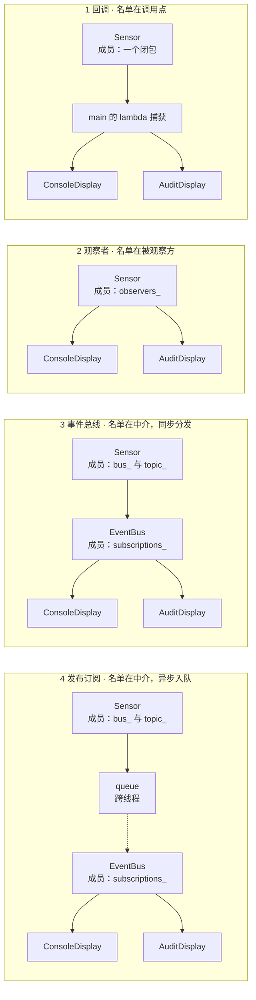
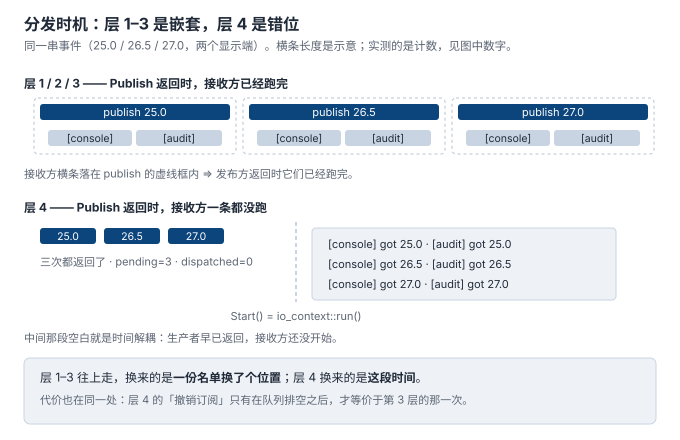

# 4. 代码对比：同一份场景，四层各写一遍

> **本节的一手材料就是这四份代码**，都在 [`code/04_compare/`](../code/04_compare/)：
> `layer1_callback.cpp` / `layer2_observer.cpp` / `layer3_eventbus.cpp` / `layer4_pubsub.cpp`。
>
> 两份工具脚本负责把结论从输出里读出来，而不是靠人读：
> - [`run_compare.sh`](../code/04_compare/run_compare.sh) —— 逐层编译运行（`-Wall -Wextra` 干净）＋ 可数性 grep 证据
> - [`check_growth.py`](../code/04_compare/check_growth.py) —— 让**编译器**回答「场景长大时谁被牵连」
>
> 第 3 节用文献把刻度定成 **0 / 1 / 3**，并留下一个**推论**：事件总线落在 1 与 3 之间。
> 本节用四份能跑的代码把那个推论补成 **0 / 1 / 2 / 3**，并把每一级的价格标出来。

## 先说结论

第 3 节把「名单放在哪」定为那把尺子的斜率。这一节让它落地，落出来的东西比那句话更具体：

> **升一层换到的从来不是「解耦」这个笼统的东西，而是一件可以指着说的东西：**
> **回调 → 观察者**换的是*名单从调用点搬进被观察方*；
> **观察者 → 事件总线**换的是*名单再从中介手里拿走*；
> **事件总线 → 发布订阅**换的是**时间**。
>
> 而且每一层都当场留下一笔账 —— **第 1 层那笔最容易被忽略：它连「撤销一个订阅方」都做不到。**

## 场景：四层共用同一份，不许换

| 要素 | 取值 |
|---|---|
| 生产者 | `Sensor`，只会报温度 |
| 接收方 | `ConsoleDisplay`（打印）与 `AuditDisplay`（打印并累计） |
| 事件序列 | `25.0` → `26.5` → `27.0`，然后**撤销 audit**，再报 `28.0` |
| 期望 | 前三次两个都收到；`28.0` 只有 console 收到 |

三个显示端会更好看，但两个就够 —— 这一节要区分的是**名单的位置**，不是名单的长度。

四份文件里，`main()` 的事件序列逐行相同，连那三行注释都相同：

```cpp
  // --- cancel demo: the same three lines appear in all four files ---
  std::printf("-- unsubscribe audit\n");
```

**唯一不同的是这一层用什么方式注销**（以及第 1 层根本写不出这一行）。对照要成立，差异就只能来自被对照的那一样东西。

| 文件 | 层 | 行数 |
|---|---|---|
| [`code/04_compare/layer1_callback.cpp`](../code/04_compare/layer1_callback.cpp) | 1 回调 | 67 |
| [`code/04_compare/layer2_observer.cpp`](../code/04_compare/layer2_observer.cpp) | 2 观察者 | 87 |
| [`code/04_compare/layer3_eventbus.cpp`](../code/04_compare/layer3_eventbus.cpp) | 3 事件总线 | 108 |
| [`code/04_compare/layer4_pubsub.cpp`](../code/04_compare/layer4_pubsub.cpp) | 4 发布订阅 | 201 |

行数一路涨上去不是排版问题：第 4 层那 93 行差额，买的就是上面那段 `pending=3 dispatched=0`。

## 四份代码的骨架差异



看两处就够：

1. **`Sensor` 的成员**。第 1 层是 `Sink sink_`（一个闭包）；第 2 层是 `std::vector<Observer*> observers_`；第 3、4 层是 `EventBus& bus_` 加 `std::string topic_`。生产者的「知道面」一层比一层窄，第 3 层起就只剩一个中介和一个名字。
2. **第 3 层与第 4 层的 `EventBus` 接口完全相同**。差别只在 `Publish` 里那几行做的是「现在就调」还是「入队，让别人去调」。这不是巧合 —— 它正是第 3 节那句「事件总线与发布订阅是同一副中介、差一个时间维度」在代码里的样子。

## 逐行输出对比

### 第一次读数：层 1 / 2 / 3 逐字相同，层 4 不像

```
# 层 1 / 2 / 3（三份输出在这一段逐字相同）
-- publish 25.0
[console] got 25.0
[audit] got 25.0 (total 25.0)
-- publish 25.0 returned

# 层 4
-- publish 25.0 (dispatched so far=0)
-- publish 25.0 returned (dispatched so far=0)
```

层 1 / 2 / 3 的接收方行**夹在**两条 `publish` 行中间。层 4 没有中间 —— 而且层 4 还多印了一个计数，后面要用。

### 取消演示：第 1 层写不出这一行

```
层 1  -- unsubscribe audit
      -- publish 28.0
      [console] got 28.0
      [audit] got 28.0 (total 106.5)     ← audit 压根没停下来

层 2  -- unsubscribe audit
      -- publish 28.0
      [console] got 28.0
                                          ← audit 停了，累计值停在 78.5
      producer-side receiver count after detach: 1

层 3  -- unsubscribe audit
      -- publish 28.0
      [console] got 28.0

层 4  -- unsubscribe audit
      -- publish 28.0 (dispatched so far=3)
      -- publish 28.0 returned (dispatched so far=3)
      [console] got 28.0
```

第 1 层那一格是本节的第一个发现：**它没有「撤销」这个动作**。名单在调用点的 lambda 捕获里，生产者手上只有一个已经包好了两个接收方的闭包 —— 要停掉 audit，只能把整个闭包换掉，而那样 console 也会一起停。所以那一行输出里两个显示端都还在收，`audit` 的累计值一路涨到了 106.5。

#### 完整的层 4 输出（其余三层的命令与它相同）

```
$ sh run_compare.sh
-- publish 25.0 (dispatched so far=0)
-- publish 25.0 returned (dispatched so far=0)
-- publish 26.5 (dispatched so far=0)
-- publish 26.5 returned (dispatched so far=0)
-- publish 27.0 (dispatched so far=0)
-- publish 27.0 returned (dispatched so far=0)
-- 3 publishes done: pending=3 dispatched=0
[console] got 25.0
[audit] got 25.0 (total 25.0)
[console] got 26.5
[audit] got 26.5 (total 51.5)
[console] got 27.0
[audit] got 27.0 (total 78.5)
-- after drain: pending=0 dispatched=3
```

**发布方返回了三次，接收方跑了零次。** 这一段空白就是第 3 节说的「时间解耦」——它不是一个概念，是一个可以打印出来的数。



## 三条实测

### 一、分发时机：一个计数就够了

层 1 / 2 / 3 对「Publish 返回时接收方跑完了吗」的回答都是**是**，而且不需要额外装置 —— 接收方的行被夹在两条 publish 行中间，本身就是证据。

层 4 需要装置，因为答案是**否**：`dispatched()` 返回的是已经调用完接收方的次数，`pending()` 返回队列长度。实测 `pending=3 dispatched=0`。

那四行 `dispatched so far=0` 不是多余的日志。**它们是「Publish 已经返回」和「接收方尚未开始」这两件事同时为真的唯一书面形式** —— 没有它，读者只能相信注释。

`Start()` 被显式拆出来，是为了让上面这个数**可复现**；真实系统里它就是 `io_context::run()` / `QEventLoop::exec()`，而 `main()` 里调了两次 `Start()`，也正是 asio 那边「又有活要干了就再 run 一次」的写法。

### 二、发布方数得出人数吗

第 3 节从 Eugster03 的措辞里读出第二问：「publishers … neither do they know how many of these subscribers are participating」。本节用 grep 把它变成可执行判据：

```
$ grep -cE 'observer_count|receiver_count' layer1_callback.cpp layer2_observer.cpp \
                                          layer3_eventbus.cpp layer4_pubsub.cpp
layer1_callback.cpp:0
layer2_observer.cpp:3
layer3_eventbus.cpp:0
layer4_pubsub.cpp:0
```

第 2 层那 3 行是**声明 + 两处调用**，重点不在这个数字，在于**另外三层是 0**：

- 第 1 层：`Sensor` 里只有一个闭包，没有「几个」这回事；
- 第 3、4 层：中介内部当然知道名单（否则没法投递），但**发布方这一侧的接口上没有这个能力** —— `Sensor` 的全部成员就是 `bus_` 与 `topic_`。

⇒ **人数可不可数，和名单在不在系统里，是两件事。** 第 3、4 层里名单在，只是不在发布方手上。

### 三、场景长大时，谁被牵连

同一份场景加第二种事件（传感器故障）。四层的加法天然不同，于是牵连范围也不同。判据不靠人读 —— 让编译器说：

```
$ python3 check_growth.py

  文件                       加法                结果     被点名的既有类
  layer2_observer.cpp      契约里加一条纯虚        FAIL    AuditDisplay, ConsoleDisplay
  layer3_eventbus.cpp      多订一个主题           PASS    -
  layer4_pubsub.cpp        多订一个主题           PASS    -

--- layer2_observer.cpp 的报错原文（共 2 条）---
  layer2_observer.cpp: error: cannot declare variable 'console' to be of abstract type 'ConsoleDisplay'
  layer2_observer.cpp: error: cannot declare variable 'audit' to be of abstract type 'AuditDisplay'
```

只有第 2 层**炸了**，而且炸的原因正是它当初换到的那件东西：它把「接收方」提成了一个契约（`Observer` 基类）。契约一旦加宽，**每一个已有的接收方都必须跟着改** —— 编译器把两个都点了名。

第 3、4 层不受影响：加一种事件就是多订一个主题，`Sensor` 和两个既有显示端一行都不用动。

> **这是观察者最真实的一笔代价，也是很长时间里被「它比硬编码好」这句话盖住的一笔。**
> 第 2 节量过它的收益（改动挪到了不放大它的地方），这一节量到了它的支出。

第 1 层没进这个实验，因为**它连契约都没有**，没有东西可加宽，也就没有东西可炸。它付这笔账的方式不一样：生产者自己得知道有第二种事件存在 —— 这笔账落在下一节。

## 每一层的价格

| 层 | 拿到什么 | 付出什么 | 撤销订阅 |
|---|---|---|---|
| 1 回调 | 接收方可在运行期替换（但只能一个） | 名单落在**调用点**：生产者数不出人数，也删不掉其中任何一个 | **做不到** |
| 2 观察者 | 生产者数得出人数、能按人撤销 | **契约**：接收方必须继承；第二种事件要改基类 ⇒ 每个接收方跟着改 | `Detach(ptr)` |
| 3 事件总线 | 生产者只剩一个中介引用加一个主题名 | 多一层间接；撤销要拿 id 而不是指针对 | `Unsubscribe(id)` |
| 4 发布订阅 | 生产者**不等**接收方 | 队列 + 线程 + 锁；而且是笔**顺序债**（见下） | `Unsubscribe(id)`，但语义变了 |

第 4 层那格「语义变了」值得单独说一句，因为它在输出里看得见：那次 `unsubscribe` 之所以和第 3 层等价，是因为队列**已经排空**了。若队列里还压着事件，注销会先于那些事件生效 —— 第 3 节待展开清单里那条「`Subscription.cancel()` 与注销协议的关系」就落在这一格上，本节的代码是它的最小复现。

## 判据：三条能从代码里直接读出来的

1. **生产者的成员变量里，有没有接收方的名字或指针？** 有 ⇒ 回调或观察者；只有一个中介 + 一个主题/类型 ⇒ 第 3、4 层。
2. **生产者这一侧有没有一个「数出人数」的接口？** 有 ⇒ 观察者（或任何自己持有名单的形态）。
3. **`Publish` 这一行的下面，接收方的代码跑了吗？** 跑在同一个栈上 ⇒ 层 1–3；只入队就返回 ⇒ 第 4 层。

三条都不需要读文档，`grep` 与一段输出就够。

## 这一节要你带走的

四层放在一起看，最容易得出的结论是「越往上越好」。这一节的四份代码给的是相反的读法：

> **每一层都精确地买到了一件事，也精确地欠下一笔账。**
> 第 3 节说「什么时候该升到下一层」，本节给出的是同一句话的可执行版本 —— 你先说得出**你现在缺的是哪一件**：是缺「能数出人数」，还是缺「不被接收方拖住」，还是缺「加一种事件不要动所有人」。说不出，就别升。

## 进度

- 已完成：1 诞生背景 / 2 不用它的代价 / 3 谱系 / **4 代码对比**
- 下一节：**5 业务场景** —— 真实场景 ≥ 3 个，生活类比必须能指出在哪里失效
- 本节新增待展开：`事件总线的通配符与分层主题`（挂起于本节第 3 层）—— 回流第 8 节
