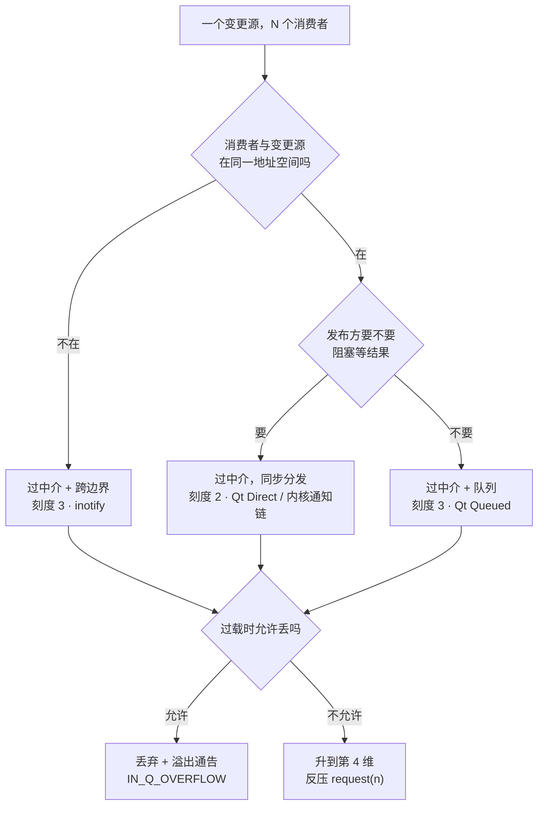
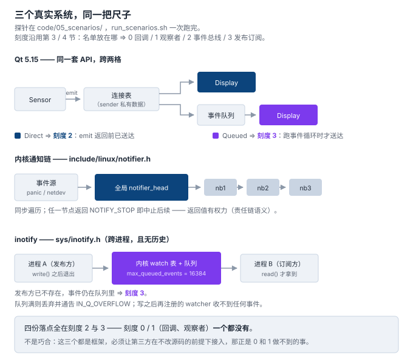

# 5. 业务场景：什么时候真的需要它

> 本节的一手材料是**三个真实系统**，都在本机可查、可跑：
>
> - **Qt 5.15 的 signal/slot** —— 真编译真跑（`moc` + `Qt5Core`）
> - **Linux 内核通知链** —— 内核态代码跑不了，就地摘引 `include/linux/notifier.h`
> - **inotify** —— 真编译真跑，外加 `man 7 inotify` 与 `/proc/sys/fs/inotify/`
>
> 探针在 [`code/05_scenarios/`](../code/05_scenarios/)，`run_scenarios.sh` 一次跑完三个场景。
> 第 4 节把尺子做成了可执行的；本节拿它去量**别人写的**系统。

## 先说结论

第 3 节那把尺子不是只对「自己写的代码」成立。拿它去量三个真实系统，量出三件事：

> 1. **三个系统全部落在刻度 2 与 3 上** —— 没有一个停在 0 或 1。
> 2. **其中一个是同一套 API 跨了两格**：Qt 的一个 `connect()` 参数，就在 2 与 3 之间来回。
> 3. **三个系统里没有一个**给调用方提供「数出几个人在听」的接口 —— 内核给的最多是一个布尔。

## 场景一：GUI 事件 —— 落点由连接类型决定

`Sensor::Tick` 在这里的三次运行里逐字相同：

```cpp
void Sensor::Tick(double value) {
  Say(QStringLiteral("-- publish %1").arg(value, 0, 'f', 1));
  emit Reading(value);
  Say(QStringLiteral("-- publish %1 returned").arg(value, 0, 'f', 1));
}
```

改的只是 `QObject::connect(...)` 最后那个参数：

```
$ ./run_scenarios.sh

=== A. DirectConnection ===
-- publish 25.0
   [direct] got 25.0 (hits=1)
-- publish 25.0 returned
   after Tick returned: hits=1  <- already delivered

=== B. QueuedConnection ===
-- publish 25.0
-- publish 25.0 returned
   after Tick returned: hits=0  <- nothing delivered yet
   -- running the event loop --
   [queued] got 25.0 (hits=1)
   after event loop: hits=1

=== C. AutoConnection across threads ===
-- publish 25.0
-- publish 25.0 returned
   after Tick returned: hits=0 by definition (hits() is on the other thread)
   [auto/cross-thread] got 25.0 (hits=1)
   after the worker drained: hits=1  <- Auto chose Queued
```

三组的读数正好是第 4 节那三行：

- **A 组**：接收方行**夹在**两条 `publish` 行中间 ⇒ 同步 ⇒ **刻度 2**（事件总线）。
- **B 组**：接收方行出现在 `returned` **之后**，而且要显式跑一次事件循环才出现 ⇒ 异步 ⇒ **刻度 3**（发布订阅）。
- **C 组**：跨线程时 `Auto` 自己选了 Queued ⇒ **框架在替你做这个决定**，判据是线程亲和性。

这个选择在 `QtCore/qnamespace.h` 里就是一个枚举（L1339–1345）：

```cpp
enum ConnectionType {
    AutoConnection,
    DirectConnection,
    QueuedConnection,
    BlockingQueuedConnection,
    UniqueConnection =  0x80
};
```

⇒ **尺子上的位置在这里不是一个设计属性，是一个参数的取值。** 同一条 `emit`，A 组落在 2、B 组落在 3。

顺带一提 `BlockingQueuedConnection`：投递方式（入队）与等待策略（阻塞）在这里是**两个正交维度**，Qt 把四种组合里的三种都做成了枚举值。第 3 节说「第 4 层是两个名字的合称，不在同一根轴上」，这个枚举就是那句话的工业版本。

**可数性**：Qt 有数出订阅者的能力，但不在公开接口上 —— `QObject::receivers(const char* signal)` 声明在 `QtCore/qobject.h` 第 433–436 行，落在 **`protected:`** 区。子类能问，调用方不能。

## 场景二：进程内的状态广播 —— 内核通知链

`include/linux/notifier.h` 的开头就是动机，作者署名 Alan Cox：

```c
/*
 *	Routines to manage notifier chains for passing status changes to any
 *	interested routines. We need this instead of hard coded call lists so
 *	that modules can poke their nose into the innards. The network devices
 *	needed them so here they are for the rest of you.
 */
```

**这段注释就是第 2 节那张账单的原话版。** 「hard coded call lists」是同一个东西；「so that modules can poke their nose into the innards」说的是同一件事的反面 —— 让模块能插进来，**而不必去改那个广播状态变化的调用方**。

名单长这样（L54–68）：

```c
struct notifier_block {
	notifier_fn_t notifier_call;
	struct notifier_block __rcu *next;
	int priority;
};

struct blocking_notifier_head {
	struct rw_semaphore rwsem;
	struct notifier_block __rcu *head;
};
```

关键在**节点自带 `next` 指针** —— 链表节点内嵌在订阅者自己的结构里（侵入式链表）。订阅者持有节点，注册只是把节点挂到 `head` 上。而 `head` 是全局的（`reboot_notifier_list` 之类就是文件作用域变量）。

⇒ 发布方（`panic()`、netdev 事件）**不持有名单**，名单在 `head` 里 ⇒ **刻度 2**（事件总线）。

### 回调有返回值，而且返回值有权力（L185–193）

```c
#define NOTIFY_DONE		0x0000		/* Don't care */
#define NOTIFY_OK		0x0001		/* Suits me */
#define NOTIFY_STOP_MASK	0x8000		/* Don't call further */
#define NOTIFY_BAD		(NOTIFY_STOP_MASK|0x0002)
```

`NOTIFY_STOP_MASK` 的意思是：**一个订阅者能让整条链停在这里。**

这是观察者没有的东西。观察者的通知是「告知」，返回值没人看；这里返回值**能决定后面的人还要不要被叫到**。

⇒ **被叫做「通知链」的东西，混进了责任链（Chain of Responsibility）的语义。** 名字里写的是「通知」，语义里带的是「有人说了算」。这是本节第一条反直觉的发现。

### 链内不许注销（L36–38）

```
 * atomic_notifier_chain_unregister(), blocking_notifier_chain_unregister(),
 * and srcu_notifier_chain_unregister() _must not_ be called from within
 * the call chain.
```

**内核直接在文档层面禁止「在回调里注销自己」。**

这正是第 4 节那个问题的另一条出路。我们的 `Publish` 里先把 handler 拷一份出来（`std::vector<Handler> targets`），所以回调里注销不会破坏遍历；内核选择**禁止**。同一个问题，两条路 —— 第 6 节正式结账。

### 只给「有没有人」，不给「有几个人」（L183）

```c
extern bool atomic_notifier_call_chain_is_empty(struct atomic_notifier_head *nh);
```

这是内核给出的唯一「问人数」的接口，**返回 bool**。它只回答「有没有人在听」，不回答「几个人在听」。

第 4 节量的是「发布方那一侧数不出人数」；这里更进一步 —— **连中介自己都不对外给人数。**

## 场景三：跨边界的热更新 —— inotify

第一次实测：发布方是一个**独立进程**，它已经退出了，事件还在内核队列里等着。

```
-- publish: writing /tmp/observer05-watch/config.txt
-- publish returned (file written, no consumer has run)
-- publisher process pid=153736 has exited
-- watcher now reads what the kernel queued:
[watcher-pid=153735] event: IN_CREATE /tmp/observer05-watch/config.txt
[watcher-pid=153735] event: IN_MODIFY /tmp/observer05-watch/config.txt
```

（pid 每次不同，其余逐字可复现。）

第 4 节第 4 层的「时间解耦」是「另一个线程」；这里升级成「**另一个地址空间，而且发布方可以已经不存在**」。

第二次实测：**写之后再注册的 watcher，一个事件都收不到。**

```
-- publish: writing /tmp/observer05-watch/late.txt
-- publish returned
-- late watcher registered; reading now:
[late-watcher] no event received
```

⇒ **队列有，历史没有。** 订阅必须发生在事件之前 —— 迟到的订阅者不是订阅者。

这和第 4 节第 4 层形成对照：那一层的 `pending()` 就是队列长度，队列里的东西**一定**会被投递；inotify 的队列只保证「注册之后」的事件。

### 过载时它选择丢

```
$ cat /proc/sys/fs/inotify/max_queued_events
16384
```

`man 7 inotify`：

> ...this limit are dropped, but an **IN_Q_OVERFLOW** event is always generated.

> **IN_Q_OVERFLOW** — Event queue overflowed (**wd is -1** for this event).

⇒ **inotify 对过载的答案是：丢弃 + 通告。**

对照第 3 节的响应式流：`Subscription.request(n)` 的背压是「**不让它丢**」。同一个问题（消费者跟不上），两个真实系统给了相反的答案：

| 这条通知 | 做法 | 停在哪 |
|---|---|---|
| 允许丢（配置变更、缓存失效 —— 丢一次，下次变更还会来） | 丢弃 + 溢出通告 | 第 3 维 |
| 不允许丢（交易指令、控制消息） | 背压，把压力推回生产者 | 第 4 维 |

**可数性**：`sys/inotify.h` 里没有任何「数 watch」的接口。

## 三个场景放在同一把尺子上

四个落点是怎么分出来的：



| 场景 | 名单放在哪 | 分发时机 | 有队列 / 有历史 | 刻度 |
|---|---|---|---|---|
| Qt `DirectConnection` | sender 的连接表（中介） | **同步**（`emit` 返回前） | 无 / 无 | **2** |
| Qt `QueuedConnection`（含跨线程 `Auto`） | 同上 ＋ 事件队列 | **异步**（事件循环跑时） | 有 / 无 | **3** |
| 内核通知链 | 全局 `notifier_head` | **同步**（中断或进程上下文） | 无 / 无 | **2** |
| inotify | 内核 `watch` 表 ＋ 队列 | **异步**（跨进程） | 有 / 无 | **3** |



⇒ **四个落点全在 2 与 3。刻度 0 和 1（回调、观察者）在这三个系统里一个都没有。**

这不是巧合。这三个系统都是**框架** —— 它们必须让第三方在不改源码的前提下接入，而「不改源码」正是刻度 0 和 1 做不到的事（第 2 节量过那个代价：硬编码改的是被四个 TU 依赖的头文件）。

⇒ **落在刻度 1 的样本不在框架里，在「一个类给另一个类装回调」的地方** —— 那是第 9 节的对象，本节欠着。

## 生活类比：它在哪里失效

把「订阅号」当成类比：你关注了它，它发文你收到；它不需要知道你是谁。

对应关系是干净的：关注＝注册、发文＝发布、推送到达＝分发、取关＝注销。**但有两处会立刻失效**，而这两处恰好是本节量出来的。

**失效一：类比里的发布方数得出粉丝数。**
本节测的三个系统里，发布方**一个都数不出人数** —— 内核给的是 `bool`，Qt 把 `receivers()` 放在 `protected`，inotify 干脆没有。真实的平台有账本，进程内的通知机制通常没有。

⇒ 用类比会让人以为「人数」是天然就有的。它不是：**它是一笔需要另外维护的账**（第 4 节第 2 层那个 `observer_count()` 就是这笔账，而它正是那一层唯一的收益）。

**失效二：类比里的消息会等你。**
订阅号的消息是持久的，你三天没看，消息还在。inotify 明确不这样：写完文件之后再注册的 watcher，一个事件都收不到。

⇒ 用类比会让人以为「订阅了就不会漏」。**只有带历史的系统才不漏** —— 而带不带历史，是一个需要显式选的决定，不是一个默认值。

⇒ 结论：**类比可以用来理解「解耦」这层意思，不能用来推断行为。** 类比里的那个「平台」既有账本又有历史；进程内的通知机制两样都没有。

## 什么时候真的需要它

三条判据，都不需要模式名：

1. **变更源和消费者在同一地址空间吗？**
   不在 ⇒ 必须过中介，从刻度 2 起，而且必须**现在**决定「要不要历史」。
2. **发布方要不要阻塞等结果？**
   要 ⇒ 同步分发（刻度 2）；不要 ⇒ 队列 + 分发（刻度 3）。
   注意 Qt 把这一步做成了 `connect()` 的一个参数，而 `AutoConnection` 进一步把它变成了**线程亲和性的推论**。
3. **过载时允许丢吗？**
   允许 ⇒ 丢弃 + 溢出通告就够；不允许 ⇒ 才需要为第 4 维（背压）付钱。

**反过来的那条同样重要**：如果只有一个消费者，它就在旁边、同一线程、也不会过载 —— **直接调，别套模式**。第 2 节量过套错的代价，本节量的是套对的场合：**上面三问里至少有一个的答案是「不是同一个空间」「要等」「不能丢」，才值得。**

## 这一节要你带走的

> 真实系统不问「我用不用观察者模式」。它们问三个更小的问题：
> **名单放哪、要不要等、丢了行不行。**
>
> 三个问题答完，落在哪一格是**算出来的**，不是选出来的。

还有一件值得单独记一笔：**三个系统里没有一个给出「人数」接口。** 第 4 节说「人数可不可数，和名单在不在系统里，是两件事」；这一节把它坐实了 —— 真实系统**宁愿不给这个数**。

## 进度

- 已完成：1 诞生背景 / 2 不用它的代价 / 3 谱系 / 4 代码对比 / **5 业务场景**
- 下一节：**6 谁持有那张名单** —— 内核那句 `_must not_ be called from within the call chain` 与第 4 节那份快照拷贝是同一问题的两条出路，那里正式结账
- 本节新增待展开：`IN_Q_OVERFLOW 的丢弃语义 vs 背压`（挂起于本节场景三）—— 回流第 8 节
