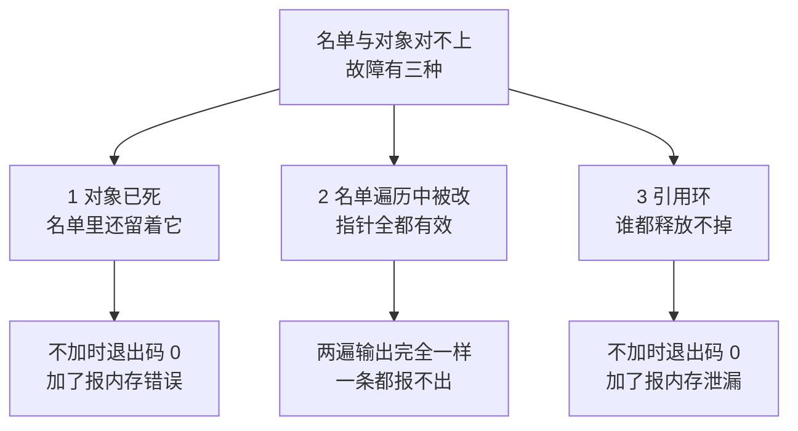
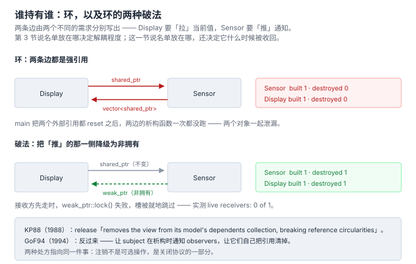

# 6. 谁持有那张名单：生命周期负债

> 本节的一手材料，都在本机可查：
>
> - Glenn E. Krasner & Stephen T. Pope，JOOP 1(3)，1988（下称 **KP88**）—— 第 1 节已经下过的那份 PDF
> - GoF94 第 5 章 —— 同第 1 节
> - **Linux 内核通知链**：`include/linux/notifier.h` 的头部注释（第 5 节只摘了链内注销那一条，这里要它的全部）
> - **boost::signals2**：`boost/signals2/connection.hpp` 与 `detail/slot_template.hpp`
> - **Qt 5.15**：`QtCore/qobject.h`
>
> 探针在 [`code/06_lifetime/`](../code/06_lifetime/)，`run_lifetime.sh` 一次跑完三个故障，
> 每个都跑两遍（不带 sanitizer 一遍、带 `-fsanitize=address` 一遍），并用 `cmp` 判定两遍输出是否逐字节相同。

## 先说结论

前三节量的是「名单放在哪」，这一节量的是**名单什么时候被收回**。三件事：

> 1. **名单是一份借据。** 它记录的关系可以随时断，但借据不会自己作废 —— 前 5 节攒下的每一份
>    都不能。
> 2. **三种故障里，工具只抓得到两种。** 悬垂指针和引用环一个 `-fsanitize=address` 就抓出来了；
>    而**「遍历名单的过程中名单被改」它一条都报不出** —— 加了 sanitizer 的输出与不加**逐字节相同**。
> 3. **两个权威给了相反的处方。** 1988 年的 KP88 把注销**做进关闭协议**；1994 年的 GoF94 让
>    subject **在析构时通知** observers。两种做法都对，但它们是两种不同的责任归属。

三种故障的形状先摆在一起 —— 注意第二列：**一种是内存错误，一种是协议错误**。



## 名单是一份借据

前 5 节攒下的名单，一份都没结过账：

| 出自 | 名单在哪 | 建立方式 | 谁负责收回 |
|---|---|---|---|
| 第 2 节 | `Sensor` 的成员 / 调用点 | `Attach()` / 直接调用 | 没人 —— 硬编码那版连 `Detach` 都没有 |
| 第 3 节 | 闭包捕获 / 被观察方 / 中介 | 各层不同 | 第 1 层根本没有这个概念 |
| 第 4 节 | 四层各自的 `viewers_` / `subscriptions_` / `queue_` | `Attach` / `Subscribe` / 入队 | 第 1 层做不到；第 4 层的 `Unsubscribe` 是整份代码里唯一一处 |
| 第 5 节 | Qt 连接表 / 内核链 / inotify watch | `connect` / `register` / `inotify_add_watch` | Qt 由 `QObject` 析构兜底；内核**禁止**链内注销；inotify 要显式 `rm_watch` |

**注册写在哪儿？** 前 4 节的所有实现，`Attach` 都写在 `main` 里。这不是随手 —— 它是唯一位置，因为：

- 构造函数只看得见**自己**。要在构造函数里注册，就得把 subject 的引用塞进成员；
- 而注册出去的是一个**还没构造完的对象**。任何「注册时补发一次当前值」的实现，都会把通知
  投给一个半成品；
- 构造失败时析构函数不会跑 —— 已经注册出去的那一半没人收回。

所以注册点就是**组合根**：能同时看见生产者和接收者的那个地方。第 2 节那张三种写法的对照表，
量的是同一件事 —— 组合根在哪，改动就落在哪。

> GoF94 自己给的那段示例是反过来写的：`DigitalClock` 在自己的构造函数里调 `_subject->Attach(this)`。
> 该走哪条路取决于谁掌握两个对象的生存期；本文后面几节的判据不依赖这个选择。

## 故障一：对象已死，名单还在

`code/06_lifetime/dangling.cpp` 里有两份**只差一行**的代码。生存期是错配的：`Sensor` 活得长，
`Display` 是短命的局部对象。

### 变体 A：地址回来了，住进了另一个对象

`Display` 在堆上构造、析构，然后**在同一块地址上**构造第二个 —— 用 placement new，所以地址相同
是结构保证的，不靠运气：

```cpp
void* raw = ::operator new(sizeof(Display));
Display* a = new (raw) Display("display-A");
sensor.Attach(a);
sensor.Tick(20.0);

a->~Display();
std::printf("   (display-A destroyed -- the producer was never told)\n");

Display* b = new (raw) Display("display-B");   // same address, never attached
sensor.Tick(25.0);                             // delivered to b
```

不加任何工具，退出码 **0**：

```
== variant A: the freed address is reused by a receiver that never subscribed ==
    Attach(display-A)
-- publish 20.0  (producer's list holds 1)
    [display-A @0x57ec3ae482c0] got 20.0  (this object has now received 1)
-- publish 20.0 returned
   (display-A destroyed -- the producer was never told)
   (display-B constructed at the same address; it never called Attach)
-- publish 25.0  (producer's list holds 1)
    [display-B @0x57ec3ae482c0] got 25.0  (this object has now received 1)
-- publish 25.0 returned
```

两个地址逐字相同。`display-B` **从来没调过 `Attach`**，却收到了通知，而且它自己也认为是第一次收到
（`received 1`）。没有任何东西是坏的：那块内存是活的、指针指向的对象是活的、容器是一致的。

**这是最坏的一种错**：它不崩溃、不报错、语义全错。内存检测工具也**不会报** —— 从它的角度看，
这次访问落在一次合法分配的合法区间里。

### 变体 B：地址空着

把归还的对象留在原地不再复用，同一份代码就换了一副面孔：

```
   (display-C deleted -- the producer was never told)
-- publish 31.0  (producer's list holds 1)
    [H.. @0x57ec3ae482c0] got 31.0  (this object has now received 2)
-- publish 31.0 returned
```

名字那一格已经打印不出东西了 —— 分配器把空闲链表的指针写进了对象头部，盖住了 `name_`。
**注意地址仍然打得出来**：地址是**名单里的那个值**，不是对象里的数据；只有对象里的数据坏了。

而这一次退出码**还是 0**。不加 sanitizer 的同一个二进制，跑了两次悬垂读，两次都「成功」。

### 加上 sanitizer 之后

同一个文件，只多一个 `-fsanitize=address`：

```
==173728==ERROR: AddressSanitizer: heap-use-after-free on address 0x503000000088 ...
READ of size 4 at 0x503000000088 thread T0
    #0 ... in Display::Show(double)  code/06_lifetime/dangling.cpp:29
    #1 ... in Sensor::Tick(double)   code/06_lifetime/dangling.cpp:52
    #2 ... in VariantB               code/06_lifetime/dangling.cpp:94
...
0x503000000088 is located 24 bytes inside of 28-byte region [0x503000000070,0x50300000008c)
freed by thread T0 here:
    #0 ... in operator delete(void*, unsigned long)
    #1 ... in VariantB               code/06_lifetime/dangling.cpp:92
```

退出码变成 1。**两个变体里，它只抓到了第二个。**

这不是工具的疏漏，是这一族错误的形状：**「对象死了」和「这次访问非法」不是同一回事**。
变体 A 里对象死了，访问完全合法。

⇒ 想靠工具兜底的人得知道：`-fsanitize=address` 能证明「有 bug」，**不能证明「没有 bug」**。

## 故障二：名单在遍历中被改

「接收方在自己的回调里注销自己」是日常需求 —— 控件要销毁了，它说一句「别再发给我了」——
而生产方正处在**发到它一半**的位置上。

`code/06_lifetime/mutation_during_notify.cpp` 用同一份场景（三个接收方，A 在回调里注销自己）
跑三种写法。

### 写法一：按下标走活容器

```cpp
for (std::size_t i = 0; i < viewers_.size(); ++i) {
  viewers_[i]->OnReading(value);
}
```

```
-- publish 20.0 over 3 viewer(s), live-by-index
    -> viewer[0] = A-leaves
    [A-leaves] got 20.0 -> removing myself from inside the callback
      (Detach(A-leaves): list is now 2)
    -> viewer[1] = C-quiet
    [C-quiet] got 20.0
-- publish 20.0 returned
```

`erase` 让后面的元素整体前移，**`B-quiet` 被跳过了** —— 它排在注销者的后一位。
下一轮它才收到。三个接收方里，唯一安静的那个丢了这一次通知。

### 写法二：range-for 走活容器

这是大家真正会写的形状：

```
-- publish 20.0 over 3 viewer(s), live-by-range-for
    -> about to notify A-leaves
    [A-leaves] got 20.0 -> removing myself from inside the callback
      (Detach(A-leaves): list is now 2)
    -> about to notify C-quiet
    [C-quiet] got 20.0
    -> about to notify C-quiet
    [C-quiet] got 20.0
-- publish 20.0 returned
```

`range-for` 在循环开始前缓存 `end`，而容器已经缩短了 —— 于是**同一个元素被访问两次**：
`C-quiet` 收到两遍，`B-quiet` 一遍都没收到。第三次访问落在 `size()` 之外，是越界。

而这时候**加了 sanitizer 的输出与不加逐字节相同**（脚本自己用 `cmp` 判的）：

```
----- no sanitizer (exit 0) -----     >>> stdout: identical | exit code: 0 vs 0
----- -fsanitize=address (exit 0) -----
```

**没有一条工具报了任何东西。** 容器没有越界到未分配的内存（`capacity` 还够），每个指针都有效，
每个对象都活着 —— 这是**协议错误**，不是内存错误。内存工具按定义看不见它。

### 写法三：走快照

```cpp
const std::vector<Receiver*> targets = viewers_;
for (Receiver* r : targets) {
  r->OnReading(value);
}
```

```
-- publish 20.0 over 3 viewer(s), snapshot
    -> about to notify A-leaves
    [A-leaves] got 20.0 -> removing myself from inside the callback
      (Detach(A-leaves): list is now 2)
    -> about to notify B-quiet
    [B-quiet] got 20.0
    -> about to notify C-quiet
    [C-quiet] got 20.0
-- publish 20.0 returned (list now 2)
```

三个人各一次，一个不漏、一个不重。**代价写在输出里**：这一轮的通知名单是**发布那一刻**的，
A 的注销从下一轮才生效。

第 4 节的 `Publish` 用的就是这一条（`const std::vector<Handler> targets = subscriptions_;`），
当时只是当作「顺手拷贝」，现在能说清它买的是什么了：**它把「遍历中改名单」这个时序问题，
换成了「注销从下一轮生效」这个明确的语义**。前者是 bug，后者是一句话能写进文档的约定。

### 内核的答案：不许

Linux 内核通知链选了第四条路 —— 不解决，直接禁止（`include/linux/notifier.h` L36–38）：

> atomic_notifier_chain_unregister(), blocking_notifier_chain_unregister(), and
> srcu_notifier_chain_unregister() **_must not_ be called from within the call chain**.

它连快照的代价都不愿付，改成了锁的问题。同一个头文件把这件事的**价格标了出来**（L40–46）：

> This means there is _very_ low overhead in srcu_notifier_call_chain(): no cache bounces and no
> memory barriers. As compensation, **srcu_notifier_chain_unregister() is rather expensive**.
> SRCU notifier chains should be used **when the chain will be called very often but
> notifier_blocks will seldom be removed**.

**「通知频繁、注销罕见」—— 这是把生命周期负债明码标价后做出的选择。** 同一份名单，四种锁策略：

| 类型 | 回调上下文 | 注册 / 注销 | 谁保证并发安全 |
|---|---|---|---|
| `atomic` | 中断、原子上下文，**不许阻塞** | 注销不得在链内 | 框架（自旋锁） |
| `blocking` | 进程上下文，**允许阻塞** | 注销不得在链内 | 框架（读写信号量） |
| `raw` | 无限制 | **无限制** | **调用方**（注释原文：All locking and protection must be provided by the caller） |
| `srcu` | 同 blocking | 注销**很贵** | 框架（SRCU）—— 用「注销贵」换「通知便宜」 |

「名单的并发保护由谁负责」和「名单放在哪」是同一个问题的两种问法。

## 故障三：谁都释放不掉

第三种故障不崩溃、不越界，症状是**两个析构函数一次都不跑**。环是两条边分别写出来的：

```cpp
class DisplayShared {
  std::shared_ptr<SensorShared> sensor_;   // Display -> Sensor：「拉」当前值
};

class SensorShared {
  std::vector<std::shared_ptr<DisplayShared>> views_;  // Sensor -> Display：「推」通知
};
```

main 把两个外部引用都 `reset()` 之后：

```
-- publish 20.0
    [display-shared] got 20.0
-- publish 20.0 returned
   (main dropped both of its references)
   after leaving the scope:
     Sensor : built 1, destroyed 0
     Display: built 1, destroyed 0
     => the pair leaked together
```

退出码 0，什么也不打印。改成生产者一侧持有 `weak_ptr`：

```
     Sensor : built 1, destroyed 1
     Display: built 1, destroyed 1
     => both objects were reclaimed
```

同一个二进制里还有一句顺带的收获 —— 接收方先走时，弱句柄让「它已经没了」变成**可检测**的：

```
-- publish 26.0
-- publish 26.0 returned (live receivers: 0 of 1)
```

槽没有被移除，但分发时 `lock()` 失败，就跳过。这正是 boost::signals2 的 `slot::track()` 做的事
（`detail/slot_template.hpp` L115）：

```cpp
// tracking
BOOST_SIGNALS2_SLOT_CLASS_NAME(BOOST_SIGNALS2_NUM_ARGS)& track(const weak_ptr<void> &tracked) {
  _tracked_objects.push_back(tracked);
  return *this;
}
```

分发前它会检查这些弱引用（`connection.hpp` L159–163 的 `disconnect_expired_slot`，判据就是
`slot().expired()`）。

### 1988 年就写下来了

KP88 的原文（DependentFields 那一节）：

> Since views and controllers hold **direct pointers to their models**, the DependentFields
> dictionary creates a type of **circularity that most storage managers cannot reclaim**.

同一篇里还有一句更实用的 —— 它给出了**两种环**的区别：

> The corresponding circularities that result from using instances of Model are the **direct kind
> that most storage managers can reclaim**. Therefore, we encourage the use and sub-classing of Model.

**同一个结构，换一个基类，可回收性就变了。** 「我用 `Model` 还是自己写一个 model」在 1988 年的
Smalltalk-80 里就是一道有实际后果的选择题。

### 两种处方，相反

KP88 把注销**做进关闭协议**：

> The message **release** ... gives the programmer the opportunity to insert any finalization
> activity. By default, release breaks the pointer links between the view and controller.
> The message release also **removes the view from its model's dependents collection,
> breaking reference circularities between them**.

GoF94 的处方是反过来 —— 让**被观察方在死之前通知大家**：

> **Dangling references to deleted subjects.** Deleting a subject should not produce dangling
> references in its observers. One way to avoid dangling references is to **make the subject
> notify its observers as it is deleted so that they can reset their reference to it**. In general,
> simply deleting the observers is not an option, because other objects may reference them, or
> they may be observing other subjects as well.

最后那句是重点：**GoF 明确否掉了「把 observers 一起删掉」这个偷懒办法**，理由是同一个 observer
可能还在观察别人。所以它选了「死前通知」—— 通知的反向用法：**一次专门用来撤销引用的通知**。

一个把注销塞进关闭流程（调用方少写一行，但必须记得关），一个把注销留在通知通道里
（调用方少写一行，但观察者必须实现那个方法）。两条路都在**减少「忘记」的机会**，
只是分别从协议的入口和出口下手。



## 同一个问题的六种答案

把本节的一手材料排在一起，就是「谁负责让借据作废」的全部选项：

| 谁负责 | 出处 | 忘了会怎样 |
|---|---|---|
| 调用方手工配对 | GoF94 的 `Detach()` / 响应式流的 `cancel()` | 悬垂 —— 本节的故障一 |
| 关闭协议顺带做 | KP88 的 `release` | 不走关闭流程就没做（但正常路径一定走） |
| 框架直接禁止 | 内核 `_must not_ be called from within the call chain` | 不是「忘了」，是「不许」 |
| 接收者的基类兜底 | Qt：接收者析构时自动断开（`~QObject`） | 不是 `QObject` 的接收者没有保障 |
| RAII 句柄 | boost `scoped_connection`：`~scoped_connection() { disconnect(); }` | 句柄自己的生存期得管对 |
| 弱引用 + 惰性清理 | `weak_ptr::lock()` / `slot::track()` | **无 —— 这是唯一一种忘不掉的** |

最后一行值得单独说：**弱引用不是「记得注销」，是把「注销」这件事从时序里删掉了**。
对象一死，句柄自动失效，没有窗口期，不依赖任何人守约。代价是每一次分发都要判一次有效性 ——
这也是为什么它没成为默认答案：它把成本从「出错时」挪到了「每次」。

## 什么时候根本不用管

**判据只有一句：谁先死。** 如果答案是确定的、且两个对象写在同一个作用域里，负债就不存在：

- 名单和接收方同生共死（同一个块、同一个类的成员）⇒ 停机即释放；
- 生产方是单例 / 静态生存期 ⇒ 进程退出时由 OS 一并回收；
- 接收方**结构性**地比生产方活得久（生产方是接收方的成员），且没有环。

这三种情况里，注销仍然「没有发生」，但没有任何窗口期 —— 因为不存在「一个死了另一个还在」的时刻。
**所有生命周期负债的本质，都是这句话不成立。**

## 这一节要你带走的

> 名单是一份借据。它会记下每一段关系，但关系断了它不会自己作废。
>
> 三种坏账里，工具只抓得到两种。**「遍历中改名单」两遍输出逐字节相同** —— 它不坏内存，
> 坏的是语义，所以只有眼睛和协议能发现它。
>
> 六种答案里，只有一种不需要任何人记住什么：让句柄根本持有不到那个对象。

## 进度

- 第 1 节 诞生背景 ✅
- 第 2 节 不用它的代价 ✅
- 第 3 节 谱系 ✅
- 第 4 节 代码对比 ✅
- 第 5 节 业务场景 ✅
- **第 6 节 谁持有那张名单 ✅（本节）**
- 第 7 节 语言演进 ⬜
- 第 8 节 与相邻概念的边界 ⬜
- 第 9 节 真实项目案例 ⬜
- 第 10 节 收口 ⬜

本节实测（复现：`cd code/06_lifetime && sh run_lifetime.sh`）：

| 文件 | plain | asan | 两遍 stdout |
|---|---|---|---|
| `dangling.cpp` | 0 | 1 | differs |
| `mutation_during_notify.cpp` | 0 | **0** | **identical** |
| `reference_cycle.cpp` | 0 | 1 | differs |
