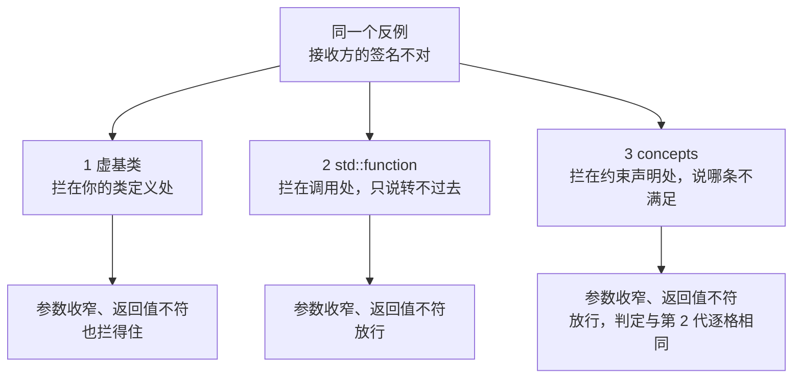
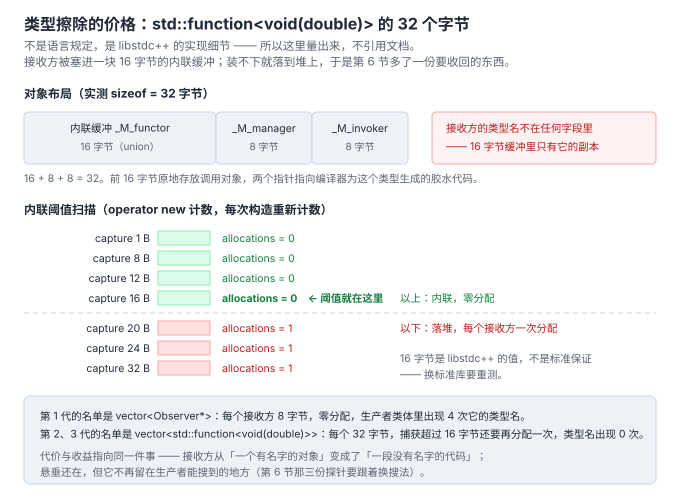

# 7. 语言演进：从虚基类到可调用对象

> 本节的一手材料不是论文，是**编译器**。版本与头文件都写在正文里，命令可复现：
>
> - `g++ (Ubuntu 13.3.0-6ubuntu2~24.04.1) 13.3.0`，`-std=c++17` / `-std=c++20`
> - `/usr/include/c++/13/bits/std_function.h`（`_M_invoke` L290、`operator()` L591）
> - `/usr/include/c++/13/concepts` L352（`concept invocable = is_invocable_v<_Fn, _Args...>;`）
> - `/usr/include/c++/13/type_traits` L2610（`enable_if_t` 的 SFINAE 报错点）
>
> 探针在 [`code/07_language/`](../code/07_language/)，`run_language.sh` 一次跑完七组测量。
> 前三组的复现入口：`cd code/07_language && sh run_language.sh`。

**本节文件**：

| 文件 | 作用 |
|---|---|
| [`gen1_virtual.cpp`](../code/07_language/gen1_virtual.cpp) / [`gen2_function.cpp`](../code/07_language/gen2_function.cpp) / [`gen3_concept.cpp`](../code/07_language/gen3_concept.cpp) | 三代各自完整可运行，输出逐字节相同 |
| [`examples/interfaces.hpp`](../code/07_language/examples/interfaces.hpp) | 三个接口，`-DGEN=1\|2\|3` 切换 |
| [`examples/01..07_*.cpp`](../code/07_language/examples/) | 7 个反例，拦截矩阵的输入 |
| [`identity.cpp`](../code/07_language/identity.cpp) | 身份：`==` 在三代里有几代存在 |
| [`dangling_sink.cpp`](../code/07_language/dangling_sink.cpp) | 第 6 节那份负债在类型擦除之后的形状 |
| [`allocation_cost.cpp`](../code/07_language/allocation_cost.cpp) | `sizeof` 与 `operator new` 计数 |
| [`sfinae_vs_concept.cpp`](../code/07_language/sfinae_vs_concept.cpp) | 同一个约束的两种写法 |
| [`run_language.sh`](../code/07_language/run_language.sh) | 一次跑完上面七组 |

## 先说结论

这一节量的是**接口形状换来换去，到底换掉了什么**。三件事，第一件是反直觉的：

> 1. **运行期什么都没换。** 三代实现跑同一份场景，输出**逐字节相同**（脚本用 `cmp` 判）。
>    也就是说三代的差别**全部**在编译期 —— 这一节才有得量。
> 2. **concepts 不比 `std::function` 严，一个检查都没多。** 7 个反例 × 3 代的矩阵里，
>    第 2 代与第 3 代**逐格判定相同**。它换掉的是**错误落在哪**，不是**拦不拦得住**。
> 3. **真正被换掉的是一个精确签名检查。**「参数收窄」和「返回值不符」这两格，
>    **只有 1994 年那个虚基类拦得住** —— 因为 `override` 检查的是**签名**，
>    而所有可调用性判据（`std::invocable`、`std::function` 的构造）都只问**能不能调用**。

## 三代并排

同一份场景：一个温度传感器，两个显示端，`25.0 / 26.5` 之后撤销一个接收方再发 `28.0`。
三代各自完整可运行，`main()` 里的调用顺序逐行相同。

### 1 虚基类：接口是一个类型

```cpp
class Observer {
 public:
  virtual ~Observer() = default;
  virtual void OnReading(double value) = 0;
};

class Sensor {
  void Attach(Observer* observer);
  void Detach(Observer* observer);   // 身份就是那个指针
  std::vector<Observer*> observers_;
};
```

要收到通知，你必须**继承**。lambda、自由函数、成员函数都进不来 —— 得先包一层适配器。

### 2 `std::function`：接口是一个形状

```cpp
class Sensor {
  using Sink = std::function<void(double)>;
  void Attach(Sink sink);
  void DetachAt(std::size_t index);   // 没有身份可比较，只能按位置
  std::vector<Sink> sinks_;
};
```

任何**能拿 `double` 调起来的**东西都行。代价立刻出现在注销上：`std::function` 之间没有 `==`，
所以生产者不能再「把当初那件东西还给我」，只能自己发一个句柄（这里是下标）。

### 3 concepts：把形状写进签名

```cpp
class Sensor {
  using Sink = std::function<void(double)>;

  template <class F>
    requires std::invocable<F&, double>
  void Attach(F&& sink) { sinks_.emplace_back(std::forward<F>(sink)); }
  // 存储与第 2 代一模一样
};
```

**存储没变**（还是 `std::function`）。变的是那句要求从 `std::function` 的构造函数里
**搬到了签名上** —— 读接口的人不用点进 `<functional>` 就知道它要什么。

### 三代的运行输出

```
-- receivers: 2
[console] got 25.0
[audit] got 25.0 (total 25.0)
[console] got 26.5
[audit] got 26.5 (total 51.5)
-- receivers: 1
[console] got 28.0
```

```
>>> 运行输出比对
    GEN1 vs GEN2 : 逐字节相同
    GEN1 vs GEN3 : 逐字节相同
```

这不是顺带一提，是本节所有结论的前提：**既然运行期一模一样，那么选哪一代就只剩编译期的账**。

## 编译期拦截矩阵

7 个反例，每个都写成一段「有问题的接收方 + 一次 `Attach`」，用 `-DGEN=1|2|3` 切换接口。
第 1、2 代用 `-std=c++17`，第 3 代用 `-std=c++20`（`requires` 子句是 C++20 的）。

| 反例 | 1 虚基类 | 2 `std::function` | 3 concepts |
|---|---|---|---|
| 01 参数类型完全不对（要 `std::string`） | FAIL | FAIL | FAIL |
| 02 **参数收窄**（要 `int`） | **FAIL** | **PASS** | **PASS** |
| 03 **有返回值**（`double`） | **FAIL** | **PASS** | **PASS** |
| 04 根本不是可调用对象 | FAIL | FAIL | FAIL |
| 05 参数个数多一个 | FAIL | FAIL | FAIL |
| 06 **自由函数**当接收方 | **FAIL** | **PASS** | **PASS** |
| 07 按引用捕获一个局部对象 | PASS | PASS | PASS |

每一格 `FAIL` 的首条错误原文（脚本打印，可核）：

```
01 GEN1 user:23  cannot declare variable 'receiver' to be of abstract type 'BadReceiver'
01 GEN2 user:24  cannot convert 'BadReceiver' to 'Sensor::Sink' {aka 'std::function<void(double)>'}
01 GEN3 api:77   no matching function for call to 'Sensor::Attach(BadReceiver&)'
02 GEN1 user:16  'void BadReceiver::OnReading(int)' marked 'override', but does not override
03 GEN1 user:14  conflicting return type specified for 'virtual double BadReceiver::OnReading(double)'
04 GEN1 user:17  cannot convert 'NotCallable*' to 'Observer*'
04 GEN2 user:19  cannot convert 'NotCallable' to 'Sensor::Sink' {aka 'std::function<void(double)>'}
04 GEN3 user:19  no matching function for call to 'Sensor::Attach(NotCallable&)'
05 GEN1 user:9   'void BadReceiver::OnReading(double, int)' marked 'override', but does not override
05 GEN2 user:26  cannot convert 'BadReceiver' to 'Sensor::Sink' {aka 'std::function<void(double)>'}
05 GEN3 api:77   no matching function for call to 'Sensor::Attach(BadReceiver&)'
06 GEN1 user:16  cannot convert 'void (*)(double)' to 'Observer*'
```

把「同一个反例在三代里分别被拦在哪」画成一张图，这张图就是本节的主线：



从这张表里能读出三件事。

### 一、02 和 03 两格，只有第一代拦得住

`void OnReading(int)` 这个签名，在虚基类下会立刻被点名：

```
'void BadReceiver::OnReading(int)' marked 'override', but does not override
```

这句话是**精确签名比较**的结果 —— 编译器拿 `override` 那行去比对基类的纯虚函数，
参数类型、返回类型逐项对。而 `std::function<void(double)>` 和 `std::invocable<F&, double>`
问的是另一个问题：**`double` 能不能被用来调用它**。`double → int` 是合法的隐式转换，
所以答案是「能」，于是第 2、3 代都放行，`26.5` 到了接收方手里会变成 `26`。

**这不是退步，是换了要保护的东西。** 换成可调用对象，换来的是 06 那一格：
自由函数、lambda、`std::bind` 的产物都能直接接上，不需要为每个接收方写一个适配类。
代价是把「签名一致性」这类检查从编译期挪到了**运行期观察**。

### 二、第 2 代与第 3 代逐格判定相同

把表的两列并排看：7 行里，第 2 代与第 3 代的 PASS / FAIL **完全一致**。原因就在约束本身：

```cpp
template <class F> requires std::invocable<F&, double> void Attach(F&&);
//                                  ~~~~~~~~~~~~~~~~~~~~~~~~~~
// 而 <functional> 里 std::function<void(double)> 的约束条件，本质是同一个问句
```

`std::function<void(double)>` 的构造函数接受的正是「能拿 `double` 调用」的 `F`。
所以在接口上再写一遍 `std::invocable<F&, double>`，**没有增加任何一项检查**。

> 想靠 concepts 把「参数必须是 `double`」写死，得显式去拆 `decltype(&F::operator())` 的形参列表 ——
> 而那件事对函数指针、泛型 lambda、函数对象要各写一套。**concepts 不自动给你更严的检查，
> 它只是把「检查什么」变成你能写出来的东西。** 写不写、写多严，仍然是人的决定。

### 三、07 是唯一三代全过的一行

按引用捕获一个局部对象 —— **三代都放行，一个都不报**。
第 6 节量过的那份生命周期负债**不是类型错误**，所以再怎么改接口形状都不会在这里被拦下。
这一格是故意留的：它标出了**语言演进的能力边界**。

## 同一个反例，三份诊断

判定相同不代表给出的一样。同一个 `Attach(NotCallable)`，第 2 代说：

```
error: cannot convert 'NotCallable' to 'Sensor::Sink' {aka 'std::function<void(double)>'}
note:   initializing argument 1 of 'void Sensor::Attach(Sink)'
```

第 3 代说：

```
error: no matching function for call to 'Sensor::Attach(NotCallable&)'
note: candidate: 'template<class F> requires invocable<F&, double> void Sensor::Attach(F&&)'
note:   template argument deduction/substitution failed:
note:   constraints not satisfied
note: the expression 'is_invocable_v<_Fn, _Args ...> [with _Fn = NotCallable&; _Args = {double}]'
        evaluated to 'false'
```

差别落在**错误位置**上，这是可数的：

| | 首条错误位置 | error 行数 |
|---|---|---|
| 第 2 代 | `user:19`（调用行） | 1 |
| 第 3 代 | `api:77`（约束声明所在文件） | 1 |

第 3 代把错误指回**约束本身**，并在 note 里把那条 constraint 求值成 `false` 的原文吐出来；
第 2 代只能说你「转不过去」。这也解释了矩阵里 01/05 两行的 `api:77`：
**问题被归到了接口那一侧，而不是调用点**。

### 顺带量一下 SFINAE 版

第 3 代之前，同一个约束只能用 SFINAE 写（`std::enable_if_t` + 默认模板参数）。
两种写法各编译一次同一个错误调用：

| 写法 | 首条位置 | error 行数 | 总输出行数 | note 行数 |
|---|---|---|---|---|
| SFINAE（`-std=c++17`） | `user:38` | 2 | 14 | 2 |
| concepts（`-std=c++20`） | `user:38` | **1** | 16 | **4** |

**concepts 的 error 更少（1 vs 2），但总输出更长（16 vs 14）** —— 多出来的是 4 条 note，
其中就包括上面那句「哪条约束求值成 `false`」。SFINAE 版多出来的那条 error 长这样：

```
/usr/include/c++/13/type_traits:2610:11: error: no type named 'type' in 'struct std::enable_if<false, void>'
```

**它报的是替换过程本身失败了，没告诉你要求是什么。**

⚠️ 口径说明：这两种写法还各自绑定了不同的标准（C++17 / C++20），所以这不是单变量对照 ——
它回答的是「用 C++17 能做到的事 vs 用 C++20 能做到的事」，不是「同一个标准下两种写法的优劣」。

## 身份：指针变成句柄

第 6 节收尾排过「谁负责让借据作废」的六种答案。这一节直接量了其中**第一行的前置条件**：

```
GEN1  PASS  可以比较
GEN2  FAIL  user:27
      首条错误：no match for 'operator==' (operand types are
                'std::function<void(double)>' and 'std::function<void(double)>')
GEN3  FAIL  user:27
```

指针可以比较，所以第 1 代的 `Detach(Observer*)` 就是「把当初那件东西还给我」。
`std::function` 不能比较，**于是「把当初那件东西还给我」这个动作在这一代根本不存在** ——
生产者必须自己造一个句柄（下标、id、句柄对象）并保证它和名单条目同步。

第 6 节那张表里「RAII 句柄」和「弱引用 + 惰性清理」两行，正是为这一代准备的。

## 类型擦除的价格



`operator new` 计数（脚本重载了全局 `operator new`，每次构造前清零）：

```
sizeof(std::function<void(double)>) = 32 bytes

capture 0 bytes          callable= 1 bytes  allocations=0
capture 8 bytes          callable= 8 bytes  allocations=0
capture 12 bytes         callable=12 bytes  allocations=0
capture 16 bytes         callable=16 bytes  allocations=0
capture 20 bytes         callable=20 bytes  allocations=1
capture 24 bytes         callable=24 bytes  allocations=1
capture 32 bytes         callable=32 bytes  allocations=1
```

**16 字节以内零分配，超过就每个接收方多一次堆分配。** 这个 16 不是标准保证的，
是 libstdc++ 的内联缓冲大小 —— 换标准库要重测，所以这里给的是测量而不是引用。

还有一笔更隐形的账，用 grep 就能量：

```
gen1_virtual.cpp 的 Sensor 类体内：
    Observer 出现 4 次        （Attach 参数、Detach 参数、遍历变量、容器元素类型）
gen2_function.cpp 的 Sensor 类体内：
    接收方类型名出现 0 次
```

第 1 代的 `Sensor` 里，接收方的**接口名**出现了 4 次；第 2、3 代里，
接收方的**具体类型名**一次都不出现 —— 它只出现在 `main` 的 lambda 捕获里（第 39、44、57、58 行）。
**这个计数就是两代之间真正被换掉的东西。**

## 第 6 节的负债：变轻还是变重

这是本节要回答的第二个问题。用第 6 节同一套方法：一个探针跑两遍，脚本用 `cmp` 判。

```
-- publish 25.0 (sinks=1)
    [audit] got 25.0 (total 25.0)
-- publish 25.0 returned
   (leaving the scope that owns the receiver)
-- publish 28.0 (sinks=1)
    [audit] got 28.0 (total 53.0)
-- publish 28.0 returned
```

`plain` 退出码 **0**，而且那个已经死掉的接收方**照常收到了通知、照常把累计值加到 53.0**。
加上 `-fsanitize=address` 之后：

```
ERROR: AddressSanitizer: stack-use-after-scope ... 退出码 1
    #0 AuditDisplay::Show(double)                  code/07_language/dangling_sink.cpp:42
    #1 operator()                                  code/07_language/dangling_sink.cpp:57
    #2 __invoke_impl<... main()::<lambda(double)>&> /usr/include/c++/13/bits/invoke.h:61
    #3 __invoke_r<void, main()::<lambda(double)>&>  /usr/include/c++/13/bits/invoke.h:111
    #4 _M_invoke                                    /usr/include/c++/13/bits/std_function.h:290
    #5 std::function<void (double)>::operator()     /usr/include/c++/13/bits/std_function.h:591
    #6 Sensor::Tick(double)                         code/07_language/dangling_sink.cpp:30
```

**结论：变重了，而且重在同一处。**

- **多了一份要收回的内存**（上面那次分配），第 6 节的六种答案现在要同时管两样东西；
- **多了一个要自己造的句柄**（没有 `==`），「手工配对」这一行的成本上升；
- **故障更难搜**：第 1 代在生产者源码里能 grep 到接收方类型名（4 次），第 2、3 代是 0 次 ——
  调用栈里接收方也只剩 `<lambda(double)>` 这个名字，中间还夹着两层库帧（`invoke.h` / `std_function.h`）。

换到的好处也确实存在（第 2 代让 `Attach` 不再需要适配类），但**它没有减轻负债，
只是把负债挪到了一个更不容易被看见的位置**。第 6 节那句话在这里继续成立：
六种答案里只有弱引用那种是忘不掉的；而**接口越抽象，你越需要在别处把「谁先死」这件事写下来**。

## 判据：哪一代

| 你要什么 | 用哪一代 | 代价 |
|---|---|---|
| 接收方是**少数几个固定类型**，签名一致性最重要 | 虚基类 | 自由函数、lambda 进不来，每个还得写适配类 |
| 接收方**类型不固定**（插件、脚本、测试替身、临时观测） | `std::function` | 签名检查降级为「能否调用」；要自己发句柄 |
| 接口要给**第三方读**，报错信息要能指回要求 | concepts 约束的 `Attach` | 要 C++20；不增加检查，只改变错误位置 |
| 每个接收方**都不大于 16 字节**且要零分配 | 由第 1 代，或模板化的 `Sensor<Sink>` | 后者让 `Sensor` 不再是单一类型 |

**「换了新写法所以更安全」这句话在矩阵里不成立。** 三代中检查最严的是最老的那一代。
选择依据是**接收方类型固定不固定**，不是新不新。

## 这一节要你带走的

> 语言演进换掉的不是安全性，是**接口的形状**。矩阵里最严的一格属于 1994 年那个虚基类。
>
> `std::function` 与 concepts 的判定逐格相同 —— concepts 买的是**错误落在哪**，
> 以及把要求写在签名上让第三方读得见。
>
> 三代运行期输出逐字节相同。所以「升级写法」的收益全在编译期，
> 而它的代价（多一次分配、多一个自己造的句柄、故障更难搜）全在运行期之后。

## 进度

- 第 1 节 诞生背景 ✅
- 第 2 节 不用它的代价 ✅
- 第 3 节 谱系 ✅
- 第 4 节 代码对比 ✅
- 第 5 节 业务场景 ✅
- 第 6 节 谁持有那张名单 ✅
- **第 7 节 语言演进 ✅（本节）**
- 第 8 节 与相邻概念的边界 ⬜
- 第 9 节 真实项目案例 ⬜
- 第 10 节 收口 ⬜

本节实测（复现：`cd code/07_language && sh run_language.sh`）：

| 组 | 量了什么 | 结果 |
|---|---|---|
| 1 | 三代运行输出 | 逐字节相同（`cmp`） |
| 2 | 7 反例 × 3 代拦截矩阵 | 第 2、3 代逐格相同；02/03/06 只有第 1 代拦得住；07 三代全过 |
| 3 | 接收方能否被指认 | `==` 在第 2、3 代不存在 |
| 4 | 接收方类型名在生产者类体内的出现次数 | 4 → 0 |
| 5 | `sizeof` 与内联阈值 | 32 字节 / 16 字节 |
| 6 | 悬垂（带与不带 ASan） | exit 0 → 1，`stack-use-after-scope` |
| 7 | 同一个约束的两种写法 | error 2 → 1，note 2 → 4 |
