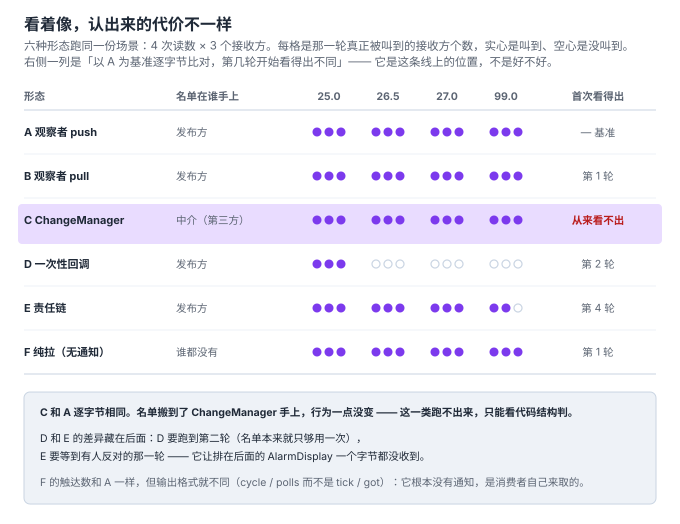
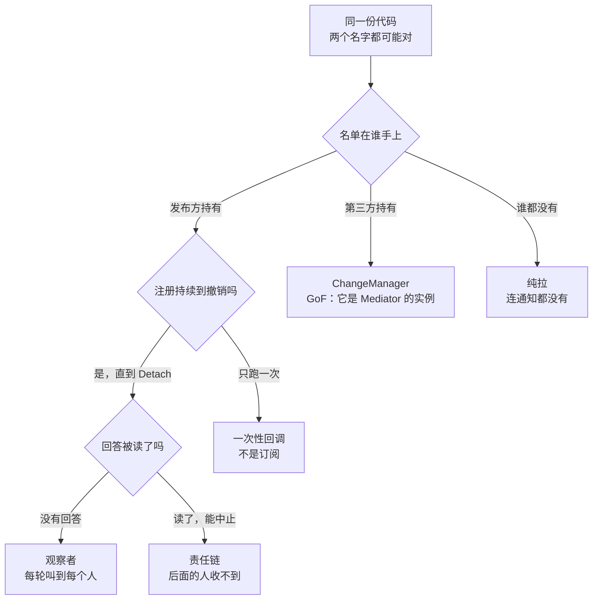

# 8. 与相邻概念的边界：判据要能在代码上判

> 本节的一手材料都在**同一章**里 —— GoF94 的 Observer 章。下面引的 push / pull 模型、
> `ChangeManager`、以及 `Related Patterns` 那一条，全部出自同一章，不需要跨书比对：
>
> - GoF94 第 5 章 Observer 全文（`Implementation` / `Related Patterns` / `Sample Code` 三节）
> - `include/linux/notifier.h`（内核通知链，`NOTIFY_STOP_MASK`）
>
> 探针在 [`code/08_boundary/`](../code/08_boundary/)，`run_boundary.sh` 一次跑完六段取证。
> 复现入口：`cd code/08_boundary && sh run_boundary.sh`。

**本节文件**：

| 文件 | 作用 |
|---|---|
| [`form_a_observer_push.cpp`](../code/08_boundary/form_a_observer_push.cpp) | 基线：名单在发布方，数据随通知走 |
| [`form_b_observer_pull.cpp`](../code/08_boundary/form_b_observer_pull.cpp) | GoF 的 pull 模型：`OnReading(const Sensor&)` |
| [`form_c_change_manager.cpp`](../code/08_boundary/form_c_change_manager.cpp) | GoF 的 `ChangeManager`：名单在中介 |
| [`form_d_one_shot.cpp`](../code/08_boundary/form_d_one_shot.cpp) | 一次性回调：注册像订阅，只够用一次 |
| [`form_e_chain.cpp`](../code/08_boundary/form_e_chain.cpp) | 责任链：通知有回答，回答能中止 |
| [`form_f_pure_pull.cpp`](../code/08_boundary/form_f_pure_pull.cpp) | 纯拉：谁都没有名单，连通知都没有 |
| [`mediator_dedup.cpp`](../code/08_boundary/mediator_dedup.cpp) | 中介者买的那一件事：一个观察者看两个 subject |
| [`topic_wildcard.cpp`](../code/08_boundary/topic_wildcard.cpp) | 名单的条目从「名字」变成「规则」 |
| [`run_boundary.sh`](../code/08_boundary/run_boundary.sh) | 六段取证：运行轨迹、`cmp`、结构 `grep`、逐轮触达数 |

**六种形态跑的是同一份场景**：一个温度传感器，4 次读数（`25.0 / 26.5 / 27.0` 正常，
`99.0` 越界），3 个接收方（`ConsoleDisplay` / `AuditDisplay` / `AlarmDisplay`），
输出格式全部一致。`cmp` 判得动的前提就是这个。

---

## 先说结论

> 1. **判据必须是结构判据，因为有一种「像」是跑不出来的。** `ChangeManager` 那一形态
>    与基线**逐字节相同**：名单搬到了中介手上，行为一点没变。单看运行结果，它是永远正确的那个。
> 2. **「看着像但不是」这个问题常常问错了。** GoF 说的是
>    `ChangeManager is an instance of the Mediator pattern` —— 不是「这两者该选哪个」，
>    而是**同一次通知里，发布方那侧是观察者，中介那侧是中介者**。
>    两个名字同时成立，取决于你看哪个对象。
> 3. **「是哪个」不是二值问题，是要付多少代价才能判出来的问题。** 实测六种形态，
>    与基线的首次可见差异分别落在**第 1 轮 / 从不 / 第 2 轮 / 第 4 轮**。

---

## 判据：五个问题，都能在代码上问

「观察者是一对多，中介者是多对多」——这句话**没法判代码**。一对多是几个？谁来数？
把判据写成能在源码上问出答案的问句，它才有用：

| # | 判据 | 怎么问（可操作） | 落点 |
|---|---|---|---|
| Q1 | **名单在谁手上** | `grep -n 'std::vector<Observer\*>\|std::vector<Subscription>\|std::vector<Handler>'` | a/b/e 在发布方；c 在中介；d 在发布方但用一次；**f 一个都没有** |
| Q2 | **数据随通知走，还是接收方自己去取** | 看 `OnReading` 的形参是 `double` 还是 `const Sensor&` | 只有 b 是后者 |
| Q3 | **通知的回答被读了吗** | `grep -n 'virtual bool OnReading\|if (observer->OnReading'` | 只有 e 命中两行 |
| Q4 | **注册是持续的，还是只够用一次** | 找撤销入口 `Detach` / `Unregister`，或找消费名单的那一行 | d 只有 `batch.swap(pending_)`，没有撤销 |
| Q5 | **发布方自己调用任何人吗** | `grep -n 'observer->OnReading\|handler(value)\|\.Poll(sensor)'` | a~e 的命中都在**发布方类体内**；f 的三行在 `main` 里 |

Q5 是这五个里最不好替换的一个。它不是「名单在哪」的另一种问法，而是问
**调用动作发生在谁的代码里** —— 前五个形态的调用行都在 `Sensor` / `ChangeManager` 内部，
只有 F 在 `main`：

```cpp
// form_f_pure_pull.cpp:73-75   —— 名单是手写的一段调用序列，重写于每一轮，传感器从来看不到
    console.Poll(sensor);
    audit.Poll(sensor);
    alarm.Poll(sensor);
```

---

## 六种形态，同一份场景



| 形态 | 名单在谁手上 | 与基线 `cmp` | 首次可见差异 |
|---|---|---|---|
| A 观察者 push | 发布方 | — 基准 | — |
| B 观察者 pull | 发布方 | differs | **第 1 轮** |
| C `ChangeManager` | 中介（第三方） | **identical** | **从不** |
| D 一次性回调 | 发布方 | differs | 第 2 轮 |
| E 责任链 | 发布方 | differs | 第 4 轮 |
| F 纯拉（无通知） | 谁都没有 | differs | 第 1 轮 |

逐轮触达的接收方个数（脚本第 4 段，`awk` 数每轮的 `[` 行）：

```
form                       r1  r2  r3  r4
form_a_observer_push        3   3   3   3
form_b_observer_pull        3   3   3   3
form_c_change_manager       3   3   3   3
form_d_one_shot             3   0   0   0
form_e_chain                3   3   3   2
form_f_pure_pull            3   3   3   3
```

这张表里 `C` 和 `A` 完全一样、`F` 也和 `A` 一样 —— 光看触达数，三种形态分不开。
这正是下面三小节各自要处理的那种分不开。

---

## 一、C 与 A 逐字节相同：有一种「像」跑不出来

`ChangeManager` 那一段输出与基线 `cmp -s` 判定 **identical**。不是「差不多」，是没有一行不同。

```diff
===== form_c_change_manager vs form A =====
(identical -- no line differs)
```

这是本节最该记住的一条方法论：**当一个问题只能靠跑程序来回答时，「跑出来一样」
会被当成「没有差别」**。而这里的差别是真的 —— 名单搬到了中介手上，发布方从此
没有任何办法数出有几个人在听（第 3 节那条「可数性」判据在这里判不了）。

GoF 给它写了三段责任，原文（Observer，`Implementation`）：

> When the dependency relationship between subjects and observers is particularly complex,
> an object that maintains these relationships might be required. We call such an object
> a `ChangeManager`. … `ChangeManager` has three responsibilities:
> It **maps a subject to its observers** and provides an interface to maintain this
> mapping. This eliminates the need for subjects to maintain references to their observers
> **and vice versa**. It **defines a particular update strategy**. It **updates all
> dependent observers at the request of a subject**.

中间那句 `and vice versa` 是关键：中介两头都持有，所以两头都不用持有。
这正是第 3 节刻度 2 那一格的定义 —— 而它在这里有了**出处**。

> ⚠️ **对第 3 节的一处更正。** 第 3 节说「刻度 2 这一格是**推论**，Eugster 表 1 里没有这一行」。
> 在 Eugster 那张表里确实没有；但**在 GoF 原书里有**，名字就是 `ChangeManager`，
> 而且早写了六年。当时的措辞偏保守了。

---

## 二、同一个对象，两个名字

`ChangeManager` 是不是「假冒观察者的中介者」？GoF 的回答不是二选一。`Related Patterns` 一节原文：

> **Mediator (273)**: By encapsulating complex update semantics, the `ChangeManager`
> acts as mediator between subjects and observers.

而 `ChangeManager` 又是 Observer 模式内部的组件（`Implementation` 那一节讲的）。
所以这份代码里：**站在 `Sensor` 看是观察者，站在 `ChangeManager` 看是中介者**。
两个名字都对，它们在描述**不同对象的形状**，而不是给整个系统贴一个标签。

这也解释了为什么「把中介者说成观察者」这种反例总显得别扭 —— 它默认了一个系统只能有一个
模式名。GoF 自己都不这么用：它把 `ChangeManager` 同时挂在 Observer 章和 Mediator 的交叉引用上。

顺带把「中介者到底买到了什么」量出来。GoF 说的是：

> A `DAGChangeManager` is preferable to a `SimpleChangeManager` when an observer observes
> more than one subject. In that case, a change in two or more subjects might cause
> redundant updates. The `DAGChangeManager` ensures the observer receives just one update.

一个观察者看两个 subject，一次事务改了两个值 —— [`mediator_dedup.cpp`](../code/08_boundary/mediator_dedup.cpp)：

```
== one transaction, two subjects changed ==
SimpleChangeManager : 2 update(s)
DAGChangeManager    : 1 update(s)
```

**中介者买到的是「合并」，不是「解耦」** —— 解耦在 C 那一格已经买过了（`and vice versa`）。
如果只为了解耦就上一大套 `ChangeManager`，GoF 这段话说明它还有别的用处：把
「一个事务里改了 N 个 subject」压成「通知了一次」。没有这个需求时，
`SimpleChangeManager is fine when multiple updates aren't an issue`。

---

## 三、D 和 E：差异藏在第 2 轮、第 4 轮

**D 是一次性回调。** 注册的写法与 `Attach` 无法区分，第一轮输出与基线逐字节相同 ——
差异出现在第二轮：

```diff
7,9d6
< [console] got 26.5
< [audit] got 26.5 (total 51.5)
< [alarm] ok 26.5
```

不是「少了一些」，是**名单本来就是空的**。它从来没有被注销过，因为它一开始就不是订阅。
判据 Q4 就是为这一类准备的：**找撤销入口**。找不到撤销入口的「注册」，
多半不是订阅 —— 一个只能注册、不能注销的名单，和一次性名单在行为上等价。

**E 是责任链。** 前三轮与基线逐字节相同，差异只出现在有人反对的那一轮：

```diff
18,19c18,19
< [audit] got 99.0 (total 177.5)
< [alarm] OVER 99.0
---
> [audit] rejects 99.0, stopping the chain
> -- chain stopped
```

两件事同时发生：`audit` 没有累计这 99.0（它拒绝了），而排在它后面的 `alarm`
**一个字节都没收到**（第 4 轮触达数 3 → **2**）。这正是判据 Q3 问的东西，
而它的真实锚点在 [第 5 节](05-业务场景.md) 读过的那份头文件里：

```c
#define NOTIFY_STOP_MASK 0x8000 /* Don't call further */
```

内核把这行注释写得很直白：`Don't call further`。「通知」这个词本身不含这种权力 ——
一个订阅者能替后面所有人做决定。GoF 的 Observer 章里没有这一段，因为 1994 年那份
`Update()` 返回 `void`。

> 「看着像通知，其实不是」在这里有了可操作的说法：**看 `Update` 有没有回答，
> 以及发布方读不读那个回答**。只加返回值而没人读，它还是观察者（E 里如果去掉
> `if (…) break;`，它就退化成 A）。

---

## 四、名单的两种边界

### 左端：连名单都没有（F）

F 是判据 Q1 的尽头 —— 不是「名单在别处」，而是**没有名单**。发布方连一个接收方的引用都不持有，
也没有闭包：

```cpp
// form_f_pure_pull.cpp:28
  void Set(double value) { value_ = value; }  // no notification, no list, nobody told
```

GoF 把 pull 模型放在这根轴的另一端，但**pull 模型仍然有一次通知**
（`the subject sends nothing but the most minimal notification`）。F 连那个都没有，
所以要单独摆一格：[第 1 节](01-诞生背景.md) 那张推 / 拉图讲的是文献层
（1979 年的 View 靠 `by asking questions` 取数），这里是它在代码上的尽头。

F 的代价当场可见：消费者必须自己排好「每轮问谁」的顺序，而且**这个顺序写死在 `main` 里**。
`main` 每循环一次就把这份名单重建一次，传感器全程不知情 —— 所以它没有任何办法
在值变化时做点什么（比如提前通知）。

### 右端：名单里不是名字，是规则（`topic_wildcard.cpp`）

名单搬出发布方之后，还有一步：**名单里的条目可以不再是名字**。同一个 bus，
订阅时写 `temperature/room1`、`temperature/*`、`**` 三条规则，发布三条消息：

```
-- publish temperature/room1 25.0
   [exact     ] temperature/room1 -> 25.0
   [one level ] temperature/*     -> 25.0
   [everything] **                -> 25.0
   3 of 3 subscriptions matched, chosen by rule
-- publish temperature/room2 26.5
   [one level ] temperature/*     -> 26.5
   [everything] **                -> 26.5
   2 of 3 subscriptions matched, chosen by rule
-- publish humidity/room1 41.0
   [everything] **                -> 41.0
   1 of 3 subscriptions matched, chosen by rule
```

发布方写的字符串**一样长**（`temperature/room1` 这种名字，第 4 节的精确匹配版也是这样写），
命中的订阅者却从 3 变到 1，**而且这个数字发布方算不出来** —— 它得先把匹配规则跑一遍，
而规则不在它手里。第 4 节量过的「可数性」在这里彻底不可能：
`observer_count` 那种接口需要发布方持有名单，通配符把这件事也拿走了。

---

## 判据流程

把上面五个问题串起来，就是这一节的判据 —— 它问的顺序不固定，但每一步都能落到代码上：



两个容易搞混的对照，本节不重复讲，只指出出处：

- **推 / 拉**：一手定义在 GoF 的 `Avoiding observer-specific update protocols: the push and pull models`
  一节（本节引了原文，代码在 B）；两个年代的对照在 [第 1 节](01-诞生背景.md)。
- **过载时丢弃还是反压**：`inotify` 的 `IN_Q_OVERFLOW` 与响应式流的 `Subscription.request(n)`
  是同一问题的两个相反答案，[第 5 节](05-业务场景.md) 与 [第 3 节](03-谱系.md) 已经结账，
  本节不重开。

---

## 这一节要你带走的

> 边界不是一张分类表，是**五个能在源码上问出答案的问题**。
>
> 而它的第一个用途是承认一件事：**有一种「像」是跑不出来的**。
> `ChangeManager` 与基线逐字节相同 —— 判断只能靠看名单在谁手上。
>
> 第二个用途是承认第二件事：**两个名字可以同时成立**。GoF 自己说
> `ChangeManager is an instance of the Mediator pattern`；模式名描述的是一个对象的形状，
> 不是给整个系统贴的标签。想分清「是哪一个」之前，先问「说的是哪个对象」。
>
> 第三个用途是给出「多难判」的刻度：同一个场景里，三种反例的首次可见差异分别落在
> 第 1 轮、第 2 轮、第 4 轮，还有一种**永远不出现**。

## 进度

- 第 1 节 诞生背景 ✅
- 第 2 节 不用它的代价 ✅
- 第 3 节 谱系 ✅
- 第 4 节 代码对比 ✅
- 第 5 节 业务场景 ✅
- 第 6 节 谁持有那张名单 ✅
- 第 7 节 语言演进 ✅
- **第 8 节 与相邻概念的边界 ✅（本节）**
- 第 9 节 真实项目案例 ⬜
- 第 10 节 收口 ⬜

本节实测（复现：`cd code/08_boundary && sh run_boundary.sh`）：

| 组 | 量了什么 | 结果 |
|---|---|---|
| 1 | 六形态运行轨迹 | 同一场景、同一输出格式，可直接 `cmp` |
| 2 | 与基线的首次可见差异 | B 第 1 轮 / **C 从不** / D 第 2 轮 / E 第 4 轮 / F 第 1 轮 |
| 3 | 五条判据的结构落点 | Q1 三种落点＋一形态无名单；Q3、Q4、Q5 各只命中一个形态 |
| 4 | 逐轮触达的接收方个数 | D = 3/0/0/0；E 第 4 轮 3 → **2** |
| 5 | 一个观察者、两个 subject 的一次事务 | `SimpleChangeManager` 2 次 vs `DAGChangeManager` **1** 次 |
| 6 | 名单条目变成规则 | 同名字串命中 3 / 2 / 1 条订阅，发布方无法预先算 |
