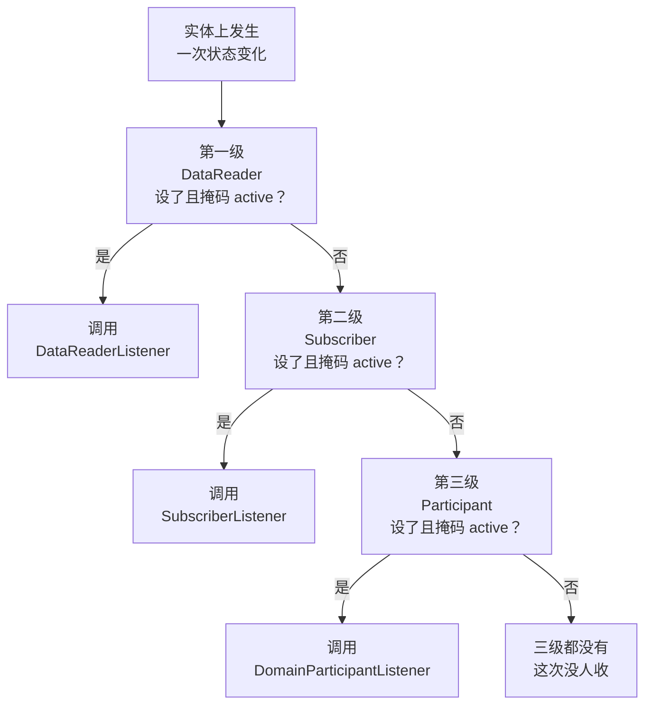
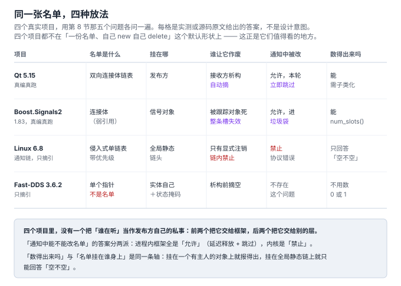
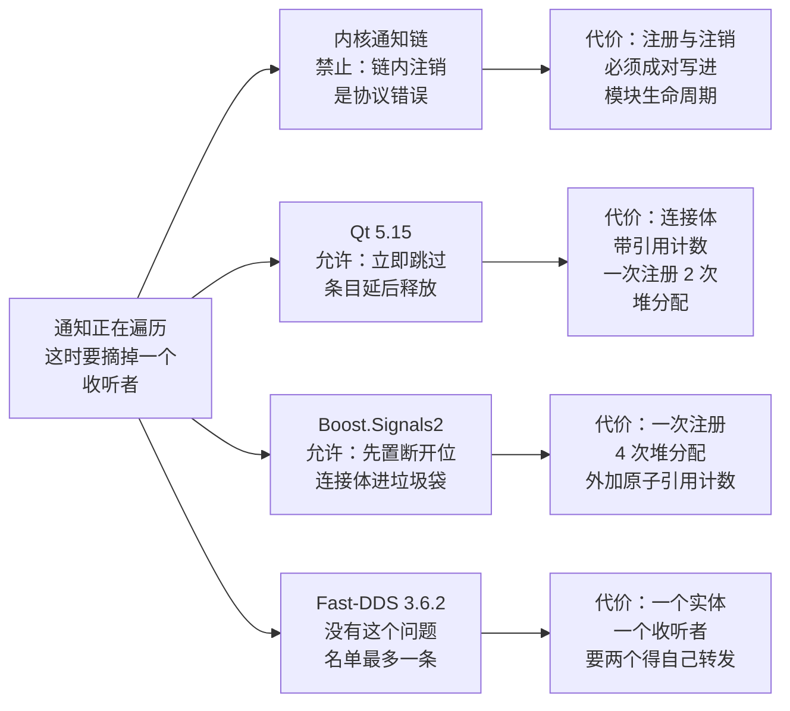

# 9. 真实项目案例：同一张名单，四种放法

> 本节的一手件全部是**本机可读的真源码**，四个项目的版本与坐标在下面第一节列出。
> 前两个案例**真编译真跑**，后两个是内核态 / 重型依赖，就地摘引原文 —— 不跑的地方不假装跑过。
>
> 探针在 [`code/09_cases/`](../code/09_cases/)，`run_cases.sh` 一次跑完四段取证。
> 复现入口：`cd code/09_cases && sh run_cases.sh`
> （案例 3、4 的源码根由环境变量给出：`KERNEL_HEADER=` / `FASTDDS_ROOT=`）。
>
> 本节要回答的不是「有哪些项目用了观察者」，而是：
> **§6 留下的那三种坏账，四个真系统各自怎么还**；以及 §8 那五个判据，问它们能问出什么。

**本节文件**：

| 文件 | 作用 |
|---|---|
| [`qt_connection_lifetime.cpp`](../code/09_cases/qt_connection_lifetime.cpp) | Qt 5.15：接收方析构、遍历中注销、连接句柄、重复连接、一次注册的价格 |
| [`signals2_lifetime.cpp`](../code/09_cases/signals2_lifetime.cpp) | Boost.Signals2 1.83：弱引用轨迹、any-of 语义、遍历中注销、两种句柄、一次注册的价格 |
| [`run_cases.sh`](../code/09_cases/run_cases.sh) | 四段取证：两段真跑 ＋ 两段源码摘引（可复现 `grep`） |

---

## 先说结论

> 1. **四个项目里没有一个把「谁在听」当作发布方的私事。** Qt 与 Boost 把它交给框架，
>    内核把它钉在模块生命周期上，Fast-DDS 干脆不让它存在（一个实体最多一条）。
>    教科书里「一份名单、自己 `push_back` 自己 `delete`」那个形状，在四个真系统里一个都没出现。
> 2. **「通知遍历中能不能摘掉一个收听者」分成两派，而且分野不在新旧。**
>    两个进程内框架（Qt、Boost）都答**允许**：先标记、延后释放、遍历时跳过；
>    内核答**禁止**，并把它写进头文件的注释里（`_must not_ be called from within the call chain`）。
>    §6 的探针当时只证明了「不加工具看不出来」，现在知道**它是可以选错的**——两派都活得很好。
> 3. **弱引用不是万能的：它给的是一票否决。** Boost.Signals2 实测，一个槽跟踪两个对象时，
>    **任意一个死掉，整个槽失效**（any-of），另一个还活着的对象也跟着不再被通知。
>    §6 把「弱引用＋惰性清理」列为唯一忘不掉的答案 —— 本节把它的粒度问题补上。
> 4. **同一个系统里，不同环节可以落在不同层。** Fast-DDS 的传输是真正的第 4 层发布订阅，
>    它的回调却退回「一个实体一个指针」——连第 1 层的回调列表都不是。
>    这与 §8 的「两个名字同时成立」同源：**层不是给系统贴的标签，是每个对象各自的事**。

---

## 四个项目，先看坐标

| # | 项目 | 版本 | 名单是什么 | 本节怎么取证 |
|---|---|---|---|---|
| 1 | Qt signals/slots | 5.15.13（`pkg-config --modversion Qt5Core`） | `QObject` 私有区里的双向连接体链表 | 真编真跑：`moc` + `g++` |
| 2 | Boost.Signals2 | 1.83（本机 `/usr/include/boost/`） | 信号对象持有的 `connection_body` 列表 | 真编真跑：header-only |
| 3 | Linux notifier chain | 6.8.1（本机内核头文件，243 行） | 侵入式单链表，链头是全局静态变量 | 就地摘引（内核态跑不了） |
| 4 | Fast-DDS `DataReaderListener` | 3.6.2（`git diff --quiet v3.6.2` 判定五个文件**逐字节相同**） | **没有名单**，每个实体一个指针 | 就地摘引（依赖太重） |

案例 4 的上游归属是核对过的，不是按文件名猜的：

```sh
# 引用到的五个文件与上游 tag 逐字节相同，grep 与行号因此可以对外复现
git diff --stat v3.6.2 -- \
  include/fastdds/dds/subscriber/DataReaderListener.hpp \
  include/fastdds/dds/core/Entity.hpp \
  src/cpp/fastdds/subscriber/DataReaderImpl.cpp \
  src/cpp/fastdds/subscriber/DataReaderImpl.hpp \
  src/cpp/fastdds/subscriber/SubscriberImpl.cpp      # 输出为空
```

---

## 一、Qt：名单挂在接收方身上，所以它会自己消失

Qt 的 `QObjectPrivate` 里存着这个对象的**入边**（谁连到我），而发送方那一侧同样有**出边**。
这意味着一件教科书很少提的事：**注册这件事是被两端共同记住的**，因此任一端消失，
连接就没了 —— 不需要谁去手工撤销。

实测第一段，`heap` 那个接收方被 `delete` 之后：

```text
=== A. the receiver is destroyed ===
   receivers() before emit: 1
-- emit 1.0
   [heap] got 1.0 (hits=1)
-- emit 1.0 returned
   receivers() after  delete: 0  <- nobody called disconnect()
-- emit 2.0
-- emit 2.0 returned
   <- the second emit produced no slot output
```

**`receivers()` 从 1 变 0，而我们一次 `disconnect` 都没调。** 这是「谁持有那张名单」这一问
在 Qt 里的答案：名单不是发布方的私产，是两端共享的结构，任一端析构即摘链。

顺带一个可操作的事实：`QObject::receivers()` 是 `protected`，但**能数出来**——
写个 `Sensor : public QObject` 把转发出来就行（本节探针的 `ReceiverCount()` 就是这一行）。
所以 §5 那句「可数性三系统一致缺失」需要收窄范围，见本节的「横着看」。

### 通知遍历中改名单：Qt 选「允许」

```text
=== B1. a slot disconnects a sibling, mid-walk ===
   [first] disconnecting [second]
   [third] got 1.0 (hits=1)
   after the round: first=1 second=0 third=1
```

`first` 在自己被调用的时候把 `second` 摘掉了。结果是 `second` **本轮就没收到**，
而排在它后面的 `third` 照常收到。这说明：**它不是快照**（快照会让 `second` 收到这一轮），
而是遍历过程中实时判断「这一条还在不在」。

接着试了另一种：注销自己。

```text
=== B2. a slot disconnects itself, mid-walk ===
   after round 1: self=1 other=1
   after round 2: self=1 other=2
```

自己这一轮已经被调过了（`self=1` 就停在那儿），第二轮不再收到。

最狠的一版是**在槽里直接 `delete` 下一个接收方**——这是 C++ 里最容易出人命的写法：

```text
=== B3. a slot deletes a sibling, mid-walk ===
   [first] deleting [third]
   [fourth] got 1.0 (hits=1)
   after the round: first=1 fourth=1  <- survived the delete
```

**没有崩溃**，`third` 本轮不收到，`fourth` 照常收到。Qt 靠的是连接体的引用计数与
「正在发送」标记：被删掉的那条在本轮里被识别成无效并跳过，而列表本身不死。
这正是内核选择禁止的那件事 —— 同一个问题，两个都算成熟的选择。

### 两种句柄，两种「作废」

```text
=== C. the handle connect() returned ===
   bool(handle) = true
   after QObject::disconnect(handle): bool = false   receivers() = 0
```

`QMetaObject::Connection` 有 `operator bool`，断开之后**自己会说「我失效了」**。
对照第 7 节量过的 `std::function`（32 字节、没有 `==`、没有失效判定）：
这就是 §6「六种答案」里 RAII 句柄那一行的工业实现 —— 它比 §6 当时写的更完整：
**不只是「出作用域自动断」，还多了一个可查询的状态**。

最后一段：同一个槽连两次。

```text
=== D. the same slot connected twice ===
   receivers() = 2  <- the list is a sequence, not a set
   [dup] got 1.0 (hits=1)
   [dup] got 1.0 (hits=2)
   with Qt::UniqueConnection: receivers() = 1
```

**名单是序列不是集合**：默认允许同一条重复出现，去重是显式选项（`Qt::UniqueConnection`）。
取舍在这里是干净的：默认不查重 ⇒ 加入是 O(1) 追加；代价是重复注册会重复通知，
而这类错误只在运行时表现为「怎么响了两遍」。

价格（重载全局 `operator new` 数出来的，口径写在探针里）：

| 操作 | 冷启动第一次 | 稳定后 |
|---|---|---|
| `connect()` 一次 | 4 次堆分配 | **2** 次 |
| `disconnect()` 一次 | — | 2 次释放、0 次分配 |

---

## 二、Boost.Signals2：弱引用是「忘不掉」的，但它的粒度是一票否决

§6 排「谁负责让借据作废」时，把「弱引用＋惰性清理」列为唯一忘不掉的一种。
Signals2 就是这一种的工业实现：`connection` 句柄自己持的是 `weak_ptr<connection_body_base>`
（`boost/signals2/connection.hpp:307`），而**槽**另外可以跟踪若干个对象
（`boost/signals2/slot_base.hpp:67` 的 `tracked_container_type` 是个 `std::vector`）。

### A1：跟踪之后，对象死了槽就不再跑

```text
=== A1. one tracked receiver ===
   num_slots() = 1
   [A1] got 1.0 (hits=1)
   releasing the last shared_ptr ...
   [dtor] A1
   num_slots() = 0  <- counted; the walk pruned the entry
   num_slots() = 0  <- stays 0
```

注意 `num_slots()` 这一行的措辞：**数一次就顺手清一次**。它数的是
`connected()`（`detail/signal_template.hpp:273-285` 逐个 `(*it)->connected()`），
而 `connection_body::connected()` 会先跑一遍 `nolock_grab_tracked_objects`
（`connection.hpp:150-155`）。惰性清理的「惰性」不是「等下次通知」，
而是「等下一个来问的人」——**可数性接口本身就是清理点**。

### A2：一个槽跟踪两个对象 —— 死一个就全废

这是本节最值得单独记的一条。给一个槽挂两个被跟踪对象，然后只让其中一个死：

```text
=== A2. one slot tracking TWO receivers ===
   [kept-alive] got 1.0 (hits=1)
   releasing only the second shared_ptr ...
   [dtor] about-to-die
   num_slots() = 0  <- the first receiver is still alive
   kept-alive hits = 1  <- it stopped too
```

**`kept-alive` 还活着，但它也不再被通知了。** 原因在源码里是明写的：
`slot_base::expired()`（`slot_base.hpp:85-93`）遍历所有被跟踪对象，**任意一个**过期就返回 true；
`slot_base::lock()`（`slot_base.hpp:74-80`）遇到任意一个过期对象就 `throw expired_slot()`。

⇒ 语义是 **any-of，不是 all-of**。所以：

- 想要「两个都活着才调用」——Signals2 **给不了**，它的任一过期就是整体过期；
- 想要「各自独立」——必须**拆成两个槽**，一个槽一个跟踪对象。

§6 那句「弱引用是唯一忘不掉的」要补一个量词：**弱引用忘不掉的粒度是「槽」，不是「对象对」**。

### 控制组：不跟踪就什么都不知道

```text
=== B. control group: no track() at all ===
   num_slots() = 1
   [Plain dtor]
   after delete: num_slots() = 1  <- the library cannot know
   [untracked slot] ran, with a dangling pointer in the capture
```

同样地，`num_slots()` 也报 1 —— **它对「这个槽还安不安全」一无所知**。
弱引用不是自动的，它是一个要显式接上的东西（`slot.track(weak_ptr)`），
或者让对象继承 `boost::signals2::trackable`。后者在自己的头文件里写着
`is NOT thread-safe`（`boost/signals2/trackable.hpp:10-12`），这是移植便利性留下的口子。

### 遍历中注销：和 Qt 同一个答案，另一种机制

```text
=== C1. a slot disconnects a sibling, mid-walk ===
   [first] disconnecting [second]
   [third] got 1.0 (hits=1)
   after the round: first=1 second=0 third=1
```

结果与 Qt 逐行同形。机制却不共用：Signals2 的迭代器**本身就会跳过已断开的槽**
（`detail/slot_call_iterator.hpp:72-75` 的注释），而「允许在回调里断开」靠的是三件套 ——

1. `connection_body_base::disconnect()` 只把 `_connected` 置 false，不析构
   （`connection.hpp:71-79`）；
2. 正在被调用的那个槽有一个引用计数 `m_slot_refcount`，减到 0 时不是析构，
   而是把 `shared_ptr` 塞进**垃圾袋**（`connection.hpp:121-129`）；
3. 垃圾袋挂在锁对象上，且注释明写析构顺序要保证**解锁之后**才真正释放
   （`connection.hpp:33-56`，注释在 51-53 行）。

用一句话概括这套设计：**把「摘掉」和「释放」拆成两件事，中间隔着一把锁的生存期。**

### 第七种答案：不改名单，加一个开关

§6 排了六种「谁负责让借据作废」。Signals2 还有一个第六种之外的：

```text
=== D2. shared_connection_block: stop it without touching the list ===
   num_slots() = 1
   while blocked: num_slots() = 1  <- the list is untouched
   <- nothing ran
   [D2] got 2.0 (hits=1)
```

连接**留在名单里**，通知被临时压住，出作用域自动恢复。它的价值在于：
它把「暂时不想收」和「以后不再收」分开了 —— 前者不需要改动名单，也就不需要撤销协议。

代价也在这里：**可数性接口看不出「暂停」**。`num_slots()` 报 1，而实际收到 0。
多一种状态，就多一个「数出来的和实际发生的不一致」的口子（对照 §5 的 Qt
`connect()` 连接类型：同一件事——**同一个 `emit`，参数不同，落点不同**）。

### 价格

| 操作 | 冷启动第一次 | 稳定后 |
|---|---|---|
| `connect()` 一次 | 5 次堆分配 | **4** 次 |
| `disconnect()` 一次 | — | 2 次释放 **＋ 2 次分配** |

最后那一格是垃圾袋的账：注销**不是**纯粹的释放，它自己还要分配。
对比 Qt 的 2 / 0 —— **弱引用轨迹不是免费的，一轮注册它贵一倍，一轮注销它还要倒贴两次分配。**

---

## 三、内核通知链：侵入式、有顺序、不许在链内注销

内核态代码在用户空间跑不了，这一段是就地摘引 —— 但摘引的是**完整头文件**（243 行），
每一句都能用 `grep` 复现。

### 名单的形状决定了它的两条代价

```c
// linux 6.8 include/linux/notifier.h:54-58（上游源码节选）
struct notifier_block {
	notifier_fn_t notifier_call;
	struct notifier_block __rcu *next;
	int priority;
};
```

`next` 内嵌在使用者的结构体里 ⇒ **零分配**：注册不 new 任何东西。
代价是两条，都在这一行里：

- **一个 `notifier_block` 只能挂在一条链上**。`next` 只有一个，没有第二个指针对。
  想同时听两件事，就写两个 block。
- **它必须活得比链长**。既然是内嵌的，那它的生命周期就是使用者结构体的生命周期，
  内核这边没有句柄可以还。

第三条信息是 `int priority`：**通知顺序是保证的，不是「碰巧按注册顺序」。**
这让它与「注册顺序即调用顺序」的 Qt/Boost/§8 A 形态分开 —— 那些系统的顺序是**偶然的**。

### 四种链 = 四种锁策略，同一份数据四个价

```c
// linux 6.8 include/linux/notifier.h:65-72（上游源码节选）
struct blocking_notifier_head {
	struct rw_semaphore rwsem;
	struct notifier_block __rcu *head;
};

struct raw_notifier_head {
	struct notifier_block __rcu *head;
};
```

`raw` 型**一个字节的锁都没有**（注释在 25-27 行：`All locking and protection must be
provided by the caller`）。原子型用 `spinlock_t`，阻塞型用 `rw_semaphore`，SRCU 型用
`mutex` + `srcu`。**同一个「观察者名单」抽象，内核给了四档并发保护，让调用者自己选。**
这是业务代码里几乎见不到的一种态度：不替你选，因为选错的代价只有你知道。

### 回调的返回值不是 void

```c
// linux 6.8 include/linux/notifier.h:187, 196-200（上游源码节选）
#define NOTIFY_STOP_MASK	0x8000		/* Don't call further */
static inline int notifier_from_errno(int err)
{
	if (err)
		return NOTIFY_STOP_MASK | (NOTIFY_OK - err);
	return NOTIFY_OK;
}
```

这两行把两个额外语义压进了「通知」这个动作：

- `NOTIFY_STOP_MASK` ⇒ 回调的返回值能**中止链** —— 通知协议长出了责任链（§8 的 E 形态）；
- `notifier_from_errno` ⇒ 返回值同时是 **errno 通道** —— 通知又长出了请求-应答。

第 4 节的四层里，观察者与责任链、与请求-应答本来是分开的格子。内核把它们叠在同一个
`int` 返回值上。**这是取舍不是混乱**：一条链上「有人反对就立刻停」是很常见的内核语义
（比如某个子系统的电源状态转换被否决），而单独再设计一套返回值协议会更贵。

### 生命周期：不是「谁负责作废」，是「不许在这个时刻作废」

```c
// linux 6.8 include/linux/notifier.h:36-38（上游源码节选）
 * atomic_notifier_chain_unregister(), blocking_notifier_chain_unregister(),
 * and srcu_notifier_chain_unregister() _must not_ be called from within
 * the call chain.
```

内核把 §6 那个「遍历中改名单」的问题**定义成不允许**，并写进头文件。
后果是：注销只能出现在注册的反面（模块 `init` / `exit` 配对），于是
**「谁持有那张名单」这个问题在注册期就结清了**，运行期不存在。

配套的还有 `..._register_unique_prio`（6.8 新增，第 155、157 行）：
同优先级冲突的检查放在**注册时**报错，而不是等通知时才发现两条同优先级的顺序不确定。
**能提前报的错不留给运行期** —— 这是内核这一侧最值得抄的一条。

### 可数性：链头只回答「空不空」

```c
// linux 6.8 include/linux/notifier.h:183（上游源码节选）
extern bool atomic_notifier_call_chain_is_empty(struct atomic_notifier_head *nh);
```

链头是一个全局静态变量，没有「谁」可以被问。**能报数是因为名单挂在一个有主人的对象上**
（Qt 挂在接收方、Boost 挂在信号对象）；挂在全局链上就只剩「空 / 不空」这一个 bit。

---

## 四、Fast-DDS：干脆不要名单

Fast-DDS 是四个里唯一一个把问题从根上换掉的：**每个实体最多一个监听者。**

```cpp
// fast-dds v3.6.2 src/cpp/fastdds/subscriber/DataReaderImpl.hpp:462-463（上游源码节选）
    DataReaderListener* listener_ = nullptr;
    mutable std::mutex listener_mutex_;
```

注册就是一次赋值，注销就是 `set_listener(nullptr)`（`DataReaderImpl.cpp:1413-1425`）。
**两行代码，没有名单要维护，没有注册 / 注销的配对义务。**
§6 那三种坏账里，前两种（悬垂条目、遍历中改名单）在结构上**不存在**——
只有一条记录，改它就是改一个指针。

### 用「向上冒泡」换掉「名单」

一个实体只有一个监听者，那第二个人怎么办？DDS 的答案是**往上层问**：

```cpp
// fast-dds v3.6.2 src/cpp/fastdds/subscriber/DataReaderImpl.cpp:1901-1915（上游源码节选）
DataReaderListener* DataReaderImpl::get_listener_for(
        const StatusMask& status)
{
    {
        std::lock_guard<std::mutex> _(listener_mutex_);

        if (listener_ != nullptr &&
                user_datareader_->get_status_mask().is_active(status))
        {
            return listener_;
        }
    }

    return subscriber_->get_listener_for(status);
}
```

`SubscriberImpl::get_listener_for`（`SubscriberImpl.cpp:708-717`）是同一段逻辑的复制，
末端接到 `participant_->get_listener_for(status)`。把这三段串起来就是 DDS 的
「名单替代品」——**一层一个指针 ＋ 逐级往上问 ＋ 掩码过滤**：



于是：

- **不需要名单**：一层一个指针，谁都没设就往上冒；
- **多出来一层过滤**：`status_mask.is_active(status)`。名单回答「问谁」，
  掩码回答「这件事要不要问他」——这是 Qt / Boost / 内核都没有的一层；
- **代价**：一个实体一个收听者。想要两个消费者，要么自己写转发，要么改走
  `WaitSet` / `ReadCondition` 自己去拉 —— 也就是 §8 的 F 形态（纯拉）。

另一条口径也在这段代码的调用点上（`DataReaderImpl.cpp:394-409`）：
数据到达时**先试 `on_data_on_readers`（问 Subscriber），没有再试 `on_data_available`（问自己）**。
「谁先被问」是有定义的顺序，不是实现细节。

### 生命周期：主动静音，而不是弱引用

```cpp
// fast-dds v3.6.2 src/cpp/fastdds/subscriber/DataReaderImpl.hpp:315（上游源码节选）
    //! Remove all listeners in the hierarchy to allow a quiet destruction
```

这行注释在**五个** Impl 头文件里各出现一次 —— `Subscriber` / `DataReader` / `DataWriter` /
`Publisher` / `DomainParticipant`；实现处是 `DataReaderImpl.cpp:305 / 314 / 317`
调 `set_listener(nullptr)`。

**这是 §6 六种答案之外的另一种：析构之前把自己的收听者摘空，让析构过程安静。**
它解决的**不是**「listener 对象比我死得早」（那仍然是调用方的责任，DDS 只借指针、
不持有所有权、也从不 delete 它），而是「我死的时候不要回调任何人」。

对照一下三种「让借据作废」的思路：

| 思路 | 谁做 | 典型 |
|---|---|---|
| 弱引用 | 库在**每次调用前**检查 | Boost.Signals2 |
| 引用计数＋延后释放 | 库在**断开发生时**拖住 | Qt、Boost |
| 主动静音 | **使用者**在析构前自己摘 | Fast-DDS（并由框架强制把它写进 Impl 的析构路径） |

第三种最土，但它把成本放在了最便宜的地方：**一次性、在析构路径上、不在通知路径上。**
Fast-DDS 能从这条路上走通，前提正是「最多一个收听者」——若是一份名单，
这台机器就得维护一份「全摘干净」的清单。

---

## 五、候选清单里剩下那一个：nginx 不在这根轴上

讲解计划里列的五个候选，前四个都用上了。第五个 nginx 核过之后**没进这一节**，理由留在这里 ——
它演示的是「一层一层往下走」的写法在实际项目里长什么样，但它**没有可变名单**：

```sh
# nginx 1.26.2 的模块名单是构建脚本生成的一个 C 数组，不是运行期注册来的
$ grep -n "ngx_modules\[\]" auto/modules | head -1
1506: echo 'ngx_module_t *ngx_modules[] = {' >> $NGX_MODULES_C

# HTTP 各阶段的处理器名单在配置解析期一次性填好
$ grep -n "ngx_array_init(&cmcf->phases\[" src/http/ngx_http.c | wc -l
8
$ grep -rn "postconfiguration" src/http/ngx_http.c | head -1
309:        if (module->postconfiguration) {
```

三行证据指向同一件事：**顺序由阶段编号决定，名单在配置期填一次，此后只读，没有注销入口。**
它不是观察者的一个变体，更像 §8 里 E 形态的表驱动版 ——
所以要判它，得换一把尺子（问「谁在构建期决定顺序」），本节不展开。

---

## 横着看：同一个坏账，四种答案



「通知正在遍历名单，这时要求摘掉一个收听者」——四个项目给出的答案：



两派的分野不在新旧，在**谁承担并发责任**：进程内框架有自己的锁与引用计数，
敢于让回调改名单；内核的通知链跑在中断上下文里，链上任何一次改动都可能
踩到正在遍历的 CPU，于是选择把它定义成非法。**同一个坏账，「允许」和「禁止」都能活**——
区别是你把复杂度放在了库里还是放在了使用者的纪律里。

### 第 8 节那五个判据，问一遍这四个项目

| 判据 | Qt 5.15 | Boost.Signals2 | 内核通知链 | Fast-DDS |
|---|---|---|---|---|
| Q1 名单在谁手上 | 发布方＋接收方（两端共享） | 信号对象 | 全局静态链头 | **没有名单** |
| Q2 数据随通知走吗 | 走（`emit Reading(double)`） | 走 | 走（`void* data` + `action`） | 不走，自己去 `take()` |
| Q3 回答被读了吗 | 没有（槽返回 void） | 有 combiner 合并返回值 | **有**，能中止链 | `ReturnCode_t`，是调用结果不是通知回答 |
| Q4 注册持续到撤销吗 | 是，直到任一端析构 | 是，直到断开或跟踪对象死 | **只到注销，且链内不许注销** | 是，直到 `set_listener(nullptr)` |
| Q5 发布方自己调用人吗 | 是（`QMetaObject::activate`） | 是（`operator()` 遍历） | 是（`call_chain`） | 是（`get_listener_for(...)->on_*`） |

**Q5 四个全命中**：这四个系统里，「发布方自己调用接收方」这件事都在发布方类体内部发生。
唯一不命中的 F 形态（纯拉）在真实项目里没找到 —— 而 Fast-DDS 正好给出了它的替代写法：
不设 listener、用 `WaitSet` 自己等。**判据的端点不是靠举例凑出来的，是靠结构的反例标出的。**

### 一条要收窄的旧结论

§5 写过「可数性三系统一致缺失」（Qt 的 `receivers()` 在 `protected`、内核只给 `bool`、
inotify 干脆没有）。本轮补测两类新对象之后，这句话要加范围：

| 系统 | 名单挂在哪 | 数得出来吗 |
|---|---|---|
| Qt | 接收方对象（有主人） | **能**，`receivers()` 只是被放进了 `protected` —— 那是访问控制的选择 |
| Boost.Signals2 | 信号对象（有主人） | **能**，`num_slots()` 是公开 API |
| 内核通知链 | 全局静态链头（无主人） | 不能，只有 `call_chain_is_empty()` |
| inotify | 内核数据结构，用户侧只有一个 fd | 不能 |

⇒ 收窄后的说法是：**能不能报数，取决于名单挂在一个有主人的对象上，还是挂在一个全局结构上。**
§5 那三个系统恰好全是后者（内核链、inotify、以及把连接记录藏进私有区的 Qt）——
「一致缺失」是**样本偏向**造成的，不是规律。这一条按框架约定回填到本节，
第 10 节收口时再决定是否改动 §5 正文。

### 一张价格表

两个真跑案例的注册成本（重载全局 `operator new` 计数，口径见探针源码）：

| | Qt 5.15 | Boost.Signals2 1.83 |
|---|---|---|
| 一次 `connect()`（稳定后） | **2** 次堆分配 | **4** 次堆分配 |
| 一次 `disconnect()` | 2 次释放、0 次分配 | 2 次释放 **＋ 2 次分配** |
| 句柄失效能否查询 | 能（`operator bool`） | 能（`connected()`） |
| 能不能不改名单暂停 | 不能 | **能**（`shared_connection_block`） |
| 一次注册能挂几个目标 | 一条连接 = 一个接收方 | 一个槽可挂多个跟踪对象（**any-of**） |

弱引用那一套不是免费的安全，它是**用每次调用的原子操作和每次注册的多一次分配，
换掉「必须记得配对撤销」这个纪律要求**。选它，是因为纪律会失守，不是因为它是零成本。

---

## 这一节要你带走的

> **第一件事：真实项目里没有一份「自己的名单」。** 四个项目四种放法 ——
> 两端共享（Qt）、挂信号对象（Boost）、全局静态链（内核）、根本不要名单（Fast-DDS）。
> 教科书那个「发布方私有一份 vector」的形状，在真系统里是个例外而非默认。
>
> **第二件事：「通知遍历中能不能改名单」是可以选错的。** Qt 说允许（连直接 `delete` 兄弟都不炸），
> 内核说禁止并写进头文件。两派都成熟 —— **选之前先问一句：谁来承担并发责任。**
>
> **第三件事：弱引用的粒度是「槽」，不是「对象对」。** 一个槽跟踪两个对象，死一个全废。
> §6 把弱引用列为唯一忘不掉的答案是对的，但**忘不掉的代价有时是废掉更多**：
> 该拆成两个槽的时候必须拆。
>
> **第四件事：「一票否决」式的答案最土也最便宜。** Fast-DDS 的主动静音（析构前摘空）
> 把成本从通知路径搬到了析构路径 —— 而它走通的前提是「最多一个收听者」。
> **简化结构换来的安全，比在复杂结构上做安全更划算。**

## 进度

- 第 1 节 诞生背景 ✅
- 第 2 节 不用它的代价 ✅
- 第 3 节 谱系 ✅
- 第 4 节 代码对比 ✅
- 第 5 节 业务场景 ✅
- 第 6 节 谁持有那张名单 ✅
- 第 7 节 语言演进 ✅
- 第 8 节 与相邻概念的边界 ✅
- **第 9 节 真实项目案例 ✅（本节）**
- 第 10 节 收口 ⬜

本节实测（复现：`cd code/09_cases && sh run_cases.sh`）：

| 组 | 量了什么 | 结果 |
|---|---|---|
| 1 | Qt 接收方析构 | `receivers()` 1 → **0**，一次 `disconnect` 都没调 |
| 2 | Qt 遍历中改名单 | 注销兄弟本轮即失效；注销自己下一轮失效；**直接 `delete` 兄弟不崩溃** |
| 3 | Qt 连接句柄 | `operator bool` 断开后转 false；重复连接名单是序列（2 条），`UniqueConnection` 去重 |
| 4 | Signals2 弱引用 | `num_slots()` 1 → 0；**数一次就顺手清一次** |
| 5 | Signals2 any-of | 一个槽两个跟踪对象，只死一个 ⇒ 整个槽失效 |
| 6 | Signals2 遍历中改名单 | 与 Qt 逐行同形；靠断开位＋垃圾袋＋槽引用计数 |
| 7 | Signals2 临时屏蔽 | 名单不动（`num_slots()` 仍 1），通知被压住 |
| 8 | 注册价格 | `connect()`：Qt **2** 次分配 / Signals2 **4** 次；`disconnect()`：Qt 2 释放 / Signals2 2 释放＋2 分配 |
| 9 | 内核通知链 | 侵入式单链表＋`priority`；四种链四种锁；返回值含 `NOTIFY_STOP_MASK` 与 errno 通道 |
| 10 | Fast-DDS | 单指针＋状态掩码＋三级冒泡；`quiet destruction` 出现在 **5** 个 Impl 头文件 |
| 11 | nginx 为何不入列 | 模块名单是构建脚本生成的数组（`auto/modules:1506`），配置期填一次、无注销 |
