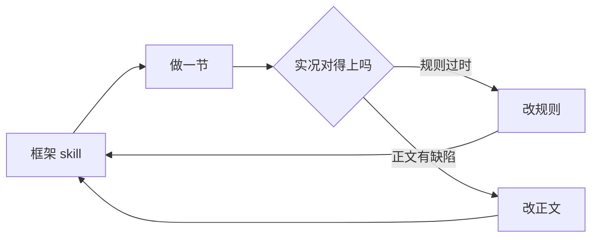

# 10. 收口：把这一轮变成一把尺子

> 分工：骨架 / 状态机 / 目录体例 / 图约定 / 人机分工 / 停机口径都在**承载本框架的那份 skill**里，
> 本文**不重述**；本文只放四样东西 —— 实测数字、迁移分级、待展开清单结账、本轮对框架的改动记录。
> 要改流程去改 skill，要加「下一轮的经验」加在这里。
>
> 范围：观察者模式这一轮（`docs/` 主线 9 篇 ＋ 本文 ＋ `code/` 7 个场景），结账于 2026-09-30。

---

## 一、先给一把尺子

下一个模式跑完，拿这几个数字对照 —— 它们**不是目标，是参照系**。

| # | 指标 | 这一轮实测 | 数出来的方式 |
|---|---|---|---|
| 1 | 正文 | **9 篇 / 2960 行**（主线；本文 320 行另计） | `wc -l docs/0[1-9]*.md` 逐篇相加；`docs/` 全目录 3472 行 |
| 2 | 图 | **20 张** ＝ mermaid **10** ＋ 具象 SVG **10** | 逐篇 `grep -c '^```mermaid'` ＋ `grep -c '^!\['` |
| 3 | 图密度 | **≈ 148 行 / 图** | 2960 ÷ 20 |
| 4 | 场景 | **7 个**自包含目录 | `ls -d code/*/` |
| 5 | 示例源 | **42 个 `.cpp`** ＋ 11 个头文件 | `find code -name '*.cpp'` |
| 6 | 构建入口 | **8 个**（`run_*.sh` ×6 ＋ `build.sh` ×1 ＋ `*.py` ×1），覆盖 **7 / 7** 场景 | `find code -maxdepth 2 -name '*.sh' -o -name '*.py'` |
| 7 | 文档引代码 | **74 处** `code/` 前缀（**48 处**带扩展名、可落地） | `grep -o 'code/[A-Za-z0-9_./-]*' docs/0[1-9]*.md` |
| 8 | 上游源码引用 | **29 处** `src/` / `include/` 前缀（只计数、不要求存在） | 同口径 |

**三个容易数错的口径**：

① **篇数**数的是主线 9 篇 ＋ 收口 1 篇，**不含编排文件** —— `docs/00-讲解计划.md` 是编排（192 行），
它自己带 1 张 mermaid，**也不进密度分母**；本文自己同理（320 行，同样不计）。
想报「`docs/` 总行数」必须说清含不含它们（含 = 3472 行）。

② **图数**数的是正文**内嵌**的图。本项目 `docs/assets/` 恰好 10 个 SVG、正文恰好 10 处 `` 引用，
一一对应 —— 没有「只在图注里以链接形式保留的矢量备份」这一类（那是参照实例 `07` 篇的形态）。

③ **`code/` 引用有两种口径**：不带扩展名的（`code/04_compare/`）是**指路**，带扩展名的
（`code/06_lifetime/dangling.cpp`）是**可落地证据**。本节报两个数，因为机器判据只认后者。

### 与参照实例并排

| 指标 | 工厂模式 | 观察者模式 |
|---|---|---|
| 正文 | 16 篇 / 4052 行 | **9 篇 / 2953 行** |
| 图 | 24 张（mermaid 7 ＋ SVG 17） | **20 张（mermaid 10 ＋ SVG 10）** |
| 图密度 | ≈ 169 行 / 图 | **≈ 148 行 / 图** |
| 场景 | 13 个 | **7 个** |
| 示例源 | 39 `.cpp` ＋ 8 `.h` | **42 `.cpp` ＋ 11 头** |
| 构建入口 | 7 个，覆盖 **6 / 13** | **8 个，覆盖 7 / 7** |
| 文档引代码 | 116 处 | 74 处（48 可落地） |

**最后一行的差别不是勤快程度，是场景类型的分布不同。** 工厂有相当一部分是**单文件示例** ——
单文件的证明就是正文里那行 `g++ … && /tmp/x` 加它的输出，本就不该有脚本；
观察者的 7 个场景**每个都是多文件装置**（三路对照 / 四层刻度 / 四层递进 / 三个探针 / 三代 × 七反例 /
六形态 / 两个探针），脚本解决的是「一次跑多个文件」。
⇒ 所以「7 / 7」和「6 / 13」**没有可比性**，能比的只有那条判据：
**脚本不解决「证明能跑」，只解决「一次跑多个文件」。**

---

## 二、逐篇过一遍密度

**平均值会掩盖单篇**（参照实例的三篇考据 `519` / `468` / `319` 行每图被全库 169 盖住）。
逐篇过一遍：

| 篇 | 行数 | 图 | 行 / 图 |
|---|---|---|---|
| 01 诞生背景 | 184 | 2 | 92 |
| 02 不用它的代价 | 255 | 3 | 85 |
| 03 谱系 | 256 | 2 | 128 |
| 04 代码对比 | 244 | 2 | 122 |
| 05 业务场景 | 293 | 2 | 146 |
| 06 生命周期负债 | 409 | 2 | **205** |
| 07 语言演进 | 386 | 2 | 193 |
| 08 边界 | 323 | 2 | 162 |
| 09 真实项目案例 | 610 | 3 | **203** |

最重的两篇（`06` / `09`）刚好越过 200 线。**结论是不构成缺陷**，两条理由：

① **两条硬约束都满足** —— 主线每篇 ≥ 1 图、全库 ≥ 1 图 / 200 行。逐篇 200 不是约束；
② 参照实例里内容最重的三篇是 **519 / 468 / 319**，观察者最重的 205 比它们轻得多。

但更值得记下来的是**原因上的差别**：工厂那三篇是**纯考据**（除了 1 张 mermaid 无处可画），
而 `06` / `09` 有 3 个探针与 4 个案例 —— **图少不是因为没东西画，是因为东西太多、每样都配了代码。**
这两篇的重量来自**装置与逐行输出**，不是叙述。

⇒ 带走一条判据：**当一篇超标的重量来自「装置 + 逐行输出」时，加图不如加代码；来自叙述时，才该补图。**
照这条判据，`06` / `09` 都不补 —— 给 `dangling.cpp` 再画一张内存示意图，
读者得到的直觉不如直接读那三行 `printf` 的输出。

---

## 三、五个流程要素，逐个判断能不能直接搬

### 3.1 目录结构 —— 直接搬

7 个场景全按 `code/<两位序号>_<场景名>/`，每个自包含，能单独拷走、单独跑。
与模式无关，命名规则照抄即可。

一处**空位**：本项目**没有 `code/A0N_` 这类考据场景目录** —— 专题篇还没开工，因为专题篇的
考据对象要等第 9 节回源结果才定（见下）。空目录不如不建。

### 3.2 同源对照 —— 搬实质，**别搬文件名**

实测：**没有任何一个场景的对照文件叫 `old.cpp` / `new.cpp`**。7 个场景，7 种命名法：

| 场景 | 对照形态 | 为什么这么命名 |
|---|---|---|
| `02_cost/` | `hardcoded.cpp` / `polling.cpp` / `observer.cpp` | 三条路线，不是新旧两版 |
| `04_compare/` | `layer0_callback.cpp` → `layer3_pubsub.cpp` | 四个版本**是刻度**，序号即层号 |
| `05_scenarios/` | `qt_connection_types.cpp` / `inotify_watch.cpp` | 按**宿主系统**分 |
| `06_lifetime/` | `dangling.cpp` / `mutation_during_notify.cpp` / `reference_cycle.cpp` | 按**故障类型**分 |
| `07_language/` | `gen1_virtual.cpp` / `gen2_function.cpp` / `gen3_concept.cpp` | 按**语言代数**分 |
| `08_boundary/` | `form_a_observer_push.cpp` → `form_f_pure_pull.cpp` | 按**形态**分 |
| `09_cases/` | `qt_connection_lifetime.cpp` / `signals2_lifetime.cpp` | 按**宿主框架**分 |

⇒ 与参照实例同一条结论，而且这次更强：**7 个场景、7 种命名法、无一重名。**

⚠️ **别急着统一前缀 —— 数字与字母的差别是有意的。**
`04_compare/` 用数字（`layer0_`…）因为四层是**有序刻度**，序数本身有含义；
`08_boundary/` 用字母（`form_a_`…）因为六个形态**并列**，A~F 没有内在顺序。
**前缀本身就是一条信息：数字＝有序，字母＝并列。**
下一个模式若给一组并列形态用 `1_` `2_` 编号，读者会误以为要按序读。

### 3.3 示例可运行 —— 分两档，别一刀切

7 / 7 场景有自包含入口。**但这是场景类型的推论，不是纪律**：
观察者的场景几乎全在多文件那一档（见第一节末段），单文件示例只有 `09_cases/` 里那两个探针 ——
它们不需要脚本，它们**共用一个** `run_cases.sh`，因为那个脚本还顺手做了两处源码摘引的取证
（`sed -n` 打出行号与原文，让读者自己验）。

⇒ 判据同参照实例：**脚本只解决「一次跑多个文件」，不解决「证明能跑」。**

### 3.4 文档引代码路径 —— 直接搬，口径一起搬

74 处 `code/` 前缀。两个必须连口径一起搬的细节：

- 门禁只检查**带扩展名**的路径（写成 `code/<场景名>/` 这种模板形式不会被判）；
- **上游引用只计数、不要求存在** —— `src/` / `include/` 开头的路径视为第三方源码引用
  （本项目 29 处）。少了这条，第 5 节与第 9 节的全部考据引用会瞬间变成假警报。

⚠️ **本项目新加的一条：扫描前先剥掉行内代码。** 否则正文里当语法示例写的
`` `` `` 会被自己当成真链接（第 9 节自检踩过，2 条假警报）。

### 3.5 图密度 —— 直接搬，但「量宽度」的命令要换

「先量基线、再判缺陷」这条依然成立，**但量宽度的命令已经过期**：
mermaid-cli 12.0.0 起**移除了 `-w`**，`--size` 量的是**长边**而不是内容宽度。

**唯一可靠口径 = 渲染成 SVG 后读 `viewBox` 的后两个数。**
⚠️ 且 `viewBox` 的前两个数**不一定是 `0 0`**（实测 `4 4 572 1088`）——
按 `viewBox="0 0 …"` 匹配会一条都匹配不上，脚本若对未匹配的图填空值，
就会报出 `10 × 10` 这种看着像尺寸的假数。

本项目基线：**主线 10 张 mermaid，实测 486 ~ 936 宽**；手写 SVG 按内容定宽，都在 680 上下。
本项目最宽的一张是 936 —— **没有一张需要处理**。

与参照实例（10 张里 9 张超 784、最宽 1843）的差别来自**图型分布**：工厂多横向流程链，
观察者多矩阵与堆叠节点，天然更窄。**这条差别不可搬** —— 下一个模式先量自己的基线。

---

## 四、流程被自己的正文改过几次

这一轮最值得带走的不是「流程长什么样」，而是**流程是怎么被正文校准的**：



回到起点的这条边就是回路 —— **规则不是权威，正文跑出来的实况才是**。

| 报出 | 核实结论 | 处置 |
|---|---|---|
| 第 1 节：一手件里「观察者」这个词**一次都没有** | 光有一个 0 说明不了问题 —— 换 `depend*` 做对照得 33 次，**有对照的 0 才可信** | skill 加「回源四步」，第 4 步特意要求找**不依赖同一文本层**的独立旁证 |
| 第 6 节：三个探针里有一个**两遍输出逐字节相同**、sanitizer 一条不报 | 它坏的不是内存，是**协议** ⇒ 工具按定义看不见 | skill 加「生命周期负债」小节，含结论句「能证明有 bug，不能证明没有 bug」 |
| 第 7 节：判定最严的一格属于**最老的那一代** | `override` 查签名，可调用性判据只问能否调用 ⇒ 新写法买的是**错误落在哪** | skill 加「语言演进」小节，含「别预设新写法更安全」 |
| 第 8 节：`ChangeManager` 与基线**逐字节相同** | 它同时是 Observer 与 Mediator ⇒ **模式名描述一个对象的形状，不是给系统贴标签** | skill 加「边界」小节，并把这条标为**跨模式通用** |
| 补丁脚本的 guard 手写失配（第 7、8 节**各一次**） | 手写的判据在措辞对不上时**静默失效**，表现是「重跑一次又改一遍」 | skill 把判据升级为「**一律从新文本派生**」，并删掉「插入式」这个限定词 |
| 第 9 节：`wsl bash -lc '…'` 里的变量赋值被吞 | 命令语法没错、只是变量是空的 ⇒ **脚本成功地做错了事** | skill 加一条，并归入「判据选错口径」同族 |
| 第 9 节：插入式补丁的 guard 叠加了「旧文本不在」 | 对插入式**判据恒为假** ⇒ 记忆文件被插了两遍 | skill 加「判据就是一句『新文本已存在即跳过』，别叠加」 |
| 第 9 节：自检脚本报三项 | **三项全是假警报、零条真缺陷**（行内代码当链接 / 正则交替截断扩展名 / 序号判据写反） | skill 记一轮，并把判据升级为「交给下一节重写时，先问它报的是真缺陷还是判据写错了」 |
| 第 9 节：一张 `TB` 线性链跑出 **386 × 1571** 的细长条 | 当时归因成「压层数比改方向有效」 | skill 加一条，与「`LR` 下并排 subgraph」并列 |
| 第 10 节：同一症状复发（`168 × 992`），照上一条**只压层数**（8 步 → 5 阶段） | **宽度纹丝不动**（168 → 168），只有高度降了（992 → 611）⇒ 上一轮的归因不准：压层数只治高度，**宽度由「标签每行几个字」决定** | 改方向 `TB → LR` 才见效（936 × 82）⇒ 回写 skill 时把那条改成**单变量结论** |
| 第 10 节：修完「行内代码算不算链接」之后，同一处**又**报出 2 条链接不可达 | 新加的「双反引号也算行内代码」那一支带了 `re.S`，**从文件头一路吞到下一个双反引号**，反而拆散了中间所有单反引号的配对 | 两支都改成**不许跨行** → 2 → 0 |

**为什么这条要紧**：这十一条里**没有一条是「正文写错了」** —— 全是「规则或工具的判据选错了口径」。
长期报假错会产生「狼来了」，**真问题会被淹掉**（参照实例里 44 条必须修有 43 条是假的）。
所以**假警报率本身是要维护的指标**：第一次跑自查，**先怀疑规则，再怀疑正文**。
⚠️ 但反过来也成立一条：**上一轮的归因可能是错的，而错的归因会以「经验」的形式传下去** ——
TB 线性链那条就是（第 9 节归因成「压层数有效」，第 10 节单变量复现后发现只对高度成立）。
⇒ 写进 skill 的每一条归因，都要能说清**它是在哪次对照里被量出来的**。

---

## 五、下一个模式的启动序列


每步做完的标志：

| 阶段 | 标志 | 判据 / 命令 |
|---|---|---|
| 铺开 | 骨架先落两样 | `README.md` ＋ `docs/00-讲解计划.md` —— **空目录不如不建**，`code/` `assets/` `notes/` 等有内容再建 |
| 逐节展开 | 每节三件齐 | 该场景的 `run_*.sh`，或正文里那行 `g++` 加**它的输出** |
| 补图 | 补图前先查重 | `grep` 该知识点是否已在别篇画过（**权属归先写的那篇**） |
| 复核 | 三项全过 | 见下 |
| 收口 | 逐篇过密度 | 不只看全库平均（见第二节） |

**三项复核的实际形态**（每节收尾都跑）：

| 项 | 判据 | 本轮结果 |
|---|---|---|
| SVG 自包含 | `xmllint --noout` 通过；`grep -c 'var(--'` 全为 0；渲染成 PNG **肉眼过** | 10 个文件 0 问题 |
| mermaid 逐张渲染 | 用 **mmdc 自己的引擎**出 PNG 并肉眼过（`rsvg-convert` 渲染不出 `foreignObject`，五项自检全绿也会得到空白框） | 13 张 0 失败 |
| 文档机械项 | 链接可达 / `code/` 路径可落地 / 节数 / 遗留形态 | 0 问题 |

---

## 六、搬不走的：凡是「因为它是观察者」才成立的

| 搬不走 | 为什么 |
|---|---|
| **四层谱系**（回调 → 观察者 → 发布订阅 → 事件总线） | 那是**「名单放在哪」**这条轴长出来的骨架。别的模式没有这条轴 |
| 四个案例对象（Qt / Boost.Signals2 / 内核通知链 / Fast-DDS） | 取决于该模式在真实仓库里**哪里有**，下一个模式要重选 |
| 第 3 节的刻度（0 / 1 / 2 / 3）与第 8 节的五条判据 | 判的是「名单在谁手上」，**不是通用设计判据** |
| 第 6 节三个故障探针（悬垂 / 遍历中改名单 / 引用环） | 那是**「名单」这种数据结构**的三笔坏账 |
| 第 7 节类型擦除的账（32 字节 / 内联阈值 16 / 类型名 4 → 0） | 量的是**可调用对象**的代价 |
| 第 9 节的注册价格（Qt 2 次 / Signals2 4 次堆分配） | 量的是**连接体**的代价 |
| 十节骨架里第 3 / 5 / 6 节的可省性 | 「单变体时可省」是**判断**不是规则，下一个模式要重新判 |

判据：**凡是「因为它是观察者」才成立的，都搬不走。**

---

## 七、待展开清单结账

编排文件里挂着 **17 条**。本节逐条处置 —— 这是收口篇的**主要工作量**，不是附注。

### 7.1 本轮新结账的四条（前面各节留下的）

| 概念 | 处置 |
|---|---|
| 无接收者的事件（Guava `DeadEvent`）算不算故障 | ✅ **不是故障，是必然结果** —— 通道层删掉「发布方知道谁在听」之后，「发了没人收」这条信息就**没有载体**了。Guava 只能靠**补票**把它买回来：把没人收的事件重新包成一个 `DeadEvent` 投给总线的订阅者（而这份补票只在发布方自己订阅了 `DeadEvent` 时才生效）。在观察者那一层这个问题**不存在**：名单是自己持有的，不叫它就是不需要通知。⇒ 这是第 8 节五条判据**右端之外**的一格：Q1 的答案从「在谁手上」变成「谁都不知道」 |
| 模板化的 `Sensor<Sink>`（零分配） | ✅ **不是跨模式边界，是第 8 节判据 Q1 的上界** —— 名单从「运行期的表」搬到「编译期的类型」，`Sensor` 不再是一个类型。代价：装不进容器、每加一个接收方类型要重编所有用它的人；而第 6 节说注册点在**组合根**，组合根要处理的恰恰是「一批类型不确定的东西」。⇒ 展开它就是另一个模式（静态多态 / CRTP），本模式不展开 |
| 六种答案要不要补第 7 种 | ✅ **补，而且它不在前六种那条轴上** —— 前六种都在回答「**条目还在不在表里**」（`shared_connection_block` 回答的是「条目在表里，但这次不叫它」）。同族还有**静态实现**：Fast-DDS 的 `StatusMask`（`set_listener` 时一起给，每次通知按掩码重判）。代价：**可数性接口看不出「暂停」**（`num_slots()` 报 1、实际收 0）⇒ 第 5 节那条「数得出人数」的判据在它面前失效 |
| 第 5 节「三个系统可数性一致缺失」的范围 | ✅ **改第 5 节正文（加一条括注）** —— 三个系统都没给是**样本事实**，但「真实系统宁愿不给这个数」这个概括被第 9 节反证：Boost.Signals2 的 `num_slots()` 是**公开 API**。真正的分界不是「进程内还是进程外」，而是**名单挂在有主人的对象上（信号对象 / `QObject`），还是挂在全局结构上（内核链 / inotify 表）** |

### 7.2 前面各节已经结掉的（改判归属，本节不重开）

| 概念 | 归属 |
|---|---|
| 弱引用 / 弱回调 | 第 6 节结账；第 9 节补了**粒度** —— 弱引用是 any-of（一个槽跟踪两个对象，死一个全废），**粒度是「槽」不是「对象对」** |
| 跨线程投递与「通知期间不得改名单」 | 第 6 节（快照拷贝 vs 内核「链内禁止注销」） |
| 反应式流（背压 / 取消传播）与观察者的关系 | 界线在第 3 节的**第 4 维（速率）**，第 8 节指认后不再重开 |
| `IN_Q_OVERFLOW` 的丢弃语义 vs 背压 | 权威在第 5 / 3 节，第 8 节不重开 |
| `Subscription.cancel()` 与注销协议 | 第 6 节（归入「调用方手工配对」一行） |
| 事件总线的通配符与分层主题 | 第 8 节（名单条目从「名字」变成「**规则**」，发布方连匹配结果都算不出） |
| 回调对象按值还是按引用捕获 | ✅ **结账：语言装置拦不住捕获语义** —— 第 7 节矩阵第 7 反例**三代全过**。归第 6 节，不单开 |
| 内存工具按定义看不见「协议错误」 | 第 6 节的结论句；第 8 节的 C 形态补了**另一半证据**（有一种「像」连**行为**都量不出来） |

### 7.3 分流出主线的两条

| 概念 | 去处置 |
|---|---|
| 信号槽的线程亲和性（Qt 排队连接） | ➡️ **转 A01** —— 第 5 节已量过「只改 `connect()` 的一个参数，落点就从刻度 2 跳到刻度 3」，主线留了一格，展开留给专题 |
| 忙轮询 / 定时器轮询 / 事件驱动的实际开销对比 | ➡️ **不展开** —— 它是**事件循环**的账，不是观察者的账：观察者讲「名单放在哪」，`epoll` 讲「**等待在哪**」。第 2 节的轮询三份账是确定性 tick 模型（读数次数 ∝ 1/周期、最大延迟 ≈ 周期、尖峰漏报率逐点吻合），够用 |

> **别把一个模式的题做成另一个模式的题。** 这条是本轮分流出第二条的依据，
> 也是下一个模式遇到「这个概念很想讲」时的第一道闸。

### 7.4 第 2 层专题篇

**已拍板：A01 = Boost.Signals2 的连接体。**

选它的理由不是「它最有名」，而是第 9 节回源时量出来的三条：本机可读**全部实现**（header-only，
`trackable.hpp` / `slot_base.hpp` / `connection.hpp` / `slot_template.hpp` 逐个可读）、
**可真编真跑**、并且它直接就是第 6 节那张「谁让借据作废」表里**唯一忘不掉的那一行** ——
一个尚未展开的 `boost::signals2::slot::track()` 语义（它凭什么知道对象死了？），
正好是本轮唯一一处「结论已经写下、机制还没看到」的地方。

---

## 八、框架的载体在哪（别在两处找同一样东西）

| 载体 | 管什么 | 加什么内容写哪里 |
|---|---|---|
| **框架 skill**（承载骨架 / 状态机 / 目录体例 / 图约定 / 体例 / 人机分工 / 停机口径） | **规范 + 协作** | 改流程 → 改 skill |
| 本文 `docs/10-收口.md` | **基线**：实测数字 / 迁移分级 / 启动序列 / 待展开结账 | 加「下一轮的经验」→ 加这里 |
| `docs/00-讲解计划.md` | **编排**：三层结构 / 逐节说明 / 产出约定 / 待展开清单 / 进度块 | 本模式的范围与进度 |
| `notes/` | **复盘**：被推翻的结论与踩过的坑，含复现方式 | 踩坑就写 |

⚠️ **本项目与参照实例的一处结构性差别**：工厂模式把「规范」与「协作」放在仓库内
（`TEMPLATE.md` / `AGENTS.md` / `tools/check_pattern.py` 三处），观察者模式**把这三样全部移出仓库**，
只由一份 skill 承载 —— 仓库里的治理层已删除（commit `38026f1`，+12 / −1271）。

**理由**：治理层与正文混在一起时，看文档的人得先分清「这一行是规则还是结论」；
移出后仓库里只剩「**一个模式学完的样子**」。
**代价**：仓库不再自解释 —— 想改流程的人得先知道 skill 在哪。
这条代价写在这里，正是为了让下一个模式知道自己在付什么。

---

## 进度

- [x] 1 诞生背景
- [x] 2 不用它的代价
- [x] 3 谱系：四层不是并列
- [x] 4 代码对比
- [x] 5 业务场景
- [x] 6 谁持有那张名单
- [x] 7 语言演进
- [x] 8 与相邻概念的边界
- [x] 9 真实项目案例
- [x] 10 收口（本文）
- [ ] A01 Boost.Signals2 的连接体（第 2 层专题，已定选，未开工）
